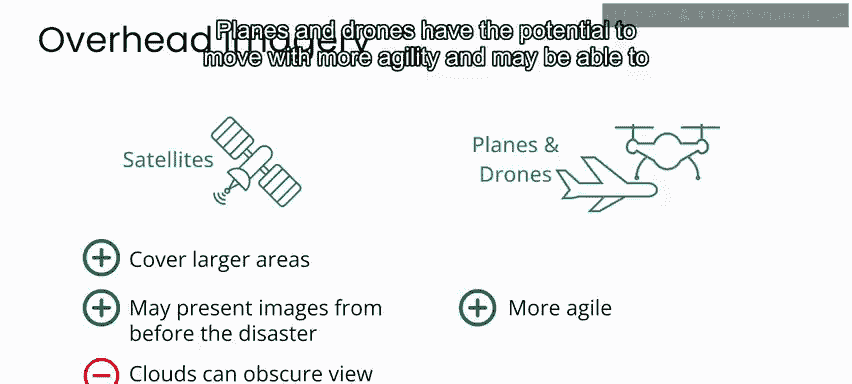
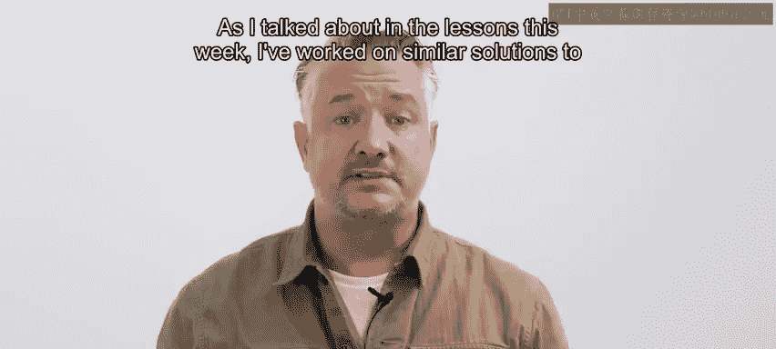
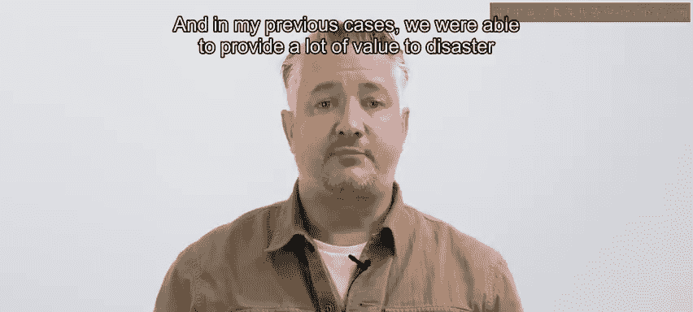
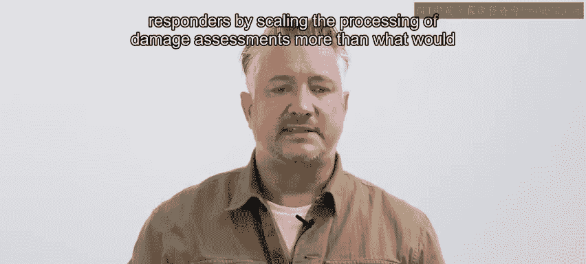
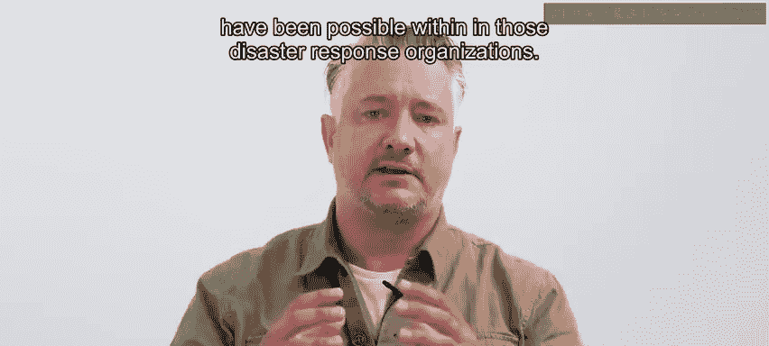

# 104：第2周总结 🎯

在本节课中，我们将总结第二周的核心内容。本周我们重点探讨了如何利用航空影像进行自然灾害后的损害评估。我们将回顾不同影像平台的优缺点，介绍本周的项目实践，并展望相关领域的研究进展。

## 航空影像平台对比 📡

上一节我们介绍了利用航空影像进行损害评估的背景。本节中，我们来看看获取这些影像的不同平台及其特点。

以下是三种主要航空影像平台的优缺点分析：

*   **卫星**
    *   **优点**：覆盖范围广。许多卫星会定期执行拍摄任务，这使其成为获取灾前区域影像的绝佳来源。
    *   **缺点**：云层会遮挡卫星对地面的观测。在飓风等可能持续数日的风暴情况下，卫星影像的实用性会降低。

*   **飞机**
    *   **优点**：机动性更强，有可能在云层下方飞行。
    *   **缺点**：覆盖区域较小。

*   **无人机**
    *   **优点**：机动性更强，有可能在云层下方飞行。
    *   **缺点**：覆盖区域较小。

## 本周项目实践：自动损害评估系统 🏗️

了解了数据来源后，我们进入实践环节。本周的项目是构建一个基于卫星影像的自动损害评估系统。

该系统在原则上也可以扩展应用于无人机或飞机拍摄的影像。项目使用了美国飓风“哈维”过后收集的数千张已标注影像数据集，该飓风引发的洪水和大风造成了广泛破坏。

通过在有标注的数据集上训练神经网络分类器，你的模型在准确率方面能够达到相对较高的性能。其核心过程可以简化为一个监督学习公式：

**模型 = 训练(神经网络, 标注数据集)**

## 项目价值与行业应用 🌍

我们构建的系统并非孤立的练习，它在现实世界中具有重要价值。我曾参与过与本周项目类似的解决方案开发。

在我的过往案例中，我们通过规模化处理损害评估流程，为灾难响应人员提供了巨大价值，其效率是单靠灾难响应组织自身难以实现的。目前，全球有许多人正在致力于开发此类解决方案。

## 本周亮点：研究者聚焦 👨‍🔬

为了结束本周的学习，我们特别关注一位该领域的研究者。Shahzd Galamami 是微软“AI for Good”实验室的高级研究科学家，主要从事与卫星影像相关的损害评估工作。

请观看下一个视频，了解他的工作。然后，我们将在本课程的第三周，也是最后一周再见。

---

**本节课中我们一起学习了**：如何利用卫星、飞机和无人机等平台的航空影像进行灾后损害评估，完成了构建自动评估系统的项目实践，并了解了该领域在实际救灾中的应用价值及前沿研究。