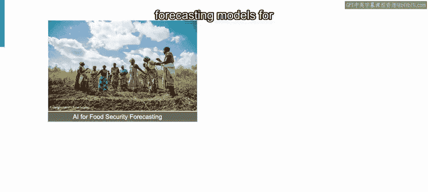
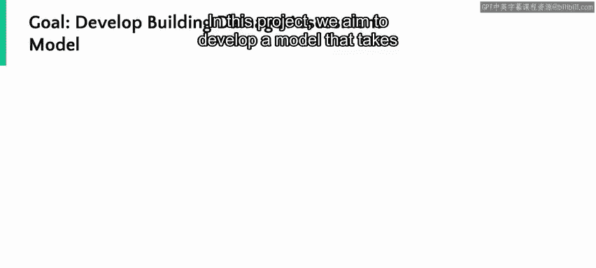
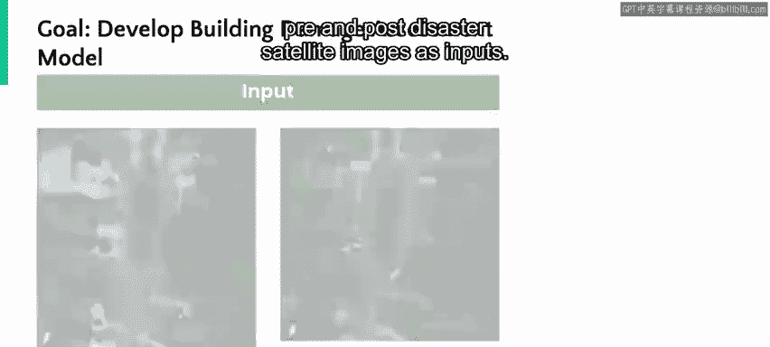
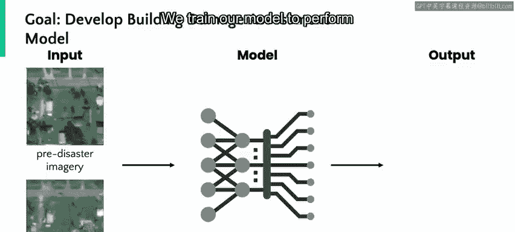
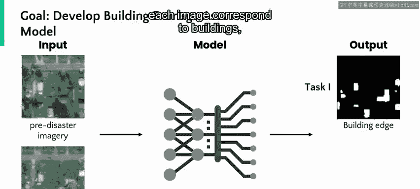
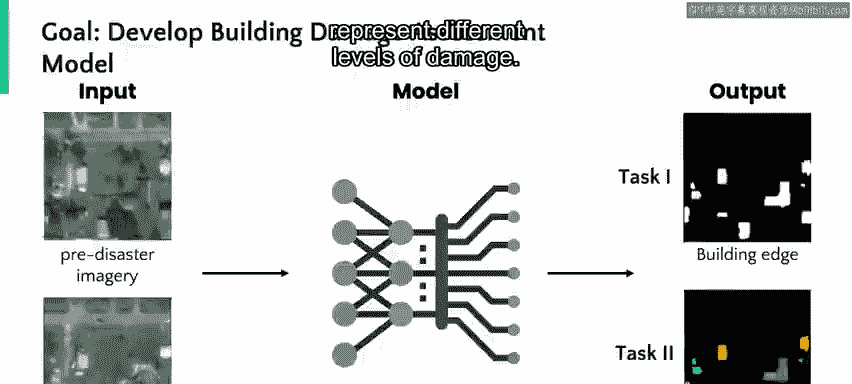
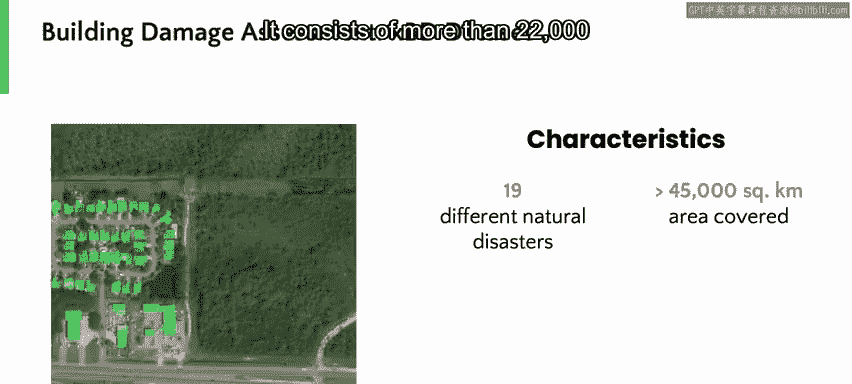
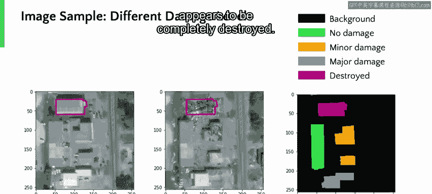

# 105：利用卫星图像进行灾害损害评估 🛰️

在本节课中，我们将学习如何结合人工智能与卫星图像技术，对自然灾害后的建筑损害进行自动化评估。我们将跟随微软“AI for Good”实验室的研究科学家Shahrzad Gholami，了解一个与国际红十字会合作的具体项目。

---

## 概述

本节将介绍微软“AI for Good”实验室的使命，以及人工智能在解决全球性挑战（如公共卫生、气候变化和灾害管理）中的应用实例。

我是Shahrzad Gholami，是微软“AI for Good”团队的一名高级研究科学家。

在微软的“AI for Good”实验室，我们与领域专家合作，应用人工智能技术为现实世界的问题开发跨学科的解决方案。

我参与过的一些项目包括：为马拉维南部的粮食不安全问题开发预测模型；在非洲国家公园识别偷猎热点以拯救濒危物种；以及通过视网膜图像为患有黄斑变性的患者预测眼部疾病。

---

## 项目背景：AI与自然灾害响应

上一节我们了解了AI在多个领域的应用，本节中我们来看看一个聚焦于自然灾害响应的具体项目。

我想向你们介绍我们在人工智能与自然灾害响应交叉领域的一个项目。

这个项目是与荷兰红十字会的一项倡议——510全球组织合作进行的。

在此项目中，我们的目标是开发一个模型。该模型以灾前和灾后的卫星图像作为输入。

模型需要精确识别图像中建筑物出现的位置，并提供灾后的损害评估。

以下是输入图像的示例。在灾害发生前，该区域状况良好；灾害发生后，部分建筑物出现了损坏。

我们训练模型来执行两项任务。

---

## 模型的双重任务

基于上述输入，我们的模型被设计来完成以下两个核心任务。

首先，是识别每张图像中哪些像素对应着建筑物。

其次，是对该区域提供损害评估。下图中的不同颜色代表了不同的损害等级。

我们在这项研究中使用了xBD数据集。这是目前最大规模的数据集，包含了来自19场自然灾害的灾前和灾后卫星图像，覆盖面积超过45,000平方公里。

它由超过22,000张图像组成，其中人类标注员已经识别出了建筑物，如下图中绿色标记所示。

---

## 数据与标签说明

了解了模型任务后，我们来看看训练模型所使用的具体数据及其标注方式。

我们用于训练模型的数据看起来是这样的：我们拥有灾前和灾后的图像对。

每一对图像都附有标签，标明建筑物的位置，并将每栋建筑的损坏程度分为四个等级。

**等级1（绿色）** 表示无损坏。你可以看到左侧这栋建筑在第二张图像中仍然完好，因此被判定为无损坏。

**等级2（橙色）** 表示轻微损坏。如图所示，这些建筑在第二张图像中可见损坏。

**等级3（紫色）** 表示严重损坏。底部的这栋建筑看起来有大部分区域受损。

**等级4（深粉色）** 表示建筑被完全摧毁。顶部的这栋建筑似乎已被完全摧毁。

---

## 模型结果与评估

在模型训练完成后，让我们通过实例来观察其预测效果。

训练后，以下是我们模型结果的一个示例。模型自动识别建筑物，然后对图像中与建筑物相关的每个像素进行损害评估。

第一行显示的是“地面实况”，即由人类标注员确定的、与建筑多边形和损害等级对齐的灾前灾后图像训练数据。

第二行显示了我们模型的预测结果。前两幅图像仅显示建筑物的位置，右侧最后一幅图像显示了图像中每个像素测量到的损害等级。

有趣的是，你可以看到，在地面实况掩码中漏掉的两栋建筑，被我们的模型正确地捕捉到了。

这是另一个结果示例。在此结果中，你可能会注意到一些被错误分类的建筑，可以通过对比上面的地面实况图和下面的模型输出看出差异。

我们模型的工作原理是，根据像素的畸变程度来分类损害。

这意味着，将损坏光谱两端的建筑分类为“摧毁”或“无损坏”，实际上比分类部分损坏的建筑更容易。

---

## 部署与应用

为了将分析结果有效地传达给利益相关者，我们将模型部署到了一个可视化工具中。

我们部署了我们的模型，与一个可视化工具结合使用，以便将结果传达给我们的利益相关者。

使用这个交互式地图，你可以比较左侧的灾前图像和右侧的灾后图像。

你还可以通过切换右下角的“预测损害层”选项，来叠加显示受损建筑的预测结果。

通过这个项目，我们验证了一个概念：利用深度学习和卫星图像，可以提高分析受灾区域的效率，并改善灾害响应。

---

## 未来工作方向

这是一个在微软“AI for Good”地理空间团队内持续进行的项目。

为了提升我们模型的性能，我们正在研究模型的预训练方法，以便能够轻松地进行微调，从而在新的灾害场景和地点提供结果。

此外，我们正在研究将人类专家整合到建模循环中的方法。

---

## 总结与资源

本节课中，我们一起学习了如何利用AI模型处理卫星图像，以自动化、高效地评估自然灾害后的建筑损害。该项目展示了AI技术在灾害响应中的实际应用潜力。

若想了解更多关于我们项目的信息，你可以查阅我们的论文，并在微软“AI for Good”网站上关注我们的工作。