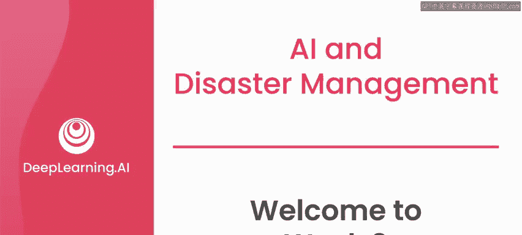
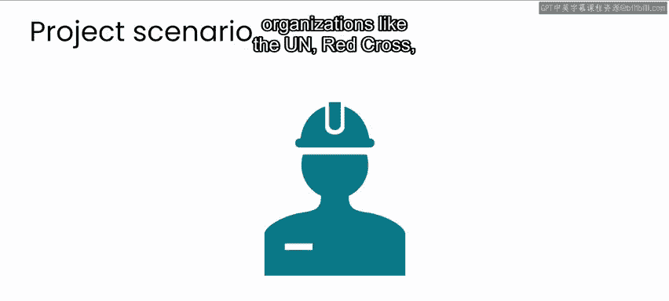
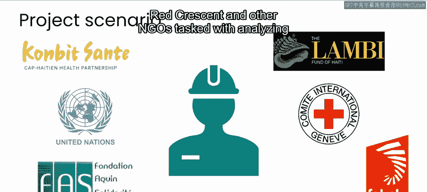
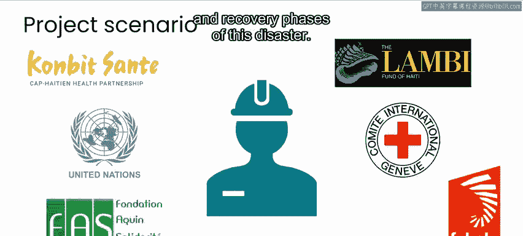
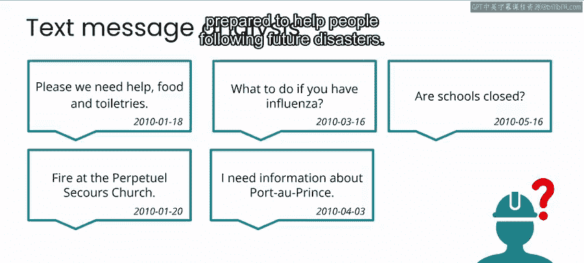
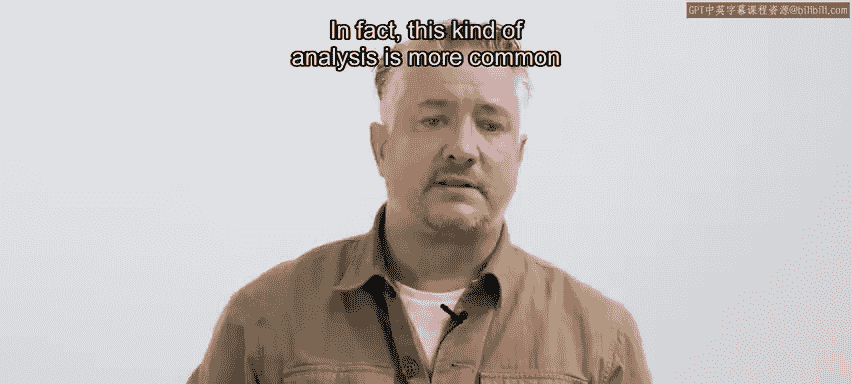
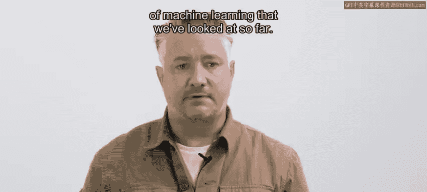
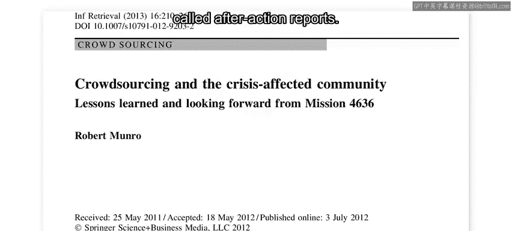
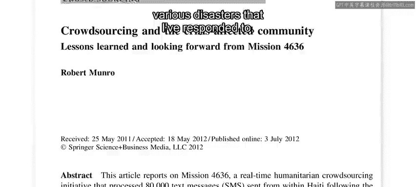

# 106：第3周课程介绍 🚀

在本节课中，我们将学习如何利用人工智能技术分析灾后文本数据，以洞察受灾人群需求的变化趋势，从而为未来的灾害响应与恢复工作提供参考。

欢迎来到第三周，这也是本门关于人工智能与灾害管理课程的最后一个教学周。本周，你将通过一个具体案例进行研究。在该案例中，你将分析一个文本消息数据集，这些消息是在2010年海地地震发生后的数日及数周内发送的。你的目标是确定人们对援助、食物、水以及信息等资源的相对需求，是如何随着时间推移而演变的。

在这个场景中，你可以将自己想象成一个由个人及各类组织（如联合国、红十字会与红新月会以及其他非政府组织）组成的团队中的一员。你们的任务是在灾害的响应与恢复阶段结束后，分析相关的通信记录。你的目标是为灾后响应与恢复阶段中人们不断变化的需求提供深入见解，以便你的组织在未来灾害发生后能更好地帮助受灾人群。

## 案例研究的特点 📊

这与你在本专业系列课程前几门课中看到的案例研究略有不同。在这里，你**不会**开发一个软件产品。相反，你可以将其设想为这样一个场景：你通过分析灾害响应与恢复数据，来生成一份能够指导未来响应与恢复工作的报告。

事实上，在灾害响应领域，这类分析比你目前所了解的机器学习应用更为常见。在灾害响应圈内，你经常会听到此类报告被称为“事后行动报告”。我曾为参与响应的各种灾害撰写过此类报告。就海地地震而言，我作为灾害响应人员参与工作，并撰写了一份事后行动报告，该报告最终成为了我博士论文的一部分。

## 背景回顾：海地地震与短信通信 📱

但在开始分析之前，让我们先更仔细地回顾一下当时发生的事件，以及短信通信是如何在灾后迅速成为响应工作中关键组成部分的。