# 107：2010年海地地震案例研究

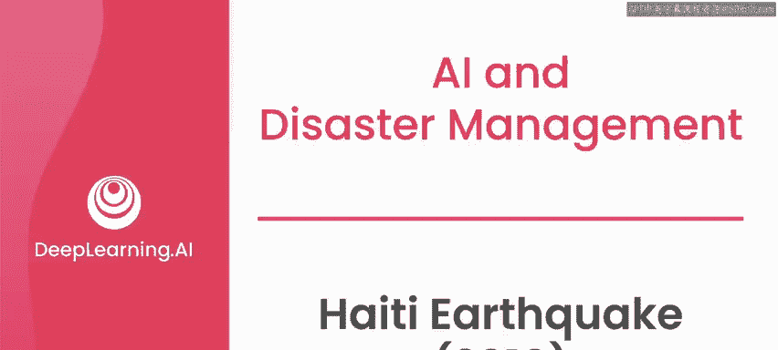

在本节课中，我们将详细回顾2010年海地地震后的紧急响应情况，并探讨如何利用技术与社区协作来协调救援工作。我们将重点关注信息传递、语言翻译和地理定位在灾难响应中的关键作用。

## 🌍 地震发生与初步影响

2010年1月12日当地时间下午5点左右，一场7.0级地震袭击了海地。

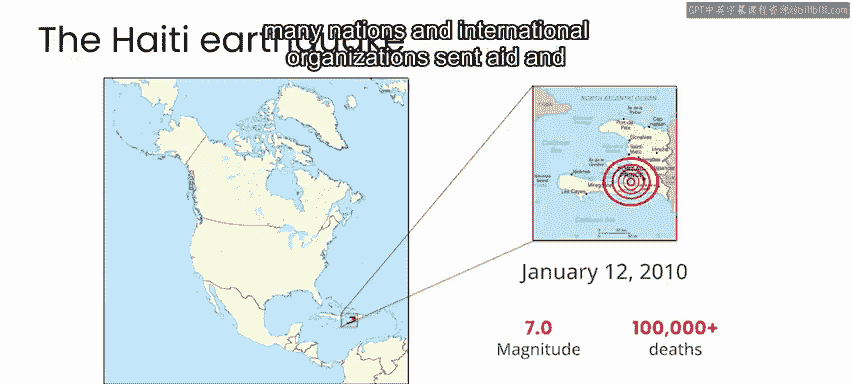

地震立即导致超过10万人死亡，数百万人无家可归，急需援助。

地震发生后的几天里，许多国家和国际组织派遣了援助物资和志愿者，协助救援工作和物资分发。

## 🚨 紧急响应的核心挑战

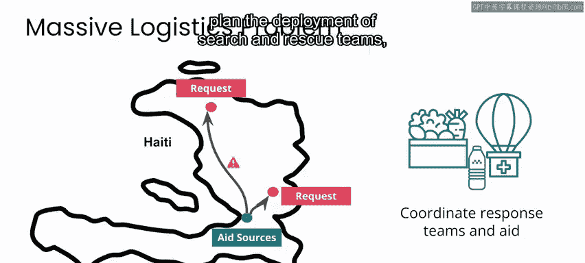

上一节我们介绍了地震造成的直接破坏，本节中我们来看看灾后响应的主要挑战。

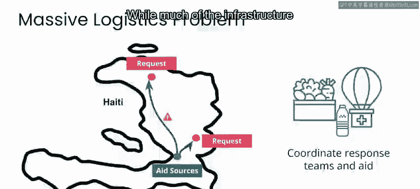

许多人仍被困在废墟下，或缺乏食物、水和住所等基本必需品，因此初步响应本质上是一个巨大的物流问题。

响应者需要知道受灾人员的位置以及他们需要什么支持，以便规划搜救队、医务人员和物资、食物、水及其他援助的部署。

## 📱 通信基础设施与信息传递

尽管大部分基础设施遭到损坏或摧毁，但大多数手机信号塔仍然完好并正常运行。

因此，人们通过短信进行交流，寻求帮助或信息。

地震后，我与多个组织合作建立了一个名为“Mission 4636”的短信服务。

海地境内的任何人都可以免费向号码4636发送短信，将他们的需求和位置传达给灾难响应者。

## 🗣️ 语言障碍与社区协作

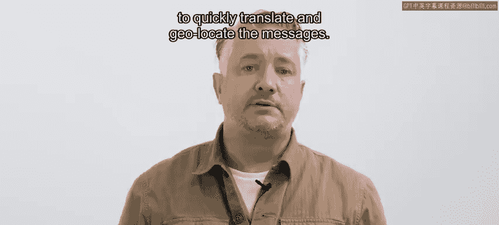

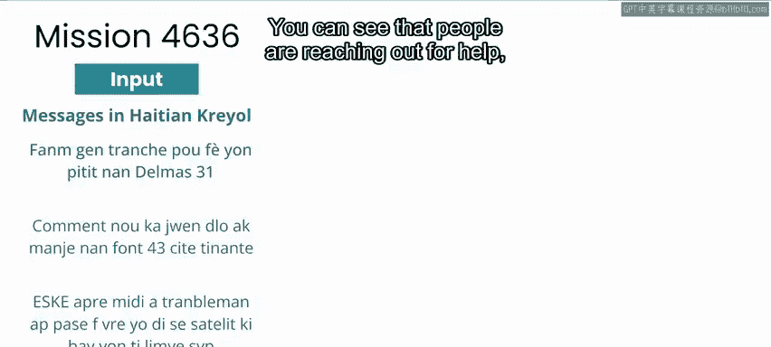

绝大多数短信使用的是海地克里奥尔语，而大多数国际响应者并不懂这种语言。

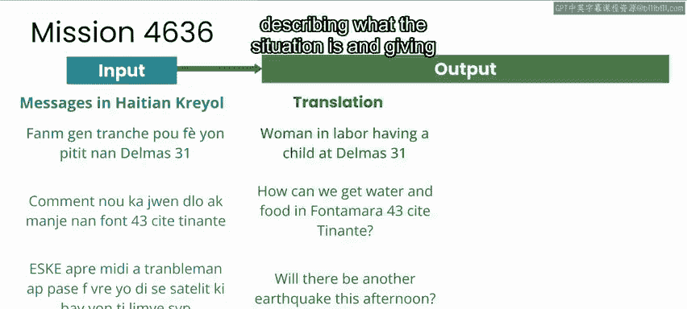

当时，没有应用程序可以自动在海地克里奥尔语和英语之间进行翻译，而英语是国际响应者之间唯一的通用语言。

作为Mission 4636的一部分，我招募并与数千名散居世界各地的海地侨民合作，他们在线快速翻译并定位这些信息。

以下是此类信息的一些示例，你可以看到人们正在寻求帮助，描述情况，并提供地址或特定地点名称等位置信息。

**示例短信（翻译后）：**
*   “我们需要食物和水，在Delmas 33。”
*   “有人被困在Pétion-Ville的建筑物废墟下。”

## 🗺️ 信息翻译与地理定位

现在，有了英文翻译，这些信息在许多情况下也通过Mission 4636的海地志愿者的本地知识，被匹配到了确切的位置。

这些翻译和位置信息随后被路由给响应者，响应者可以首先与发出信息的人进行后续沟通，以提供更多信息或部署实地支持。

为了说明这是如何运作的，你可以看这样一条信息，它会被翻译成如下英文：

**原始信息（克里奥尔语）：** “Ospital Sacre Coeur nan Ocapap ouvri.”
**翻译信息（英语）：** “Sacre Coeur hospital in Ocapap is open.”

你可以看到，这实际上是来自当地社区的一条信息，指引人们可以找到一家开放的医院。

然而，理解“Ocapap”的位置并不简单。即使我告诉你“Ocapap”可能是“Cap-Haïtien”的俚语，你也不会知道这里所指的医院实际上位于城市以南10多公里处。

因此，在这种情况下，为了告知该地区的人们应该去哪里寻求医疗帮助，这条信息的翻译和定位都依赖于对语言的本地知识以及医院的位置信息。

## 👥 本地参与的关键作用

除了翻译和对事物位置的本地知识外，让受危机影响的人群参与灾难响应工作始终是必要的。

毫无疑问，应对这次海地地震最重要的人就是海地人自己。

通过Mission 4636，海地侨民在地震后的几天和几周内处理了超过80,000条信息，世界各地海地侨民的工作无疑拯救了海地境内的生命。

在响应和恢复阶段之后，我们能够将这个系统移交给海地境内的带薪工作人员运营，它继续成为人们可以依赖的服务。

## 📊 数据共享与长期影响

为了支持未来的灾难响应和翻译工作，我们在删除了所有包含个人身份信息（甚至是个人的名字）的信息后，发布了一个短信子集。

这个数据集已成为许多灾难响应规划研究的基础，也是各种机器翻译服务的初始数据，包括微软和谷歌从海地克里奥尔语到英语的翻译服务，这两项服务都在地震发生后相对较快地发布。

在这些信息中首次被标注的地点名称也首先与OpenStreetMap共享，然后与其他地图服务共享。

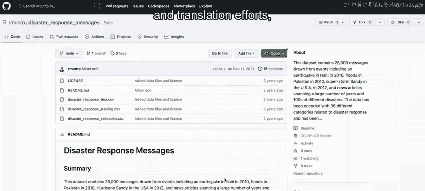

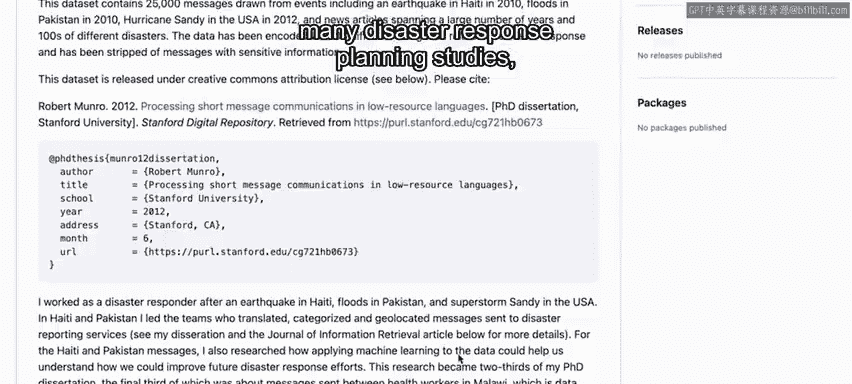

由于基于这些数据集开发的技术，翻译这样一条信息并定位Ocapap的Sacre Coeur医院，对于不懂海地克里奥尔语但可以访问互联网并能在海地搜索这家特定医院的人来说，现在实际上是一项可管理的任务。

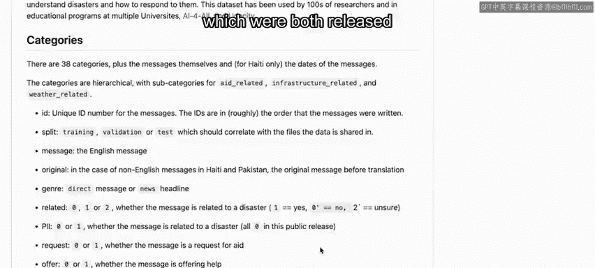

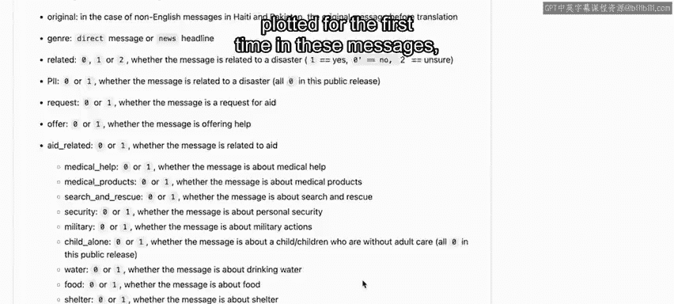

## 💡 经验总结与未来挑战

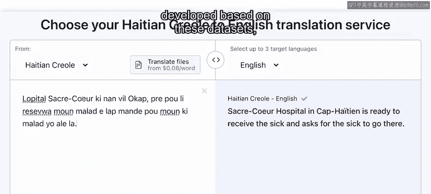

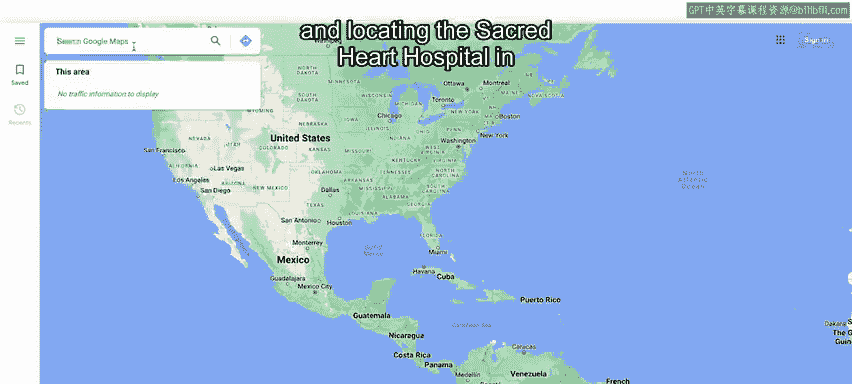

这是一个非常好的例子，说明了与低资源语言社区合作部署翻译、地图或搜索等通用应用程序，如何在包括灾难响应工作在内的许多任务中，日后为这些社区提供巨大价值。

然而，在今天世界上许多使用低资源语言的地区，我们在2010年海地面临的同样挑战仍然存在。

即，没有针对当地语言的自动翻译服务，地图功能有限，尤其是使用这些语言的地名。

## 🧪 本周实验任务

在本周的实验中，你将使用由海地侨民和地震后海地境内的带薪工作人员翻译和地理定位的短信数据。

你将作为一个有兴趣研究灾难发生后几天和几周内援助和信息请求如何演变的人来处理这个项目。

这将帮助我们灾难响应社区更好地理解和规划未来的灾难响应工作。

请加入下一视频，开始本项目的探索阶段，在那里你将识别利益相关者并定义问题陈述。

---

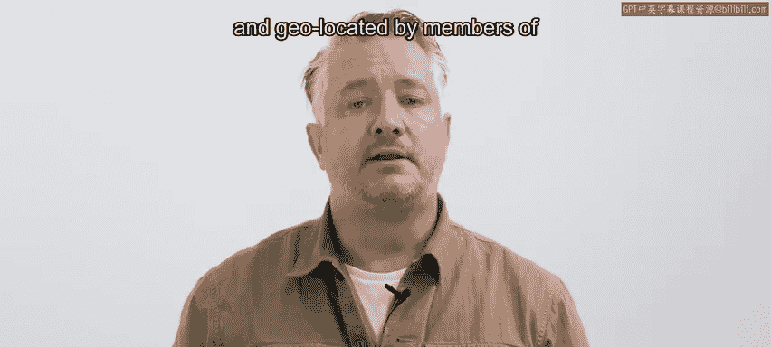

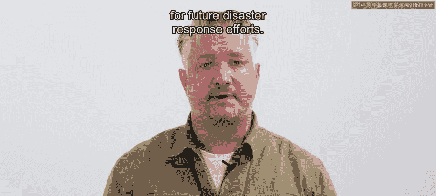

**本节课总结：**
本节课我们一起学习了2010年海地地震后紧急响应的协调过程。我们看到了通信技术（短信服务）如何成为生命线，但也遇到了严重的语言和地理定位障碍。通过“Mission 4636”项目，海地侨民社区的本地知识在翻译和定位信息方面发挥了不可替代的作用，拯救了许多生命。这个案例突显了在灾难响应中，结合技术解决方案与本地社区参与的重要性，以及为低资源语言开发工具（如翻译和地图服务）的长期价值。最后，我们了解到这些努力产生的数据至今仍在为灾难规划和机器学习研究提供支持。