# 108：主题建模探索阶段 📊

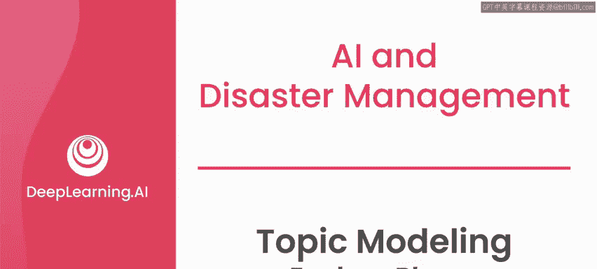

在本节课中，我们将学习如何为AI项目定义探索阶段，特别是针对灾难响应场景。我们将以2010年海地地震后的短信数据集为例，了解如何识别利益相关者、定义问题，并初步判断AI能否为解决方案增添价值。

---

## 背景回顾

上一节我们介绍了2010年海地地震后，海地侨民和当地工作人员如何通过Mission 4636项目，在翻译和地理定位受灾社区发出的短信通信中发挥关键作用。这些信息随后被转发给响应人员。

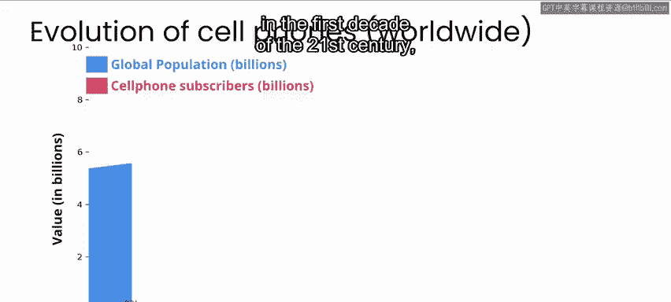

正如我在本专业课程第一门课中提到的，在21世纪的头十年，手机的使用从相对有限变得几乎在世界各地无处不在。因此，在2010年，灾后许多受灾社区的个体能够直接寻求帮助，这还是一个相对较新的现象，尽管当时许多周边基础设施已被摧毁。如今，人们期望数字通信——无论是通过电话、短信、社交媒体还是其他消息服务——在危机期间能够成为人们发送和接收信息的一种方式。在规划未来灾难的响应时，研究此类平台的使用方式、哪些方法在路由或响应此类通信方面可能有用，以及所交换消息的内容，都至关重要。

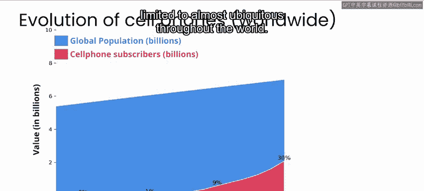

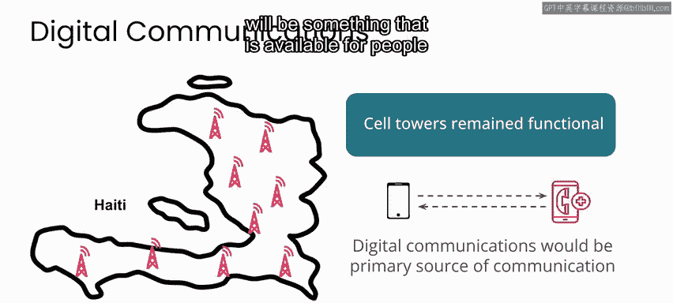

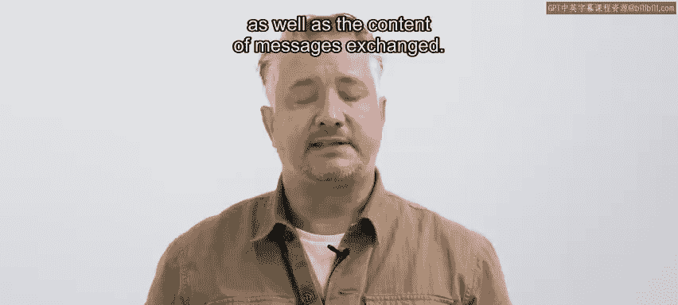

## 探索阶段的目标

目前，我们正处于项目的探索阶段。此阶段的目标是与利益相关者互动，定义你打算解决的问题，并确定AI能否作为解决方案的一部分增添价值。

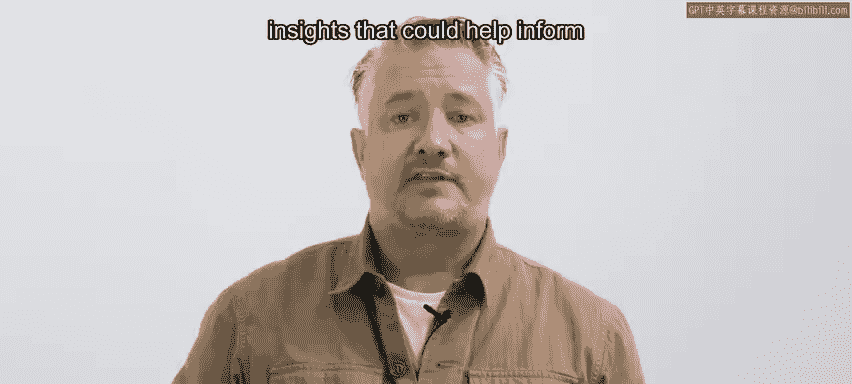

对于与利益相关者互动这一步，在本案例中，你可能需要联系许多个人和组织。

以下是需要考虑的利益相关者类型：

*   首先，你需要联系受灾社区的成员。在本案例中，包括海地国内和全球侨民中的海地人，以更好地了解他们的经历。
*   其他利益相关者可能包括参与响应的组织，例如当地组织和国际非政府组织，以及可能参与未来响应工作的组织。
*   还可能包括运营数字通信平台的公司。在2010年的海地，这是少数几家手机公司和广播电台。但如今，这可能包括手机运营商、广播电台、社交媒体平台等。例如，我在这些课程中多次提到联合国儿童基金会的U-Report系统。该系统以前通过短信工作，但现在在WhatsApp消息平台上运行。

在任何灾难中，对支持和服务的不同需求的具体细节，以及这些需求如何演变，将取决于具体地点、灾难的性质以及灾难发生前存在且灾后仍能运行的基础设施。

## 定义项目范围

与其试图考虑所有可能的情况，我建议你设想目标是帮助一个资源匮乏的语言社区，度过突发性灾难的响应和恢复阶段。

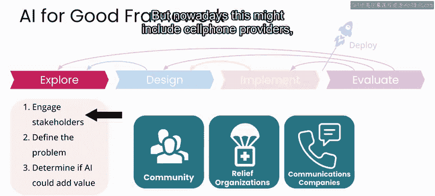

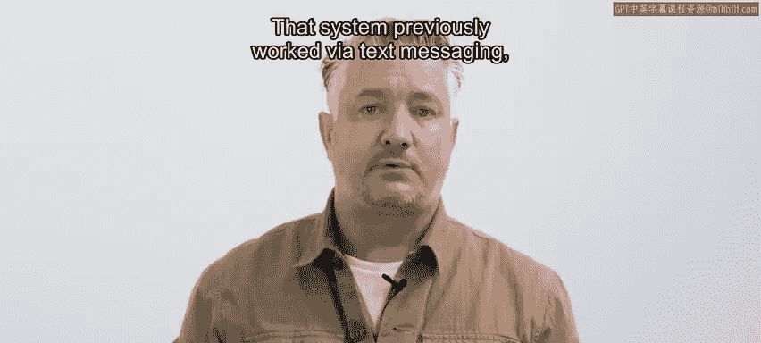

在这种情况下，你还需要与曾经处理过你希望解决的问题的人员交谈，并听取曾参与Mission 4636及类似工作的人们的意见。

即使将本项目范围缩小到支持单个资源匮乏的语言社区，这个问题仍有许多不同的方面可以考虑着手解决。

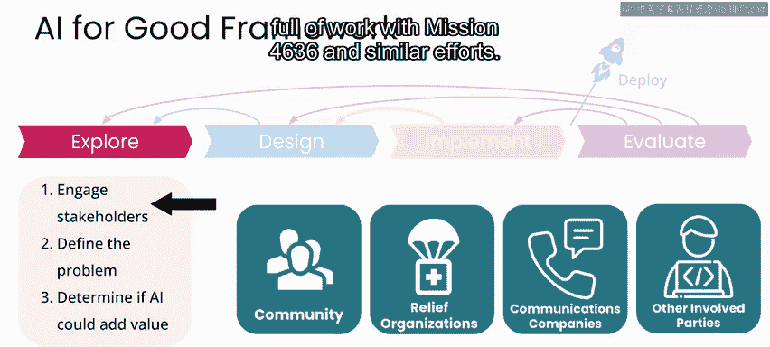

以下是几个可能的工作方向：

*   你可以致力于翻译环节，为该语言构建更好的翻译服务。
*   你也可以考虑实时从非结构化文档中提取信息，以支持资源分配。
*   你还可以考虑根据消息中描述的地址，自动对这些消息进行地理映射。

为了本项目的目的，我们将进一步缩小范围，专门研究人们提出的请求内容，以及这些请求在灾后数天和数周内如何演变。请记住，这只是巨大拼图中的一小块。但类似于我们在这些课程中看到的其他用例，应用此处的框架，你也可以处理此数据集中的另一块拼图，或完全不同的用例。

## 确定利益相关者与问题陈述

那么，在这种情况下，假设你项目的利益相关者是：

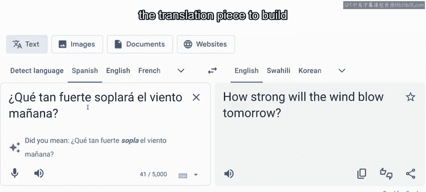

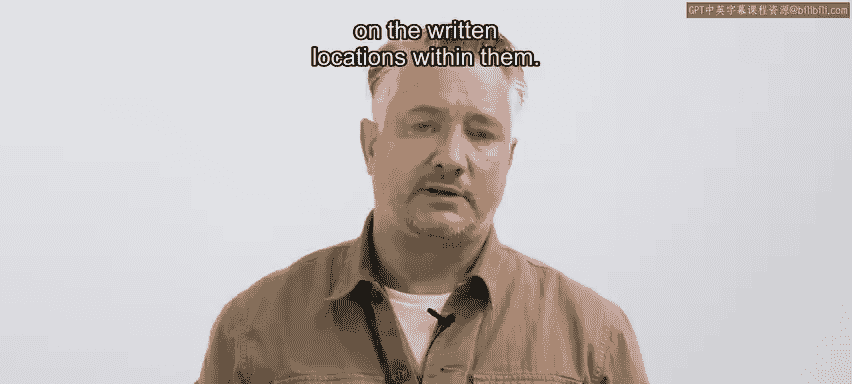

*   你希望服务的社区成员。
*   过去曾参与相关解决方案工作的个人。
*   可能参与响应和恢复工作的组织。
*   维护人们可能使用的通信平台的公司。

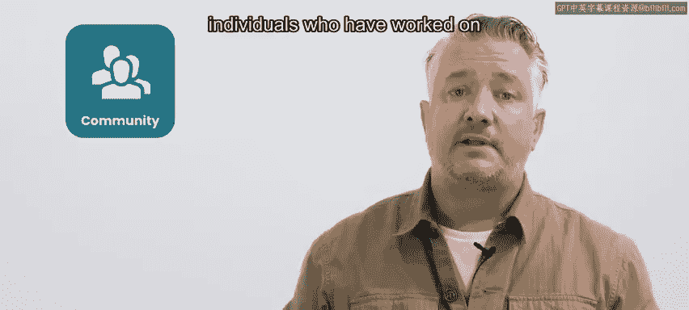

因此，针对此场景的问题陈述可以是：受灾社区的人们和援助组织希望了解在突发性灾难后，需求如何随时间变化，以便更好地为世界任何地方未来的灾难做规划。

## 评估AI的价值

在确定了利益相关者并定义了问题陈述后，你就可以进入探索阶段的第三步。当然，从这一点出发，你可以通过多种方式进行一个有影响力的项目，其中许多并不涉及AI。但这些课程是关于"AI向善"的，所以这就是我们下一步的方向。

因此，本项目的下一步是确定AI能否为你希望解决的问题增添价值。如前所述，Mission 4636的数据集已在线发布，这将是你在本项目中使用到的数据集，就像我们在这些课程中看到的其他项目一样。为了确定AI是否确实能为你的工作增添价值，你需要首先探索数据。

这就是接下来的内容。在下一个视频中与我一起，开始探索数据。

---

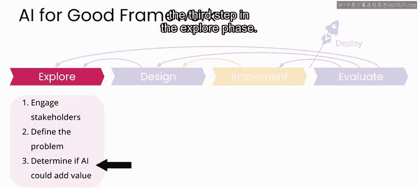

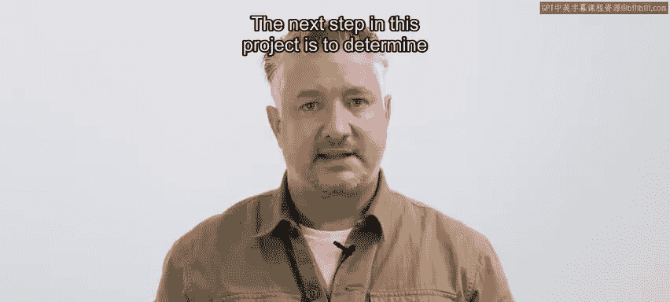

本节课中，我们一起学习了如何为AI项目构建探索阶段。我们回顾了海地地震案例的背景，明确了探索阶段需要识别利益相关者、定义具体问题范围，并初步评估AI应用的可行性。通过定义清晰的问题陈述和利益相关者，我们为后续的数据探索和AI价值评估奠定了基础。