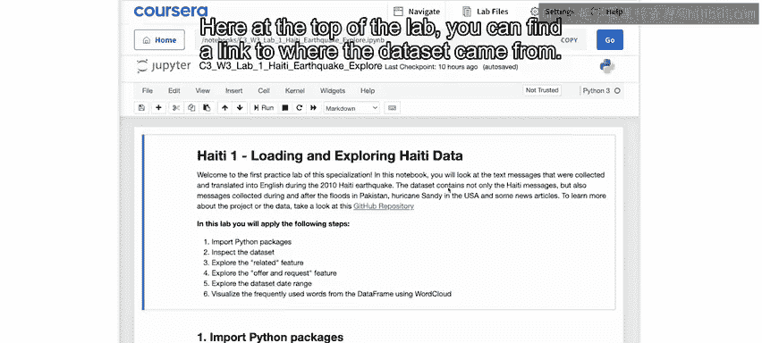
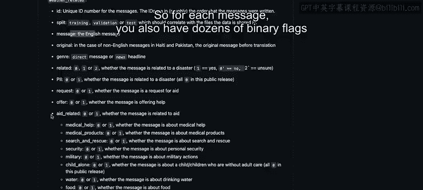
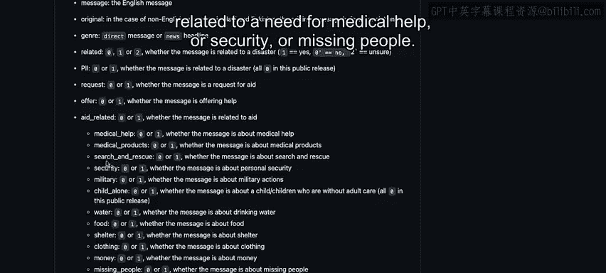
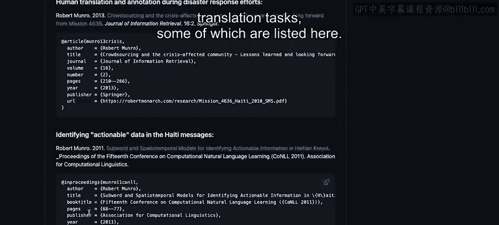
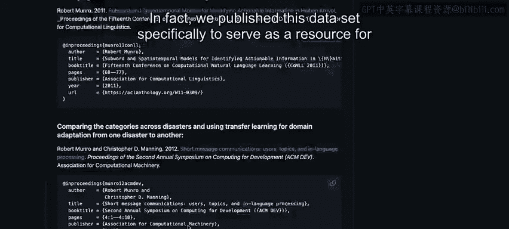
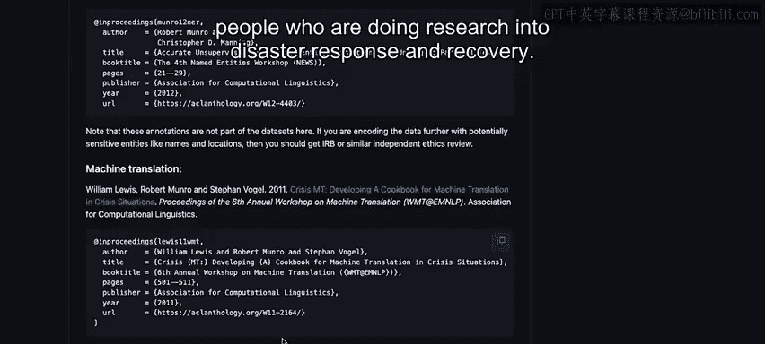
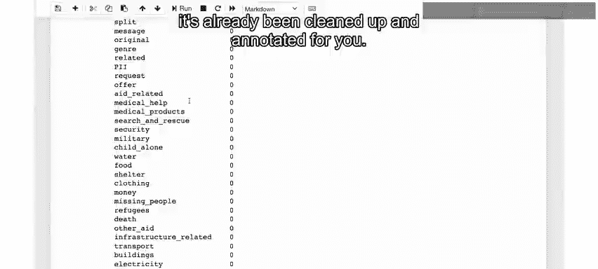

# 109：主题建模探索数据 📊

在本节课中，我们将学习如何探索和分析一个包含2010年海地地震后发送的文本消息的数据集。我们的目标是理解数据内容，并评估人工智能是否能为这类项目提供价值。

## 数据集概述

我们分析的数据集包含了2010年海地地震后发送的文本消息。具体目标是描述灾后数天至数周内，人们对援助、信息和其他请求等需求的演变情况。

为了确定人工智能是否能为你希望开展的项目提供实际价值，我们将从探索消息内容本身、每条消息被分配的各种类别以及数据集的其他特征开始。

需要提醒的是，许多消息内容令人痛心。即使灾难已过去十多年，过去仅阅读这些消息就曾给人们带来创伤。请记住，如果你选择继续，你将非常真实且悲伤地了解灾难后的情况。

在实验的顶部，你可以找到数据来源的链接，本例中是我自己的GitHub仓库。

以下是数据集的摘要。如你所见，数据集总共包含25，000条消息，这些消息来自不同的灾难响应，包括2010年海地地震、同年晚些时候的巴基斯坦洪水、2012年美国的飓风桑迪，以及一组关于灾难的新闻报道。

向下滚动，你可以看到每行数据包含内容的更多细节。这些内容包括消息的ID、消息内容、消息是否与灾难相关以及其他细节。

每条消息都由人工标注者根据其内容细节进行了标记。因此，对于每条消息，你还有几十个二进制标志来指示该消息是否与援助相关。

然后，标志会详细说明具体内容，例如这是否与医疗帮助、安全或失踪人员有关。

还有关于基础设施和天气相关主题的标志。

此外，还有一列指示消息来自哪个事件以及消息发送的日期。在本例中，只有海地的消息包含日期。

再次强调，在项目的探索阶段查看数据的主要目的是确定人工智能是否可能作为解决方案的一部分增加价值。

向下滚动一点，你可以看到这个数据集已被用于大量不同的机器学习相关项目，包括各种分类和翻译任务，其中一些列在这里。事实上，我们发布这些数据，正是为了给从事灾难响应和恢复研究的人们提供资源。

## 开始探索数据

回到笔记本，我首先要提醒你，对于每个实验，你的实验笔记本都位于一个包含其他内容的文件夹中，你可以通过点击这里的Jupyter图标来查看文件夹内容。

这里有一个数据文件夹，其中包含来自GitHub仓库的数据集。和往常一样，你还有一份数据表，描述了数据的来源，本例中指向GitHub仓库，你可以在那里找到关于此数据集细节的更多信息。

与这些课程中的其他实验一样，这里有一个U文件，我放置了你将在本实验中运行的一些代码。如果你熟悉Python并对本笔记本中某些步骤背后的操作感到好奇，可以查看其中的内容。

然后就是笔记本本身。我可以点击这里返回到笔记本。

首先，运行第一个单元格以导入本实验所需的包。当你看到“包已成功导入”的消息时，就可以继续下一步了。

接下来，你正在读取数据集，这里读取的是完整的数据集，它已被分为训练集、验证集和测试集。但在这里，由于我们要对整个数据集进行无监督分析，我们将把它们全部合并。

之后，你将打印出数据的前几行，以确保一切准备就绪且正常。

在这里，你可以看到你获得了近24，000行数据，列就是刚才在GitHub仓库中看到的那些。在这些列中，你可以看到有ID、英文消息以及原始语言，然后是不同类别的各种标志。

这个PII标志用于指示哪些消息包含个人身份信息。正如我们所说，这些信息在发布前实际上已从数据集中移除，但为了确认，我们稍后会检查以验证其值为零，这意味着数据中没有指示个人信息的标志。

这里还有一个字段指示消息来自哪个事件，所以在本例中，顶部的这些消息都来自海地地震。

当你运行下一个单元格时，你将打印出所有的列名。然后，你可以运行下一个单元格来检查PII列中的条目值。该单元格的作用是打印出PAI列中出现的所有唯一值，所以在这种情况下，你可以说只有一个唯一值，那就是零。因此，正如我已经提到的，数据中所有条目的PAI标志都设置为零，这是设计好的。

在地震后记录的全部消息数据集中，当然，许多消息确实包含个人身份信息，但我们在公开之前非常仔细地识别、标记了这些信息，并将其从数据集中移除，实际上是完全删除了它们。在你从事的任何涉及个人之间直接通信的项目中，你都需要非常小心，不要存储或发布任何包含私人信息的数据，除非获得信息被披露的个人的明确同意，并且你还需要确保这些人有机会在未来要求删除他们的数据。

运行下一个单元格，你将打印出事件列中的唯一值，在那里你可以看到不同的事件包括海地地震、美国的飓风桑迪、巴基斯坦洪水，以及这个“Nan”条目，它只是一个空值，用于指示数据集中哪些条目来自新闻报道。

之后，你将把数据过滤到仅包含海地的数据集，但如果你感兴趣，可以更改此过滤器以查看来自其他事件的数据。请记住，你将查看的某些字段（例如日期）在其他数据集中不存在。因此，如果你更改此过滤器，本笔记本中的某些代码可能无法正常工作。

现在你可以看到，你的数据中专门针对海地事件的行数约为9，900行。

当你运行下一个单元格时，你将打印出数据集中每列的缺失值数量，并发现所有列的缺失值均为零。这与你在之前课程的实验中看到的一些存在缺失值的数据集不同。这里你使用的是经过相当精心整理的数据，因此它已经为你清理和注释好了。

## 总结

本节课中，我们一起学习了如何开始探索一个包含约10，000条2010年海地地震后发送的消息的数据集。我们读取了数据，并了解了数据集的基本结构和特征，包括消息类别、事件来源以及数据隐私处理。现在，是时候开始进一步探索了。在下一个视频中，我们将开始可视化这些数据。