# 110：主题建模与数据可视化 📊

在本节课中，我们将学习如何通过可视化手段探索和分析文本数据集。我们将使用一个与灾难相关的短信数据集，通过图表和工具来理解消息的分布、内容以及随时间变化的趋势。目标是判断人工智能是否能在后续分析中提供价值。

---

## 概述

上一节我们开始探索了短信数据集。本节中，我们将继续完成实验的其余部分，通过可视化数据来更好地理解消息类型的分布、消息内容以及不同类型消息随时间的变化情况。

探索的目标是确定人工智能是否可能为分析提供价值。在我们深入探讨人工智能如何处理文本数据的具体细节之前，您需要在这些可视化图表中寻找信息：消息是否根据其内容、发送时间和其他特征自然地分离成不同的组、集群或主题。

如果您刚刚打开实验，需要运行到此为止的所有单元格。如果您一直在跟随操作，可以从这里开始。

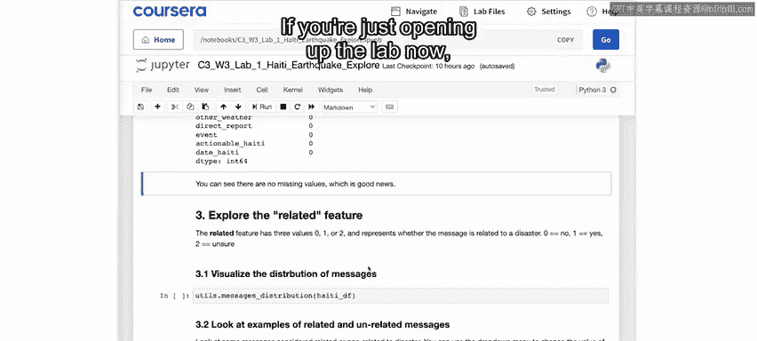

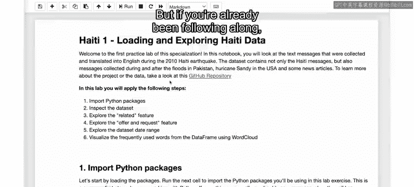

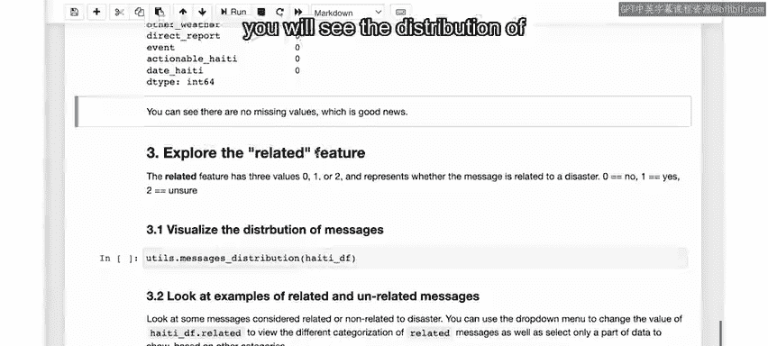

运行下一个单元格时，您将看到名为 `related` 的列中标志的分布情况。

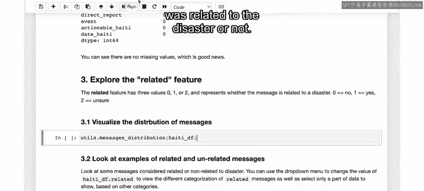

该列指示一条消息是否与灾难相关。

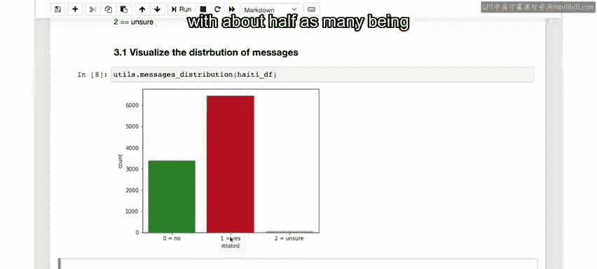

在这个条形图中，您可以看到被归类为与灾难相关的消息（在此列中值为1），以及不相关的消息（值为0），还有那些标注不明确的消息（标记为2）。

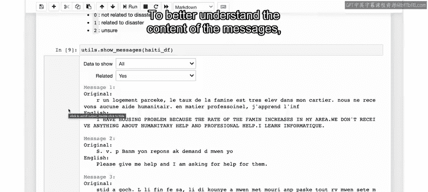

可以看到，大多数消息与灾难相关，不相关的消息大约是其一半，还有少量消息标注者不确定。

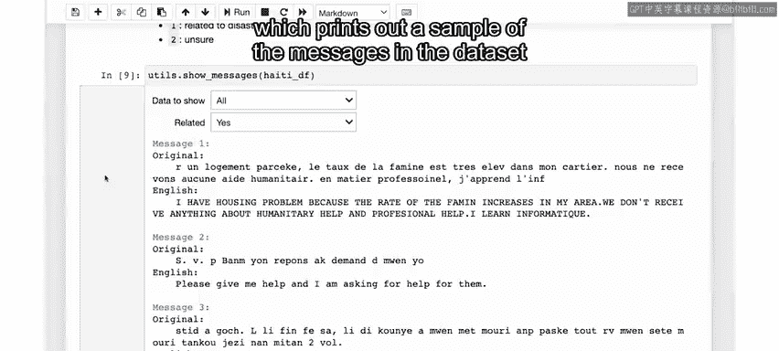

为了更好地理解消息内容，您可以运行 `Excel` 单元格。它会根据您在下拉菜单中选择的条件，打印出数据集中符合条件消息的样本。

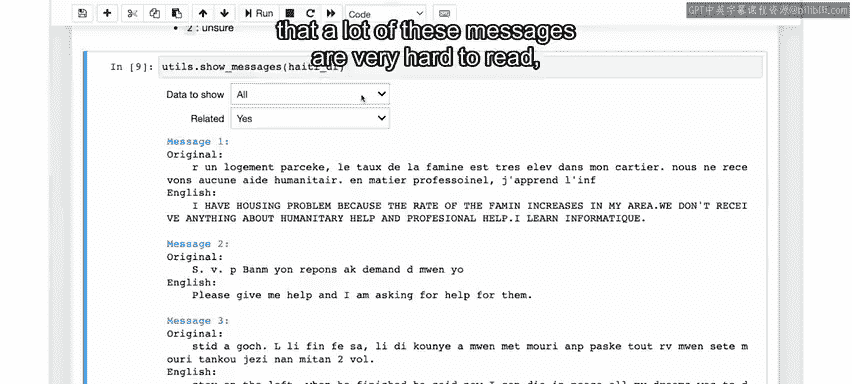

在这里，您可以选择“是”、“否”或“不确定”，来筛选与灾难相关或不相关的消息。

现在可能需要提醒您，很多消息非常难以阅读。即使是我这样参与过灾难响应工作的人，回头再看这些消息也不容易。

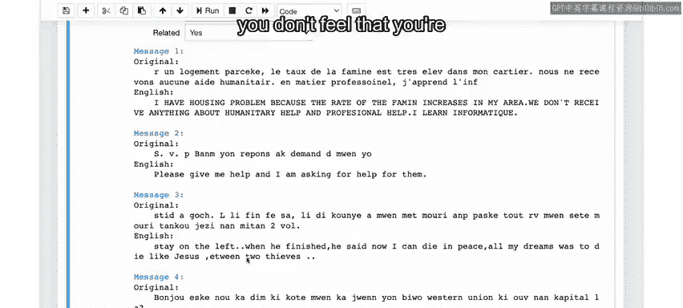

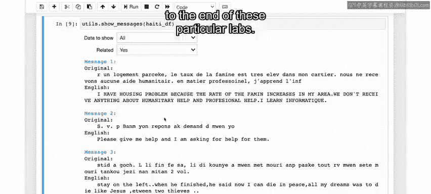

如果您想从事灾难响应工作，理解人们在灾后关心什么、表达什么确实很重要。但如果您觉得不适合查看这些消息，也完全可以跳过这些特定的实验部分。

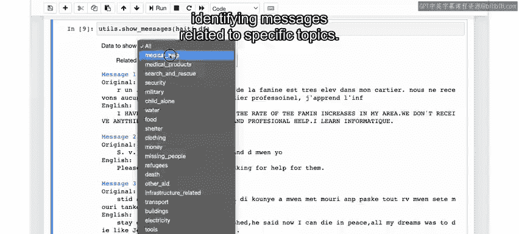

您还可以使用此菜单选择消息的子集，再次选择“全部”或标识特定主题消息的具体类别之一。

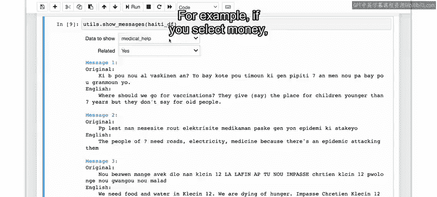

打印出的消息是那些符合您设定条件的消息。对于这些二元类别，您看到的是特定标志被设置为1的消息。

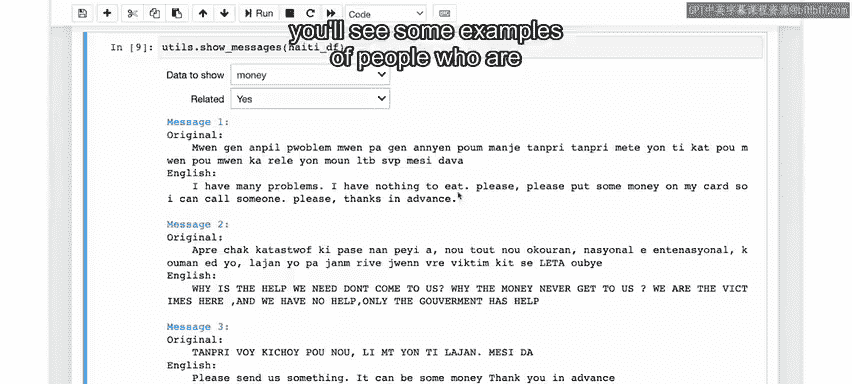

这里每条消息都包含原始的海地克里奥尔语及其英语翻译。建议您调查不同类别下的消息是什么样的。例如，如果您选择“金钱”。

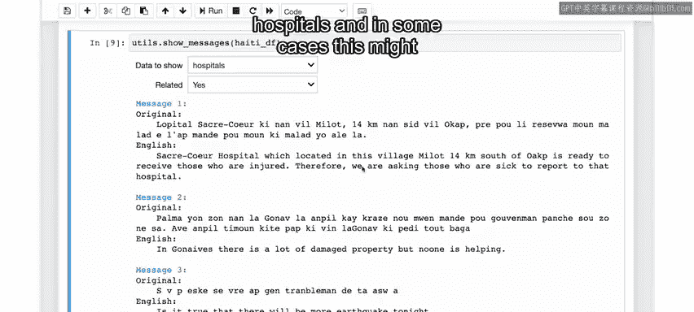

您会看到一些人们询问或提出与金钱相关请求的例子。

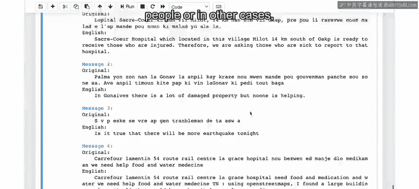

如果您选择另一个类别，比如“医院”，您将看到与医院相关的消息示例。在某些情况下，这可能是可以接收病人的医院，而在其他情况下，可能是人们寻找哪些医院可能开放的信息。

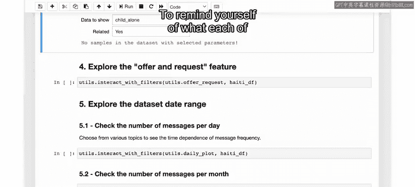

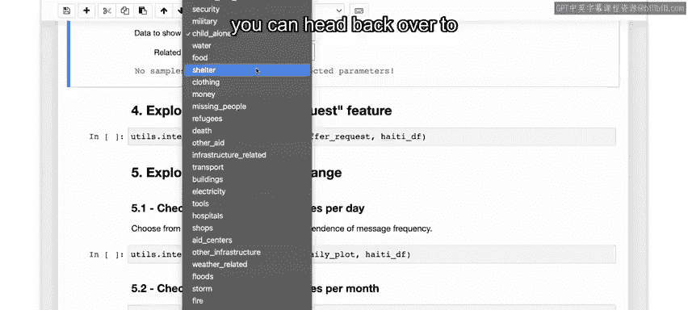

在某些情况下，您可能会遇到显示“数据集中没有符合所选参数的样本”的消息。在这种情况下，这意味着除了PI之外，我们移除了所有与“无人陪伴的未成年人”或“单独儿童”相关的消息，正如这里所标记的。

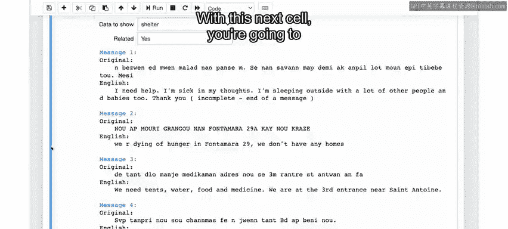

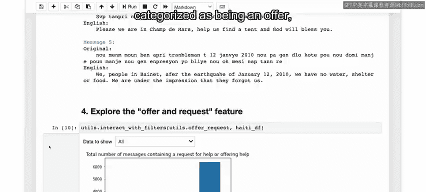

要回顾每个类别的含义，您可以返回GitHub仓库，那里描述了每个标志。

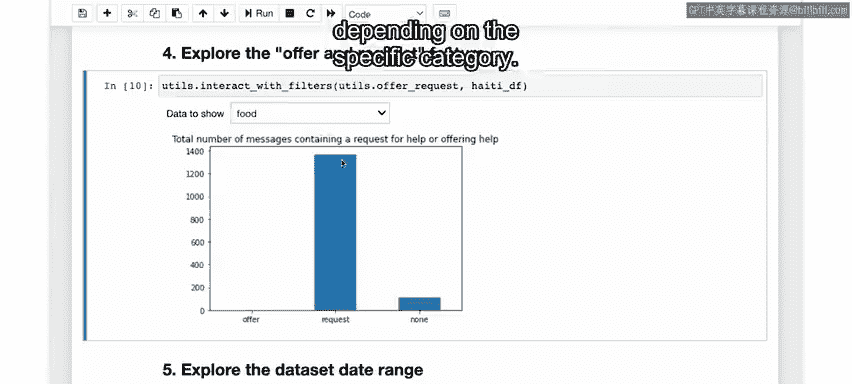

阅读不同条件组合下的消息，看看您能发现什么。

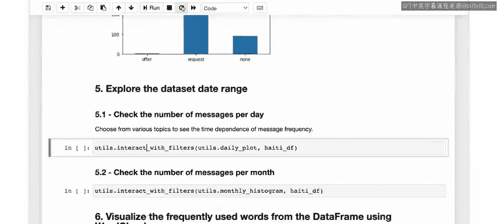

运行下一个单元格，您将生成另一个条形图，查看被归类为“提供”、“请求”或“两者都不是”的消息数量。

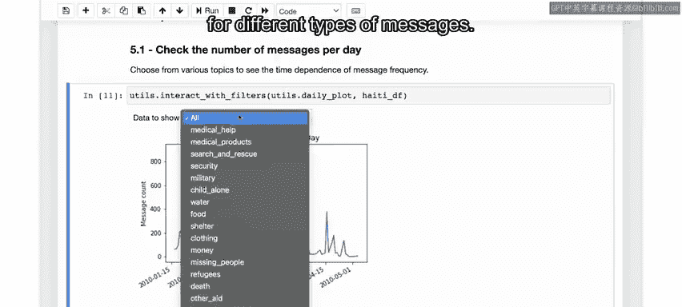

同样，您可以尝试不同的类别，看看分布情况如何。您会发现在大多数类别中，大部分消息都是请求。尽管分布情况因具体类别而异。

运行下一个单元格以显示每天记录的消息数量。

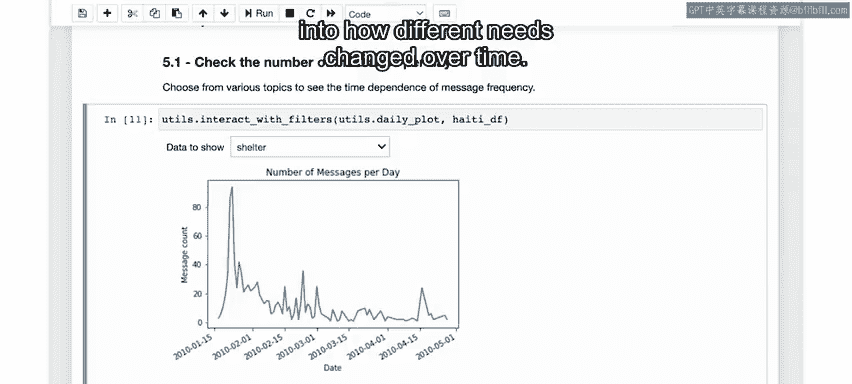

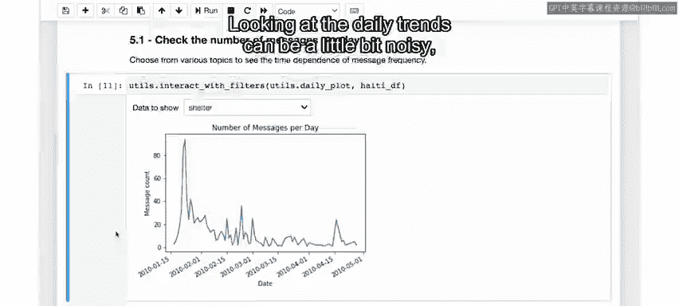

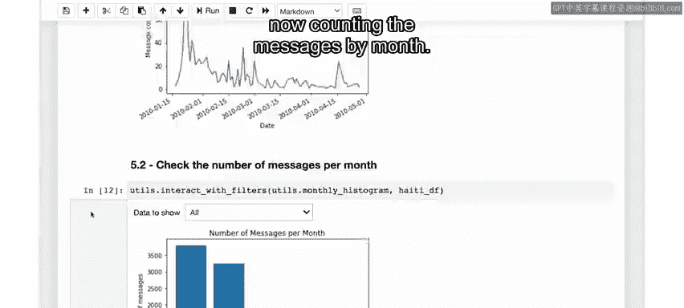

在这里，您可以使用下拉菜单查看不同类型消息的数量如何随时间演变。

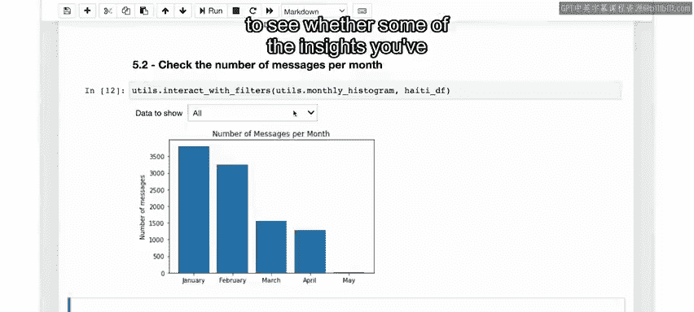

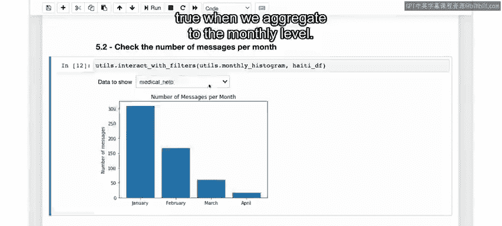

查看所有消息，您可以看到在灾难发生后的最初几天发送的消息更多。观察一下，看看您是否能弄清楚事件发生后立即最常见的是哪些类型的消息，哪些是随时间推移更持久出现的，甚至是后来首次出现的。

从这里，您可以开始粗略地了解不同需求如何随时间变化。查看每日趋势可能有些杂乱，但您可以运行下一个单元格，现在按月统计消息来进行相同的分析。

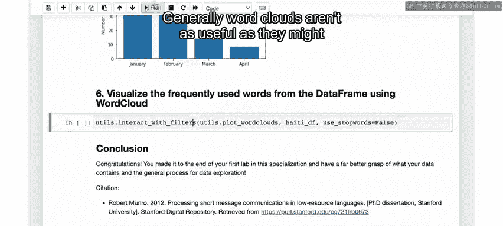

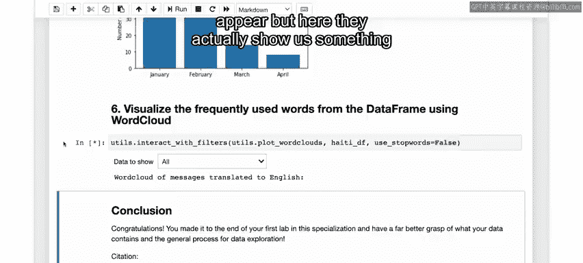

在这里，您应该能够查看当我们将数据聚合到月度级别时，您在上面看到的一些见解是否仍然成立。

最后，我们可以使用词云来查看数据。通常，词云可能不像看起来那么有用，但在这里它们实际上向我们展示了关于数据以及我们想要如何处理数据的一些重要信息。

词云，如果您不熟悉的话，就是最常见单词的集合（在本例中是您选择的给定消息类型）。单词越大，它在数据中出现的频率越高。查看所有消息类型，您可以看到英语翻译中最常见的单词是相对无趣的单词，如“in”、“the”、“we”、“are”等。如果您会说海地克里奥尔语，您会看到相同类型的单词以最大的字体出现在原始海地克里奥尔语消息的词云中。

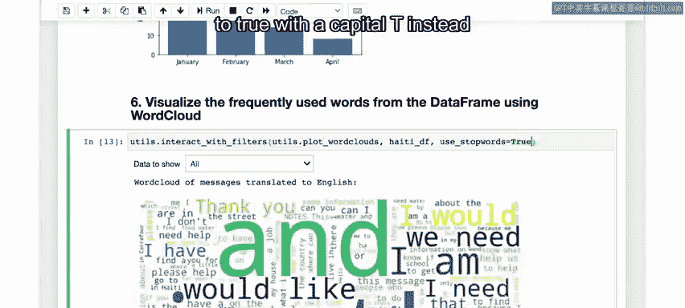

通常，这类文本分析工具默认会避免包含这类单词，但我已将 `use_stop_words` 参数默认设置为 `False`，以便所有单词都包含在此词云中。我这样做的原因是，在下一个实验我们将遵循的文本处理和建模步骤中，您将考虑每条消息的全部内容，因此这些非常常见的单词将是您需要考虑的因素。

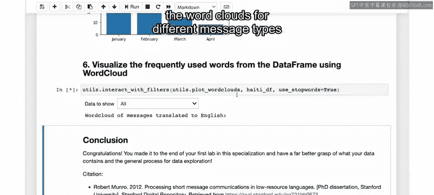

如果您想先睹为快，看看更重要的描述性单词在词云中如何显示，您可以简单地将 `use_stop_words` 参数设置为 `True`（首字母大写T），而不是 `False`。

然后尝试查看不同消息类型的词云，看看您能发现什么。

实验的探索阶段到此结束。在这里，您查看了数据集以更好地了解其包含的内容以及数据的一些特征。您看到不同类别的消息似乎在内容、发送时间以及是否与灾难相关方面自然地分成了不同的组。因此，看起来值得进入该项目的设计阶段，更深入地研究数据，并开始研究如何对不同的主题进行建模。

然而，在此之前，您将完成探索阶段检查点，以确保您已具备进入设计阶段所需的条件。请在下一个视频中与我一起进行探索阶段检查点。