# 111：吴恩达《AI for Good专业课程》 P111 - 主题建模探索阶段检查点 🧭

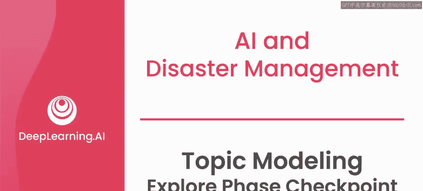

在本节课中，我们将学习如何对一个AI项目进行探索阶段的总结。我们将以2010年海地地震后的短信通信数据为案例，分析如何定义问题、识别利益相关者、评估数据价值，并考虑潜在的伦理风险。

---

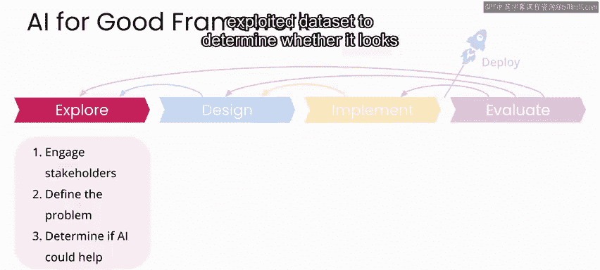

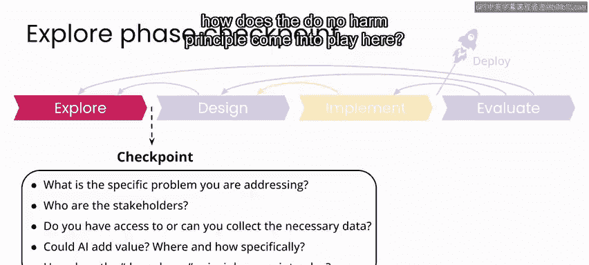

上一节我们介绍了探索阶段的目标，本节中我们来看看针对海地地震案例的具体分析结果。

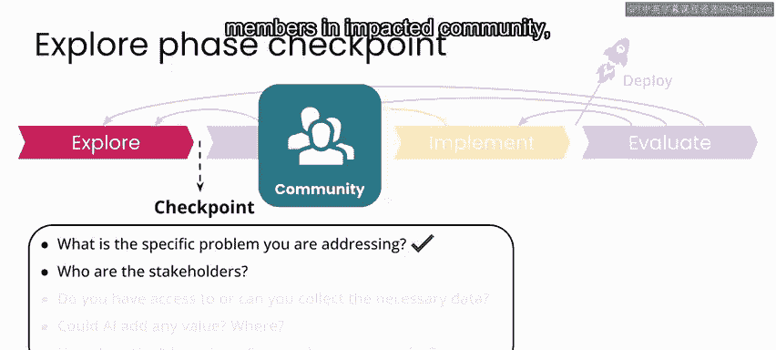

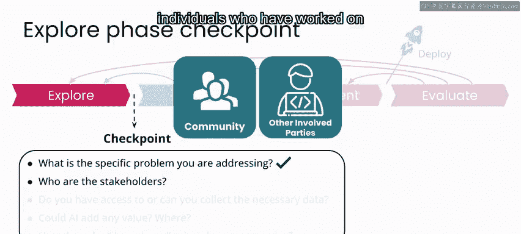

**具体问题陈述**
你正在处理的具体问题是：受灾社区和援助组织希望了解在突发灾难后，援助请求如何随时间变化，以便为未来全球任何地方的灾难制定更好的应对计划。

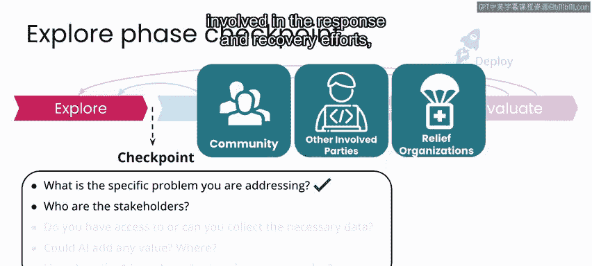

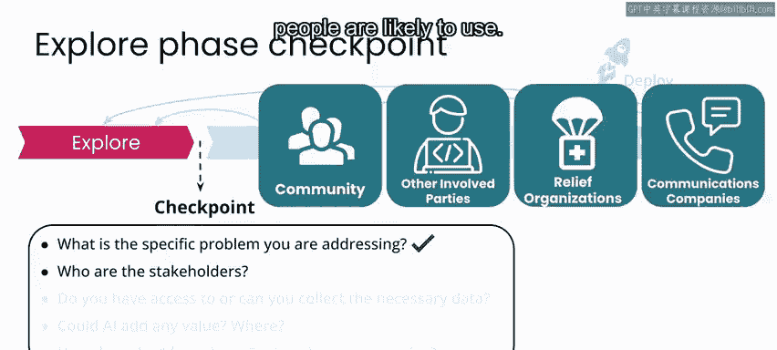

**项目利益相关者**
以下是本项目的关键利益相关者列表：
*   受灾社区的成员，以及未来希望服务的社区。
*   过去曾参与相关解决方案工作的个人。
*   可能参与响应和恢复工作的组织。
*   维护人们可能使用的通信平台的公司。

这个问题的陈述和利益相关者列表在此定义得较为宽泛。但正如之前所说，你可以设想为一个特定的低资源语言社区开展此类项目，并根据该社区的地理位置和可能面临的灾害类型，进一步定制这份利益相关者列表。

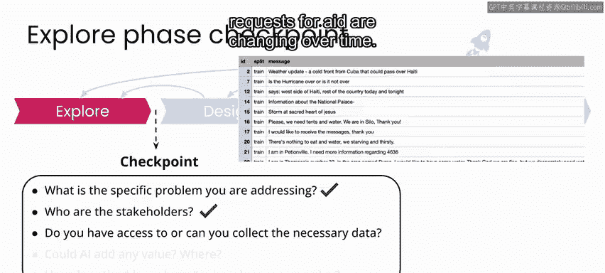

---

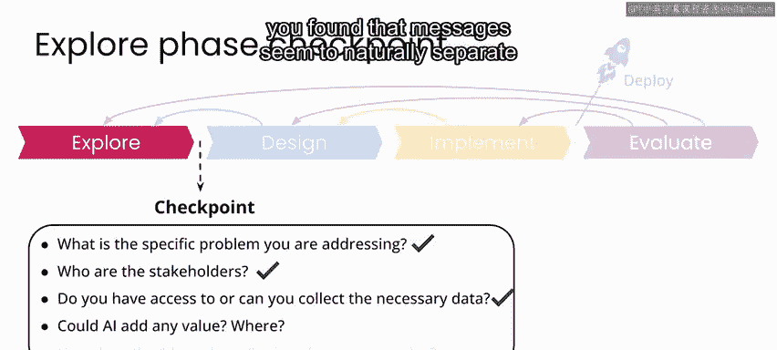

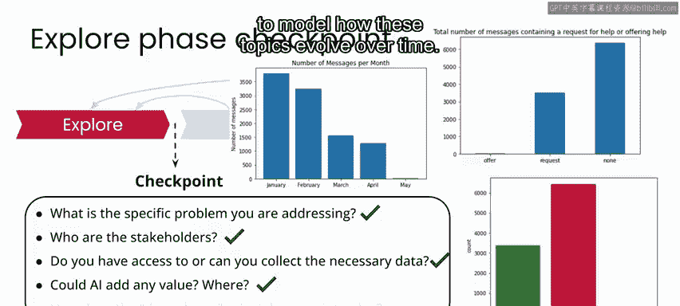

上一节我们明确了问题和相关方，本节中我们来看看数据情况和AI的潜在价值。

**数据与AI价值**
计划使用的数据已为研究目的进行了整理，看起来非常适合追踪援助请求随时间变化的任务。
在数据探索中，你发现信息似乎根据内容自然地分成了不同的组或主题。因此，值得探索一些自然语言处理技术来建模这些主题随时间的演变。例如，可以使用**主题建模算法**（如LDA）来分析文本集合。

**潜在风险与伦理考量**
在这种情况下，数据中的所有个人身份信息以及每条信息的具体地理位置都已被移除。并且是由海地社区自己决定了在此背景下什么应被视为个人身份信息。
在任何使用类似信息的实际应用中，个人身份信息和信息发送者的位置都可能带来潜在的伤害风险。但在本案例中，不存在这种风险。
一个可能造成伤害的领域是将其应用于未来的灾难。主要风险在于：因为目标是为未来的灾难响应和恢复计划提供信息，而任何未来的灾难都必然具有独特的要素和挑战，这些可能在你试图研究的过去案例中并不存在。
例如，即使你根据海地的数据经验，为灾难响应和恢复制定了详细、周密的计划，你的计划也可能无法解决甚至加剧一个具有不同挑战的新灾难场景中的问题。

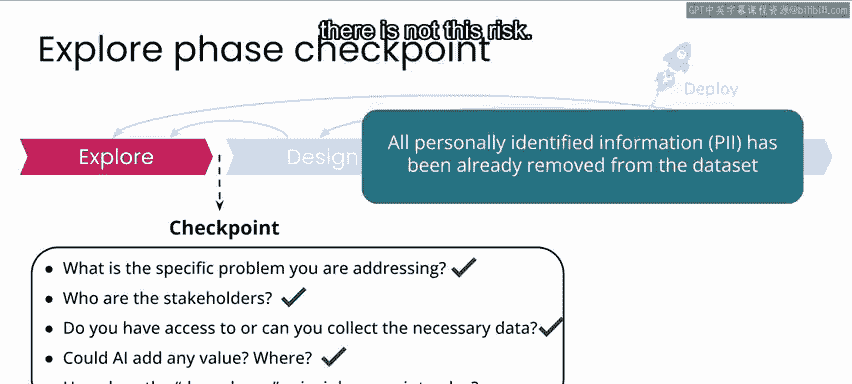

---

本节课中我们一起学习了如何完成AI项目探索阶段的检查点。我们明确了具体问题、识别了利益相关者、评估了数据的适用性以及AI（特别是自然语言处理技术）的潜在价值，并重点讨论了应用模型时需考虑的伦理风险（如朱诺伤害原则）。基于以上分析，现在可以准备进入设计阶段，开始尝试使用自然语言处理技术对数据进行更深入的分析。我们将在下一课开启设计阶段的学习。