# 112：处理文本数据 📝

在本节课中，我们将学习如何为后续的文本分析准备数据。我们将重点介绍文本处理的核心步骤，包括分词、清洗和标准化，以便算法能够有效地比较和理解文本内容。

---

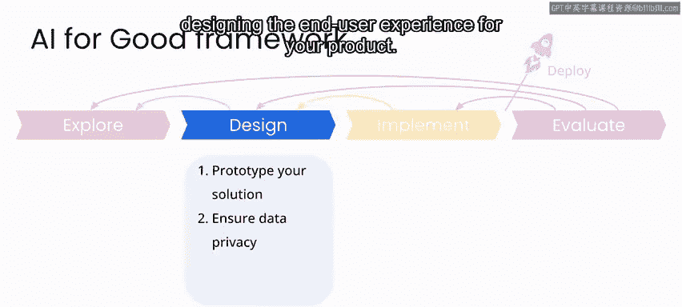

## 项目背景与设计阶段

你现在正处于海地TMes项目的设计阶段。此阶段的目标是分析数据中的消息，以确定在地震后，人们对信息、援助和其他需求的请求是如何演变的。

对于任何项目，设计阶段需要关注的步骤包括：**数据与建模策略的原型设计**、**处理隐私与安全问题**，以及**设计产品的最终用户体验**。

---

## 本案例研究的特殊性

这个案例研究与我们在课程中看到的其他案例略有不同。你将使用一个经过高度整理、更偏向学术研究的数据集，并且不会开发一个软件产品。因此，我们对数据未来的安全性担忧较少。

你的思考重点将不是构建一个具有用户体验的平台或产品，而是将分析结果作为一份关于灾难响应行动的“事后报告”的一部分进行呈现。

---

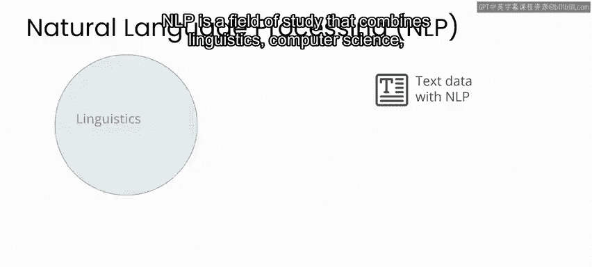

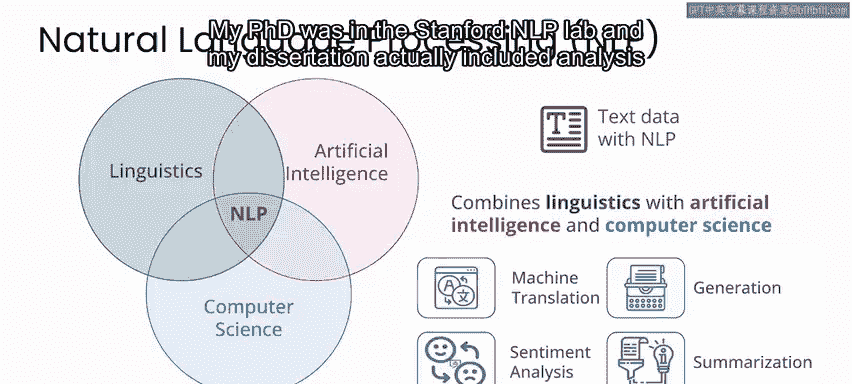

## 从数字/图像到文本数据

在之前的课程项目中，你主要处理由数字或图像组成的数据集。而在这个项目中，你将处理**文本数据**，因此需要应用**自然语言处理**（简称NLP）领域的技术。

NLP是一个结合了语言学、计算机科学和人工智能的研究领域，旨在实现诸如语言翻译、情感分析、文本生成、摘要或搜索引擎等任务。

---

## 主题建模简介

在接下来的设计实验环节，你将使用一种名为**主题建模**的技术。该技术旨在为文本语料库中的一组不同主题建立模型。

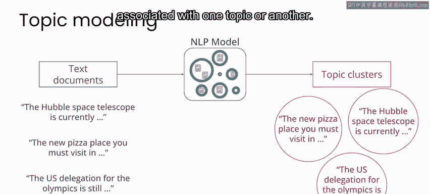

例如，假设你有一批新闻文章作为文本语料库，其中一些文章与科学相关，另一些与食物相关，还有一些可能与体育相关。通过主题建模算法，你可以训练一个模型来**发现数据中的这些不同主题**，并找出哪些特定词语最能标识文章与某个主题的关联。

实际上，你甚至可能不需要提前知道主题是什么，或者（取决于你的方法）你的文本数据中实际包含多少个主题。

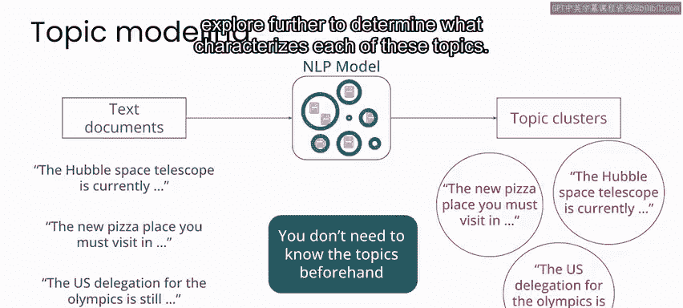

---

## 分析步骤概述

你将在分析中包含一个步骤，以**发现文档语料库中的主题及其正确数量**，并进一步探索以确定每个主题的特征。这就是你在下一个实验中要做的事情。

首先，你将处理短信数据，为分析做好准备。然后，你将应用主题建模技术来发现数据中的主要主题。

接下来的实验将专注于为分析处理和准备数据。下面我将简要介绍其工作原理，然后我们将进入实验本身。

---

## 文本处理的目标与挑战

要理解如何处理文本数据，你可以先直观地思考你想要实现的目标：你希望能够根据内容对不同的短信进行分组。因此，你需要一种能够比较不同消息内容的方法。

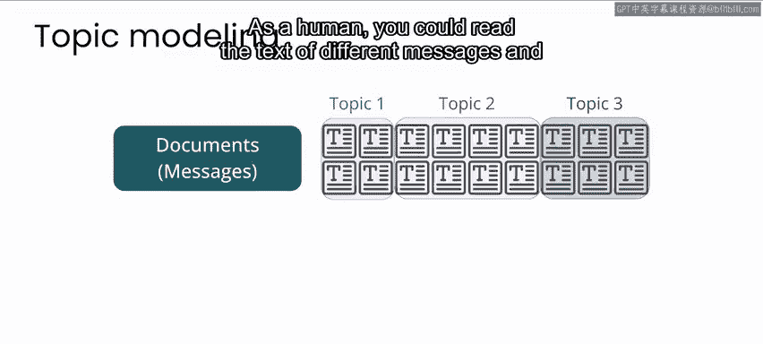

一种比较内容的方法是直接阅读每条消息并寻找相似性或差异性。作为人类，你可以阅读不同消息的文本并直接比较它们。例如，这里有三条关于需要食物、水和其他援助的相似消息。

然而，你的目标是让算法来寻找文本消息之间的相似性或差异性，以便在纯人工分析难以处理的规模上发现这些相似性。

---

## 算法面临的挑战

例如，这三条消息中都含有单词“food”。对人类来说，很容易识别它们是相同的。但对算法而言，这些单词只是数字表示。除非你特别处理，否则全小写的“food”在算法看来，与全大写的“FOOD”和首字母大写的“Food”是不同的。

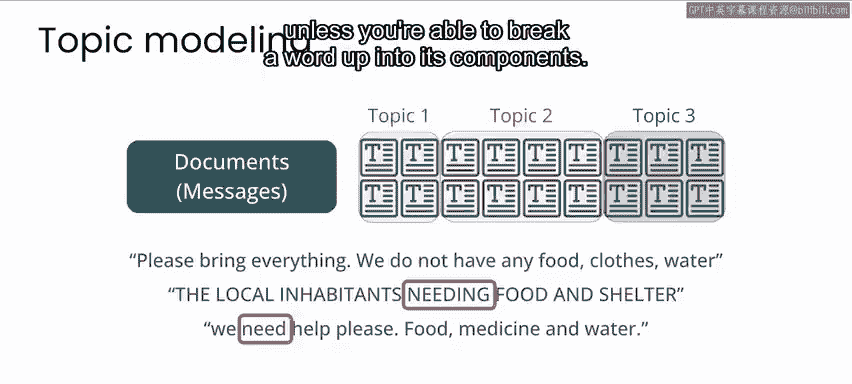

同样，你的算法不会自动识别不同时态的动词。因此，“need”和带有后缀的“needing”虽然在这里明显表示相同的意思，但除非你能将单词分解为其组成部分，否则它们在算法看来也是不同的。

---

## 文本处理的核心步骤：分词与标准化

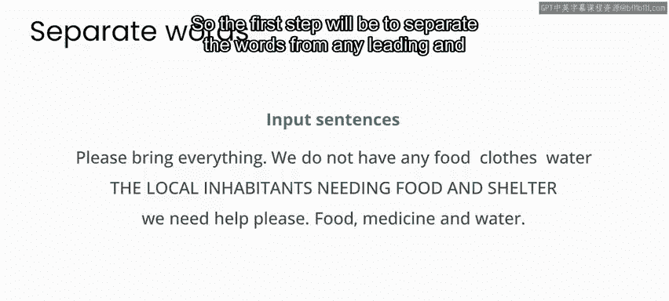

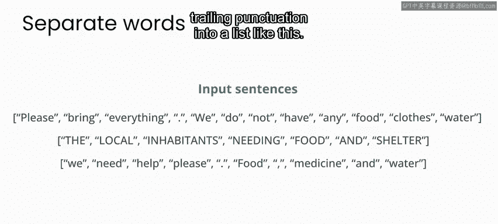

为了处理上述例子，你将把文本处理成所谓的**词元**。你可以将这些词元视为单词的“清理”版本，目的是让算法更容易平滑处理后缀、前缀和大小写等方面的差异。

以下是处理步骤：

第一步，将单词与任何前导和尾随的标点符号分开，形成一个列表。

第二步，删除所有标点符号，因为在此分析中，我们不考虑标点符号对文本含义的影响。

第三步，将所有字母转换为小写。这样，本例中“food”这个词的所有三个实例现在看起来就完全一样了。

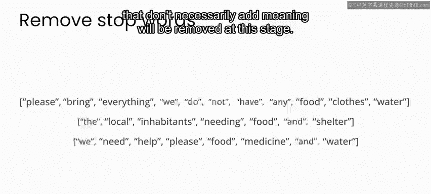

第四步，移除所谓的**停用词**。至少在英语中，这些词往往不会为语句增添任何含义，例如“the”、“and”等词在此阶段将被移除。

最后，执行一个称为**词形还原**的步骤。这是一个花哨的说法，意思是你将去除单词的前缀和后缀，将其还原为词根形式。举一个具体例子，“needing”通过词形还原将变成“need”，然后两者都将作为单词“need”的相同实例出现。

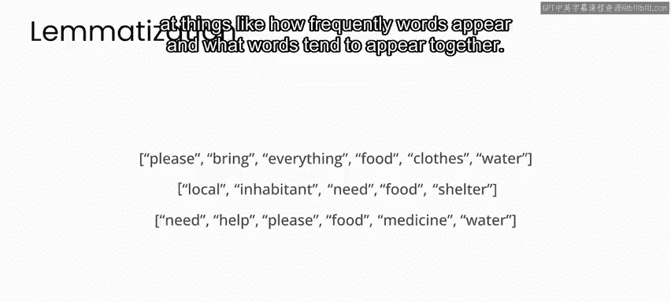

---

## 处理后的结果与应用

经过这些步骤，你得到的是每条消息的词元。现在，你可以使用算法直接在消息之间比较词元，查看词语出现的频率以及哪些词语倾向于一起出现。

这种数据标准化在文本处理中非常常见。你可能也想象得到，这是一种非常简化的处理方式，并且可能会丢失信息。例如，有些情况下大小写是有意义的；我们称之为停用词的词语有时也会影响含义；如果你说另一种语言，你可能已经意识到，英语以外的语言往往有更多的前缀和后缀，并且它们携带的意义通常比在英语中更重要。

在这个场景中，我们不会深入探讨如何处理英语以外的语言的细节。只需知道，一旦我们走出像英语这样非常标准化的语言范围，处理其他语言就变得非常重要且非常困难。

---

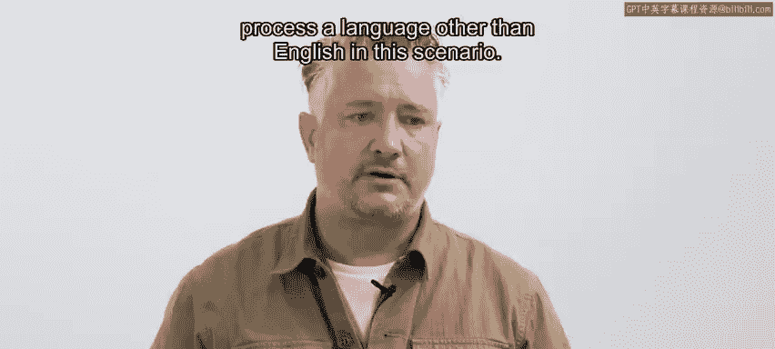

## 总结

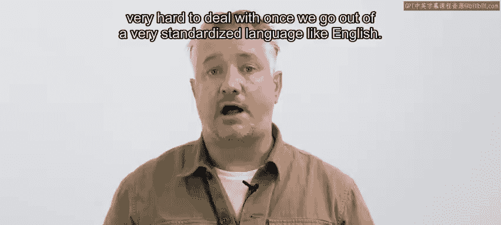

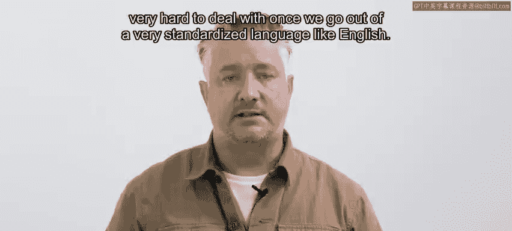

本节课中，我们一起学习了为文本分析准备数据的关键步骤。我们了解了从原始文本到标准化词元的处理流程，包括**分词**、**小写转换**、**去除停用词**和**词形还原**。这些步骤是进行有效主题建模和其他NLP任务的基础。在接下来的实验中，你将亲自应用这些技术来处理海地项目的短信数据。