# 113：主题建模处理文本消息 📝


在本节课中，我们将学习如何为文本消息数据集应用文本处理步骤，为后续的主题建模做准备。我们将使用海地地震后的短信数据集，通过一系列处理步骤，将原始文本转换为可用于分析的数值向量。

---

## 概述

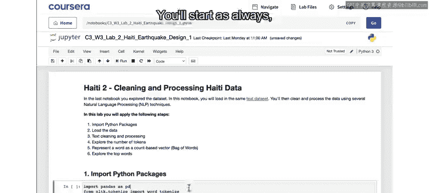

在上一个笔记本中，我们探索了海地地震后发送的短信数据集。在本笔记本中，我们将应用上一视频中介绍的文本处理步骤，为建模准备数据。

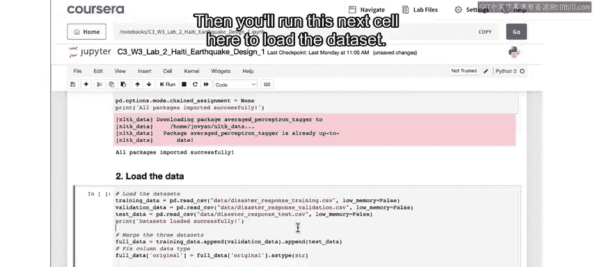

笔记本顶部提供了数据来源的GitHub仓库链接。我们将从导入本实验所需的包开始。

---

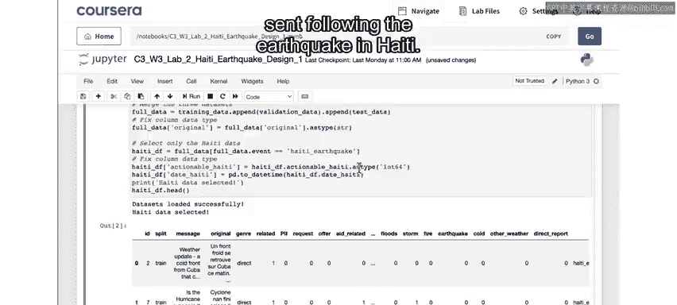

## 导入所需包

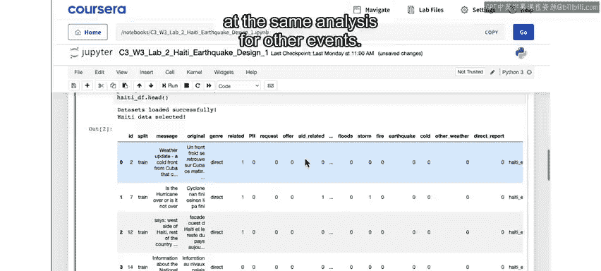

首先，导入本实验所需的Python包。

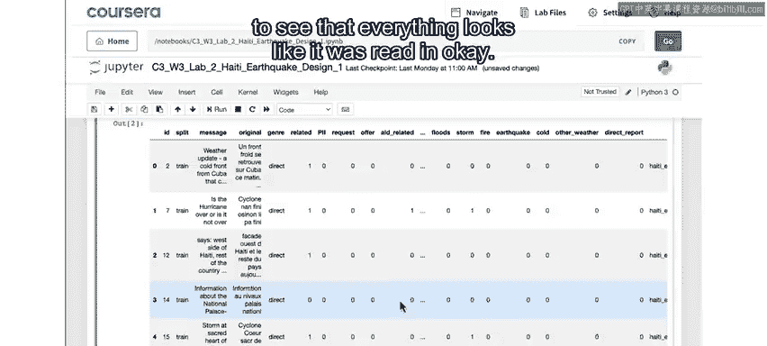

```python
import pandas as pd
import numpy as np
import matplotlib.pyplot as plt
import seaborn as sns
```

---

## 加载数据

运行以下代码加载数据。

```python
data = pd.read_csv('path_to_your_data.csv')
```

这里加载了整个数据集，然后筛选出仅包含海地地震后发送的短信。你可以更改筛选条件，对其他事件进行相同的分析。

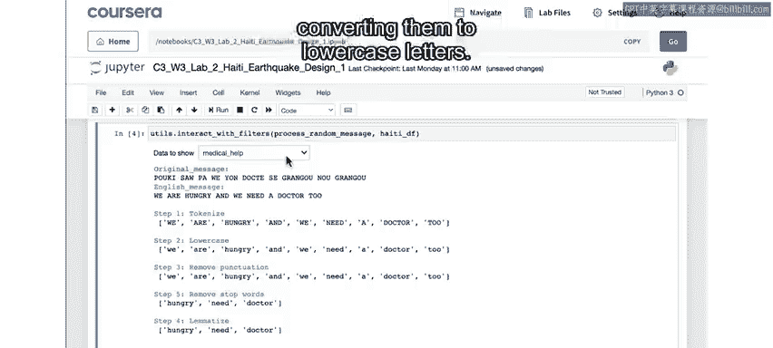

打印数据的前几行，确认数据读取正常。

```python
print(data.head())
```

---

## 文本处理步骤

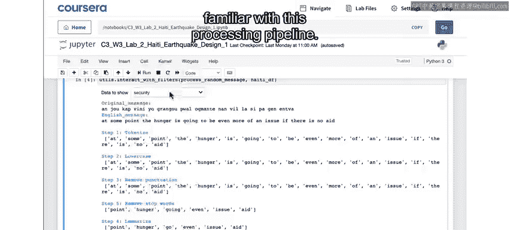

接下来，我们将运行上一视频中介绍的所有步骤：**分词**、**去除标点**、**小写转换**、**去除停用词**和**词形还原**。

你可以使用下拉菜单选择不同的消息类型，就像在上一个实验中所做的那样。每次选择不同的类型，你都会看到在处理每个步骤时其他消息的变化。

以下是处理步骤的简要说明：

*   **分词**：将文本大致分解为不同的单词，尽管在某些情况下可能会拆分单词并去除尾随的标点。
*   **小写转换**：将所有大写字母转换为小写字母。
*   **去除标点**：移除完全由标点符号组成的标记。
*   **去除停用词**：移除英语中那些非常常见但往往不携带太多意义的单词。
*   **词形还原**：通过去除不同的前缀或后缀来简化单词，至少在英语中，这些词缀本身往往不携带太多信息。

尝试在不同消息上运行这些步骤，以熟悉这个处理流程。

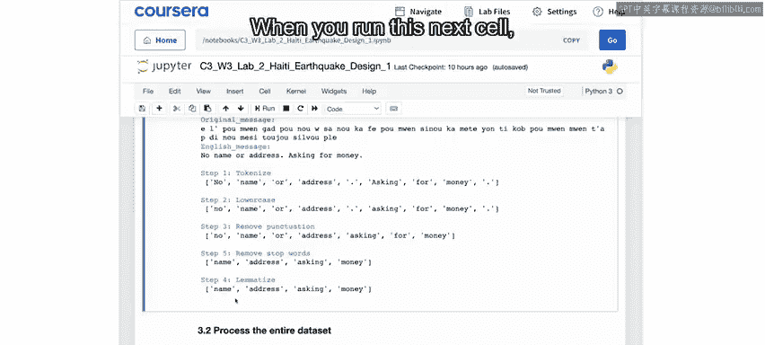

---

## 扩展停用词列表

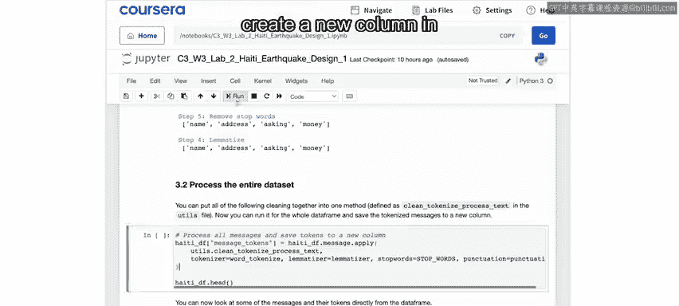

在停用词步骤中，我们应用了一个标准的英语停用词列表，例如“the”、“and”等。在文本处理中，你经常会发现需要排除超出此标准列表的额外单词。如果你查看`URLs`文件，你会看到我们根据这些消息的内容稍微扩展了标准列表。

在下一个实验中，你还有机会移除额外的停用词。

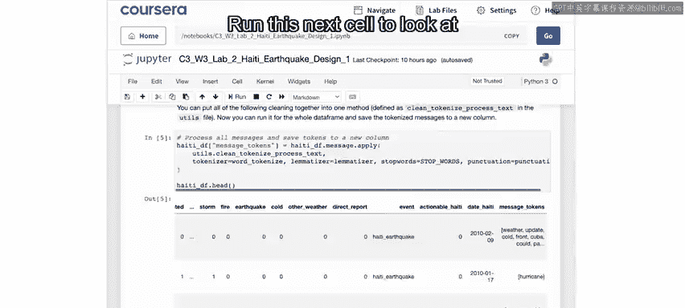

运行此单元格后，你将把处理流程应用到整个数据集，并在数据框中创建一个名为`Message tokens`的新列，用于存储每条消息的标记列表。

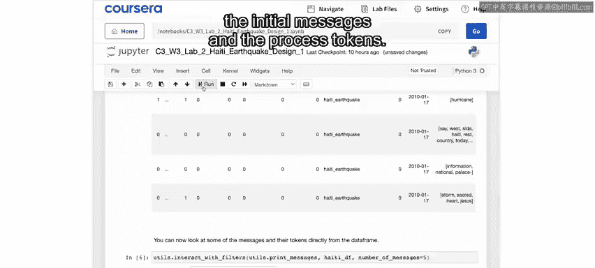

---

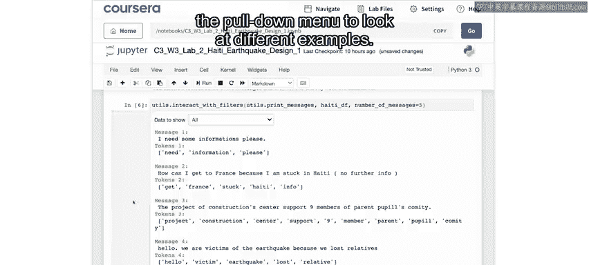

## 查看处理结果

如果你将原始消息列与消息标记列并排查看，现在可以看到每条消息是如何转换为标记的。

运行下一个单元格，查看初始消息和处理后标记的不同类别示例。

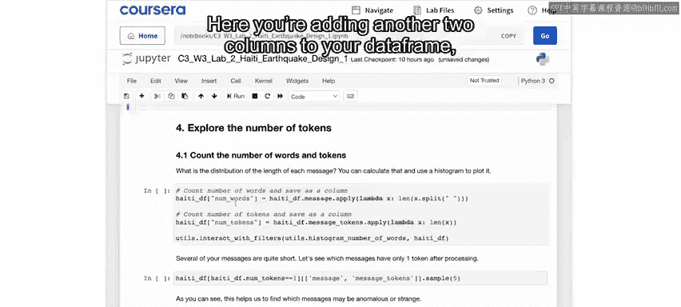

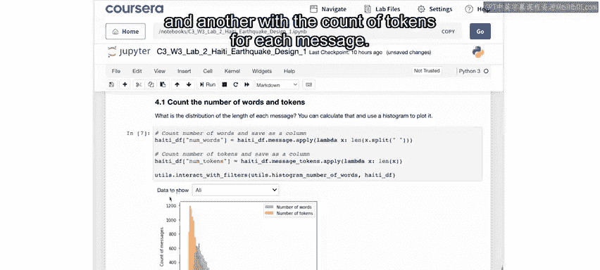

```python
# 示例代码，查看特定类别的消息和标记
category = 'your_selected_category'
sample_messages = data[data['category'] == category].head()
print(sample_messages[['original_message', 'message_tokens']])
```

同样，你可以从下拉菜单中选择不同的类别来查看不同的示例。

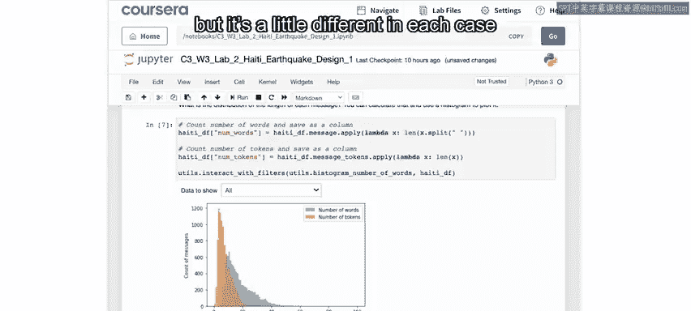

---

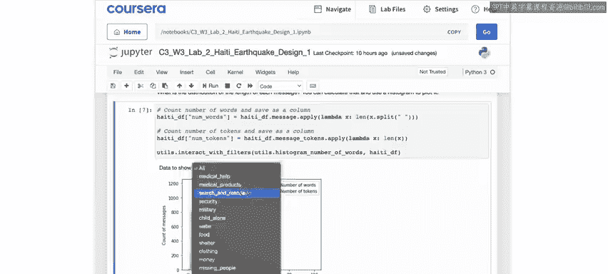

## 分析标记数量

查看每条消息生成了多少标记也很有趣。这里，我们在数据框中添加另外两列：一列是原始消息中的单词数，另一列是每条消息的标记数。

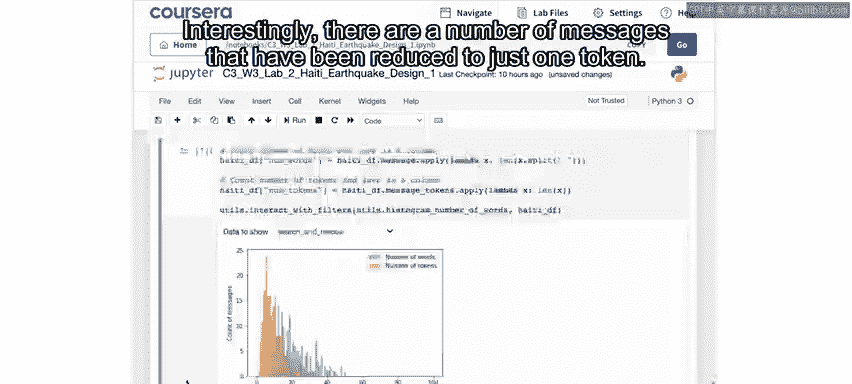

```python
data['word_count'] = data['original_message'].apply(lambda x: len(x.split()))
data['token_count'] = data['message_tokens'].apply(len)
```

然后，绘制单词数和标记数的直方图。

```python
plt.figure(figsize=(12, 5))
plt.subplot(1, 2, 1)
plt.hist(data['word_count'], bins=30, edgecolor='black')
plt.title('Distribution of Word Counts')
plt.xlabel('Number of Words')
plt.ylabel('Frequency')

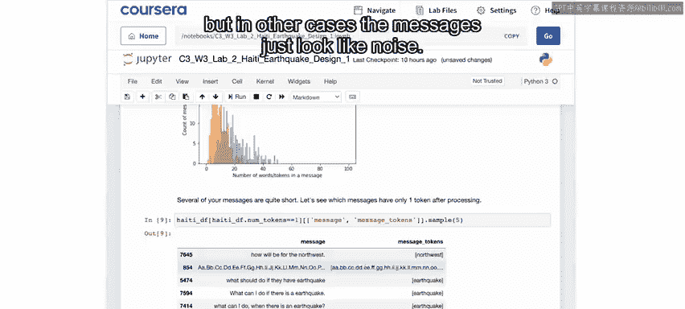

plt.subplot(1, 2, 2)
plt.hist(data['token_count'], bins=30, edgecolor='black', color='orange')
plt.title('Distribution of Token Counts')
plt.xlabel('Number of Tokens')
plt.ylabel('Frequency')
plt.show()
```

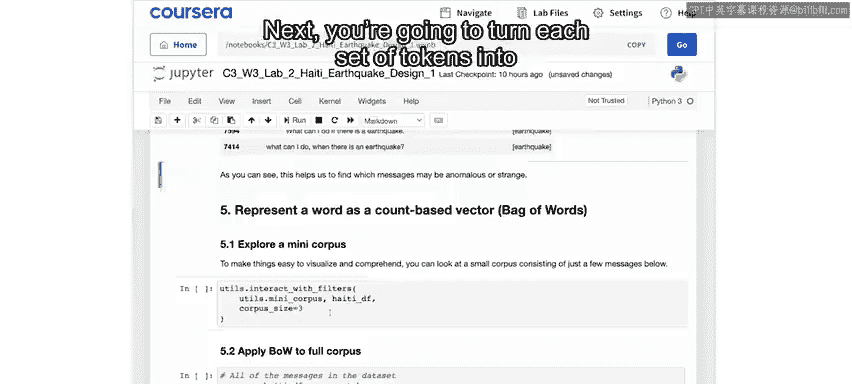

你可以看到，通常标记数少于单词数，但每种情况都不同。同样，你可以为不同类型的消息可视化这一点。

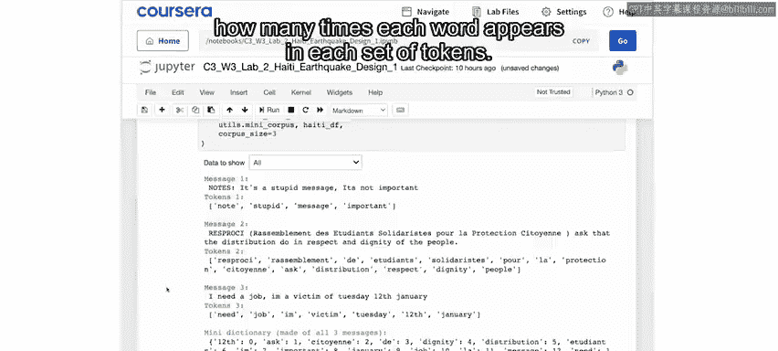

有趣的是，有许多消息被简化为仅一个标记。你可以通过运行下一个单元格来查看这些消息。

```python
single_token_messages = data[data['token_count'] == 1]
print(single_token_messages[['original_message', 'message_tokens']].head())
```

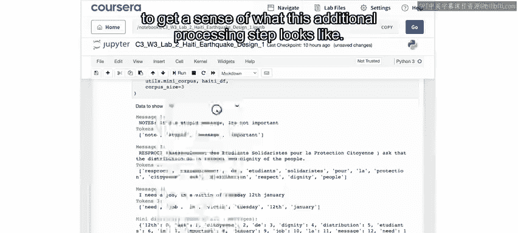

每次运行该单元格，你都会看到另外五个示例。在某些情况下，看起来确实只有一个感兴趣的单词，如“earthquake”，但在其他情况下，消息看起来只是噪音。

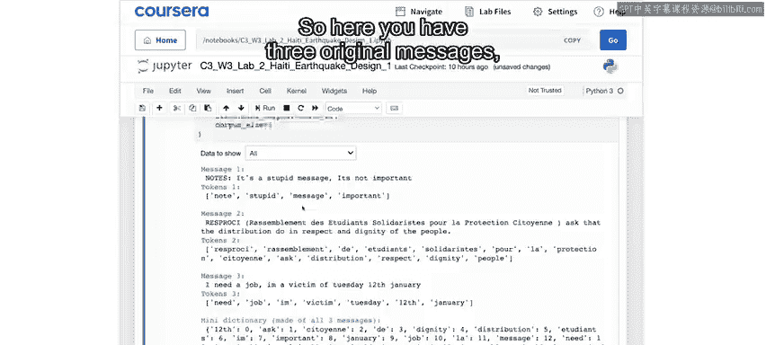

---

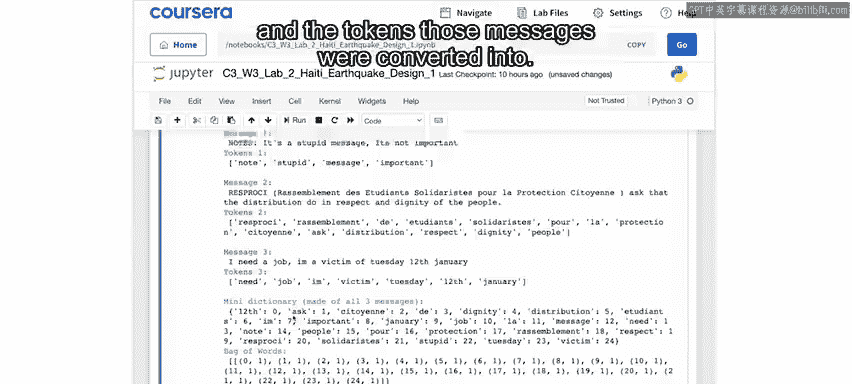

## 词袋表示法

接下来，你将把每组标记转换为一个向量或数字列表，表示每个单词在每组标记中出现的次数。

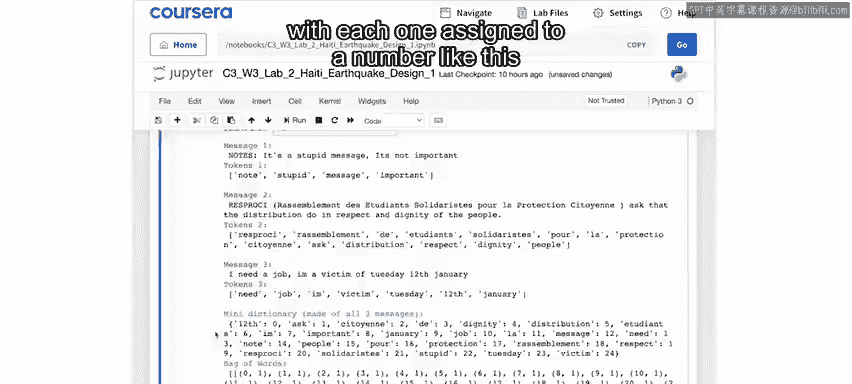

运行此单元格，你将看到这如何一次处理几条消息。同样，你可以选择不同的消息类型，以了解这个额外处理步骤的样子。

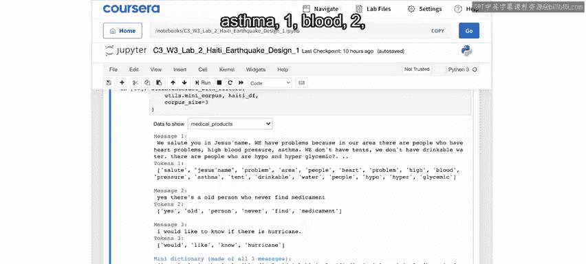

以下是处理流程：

1.  **原始消息**：你的小型语料库。
2.  **标记**：这些消息被转换成的标记。
3.  **小型词典**：出现在上述消息中的每个唯一单词的列表，每个单词分配一个数字索引。
4.  **词袋向量**：使用该小型词典创建一个数字对列表，一个数字对应每个单词或标记，以及该单词在你的小型语料库中所有消息的标记中出现的次数。

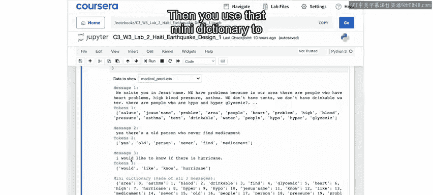

在人类可读的示例中，你可以看到这些单词大多只出现一次，尽管少数如“problem”和“people”出现了两次。

这种简单地计算一组文档（在本例中是小型语料库）中单词出现次数的过程被称为**词袋方法**。基本上，你正在以这样的方式准备数据：对于整个文本语料库，你可以知道每个单词出现了多少次。

最后，这里是词袋的人类可读版本，其中包含文本中的每个单词以及该单词在上述消息中出现的次数。

---

## 应用于整个数据集

当你对整个数据集运行此操作时，将为语料库中出现的每个唯一标记分配一个不同的数字。

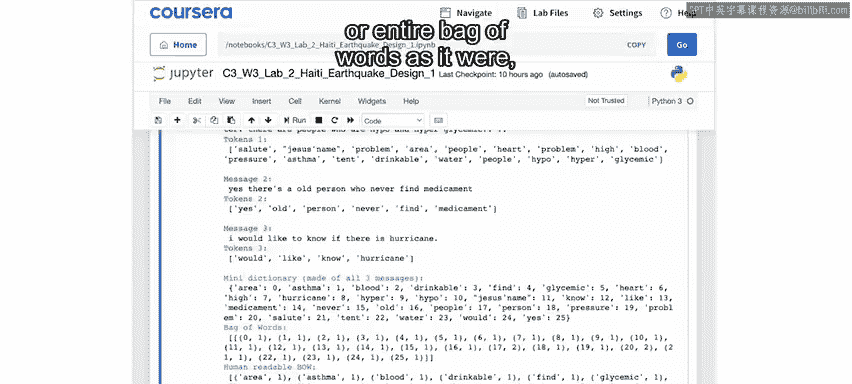

运行下一个单元格，将此技术应用于完整的数据集。

```python
from sklearn.feature_extraction.text import CountVectorizer

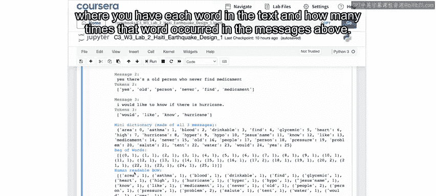

vectorizer = CountVectorizer()
X = vectorizer.fit_transform(data['message_tokens'].apply(lambda x: ' '.join(x)))
```

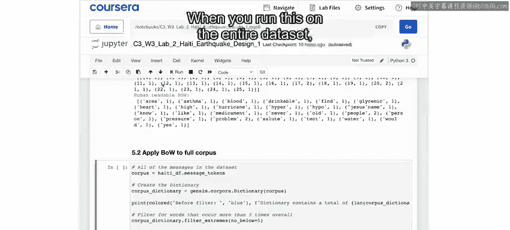

现在，你可以查看整个数据集中单词或标记的频率。同时，你将把该列表减少到仅出现至少五次的单词。

运行下一个单元格，打印出整个数据集中前20个最常出现的标记列表。

```python
# 获取词频并排序
word_freq = pd.DataFrame(X.sum(axis=0), columns=vectorizer.get_feature_names_out()).T
word_freq.columns = ['frequency']
top_20 = word_freq.sort_values('frequency', ascending=False).head(20)
print(top_20)
```

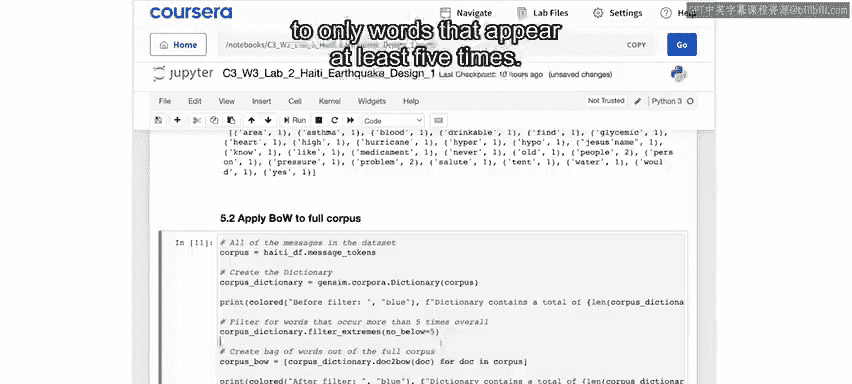

你可以看到，这些词是“help”、“need”、“sadly”、“pleased”、“people”等。尽管情况很糟糕，但人们非常有礼貌。

在这里，你可以看到在这个数据集中总共有超过80，000个标记。或者平均每条消息大约有八个标记，因为我们开始时大约有10，000条消息。

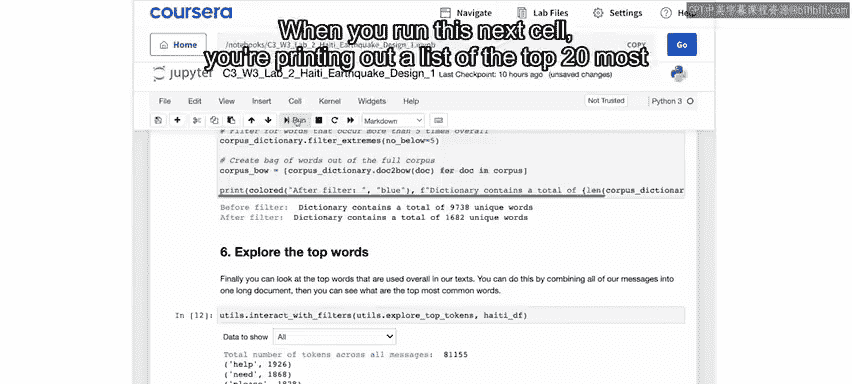

你可以从这些下拉菜单中选择查看每种消息类型的前20个单词。

---

## 可视化

接下来，你可以为不同的消息类型运行词云可视化。

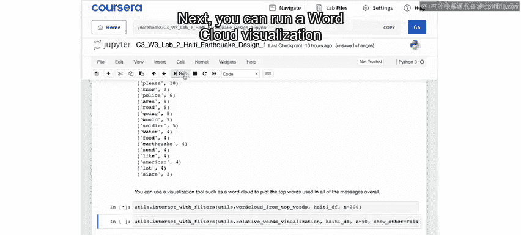

```python
from wordcloud import WordCloud

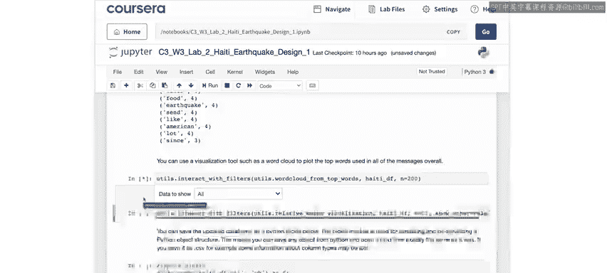

# 示例：为特定类别生成词云
category_text = ' '.join(data[data['category'] == 'your_category']['message_tokens'].apply(lambda x: ' '.join(x)))
wordcloud = WordCloud(width=800, height=400, background_color='white').generate(category_text)
plt.figure(figsize=(10, 5))
plt.imshow(wordcloud, interpolation='bilinear')
plt.axis('off')
plt.show()
```

请注意，现在不同主题的词云不再被像“and”或“the”这样携带很少内容的单词所主导，就像上一个实验中的情况一样。这当然是因为你在分析中过滤掉了停用词。

最后，你可以查看不同消息类型的所谓**树状图**，其中每个矩形的相对面积表示一个单词在数据中出现的频率。

```python
import squarify

# 示例：为特定类别生成树状图
category_freq = word_freq_for_category.head(50) # 假设已计算
squarify.plot(sizes=category_freq['frequency'], label=category_freq.index, alpha=0.8)
plt.axis('off')
plt.show()
```

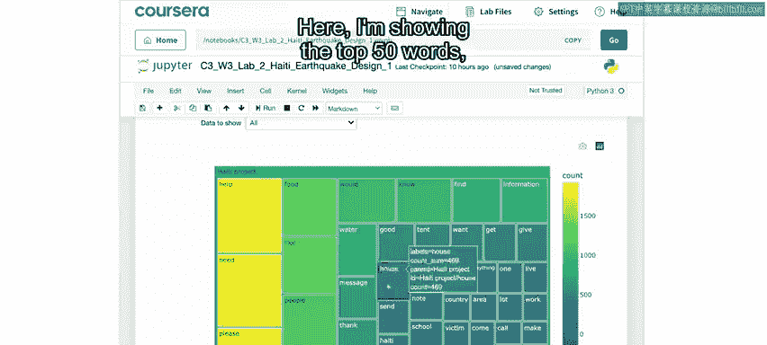

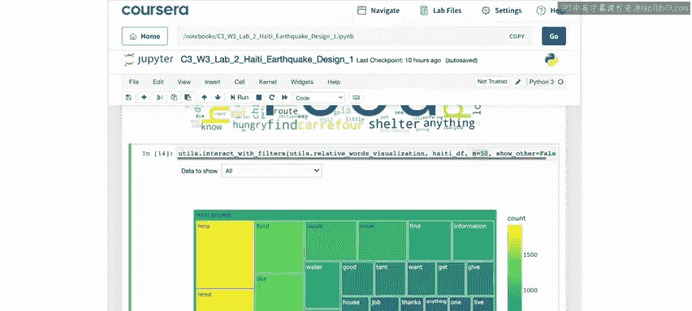

这里我展示了前50个单词，但你可以更改此参数来查看更多或更少的单词。

同样，这样做的目的是了解什么特征化了不同的类别，并开始了解数据集中一些更广泛的主题可能是什么。

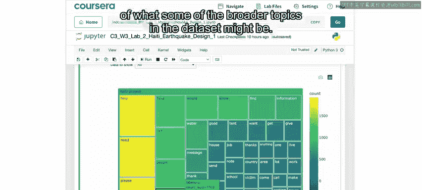

---

## 保存处理后的数据

最后一步是展示如何保存处理后的数据集。我们为你完成了这一步，你将在下一个实验中再次使用它，但如果你取消注释这行代码，你可以在此处保存自己的副本。

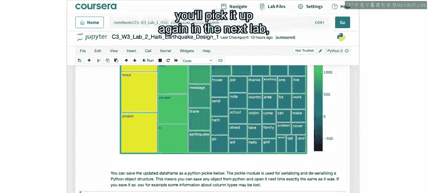

```python
# data.to_csv('processed_messages.csv', index=False)
```

---

## 总结

在本节课中，我们一起学习了如何将文本消息语料库处理成标记，然后进一步将这些标记表示为向量。这有助于我们查看不同消息类别中单词的相对频率。接下来，我们将开始构建模型，请加入下一个视频，开始对此数据集中的主题进行建模。