# 114：主题建模与潜在狄利克雷分布 (LDA) 🧠


在本节课中，我们将学习如何应用潜在狄利克雷分布（LDA）算法对文本数据进行主题建模。我们将从准备数据开始，运行LDA模型，评估模型质量，并最终分析主题如何随时间演变。

---

## 概述

上一节实验中，我们通过将每条消息中的单词转换为词元（token）并进行计数，为建模准备好了文本数据。本节中，我们将应用一种称为潜在狄利克雷分布（LDA）的技术。你可以将LDA视为一种在整个文档语料库（在本例中是短信）中进行统计比较的方法。通过这种方法，我们将能够根据相关词汇（更具体地说是它们包含的词元）在统计上的相似性对消息进行分组。

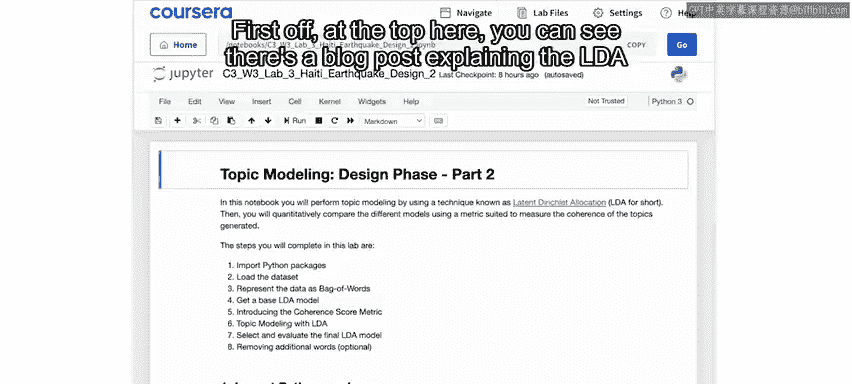

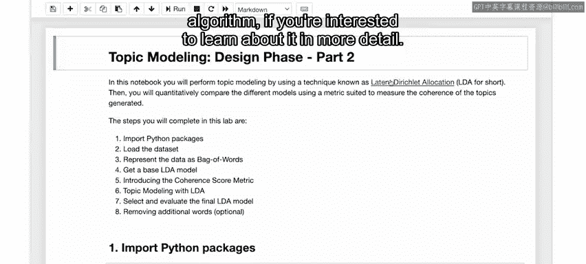

---

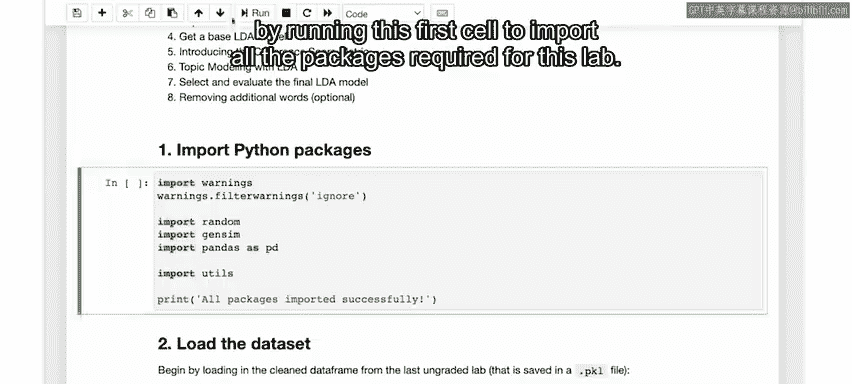

## 导入必要包

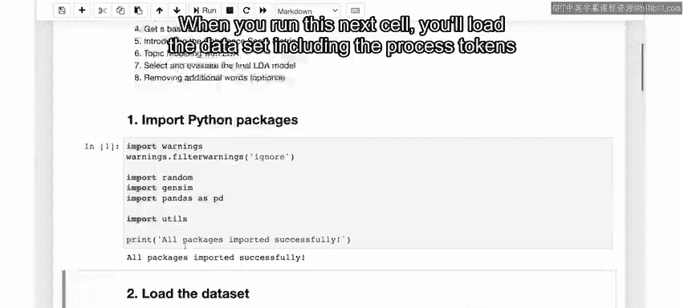

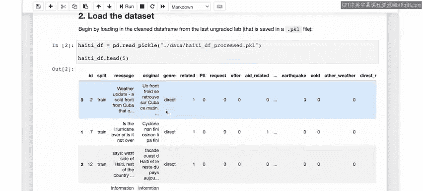

首先，运行第一个单元格以导入本实验所需的所有包。

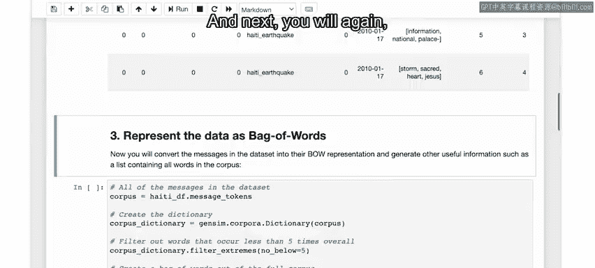

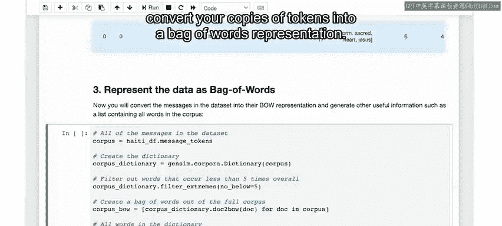

```python
# 导入所需库的代码示例
import pandas as pd
from sklearn.feature_extraction.text import CountVectorizer
from sklearn.decomposition import LatentDirichletAllocation
```

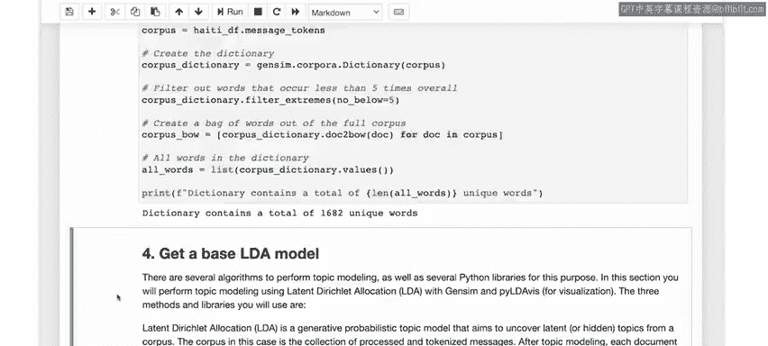

---

## 加载数据

运行下一个单元格时，你将加载数据，包括在上一实验中准备好的已处理词元。

```python
# 加载数据
data = pd.read_csv('processed_data.csv')
processed_tokens = data['tokens'].tolist()
```

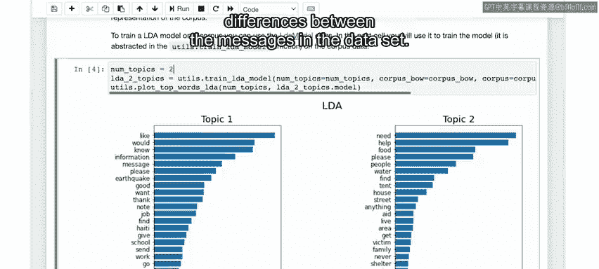

---

## 创建词袋表示

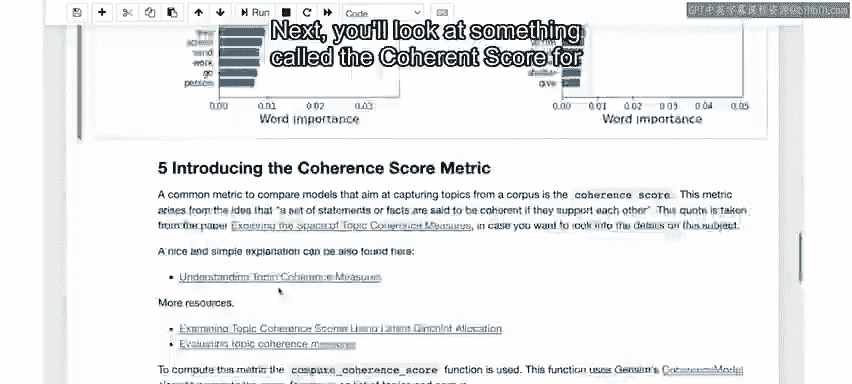

接下来，你将再次把词元语料库转换为词袋表示。

```python
# 创建词袋模型
vectorizer = CountVectorizer()
bag_of_words = vectorizer.fit_transform([' '.join(tokens) for tokens in processed_tokens])
```

这仅为数据集中的每个唯一词元分配一个数字，以便LDA算法能够利用它。

---

## 运行LDA模型

在下一个单元格中，你将在数据上运行LDA方法，这里指定将数据建模为包含两个主题。

```python
# 运行LDA，指定主题数为2
lda_model = LatentDirichletAllocation(n_components=2, random_state=42)
lda_model.fit(bag_of_words)
```

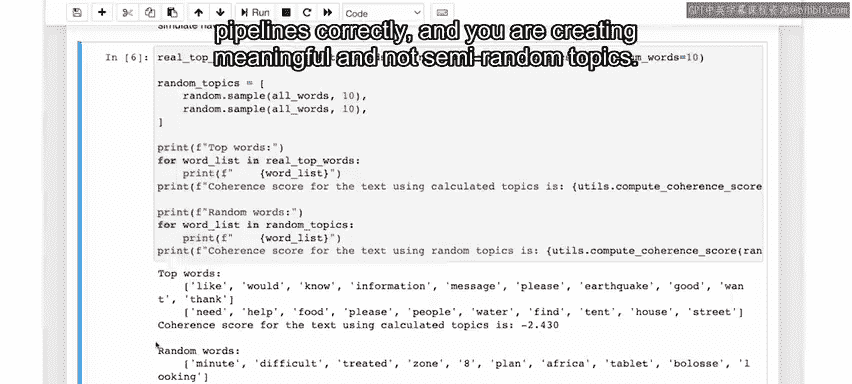

输出显示了模型识别出的主题中最常见的单词。请注意，你并未指定希望这些主题的内容是关于什么的，你只是运行了一个模型，根据数据集中消息之间的统计相似性和差异性将数据分为两个主题。

---

## 评估主题一致性

接下来，你将了解一种称为“一致性分数”的指标。以下是关于一致性分数的更多学习链接（如有兴趣）。关键点是，这是衡量你所识别主题的一致性或质量好坏的一个指标。

```python
# 计算一致性分数（示例，实际使用需要coherence模型）
from gensim.models import CoherenceModel
# ... 计算一致性分数的代码 ...
```

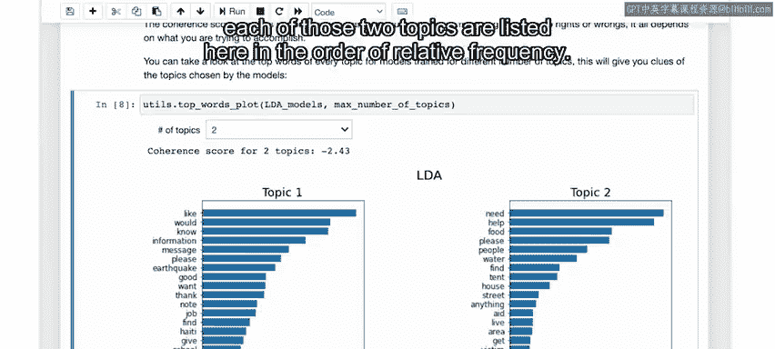

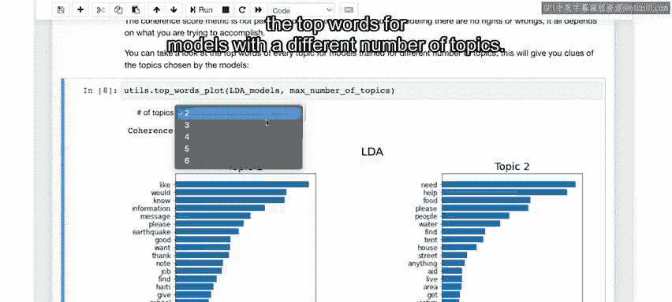

关于使用一致性来衡量主题建模质量的利弊有大量文献，如果你有兴趣，我鼓励你阅读。简而言之，一致性是通过计算最常出现单词之间相似度的估计值来衡量的。通常，分数是一个负数，越接近零的数字表示一致性越高，或者说模型越好。无论你有多少个主题，都只会得到一个一致性度量值。

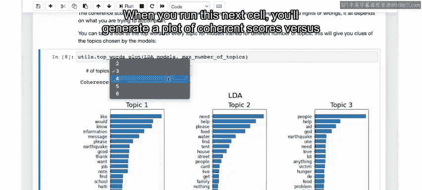

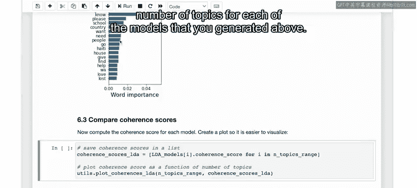

为了可视化其工作原理，你将计算在上一步建模中识别的两个主题的前10个单词的一致性，然后与数据集中随机单词列表的一致性分数进行比较。每次运行此操作，你都将与不同的随机单词集进行比较，你会发现模型主题中顶部单词的一致性比随机单词更接近零。这表明你的模型主题比随机单词集合更具一致性。这是一个很好的完整性检查，以确保你正确构建了数据管道，并创建了有意义而非半随机的主题。

---

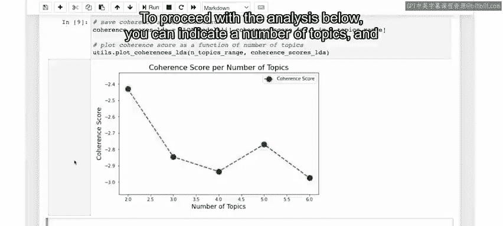

## 探索不同主题数量

如前所述，你也可以运行包含更多主题的模型，这就是下一步要做的。在这里，你将生成主题数量从2到6不等的模型。

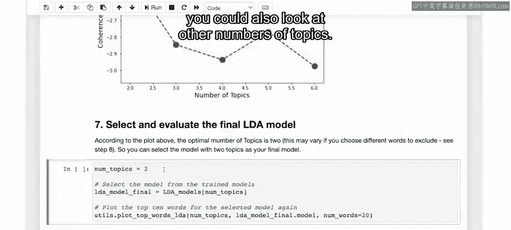

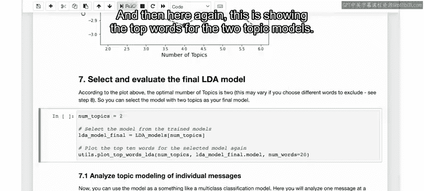

```python
# 尝试不同数量的主题
coherence_scores = []
for n_topics in range(2, 7):
    lda = LatentDirichletAllocation(n_components=n_topics, random_state=42)
    lda.fit(bag_of_words)
    # ... 计算并存储一致性分数 ...
```

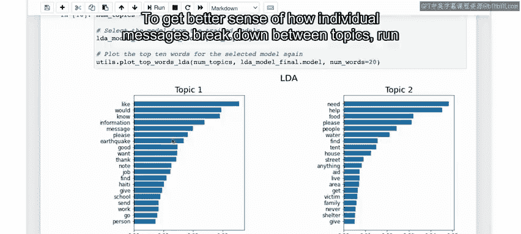

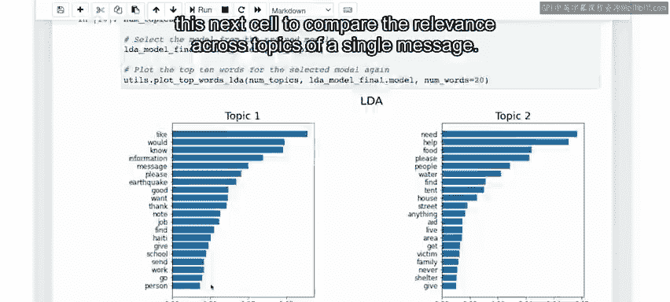

与之前的实验一样，你可以在视频中看到我们会稍微加快速度。完成后，你可以可视化每个主题的顶部单词结果以及每个模型的一致性分数。例如，对于一个包含两个主题的模型，一致性分数约为-2.43，并且两个主题的顶部单词按相对频率列出在此。然后，你可以使用下拉菜单查看具有不同主题数量的模型的一致性分数和顶部单词。

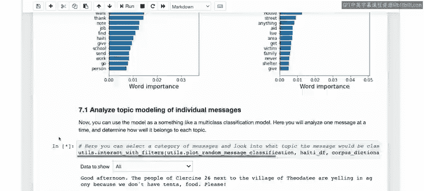

---

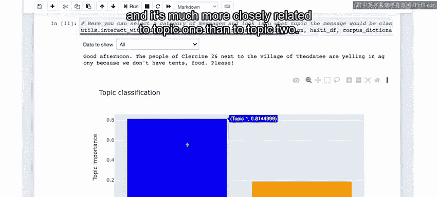

## 可视化一致性分数

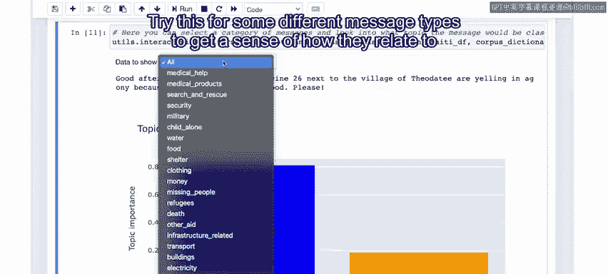

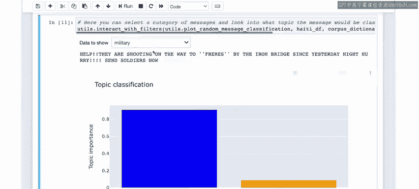

运行下一个单元格时，你将生成上面生成的每个模型的一致性分数与主题数量的关系图。

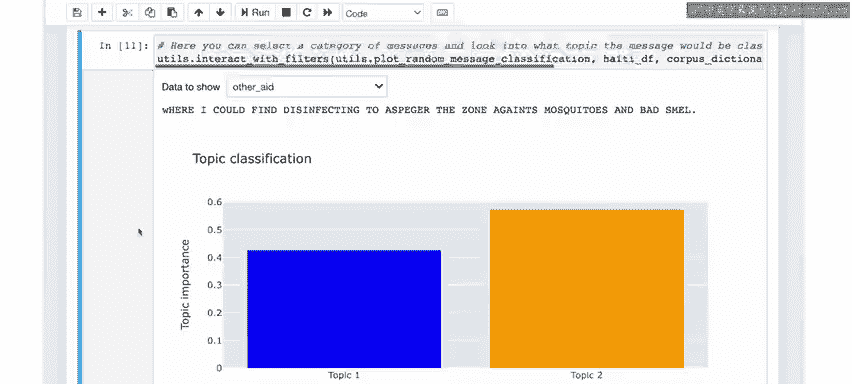

```python
# 绘制一致性分数 vs 主题数量
import matplotlib.pyplot as plt
plt.plot(range(2, 7), coherence_scores, marker='o')
plt.xlabel('Number of Topics')
plt.ylabel('Coherence Score')
plt.show()
```

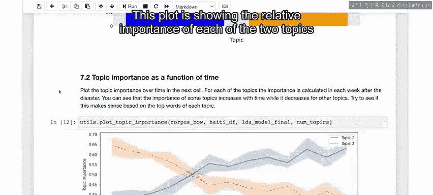

同样，更好的模型具有更高（负值更小）的分数。在这里，你可以看到在这种情况下，两个主题似乎仍然是最好的模型。

为了进行下面的分析，你可以指定一个主题数量并选择最终模型。这里我将选择两个主题，因为它具有最佳的一致性分数，但你也可以查看其他数量的主题。然后，这里再次显示双主题模型的顶部单词。

---

## 分析单个消息的主题归属

为了更好地理解单个消息如何在主题之间分解，运行下一个单元格以比较单个消息在各个主题中的相关性。

```python
# 分析单条消息的主题分布
message_index = 0
message_topic_distribution = lda_model.transform(bag_of_words[message_index])
print(message_topic_distribution)
```

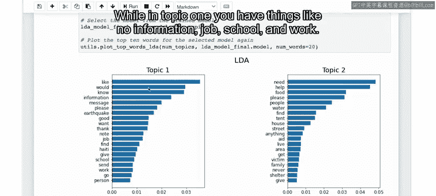

这里你看到的是一个图表，显示了特定消息与模型中每个主题的关联强度。在这种情况下，该消息是关于某个地区缺乏资源的人群，它与主题一的关联远比与主题二更密切。

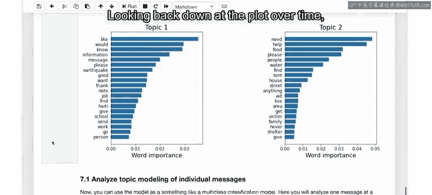

尝试对一些不同类型的消息进行此操作，以了解它们与不同主题的关系。

---

## 分析主题随时间的变化

接下来，你可以通过运行这里的单元格来绘制这些主题如何随时间变化。

```python
# 按周分组并计算主题重要性随时间的变化
# ... 数据处理和绘图的代码 ...
```

此图显示了两个主题随时间变化的相对重要性。在X轴上，是收到第一条消息后的天数。在垂直轴上，是两个主题的相对重要性。计算方式是将消息按周分组。你可以按天进行，但按周分组可以在统计上提供更好的平滑效果。然后，你使用模型评估所有消息，以确定它们与主题一和主题二的相关程度，就像上面所做的那样，但现在针对整周的消息。对于每一周的消息，这里绘制了两个主题中每个主题的平均相关性或重要性，阴影误差范围显示了该平均值周围两个标准差的范围。

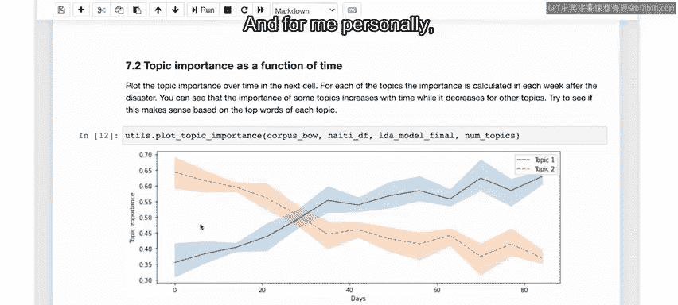

因此，这里似乎有一个清晰的信号表明，灾难发生后，主题二比主题一更相关。回顾这些主题的顶部单词，这开始变得直观，因为在主题二中，最常见的词是如“需要帮助”、“食物”、“水”、“援助”和“庇护所”等，而在主题一中，你有如“无信息”、“工作”、“学校”等词。

回顾随时间变化的图表，看起来主题二随着时间的推移变得不那么受关注，而主题一则有所增长。大约在地震发生一个月后，主题一的相关性实际上超过了主题二。三个月后，主题一比主题二更受人们关注。

你认为这些主题可能有什么好的名称或描述？也许你可以将它们分类为“长期需求”与“紧急需求”，或者主题二中的“响应相关主题”与主题一中的“长期恢复主题”。当然，这只是建模的第一步，但拥有这种关于灾难后几周和几个月内需求如何演变的基本信息，对于响应者和从事灾难响应的组织非常有帮助。

---

## 优化模型（可选）

作为可选的额外部分，你可能已经注意到上面顶部单词中有一些词看起来不太相关。因此，如果你有兴趣进一步探索，可以使用这里的列表。我已经建议了几个词，如“and”、“would”，你可以考虑将它们添加到停用词列表中（即考虑移除）。你可以在此列表中添加更多单词，只需像这样用单引号括起来并用逗号分隔。

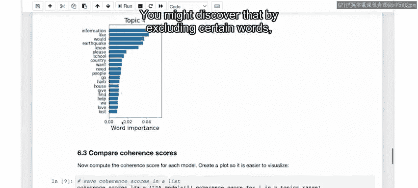

然后运行此代码单元格以从字典中删除这些单词。之后，你可以回到上面的步骤六，再次运行代码以训练一组新模型。运行时，只需逐个单元格地运行笔记本，看看你会发现什么。你可能会发现，通过排除某些单词，可以发现不同数量的主题似乎是最优的，并可能识别出不同类型的随时间变化的趋势。

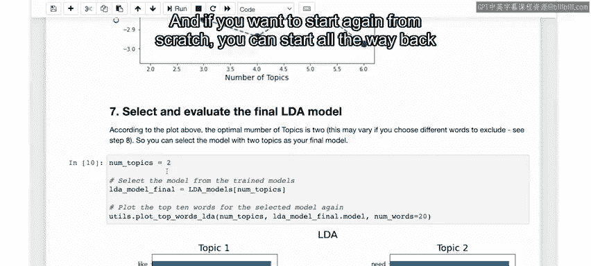

如果你想从头开始，可以从步骤3重新开始，根据原始数据集重新计算你的词袋。

---

## 总结

本节课中，我们一起学习了如何将LDA应用于数据集内的主题建模。通过识别出的主题，你能够将数据中的消息分类为与“紧急需求”和“长期恢复”等相关的内容，并且能够看到关于每个主题的消息量相对于彼此是如何随时间演变的。在下一个视频中，我们将总结本项目的设计阶段。