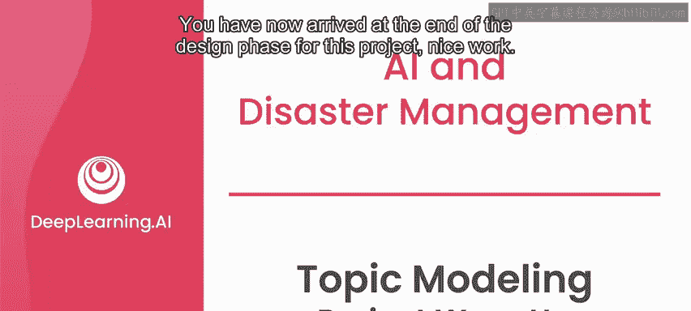
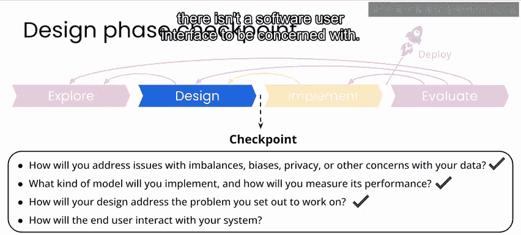
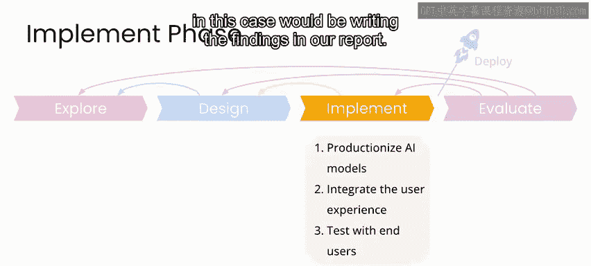
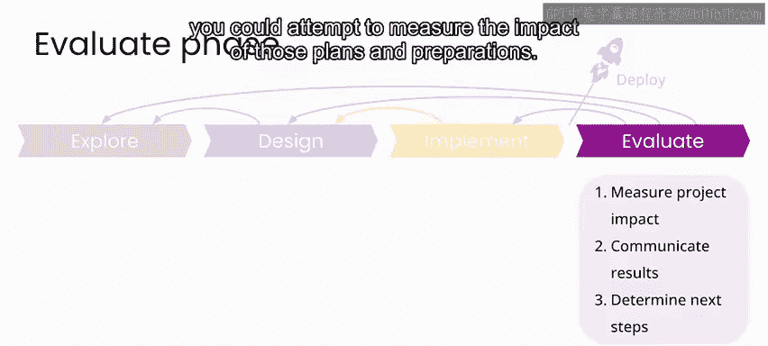

# 115：主题建模项目总结 📊

在本节课中，我们将对“海地地震后短信分析”主题建模项目进行总结。我们将回顾项目设计阶段的关键问题，并探讨如何评估此类分析项目在灾难管理中的实际影响。

---

## 项目设计阶段回顾

您现已完成本项目的设计阶段，工作出色。

正如之前所述，本项目与您在本系列课程中接触的其他案例研究有所不同。在本项目中，您是在灾难的响应和恢复阶段之后进行数据分析，目的是为未来灾难的响应和恢复工作提供信息。因此，您并非将成果部署到软件产品中，而是可能将这些发现作为事后行动报告的一部分进行呈现。

这种探索性数据分析在将人工智能应用于灾难响应时，比构建软件产品更为常见。

在您所从事的任何项目的设计阶段结束时，您和您的团队需要回答以下问题。

以下是设计阶段结束时需要回答的核心问题列表：

*   **数据问题处理**：您将如何处理数据中的不平衡、偏见、隐私或其他问题？
*   **模型与评估**：您将实现何种模型？如何衡量其性能？
*   **问题解决**：您的设计将如何解决旨在解决的问题？
*   **用户交互**：最终用户将如何与您的系统交互？

在本案例中，您所使用的数据集是经过高度整理的，所有个人身份信息均已移除，因此不存在重大的隐私问题。

就偏见而言，正如之前提到的，每场灾难都有其独特的挑战和情况。因此，虽然这个数据集可能很好地捕捉了海地地震后响应和恢复阶段的细节，但它显然也会偏向于这一特定事件的具体情况。

我们实现的模型是**LDA主题模型**，您使用**一致性分数**来衡量其性能。

您在本项目中的目标是分析在这场灾难的响应和恢复阶段中，援助或信息请求的趋势。您已经能够展示出有趣的结果，显示了信息请求和关键需求在此次灾难后是如何演变的。

在本案例中，您的最终成果将是一份报告，因此无需考虑软件用户界面。然而，您需要确保报告中包含的文字和图表能够清晰地阐明您的方法和发现。

## 实施与评估考量

本项目没有实施阶段的实验，因为您在本案例中的实施工作将是撰写报告中的发现。

在项目评估方面，重要的是要记住，您在此处进行的分析只是事后行动报告的一小部分，需要结合报告的其他部分来考虑其影响评估。

在这种情况下，利益相关方组织最关心的是报告中呈现的分析如何服务于受灾社区，以及如何影响未来的响应和恢复工作。

在基本层面上，您可以观察由于您的报告而采取了哪些行动，例如针对未来的灾难，因此进行了何种额外的规划或准备工作。您可以尝试衡量这些计划和准备工作的影响。

## 课程总结与展望

至此，我们完成了这个分析2010年海地地震后所发送短信的项目。我希望通过这个项目，您对这场灾难的响应和恢复阶段有了大致的了解，并理解了数字通信在灾难管理周期的这些阶段中可以发挥的关键作用。

我也希望您对任何突发性灾难后可能产生的需求和通信类型有了一定的认识，从而对灾难管理工作的含义有了更清晰的理解。

如果您想查看基于此数据集以及响应和恢复的其他方面所发布的实际事后行动报告，您可以在本周课程结束处的资源部分找到我发布的报告。

请继续观看下一个视频，我们将在那里总结本周内容、本课程以及整个专项课程。

---

**本节课总结**：在本节课中，我们一起回顾了主题建模项目的设计要点，探讨了如何处理数据偏见与隐私问题，明确了LDA模型在本项目中的应用与评估方式。我们认识到，此类分析项目的产出是报告而非软件，其价值在于为未来的灾难响应与恢复提供信息支持。最后，我们总结了项目在灾难管理背景下的意义，并提供了进一步学习的资源指引。