# 116：AI与灾难管理 🆘 - 第3周及课程总结

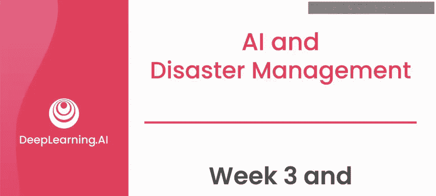

在本节课中，我们将回顾第3周的学习内容，并对整个“AI与灾难管理”课程进行总结。我们将重点分析海地地震的案例，并重温在灾难管理工作中应遵循的核心指导原则。

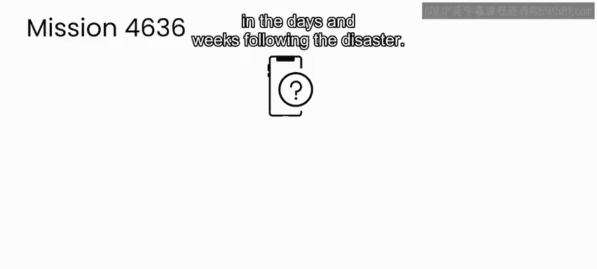

## 第3周内容回顾：海地地震案例分析

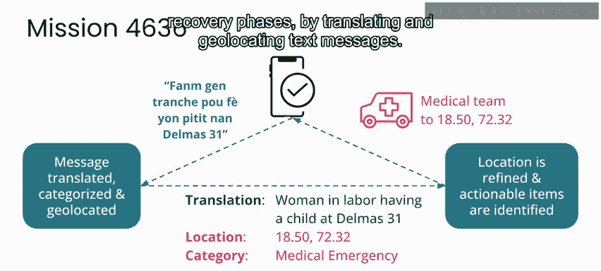

本周，我们深入研究了2010年海地地震这一具体灾难事件。

我们通过分析灾后数日及数周内，受灾社区成员发送的短信，研究了该事件的响应与恢复阶段。

我们首先了解了地震发生后立即发生的情况，以及海地侨民如何通过翻译和地理定位短信，在响应和恢复阶段发挥了关键作用。

他们的工作不仅在灾后立即提供了重要服务，还为翻译和地图服务奠定了基础。这些服务在许多方面都具有重要价值，包括未来在海地的响应和恢复工作。

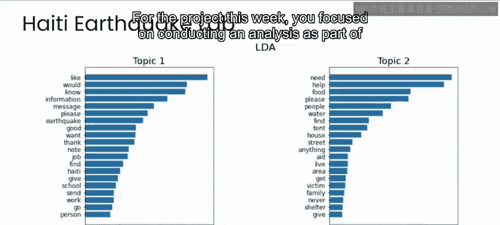

在本周的项目中，我们重点进行了分析，旨在撰写一份事后行动报告，以帮助受灾社区和响应者更好地为未来的灾难做准备。在本课程第一周学习的灾难管理周期背景下，可以认为本项目涉及了该周期的所有四个阶段：我们所处理的数据来自响应和恢复阶段，而事后行动报告旨在帮助未来灾难的减灾和准备工作。

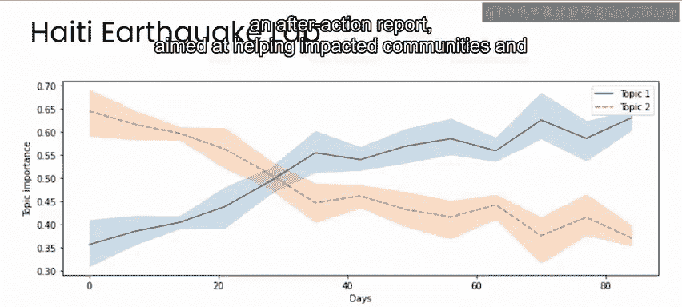

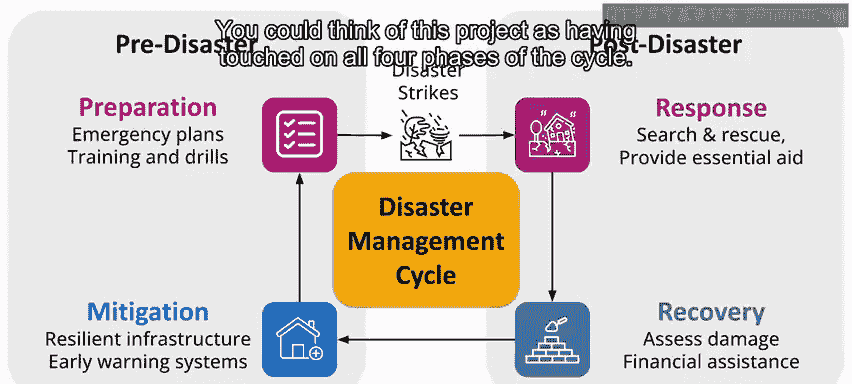

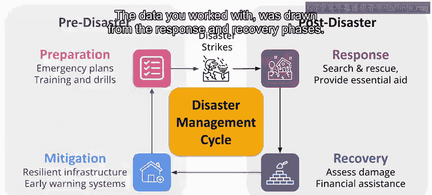

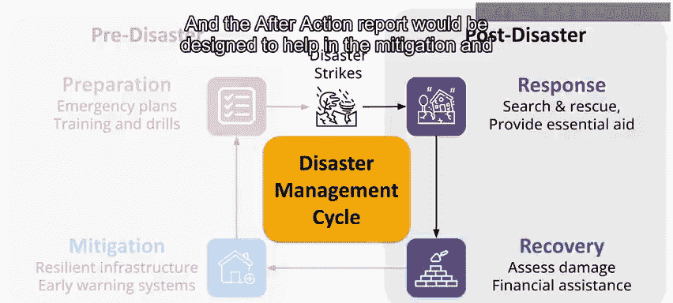

在实际的地震响应工作中，我们撰写的报告和分析也是如此。

例如，地震后不久，海地遭遇了非常强烈的风暴。通过了解短信的分布和普及情况，我们能够以每个手机信号塔为单位，向人们发送关于即将到来的风暴的预警，并指引他们前往当地最安全的建筑。

## 课程核心框架与案例重温

我们以讨论灾难的确切构成及其对人员、财产、地方经济和环境可能产生的影响开始了本课程。

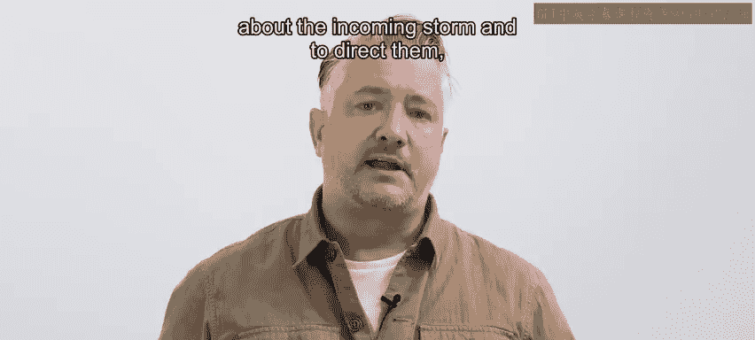

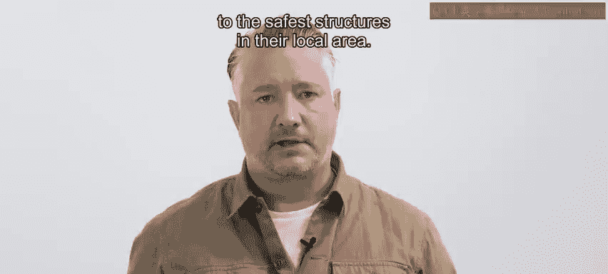

我们学习了一个由四个阶段组成的循环式灾难管理框架：**减灾、准备、响应、恢复**。

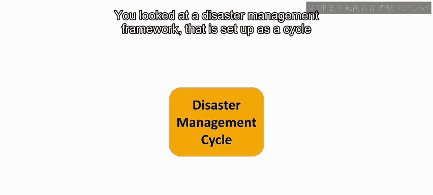

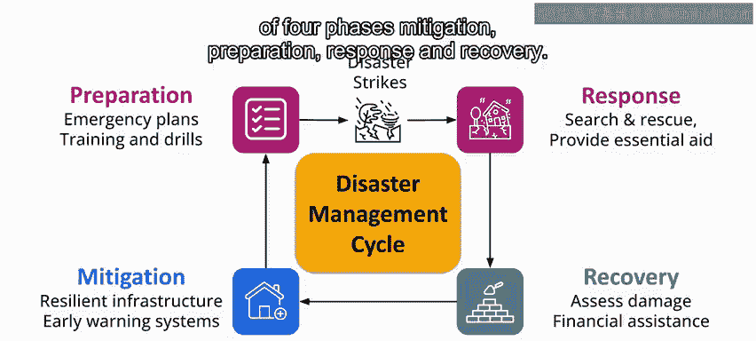

我们研究了2019年袭击莫桑比克的一对气旋所引发的灾难中，这些阶段是如何展开的，以及AI如何参与不同阶段。

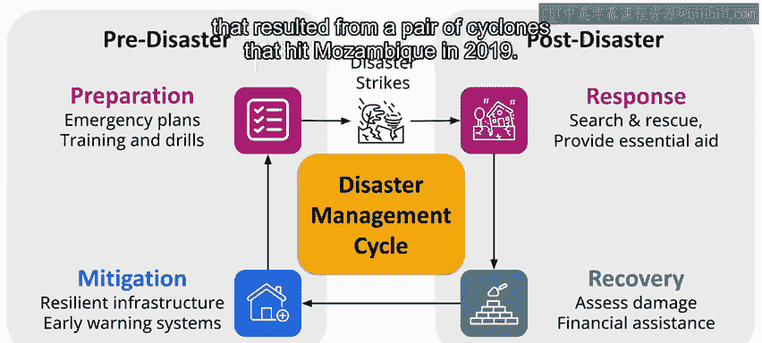

## 灾难管理工作指导原则 🧭

之后，我们分享了一些在灾难管理领域工作的指导原则。这些原则可以作为起点，帮助您优化工作以产生积极影响，同时将危害降至最低。

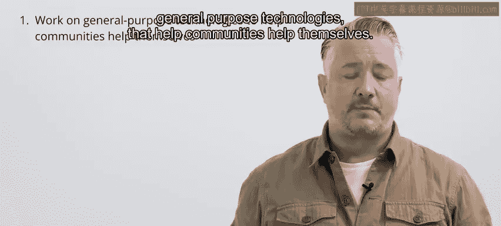

以下是这些原则的再次总结：

在灾难管理工作中，遵循以下原则有助于最大化积极影响并最小化潜在危害：

1.  **开发通用技术**：致力于开发**稳健的通用技术**，以帮助社区实现自助。这能最大化您的影响力。
2.  **支持低资源语言**：通过**翻译**和**搜索**等技术，更好地支持低资源语言的工作，将在包括灾难响应与恢复在内的许多用例中产生积极影响。
3.  **默认保护隐私**：在您所有的工作中，**默认采用保护隐私的数据实践**。请记住，聚合数据和机器学习模型本身都可能放大隐私风险。
4.  **规避风险项目**：避免涉及分析社交媒体数据的项目，或由压迫性政权资助的工作。
5.  **与社区互动**：与受影响社区互动，以确保您的项目有最高的成功机会，并将造成伤害的可能性降至最低。在许多情况下，最好的互动社区是您已经是其中一员的社区。

如果您牢记这些指导原则，无论具体背景如何，您在帮助减少灾难影响的任何努力中都更有可能取得成功。

## 课程总结与展望 🌟

至此，您已经完成了这门关于AI与灾难管理的课程，以及整个“AI向善”专业课程。

我希望这对您来说是一次发人深省、鼓舞人心的旅程。我衷心希望您能从这些课程中领悟到：通过应用像在这些案例研究中使用的那样的框架，您可以对任何想要解决的问题采取深思熟虑且能减少危害的方法，并优化以产生积极影响。

这可以应用在灾难响应、环境发展、公共卫生，或您在现实世界中正在处理的任何类型的应用中。

我期待看到您未来的建树，并祝愿您在产生积极影响的道路上一帆风顺。

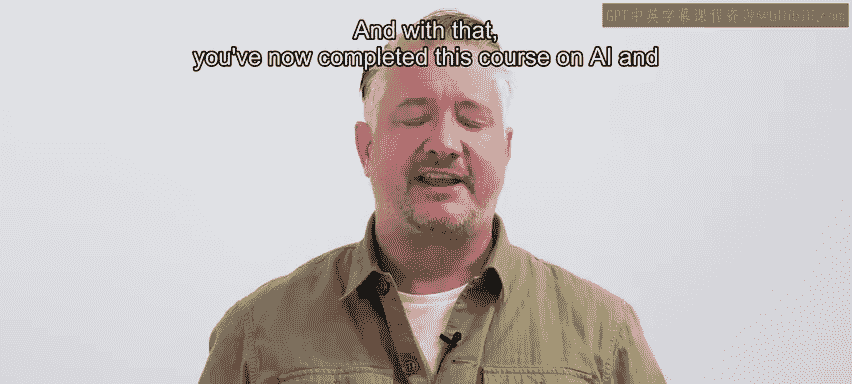

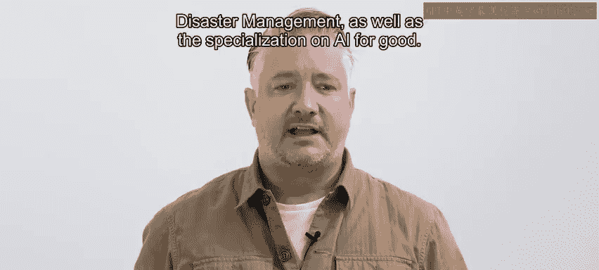

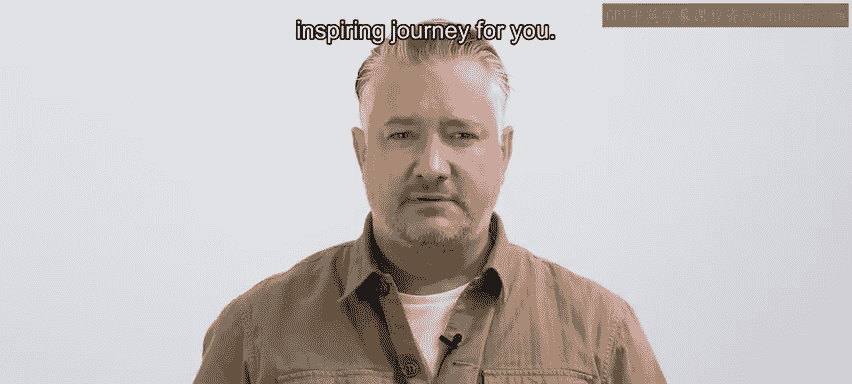

---

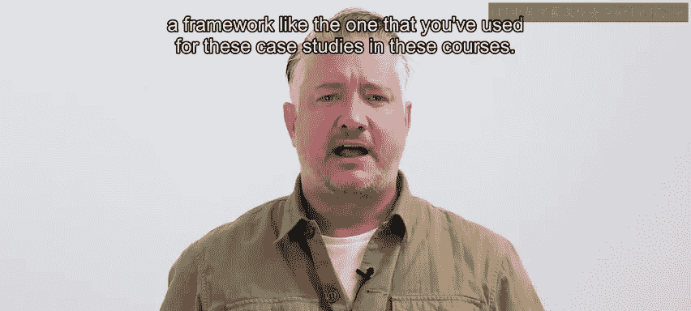

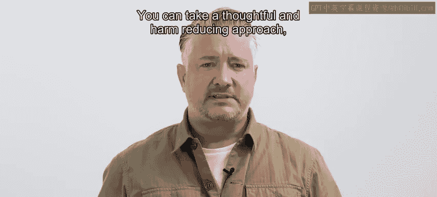

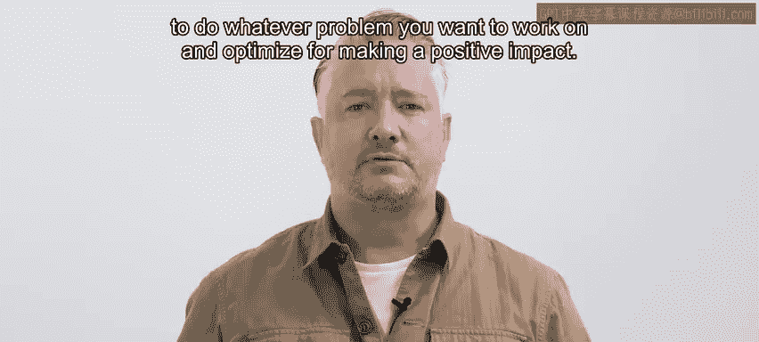

**本节课总结**：本节课中，我们一起回顾了以海地地震为案例的第3周学习内容，重温了灾难管理的四阶段框架及其在莫桑比克气旋案例中的应用，并系统总结了在利用AI进行灾难管理时应遵循的五项核心指导原则。最后，我们对整个课程进行了总结，鼓励大家应用所学框架，以审慎和减少危害的方式，在各自关注的领域创造积极影响。