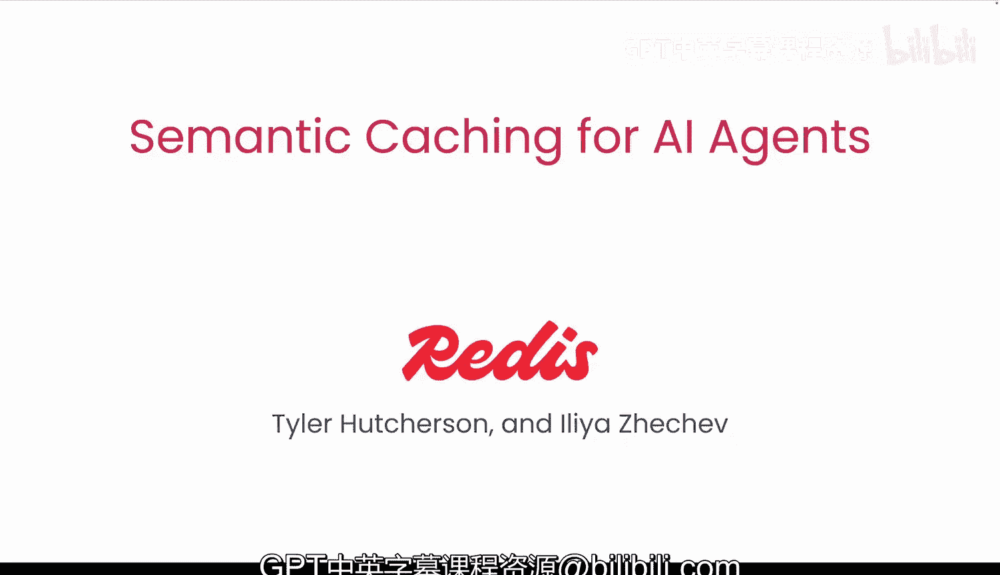
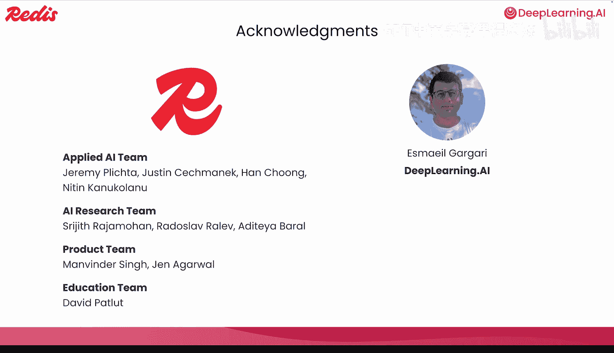

# 001：课程概述 🚀

在本课程中，我们将学习如何通过添加语义缓存，使你的AI代理运行更快、成本效益更高。

在许多项目中，推理成本和延迟会影响应用程序的扩展能力。传统的输入/输出缓存仅在输入文本完全相同时才有效，这在某些情况下有帮助。但如果一个人问“我如何获得退款”，而另一个人问“我想要回我的钱”，一个普通的精确匹配缓存会将它们视为完全不同的查询。

另一方面，语义缓存关注的是**含义**。它使用**嵌入向量**来衡量两个问题在语义空间中的相似程度。如果它们在语义上相似，就可以复用模型对旧问题的回答，而无需再次调用模型。

## 课程内容概览

首先，你将从头开始构建一个缓存，以逐步了解语义缓存的内部原理。

以下是构建基础语义缓存的步骤：
1.  创建嵌入向量。
2.  比较向量间的距离。
3.  设定一个阈值，以决定两个查询何时在语义上足够相似。

接着，我们将使用Redis的开源SDK来实现一个生产级的缓存。这将使你的缓存更接近实际部署状态，因为它将包含诸如**生存时间**等功能以保持缓存的新鲜和精简，甚至可以为不同的用户、团队或租户提供独立的缓存。

你将使用我们专为缓存准确性微调的开源嵌入模型。在拥有一个可工作的缓存后，我们将评估其性能。

我们将关注**命中率**、**精确率**和**召回率**。这些指标将显示你的缓存有多大帮助以及其正确性如何。你将在混淆矩阵中可视化这些指标，并了解改变相似度阈值如何影响精确率与召回率之间的平衡。

我们还会查看**延迟**，并观察几次命中如何快速累积成显著的节省时间。

在评估了缓存的有效性之后，你将学习四种增强缓存的方法：
1.  优化相似度阈值。
2.  使用交叉编码器进行重新排序。
3.  使用一个小型语言模型来确认两个问题是否含义相同。
4.  添加模糊匹配以处理用户提问时常见的简单拼写错误。

最后，我们将把所有内容整合到一个AI代理中。该代理将一个大问题分解成更小的部分，并为每个部分检查缓存，只在必要时才调用大语言模型。

这意味着，随着时间的推移，缓存逐渐“预热”，每个新用户或略有不同的措辞都能从系统已有的知识中受益。模型调用次数减少，响应质量不变，但速度却快得多。

## 课程资源与致谢

许多人为创建本课程付出了努力。我们要感谢来自Redis的应用人工智能、人工智能研究、产品和教育团队，以及来自DeepLearning.AI的Isaac和Serena，他们也为本课程做出了贡献。

第一课将是语义缓存的概述。你还将学习一个真实用例，其中沃尔玛发布了改进其生产缓存系统的技术。

本节课中，我们一起学习了语义缓存的基本概念、课程的整体结构以及它将带来的好处。在接下来的视频中，我们将正式开始深入探索。