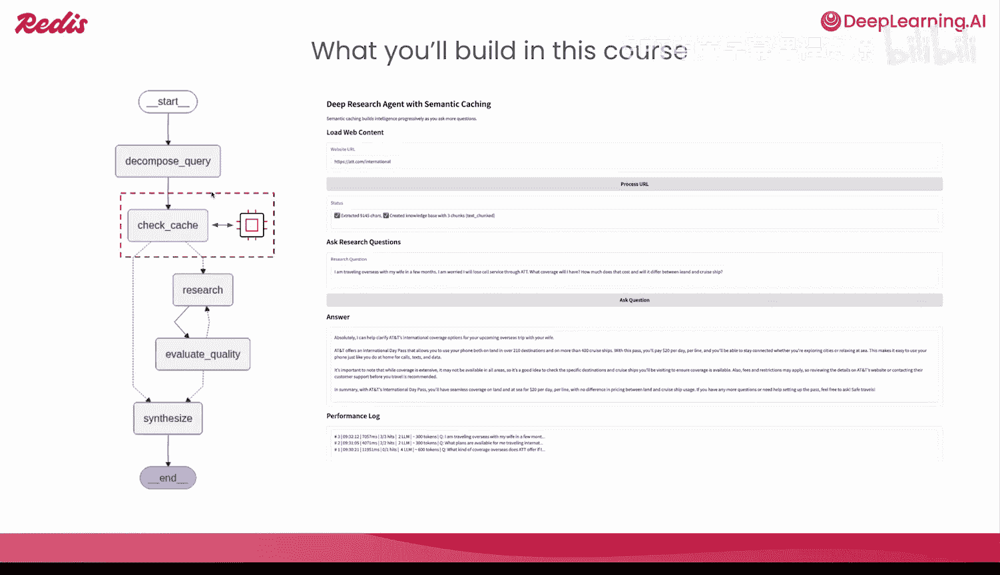
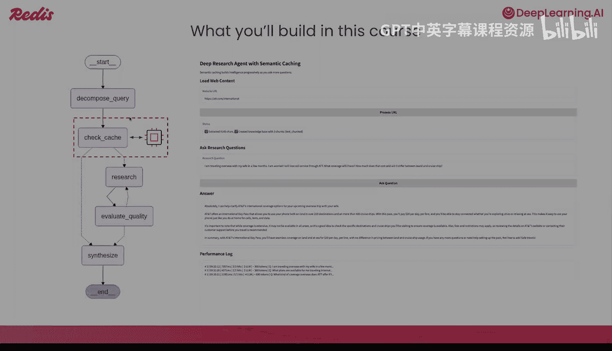

# 002：语义缓存概述 🧠

在本节课中，我们将学习什么是语义缓存，它为何重要，以及它如何帮助AI代理重用结果以降低成本和延迟。

## 引言：成本与性能的权衡

模型质量往往随着每个令牌的成本增加而提升。虽然这条曲线在不断改善，但价格和延迟之间的权衡仍然是现实世界部署的关键限制因素。

这是一个真实的矛盾，因为用于推理和解决复杂任务（如GPT-4或Claude）的流行模型通常更昂贵，也更慢。

以下是Artificial Analysis对多个基础模型进行的比较结果，展示了智能与价格的关系。对于许多团队而言，推理（而非数据处理）已成为AI系统中的主要单位成本。

## RAG系统与AI代理的挑战

组织正在构建检索增强生成系统（简称RAG）。这些系统可以将特定领域的知识注入大型语言模型的提示中，通过在正确的时间插入正确的信息来减少幻觉，并通过在运行时提供模型从未见过的最新信息来保持内容的新鲜度。

然而，AI代理是“令牌消耗大户”。它们本质上需要提取、规划、行动、反思并进行多次迭代。因此，代理在执行过程中会使用多次LLM调用。这会消耗更多令牌，增加额外延迟，并且提示长度也会随时间增长。

根据某代理公司在2025年9月发布的一篇论文中的基准测试，在多个现实世界任务中，即使在某些情况下，一次完整的端到端执行成本也高达6.8美元。

## 现实用例：客户支持

让我们讨论一个代理的常见现实用例，例如客户支持。在客户支持场景中，代理旨在加速客户支持工单或查询的解决时间。缓慢的代理会对最终用户体验产生负面影响。客户支持代理会产生大量常见问题，这些冗余数据会随时间累积，而对这些数据进行的RAG操作将推高基础设施成本。

例如，多个用户询问如何获得退款、如何拿回他们的钱或退款政策是什么。代理必须从头开始解决所有这些场景。

## 缓存的核心原则

接下来，我们谈谈一个称为缓存的经典原则。其核心思想是不在冗余信息上重复自己。用户可能会向代理提出多个问题。在这些情况下，我们可以检查缓存中是否已有过去已回答的查询，并在不需要时避免调用大型语言模型。这在理论上是个好主意。

但问题是，对于自然语言，简单的**精确匹配缓存**会失效。

让我们再看这个例子：
*   `I want my money back`
*   `How do I get a refund`
*   `What is your refund policy`

在传统缓存中，对字符串数据进行精确匹配。单词、令牌和字符必须完全相同才能获得缓存命中。这带来了完美的**精确率**，但**召回率**非常低，在大多数情况下，自然语言的缓存命中率很低。

在这个场景中，所有这三个问题都会是缓存未命中。

## 引入语义缓存

引入**语义缓存**，我们可以利用问题的**含义**。这带来了更高的召回率和更高的缓存命中率，从而影响性能。

然而，这也引入了**误报**的风险。换句话说，这增加了缓存命中错误内容的机会。

## 语义缓存的工作原理

现在，让我们从头开始讨论语义缓存的工作原理。

第一步，我们将**嵌入用户问题**。我们将把这个用户问题转换成一个可以用于语义搜索的向量。

第二步，我们将**比较用户查询与语义缓存中每个条目的相似度**。

接下来，我们将**对这个结果进行分类**。如果结果在语义距离上与原问题足够接近，我们可以直接将缓存中存储的答案返回给用户。

但如果它是缓存未命中，那么我们需要调用我们的RAG系统。该系统涉及生成某种搜索，然后调用LLM。

最后，我们仍然需要将答案返回给用户。一旦我们有了答案，我们就可以用那个问答对**更新我们的缓存**，以确保它在未来可重用。

## 语义缓存的支柱：向量搜索

语义缓存的支柱是**向量搜索**的概念。简单回顾一下，向量是数字列表。这些数字代表数据并编码意义和语义。

向量搜索在现实中有许多应用实例，包括内容发现搜索、推荐系统，甚至欺诈和异常检测。

## 生产中的挑战

生产中的语义缓存引入了新的挑战。它不仅仅是向量搜索。在这里，我们必须特别关心**缓存的有效性**：
*   **准确性**：当我们获得缓存命中时，我们是否从缓存中提供了正确的结果？
*   **性能**：我们是否确保有足够高的缓存命中率以获得价值？
*   **可扩展性**：我们能否在不影响往返延迟的情况下大规模提供缓存服务？

接下来，我们需要关心**可操作性或可扩展性**。随着数据随时间演变，我们能否刷新、使失效或预热语义缓存？

最后是**可观测性**。我们能否确保测量和观察正确的指标，如缓存命中率、延迟、成本节约和缓存质量？

## 本课程的衡量指标

在本课程中，我们将重点关注四个不同的指标来衡量缓存的有效性：
1.  **缓存命中率**：在给定距离阈值下，我们命中缓存的频率。这主要影响我们通过添加语义缓存获得的成本节约。
2.  **排序指标**：如**精确率**、**召回率**和**F1分数**。这些将用于帮助我们理解当实际获得缓存命中时，我们的缓存有多准确。

## 提升缓存性能的方法

本课程还将帮助我们介绍提高语义缓存准确性和性能的不同方法。

为了提高缓存的精确率和召回率，我们将重点关注几种不同的方法，例如：
*   **调整距离阈值**
*   添加额外的**重排序步骤**，如交叉编码器模型或大型语言模型。

此外，像**模糊匹配**这样的技术可以帮助我们在甚至调用与缓存相关的嵌入之前处理拼写错误和精确匹配的情况。这有助于我们节省计算资源。

最后，为不同类型的数据和上下文添加**额外过滤器**，例如：
*   **时间数据**：时间敏感的查询。
*   **代码检测**：如特定领域的代码、Python代码、Java代码等。

所有这些都可能从一开始就绕过任何类型的缓存操作。

在本课程中，我们将主要实现一个使用技术来提高精确率、召回率和效率的缓存。

## 现实世界案例：沃尔玛

让我们讨论一个现实世界的例子，以沃尔玛这样的大型零售商为例。沃尔玛最近发表了一篇论文，讨论了在内部用例和外部客户支持用例中对语义缓存的需求。他们称之为“沃尔玛缓存”。

在这个缓存中，他们引入了几种不同的技术，例如跨多个节点分发缓存、添加灵活的决策引擎，甚至预加载常见查询。这有助于将整体准确率提高到近90%。

让我们快速了解一下他们是如何达到这个特定基准的。

我们在沃尔玛缓存中看到的第一个贡献是添加了**负载均衡器**。这个负载均衡器使他们能够非常容易地水平扩展系统，意味着他们可以添加额外的计算节点，并且缓存可以扩展其能够服务的操作数量。这对于像沃尔玛这样在全球范围内大规模运营的组织来说至关重要。

其次，他们为缓存添加了**双层存储层**。所谓双层，是指既有L1层也有L2层存储。在L1层，这是一个向量数据库，用于基于语义搜索的简单检索，以在语义缓存中找到相似的条目。在L2层，这是一个内存缓存（如Redis或其他数据库），仅用于基于L1缓存产生的ID进行简单的数据查找。

最后是**多租户**。考虑到像沃尔玛这样组织的规模，他们可以让多个团队、多个租户和应用程序通过从同一缓存存储服务多个租户来使用相同的存储基础设施。

接下来，沃尔玛添加了一个**决策引擎**。决策引擎的存在是为了将缓存精确率提升到纯语义搜索之上。在他们的特定决策引擎中，他们添加了用于代码检测和时间上下文检测的模块。在任何情况下，涉及代码或时间敏感查询的用户查询都会完全避免缓存操作，直接走传统的LLM或基于RAG的工作流程。这些都是在语义搜索发生之前添加的。

## 本课程实践目标

在本课程中，我们将以使用LangGraph工作流从头构建一个AI代理作为结束。在这个LangGraph工作流中，我们将处理一个来自客户支持用例的大型、复杂的用户查询。代理将把该查询分解成更小的部分。然后，代理将为每个查询检查缓存，以查找我们过去是否已回答过。如果没有，代理将继续进行额外的研究和评估迭代，以确保我们获得高质量的答案。最后，LLM将以个性化的方式将结果综合起来返回给用户。

这将与我们提供的前端体验配对，允许你输入你最喜欢的网站的URL。我们可以抓取该网站的所有原始内容，使你能够与数据聊天。到最后，我们将从头构建一个语义缓存，其中填充了你测试中的常见问题。这个代理将能够利用这些语义缓存条目，随着时间的推移提高性能。

在下一课中，我们将首先从**从头构建一个语义缓存**开始。

让我们开始吧。

---

**本节课总结**：在本节课中，我们一起学习了语义缓存的基本概念、其重要性以及工作原理。我们探讨了传统精确匹配缓存的局限性，理解了语义缓存如何通过向量搜索利用查询的“含义”来提高命中率。我们还分析了生产环境中面临的挑战、关键的衡量指标（如命中率、精确率、召回率），并了解了像沃尔玛这样的公司如何在实际中应用和优化语义缓存。最后，我们明确了本课程的实践目标：构建一个能够利用语义缓存的AI代理。下一课，我们将动手开始构建。