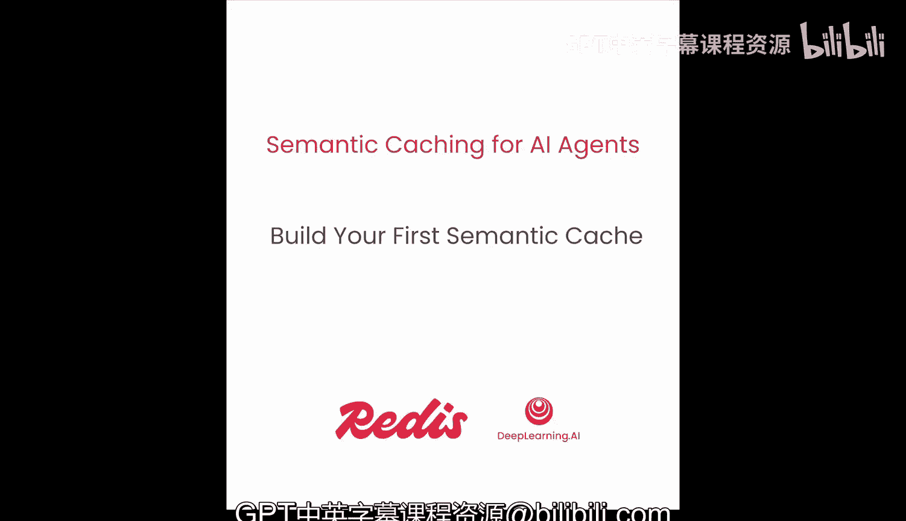
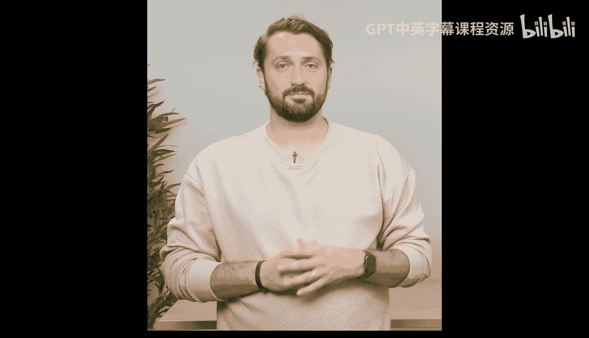
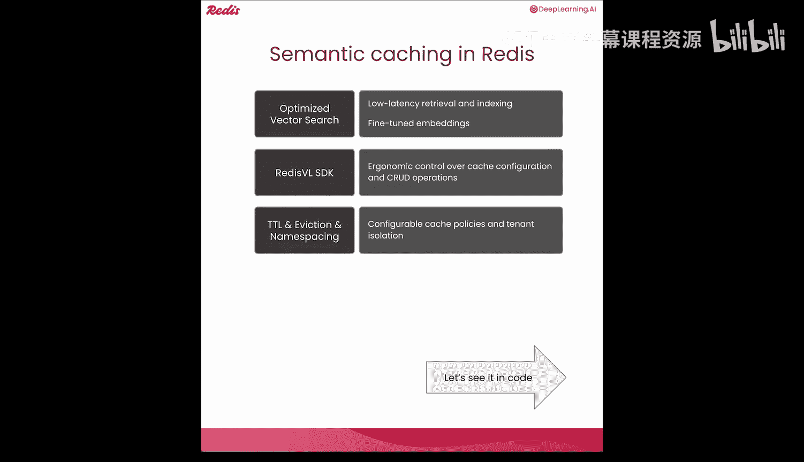
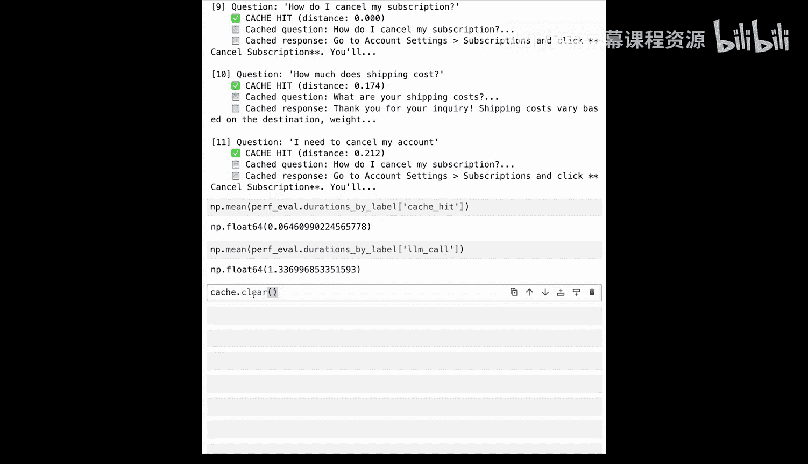

# 003：构建你的第一个语义缓存 🧠

在本节课中，我们将从零开始构建一个可工作的语义缓存，以便理解其各个组成部分的工作原理。之后，我们将使用 Redis 的开源 SDK 和数据库重新实现它。

## 概述

语义缓存的核心流程是：首先通过语义搜索检查缓存，看是否存在与当前用户问题足够相似的、过去处理过的问题。如果足够相似，则命中缓存并直接返回结果给用户。如果缓存未命中，则需要走完我们智能体的 RAG 流程，最终将结果返回给用户并更新缓存。



## 选择 Redis 作为缓存后端

上一节我们介绍了语义缓存的基本概念，本节中我们来看看如何实现它。我们将使用 Redis 作为后端。Redis 代表远程字典服务器，是一个开源、快速的内存键值数据库。这意味着你可以在 Redis 服务器上存储不同的数据结构，并在多个节点间分发。你的应用程序可以大规模地读写和访问这些数据。

Redis 通常用于缓存，但也具备二级索引的能力，这意味着我们可以跨向量、文本、数字、标签甚至地理空间数据进行存储和索引。这些特性使我们能够在 Redis 中实现语义缓存。

以下是使用 Redis 的几个优势：
*   **低延迟检索和索引**：我们可以优化向量搜索，以便快速插入和检查与用户查询相似的缓存问题。
*   **专用嵌入模型**：我们将使用一个开源的、经过微调的嵌入模型来提高语义缓存的准确性。
*   **易用的 SDK**：我们将使用开源的 Redis VL SDK，它为我们提供了对缓存配置和各种 CRUD 操作的符合人体工程学的控制。
*   **数据管理策略**：我们可以利用 TTL（生存时间）和命名空间策略来配置数据在缓存中的流动方式，以及如何隔离不同租户的数据。

## 从零开始构建语义缓存


让我们通过代码来具体看看。首先，我们需要加载数据集。



### 加载 FAQ 数据集

我们将处理的数据集来自一个客户支持系统中的 CSV 文件，其中包含常见问题、问答对以及一些可用于测试的数据。

以下是加载 FAQ 并查看其内容的步骤：

```python
import pandas as pd

# 加载 FAQ 数据集
faq_df = pd.read_csv('faqs.csv')
print(faq_df.head())
```

你会注意到，我们的 FAQ 数据集中的每个条目都包含一个问题（例如“如何获得退款？”）和一个答案（例如“要申请退款，请访问我们的订单页面并选择...”）。

### 生成文本嵌入

为了进行语义缓存，我们需要文本嵌入。我们将使用 `sentence-transformers` 库来实现。对于第一个例子，我们将使用流行的 `all-MiniLM-L6-v2` 模型。

我们将使用这个模型来编码我们的 FAQ 数据集，即问题列表，生成嵌入向量。

```python
from sentence_transformers import SentenceTransformer

# 加载嵌入模型
model = SentenceTransformer('all-MiniLM-L6-v2')
# 首次运行需要下载模型，根据网络情况可能需要几秒钟

# 为所有问题生成嵌入
faq_embeddings = model.encode(faq_df['question'].tolist())
print(f"嵌入向量示例（前几个值）: {faq_embeddings[0][:5]}")
```



### 实现语义搜索功能

接下来，我们将使用两个函数来实现从零开始的语义搜索。

第一个函数计算两组向量之间的余弦距离。第二个函数实现语义搜索：它接收一个查询，构建查询的嵌入向量，计算查询嵌入与 FAQ 嵌入矩阵之间的余弦距离，最后找到最佳匹配条目的索引和距离值。

```python
import numpy as np

def cosine_distance(vec_a, vec_b):
    """计算两个向量间的余弦距离。"""
    return 1 - np.dot(vec_a, vec_b) / (np.linalg.norm(vec_a) * np.linalg.norm(vec_b))

def semantic_search(query, model, faq_embeddings):
    """执行语义搜索，返回最相似FAQ的索引和距离。"""
    query_embedding = model.encode([query])
    distances = [cosine_distance(query_embedding[0], emb) for emb in faq_embeddings]
    best_index = np.argmin(distances)
    return best_index, distances[best_index]
```

让我们用一个示例查询来测试这个语义搜索函数。

```python
query = "我的订单退款需要多长时间？"
index, distance = semantic_search(query, model, faq_embeddings)
print(f"查询: '{query}'")
print(f"最相似的FAQ: '{faq_df.iloc[index]['question']}'")
print(f"余弦距离: {distance:.3f}")
```

### 构建语义缓存检查函数

现在，我们将把语义搜索功能转化为一个语义缓存。我们将实现另一个名为 `check_cache` 的辅助函数，它接收一个查询字符串和一个距离阈值浮点值。

在缓存检查函数内部，我们首先使用查询进行语义搜索以获取索引和距离值。如果余弦距离值小于设定的阈值，我们将其视为缓存命中并返回缓存中的条目。否则，返回 `None`，表示缓存未命中。

```python
def check_cache(query, threshold=0.3):
    """检查语义缓存。命中则返回缓存条目，否则返回None。"""
    index, distance = semantic_search(query, model, faq_embeddings)
    if distance < threshold:
        return faq_df.iloc[index], distance
    else:
        return None, distance
```

让我们用几个查询来测试我们的缓存。

```python
test_queries = [
    "可以退款吗？",
    "我的包裹丢了怎么办？",
    "如何更改送货地址？"
]

for q in test_queries:
    result, dist = check_cache(q)
    if result is not None:
        print(f"查询 '{q}' -> 缓存命中！距离: {dist:.3f}")
        print(f"  答案: {result['answer'][:50]}...")
    else:
        print(f"查询 '{q}' -> 缓存未命中。距离: {dist:.3f}")
```

### 扩展缓存

我们还可以随着时间的推移，在新数据进入时扩展我们的缓存。让我们添加一个辅助函数来实现这一点。

这个辅助函数接收一个问答对，将其添加到我们的数据框中，生成新的嵌入向量，并将其添加到 FAQ 嵌入矩阵中。

```python
def add_to_cache(new_question, new_answer):
    """将新的问答对添加到缓存中。"""
    global faq_df, faq_embeddings
    # 添加到 DataFrame
    new_row = pd.DataFrame({'question': [new_question], 'answer': [new_answer]})
    faq_df = pd.concat([faq_df, new_row], ignore_index=True)
    # 生成新嵌入并添加到矩阵
    new_embedding = model.encode([new_question])
    faq_embeddings = np.vstack([faq_embeddings, new_embedding])
    print(f"已添加新条目。缓存现在有 {len(faq_df)} 个条目。")
```

现在，我们将尝试用三个新条目更新原始缓存。

```python
new_entries = [
    ("我的包裹丢了怎么办？", "如果包裹丢失，请立即联系客服并提供订单号。"),
    ("如何更改送货地址？", "在订单发货前，您可以在‘我的订单’页面修改送货地址。"),
    ("产品有质量问题怎么办？", "对于质量问题，请拍照并联系我们的售后团队申请退换货。")
]

for q, a in new_entries:
    add_to_cache(q, a)
```

在添加了新条目之后，让我们再次运行测试，看看现在哪些查询能命中缓存。

```python
print("\n--- 添加新条目后的缓存测试 ---")
for q in test_queries:
    result, dist = check_cache(q)
    if result is not None:
        print(f"查询 '{q}' -> 缓存命中！距离: {dist:.3f}")
    else:
        print(f"查询 '{q}' -> 缓存未命中。距离: {dist:.3f}")
```

## 使用 Redis 构建生产级语义缓存

现在我们已经了解了缓存如何从零开始工作，让我们转向一个更接近生产环境的场景。我们将迁移到 Redis 数据库实例。

### 连接到 Redis

首先，我们需要连接到 Redis 服务器。你可以通过 `Redis` URL 参数来实现，在大多数情况下是 `redis://localhost:6379`。

```python
import redis
from redisvl import RedisVL

# 连接到 Redis
redis_client = redis.Redis.from_url('redis://localhost:6379')
# 快速测试连接
try:
    redis_client.ping()
    print("成功连接到 Redis！")
except Exception as e:
    print(f"连接 Redis 失败: {e}")
```

### 加载专用嵌入模型

下一个要素是经过缓存优化的嵌入模型 `lcache-embed-v1`。这是一个在 Hugging Face 上可用的开源模型，专门针对语义缓存操作进行了微调。

让我们使用 Hugging Face 的 `AutoTokenizer` 和 `AutoModel` 类来加载这个模型。这个类将从 Hugging Face 获取并下载模型权重到我们的服务器上。

```python
from transformers import AutoTokenizer, AutoModel
import torch

model_name = "makercommunity/lcache-embed-v1"
tokenizer = AutoTokenizer.from_pretrained(model_name)
lcache_model = AutoModel.from_pretrained(model_name)

def get_embedding(text):
    """使用 lcache-embed-v1 模型生成文本嵌入。"""
    inputs = tokenizer(text, return_tensors="pt", padding=True, truncation=True)
    with torch.no_grad():
        outputs = lcache_model(**inputs)
    # 使用平均池化获取句子嵌入
    embeddings = outputs.last_hidden_state.mean(dim=1)
    return embeddings.numpy()[0]
```

### 创建 RedisVL 语义缓存

现在我们已经下载并准备好了嵌入模型，我们可以使用 RedisVL 开源 SDK 创建我们的语义缓存。

在这里，我们为语义缓存传递一个名称，这将在数据库中创建一个唯一的命名空间。其次，我们传递刚刚创建的 `lcache` 嵌入模型。第三，我们传递 Redis 客户端连接对象。最后，我们配置一个用于缓存检查的基线距离阈值。

```python
# 初始化 RedisVL 客户端
rvl = RedisVL(redis_client=redis_client)

# 创建语义缓存索引配置
index_schema = {
    "index": {
        "name": "faq_semantic_cache",
        "prefix": "cache",
        "storage_type": "hash"
    },
    "fields": [
        {"name": "question", "type": "text"},
        {"name": "answer", "type": "text"},
        {
            "name": "embedding",
            "type": "vector",
            "attrs": {
                "dims": 768, # 根据模型维度调整
                "distance_metric": "COSINE",
                "algorithm": "HNSW"
            }
        }
    ]
}

# 创建索引
rvl.create_index(index_schema)
print("语义缓存索引创建成功。")
```

### 用数据填充缓存

让我们用 FAQ 数据填充缓存。这将用所有数据设置 Redis，并使其在我们的示例中准备就绪。

这里我们只是遍历数据框，逐条将数据存储到缓存中。

```python
# 假设 faq_df 是之前加载的 DataFrame
for _, row in faq_df.iterrows():
    embedding = get_embedding(row['question'])
    # 存储到 Redis Hash 中，key 为 cache:{id}
    key = f"cache:{_}"
    redis_client.hset(key, mapping={
        'question': row['question'],
        'answer': row['answer'],
        'embedding': embedding.tobytes() # 将向量转换为字节存储
    })
print(f"已成功将 {len(faq_df)} 条 FAQ 加载到 Redis 缓存。")
```

### 测试 Redis 缓存

让我们快速检查一下缓存中有什么。我们可以提问：“我需要为我的购买退款。”

```python
test_query = "我需要为我的购买退款。"
query_embedding = get_embedding(test_query)

# 在 Redis 中进行向量搜索（简化示例，实际使用 RedisVL 的搜索接口）
# 这里演示原理，生产环境应使用 rvl.search()
best_key = None
best_distance = float('inf')
for key in redis_client.scan_iter("cache:*"):
    item = redis_client.hgetall(key)
    # 从字节转换回向量
    cached_embedding = np.frombuffer(item[b'embedding'], dtype=np.float32)
    dist = cosine_distance(query_embedding, cached_embedding)
    if dist < best_distance:
        best_distance = dist
        best_key = key

if best_key and best_distance < 0.3: # 使用阈值 0.3
    hit_item = redis_client.hgetall(best_key)
    print(f"缓存命中！距离: {best_distance:.3f}")
    print(f"  匹配问题: {hit_item[b'question'].decode()}")
    print(f"  答案: {hit_item[b'answer'].decode()[:50]}...")
else:
    print(f"缓存未命中。最近距离: {best_distance:.3f}")
```

### 配置生存时间

最后，在我们用大语言模型进行端到端测试之前，我们将实现 TTL。TTL 代表生存时间，这是数据库知道何时驱逐在缓存中停留了特定时间段的数据的方式。当系统中的数据发生变化或演进时，通常使用它来保持缓存的新鲜度。

使用 Redis 开源 SDK 实现这一点非常简单。你只需调用 `expire` 命令。

```python
# 为所有缓存键设置 TTL 为一天（86400 秒）
for key in redis_client.scan_iter("cache:*"):
    redis_client.expire(key, 86400)
print("已为所有缓存条目设置 TTL 为 24 小时。")
```

## 与大语言模型结合的端到端示例

我们将使用 OpenAI 的 API 来演示一个端到端的大语言模型示例。我们将使用 `openai` SDK 和 `ChatOpenAI` 包装器来连接 GPT-4o-mini。

本课程的 OpenAI 密钥应该已经加载到你的环境中。为了与我们的语言模型对话，我们有一个辅助函数来发送提示词。在这个特定场景中，提示词是：“你是一个有用的客户支持助手。” 这个语言模型将简洁而专业地回答客户问题，根据你给出的任何问题，提供一到两句话的回复。

```python
import openai
import time

# 假设 openai.api_key 已设置
client = openai.OpenAI()

def ask_llm(question):
    """向大语言模型提问。"""
    response = client.chat.completions.create(
        model="gpt-4o-mini",
        messages=[
            {"role": "system", "content": "你是一个有用的客户支持助手。请简洁专业地回答客户问题，回复限制在一到两句话。"},
            {"role": "user", "content": question}
        ],
        max_tokens=100
    )
    return response.choices[0].message.content
```

### 性能评估

现在，对于我们的端到端示例，我们有一个测试问题列表。我们还有一个性能评估类。性能评估类是作为课程材料的一部分构建的，包含对缓存检查、LLM 调用、命中和未命中进行细粒度计时的能力。这将允许我们在运行整个测试后比较结果。

准备好我们的性能评估类来记录时间后，我们将遍历每个测试问题，检查缓存，如果不在缓存中，则将其记录为未命中并转向我们的大语言模型。

这个循环遍历我们之前看到的测试问题列表并打印出结果。

```python
class PerformanceEvaluator:
    def __init__(self):
        self.cache_times = []
        self.llm_times = []
        self.hits = 0
        self.misses = 0

    def time_cache_check(self, query):
        start = time.time()
        # 这里应调用集成了 Redis 的 check_cache 函数
        result, dist, cache_time = check_cache_redis(query, threshold=0.3)
        elapsed = time.time() - start
        self.cache_times.append(elapsed)
        if result:
            self.hits += 1
            return result, dist, True, elapsed
        else:
            self.misses += 1
            return None, dist, False, elapsed

    def time_llm_call(self, question):
        start = time.time()
        answer = ask_llm(question)
        elapsed = time.time() - start
        self.llm_times.append(elapsed)
        return answer, elapsed

    def get_stats(self):
        stats = {
            "平均缓存检查时间 (ms)": np.mean(self.cache_times) * 1000 if self.cache_times else 0,
            "平均LLM响应时间 (ms)": np.mean(self.llm_times) * 1000 if self.llm_times else 0,
            "缓存命中数": self.hits,
            "缓存未命中数": self.misses,
            "命中率": self.hits / (self.hits + self.misses) if (self.hits + self.misses) > 0 else 0
        }
        return stats

# 模拟一个集成了 Redis 的缓存检查函数
def check_cache_redis(query, threshold=0.3):
    start = time.time()
    query_embedding = get_embedding(query)
    best_distance = float('inf')
    best_item = None
    # 简化搜索逻辑，实际应使用 Redis 向量搜索
    for key in redis_client.scan_iter("cache:*"):
        item = redis_client.hgetall(key)
        cached_embedding = np.frombuffer(item[b'embedding'], dtype=np.float32)
        dist = cosine_distance(query_embedding, cached_embedding)
        if dist < best_distance:
            best_distance = dist
            if dist < threshold:
                best_item = {
                    'question': item[b'question'].decode(),
                    'answer': item[b'answer'].decode()
                }
    cache_time = time.time() - start
    return best_item, best_distance, cache_time

# 测试问题列表
test_questions = [
    "可以退款吗？",
    "我的包裹丢了怎么办？",
    "如何更改送货地址？",
    "你们的营业时间是什么？",
    "这个产品有保修吗？"
]

evaluator = PerformanceEvaluator()



print("--- 开始端到端测试 ---")
for q in test_questions:
    print(f"\n处理查询: '{q}'")
    cache_result, dist, is_hit, cache_time = evaluator.time_cache_check(q)
    if is_hit:
        print(f"  -> 缓存命中 (距离: {dist:.3f}, 耗时: {cache_time*1000:.1f}ms)")
        print(f"     答案: