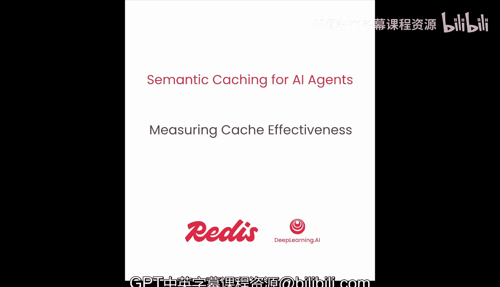
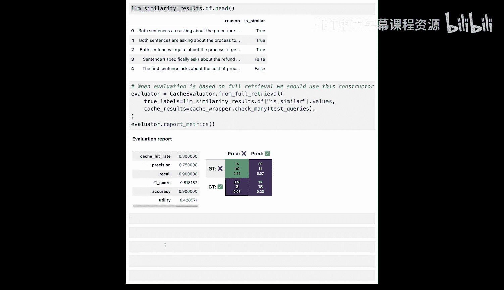

# 004：衡量缓存效果 📊

在本节课中，我们将学习如何评估你的语义缓存。我们将使用命中率、精确率、召回率和延迟等指标来衡量缓存的实际效果，并理解其性能表现。




## 概述

缓存系统可能以两种方式失效：质量不佳或性能低下。衡量缓存性能的方法与衡量机器学习模型性能的方法类似。我们将通过一系列指标和可视化工具来全面评估缓存系统。

## 缓存性能的核心指标

上一节我们介绍了评估缓存的重要性，本节中我们来看看用于衡量缓存效果的具体指标。这些指标帮助我们理解缓存命中的质量以及系统速度的提升。

以下是衡量缓存性能的四个核心指标：

1.  **命中率**：该指标衡量所有到达系统的用户查询中，有多少个查询落在了预设的距离阈值范围内。公式可以表示为：
    `命中率 = (落在阈值内的查询数) / (总查询数)`
    例如，在5个查询中有3个命中，则命中率为60%。

2.  **精确率**：精确率衡量所有落在距离阈值内的缓存条目中，有多少是真正有效的匹配。有效性来源于数据中的标签列。公式为：
    `精确率 = (真正例) / (真正例 + 假正例)`

3.  **召回率**：召回率衡量所有应该被命中的查询中，实际有多少被成功命中。如果因为距离阈值设置过低而导致应命中的查询未命中，就会降低召回率。公式为：
    `召回率 = (真正例) / (真正例 + 假反例)`

4.  **延迟**：衡量缓存系统带来的速度提升。我们可以使用以下公式计算带缓存的系统延迟：
    `带缓存的延迟 = (平均缓存延迟 * 缓存命中率) + (平均大模型延迟 * (1 - 缓存命中率))`
    通过比较缓存前后的延迟，可以计算出性能提升的百分比。

## 混淆矩阵与F1分数

为了更细致地分析缓存表现，我们需要查看混淆矩阵。混淆矩阵展示了真正例、真反例、假正例和假反例的数量。

在理想的混淆矩阵中，值应主要集中在主对角线上（即真正例和真反例）。距离阈值可以帮助我们在精确率和召回率之间进行权衡：
*   降低距离阈值可以提高精确率，但会降低召回率。
*   提高距离阈值可以提高召回率，但会降低精确率。

为了在精确率和召回率之间取得良好平衡，我们可以使用**F1分数**。F1分数是精确率和召回率的调和平均数。我们将通过遍历不同的阈值来优化并找到最适合我们数据的最佳阈值。

## 代码实践：评估缓存性能

现在，让我们在代码中实现所有这些缓存性能的衡量方法。

首先，我们设置环境并加载熟悉的数据集。数据集包含用户查询、对应的缓存命中（或最接近的匹配）、到该匹配的距离以及一个标签列（指示该命中是否正确）。

```python
# 导入必要的库并加载数据
import pandas as pd
# 假设 `faq_dataframe` 是包含查询和缓存条目的数据框
data = pd.read_csv('cache_dataset.csv')
```

接下来，我们引入一个语义缓存包装器，它封装了我们的缓存并提供了一些辅助函数，用于“填充”缓存或检查缓存。

```python
# 初始化缓存包装器
cache_wrapper = SemanticCacheWrapper()
# 使用辅助函数填充缓存
cache_wrapper.hydrate_cache(faq_dataframe)
```

然后，我们可以检查缓存。对于一个用户查询，检查缓存会返回一个对象，显示查询内容及其所有匹配项。

```python
# 检查第一个用户查询的缓存
first_query = faq_dataframe['user_query'].iloc[0]
cache_result = cache_wrapper.check_cache(first_query)
print(cache_result)
```

我们定义一个测试查询列表，并使用`check_many`辅助函数批量获取匹配结果。我们可以配置不同的阈值或匹配数量。

```python
test_queries = [...] # 用户查询列表
results = cache_wrapper.check_many(test_queries, threshold=0.5, top_k=3)
```

现在，使用一个名为`CacheEvaluator`的抽象来进行评估。由于我们的数据集是以特定方式生成的，我们可以自动生成标签。

```python
# 初始化缓存评估器
evaluator = CacheEvaluator(cache_results=results, data_container=data_container)
# 自动生成标签并打印报告
report = evaluator.report_matrix()
print(report)
```

报告会打印出清晰的混淆矩阵和精确率、召回率等指标。`get_matrix`函数可以字典格式获取所有指标，并提供一个“混淆掩码”，用于筛选出混淆矩阵中不同类别的具体数据点。

```python
metrics_dict, confusion_mask = evaluator.get_matrix()
# 查看假正例的例子
false_positives = data[confusion_mask['false_positives']]
print(false_positives.head())
```

例如，在一个假正例中，查询“我可以安排特定的送货时间吗？”被匹配到了缓存条目“我可以更改我的送货地址吗？”。尽管它们听起来相似，但含义不同，模型给出的距离足够低以至于被判定为匹配，但根据我们的标签，这应是一个错误匹配。

## 评估延迟性能

接下来，我们评估缓存的延迟性能。首先定义一个函数来模拟大语言模型的响应延迟。

```python
import time
import random

def simulate_llm_response():
    # 模拟200-500毫秒的延迟
    delay = random.uniform(0.2, 0.5)
    time.sleep(delay)
    return "Simulated LLM response"
```

然后，我们运行性能对比代码，使用一个名为`PerfVow`的抽象来同时比较缓存和大模型代码的执行性能。

```python
from perf_tools import PerfVow

perf_evaluator = PerfVow()
metrics = perf_evaluator.compare_performance(cache_wrapper.check_many, simulate_llm_response, test_queries)
print(metrics)
```

输出的指标字典会给出缓存和大模型的平均延迟。我们还可以可视化这些指标，直观地对比360毫秒的平均大模型延迟与2毫秒左右的平均缓存延迟。

最后，我们使用前面提到的公式，结合一个假设的缓存命中率（例如30%），来计算带缓存的系统整体延迟，并与原始延迟比较，得出速度提升的倍数。

```python
avg_cache_latency = metrics['avg_cache_latency'] # 例如 0.0022 秒
avg_llm_latency = metrics['avg_llm_latency'] # 例如 0.361 秒
cache_hit_ratio = 0.3 # 假设命中率

cached_system_latency = (avg_cache_latency * cache_hit_ratio) + (avg_llm_latency * (1 - cache_hit_ratio))
speedup = avg_llm_latency / cached_system_latency
print(f"系统加速比: {speedup:.2f}x")
```

## 使用大语言模型作为评判器

为了自动标注查询-缓存对，我们可以引入大语言模型作为评判器。我们重新开始，用FAQ数据框填充缓存，并进行一次全量检索（设置距离阈值为1，为每个测试查询检索最接近的邻居）。

```python
# 重新填充缓存并进行全量检索
cache_wrapper.clear_cache()
cache_wrapper.hydrate_cache(faq_dataframe)
full_matches = cache_wrapper.check_many(test_queries, threshold=1.0, top_k=1)
```

然后，我们使用大语言模型来标注所有这些查询-缓存对。首先加载API密钥，然后使用一个名为`LMEvaluator`的抽象。

```python
from lm_evaluator import LMEvaluator

lm_evaluator = LMEvaluator(api_key=your_api_key, model="gpt-3.5-turbo")
lm_results = lm_evaluator.predict(pairs=list(zip(test_queries, full_matches)), batch_size=10)
```

`lm_results`对象有一个`dataframe`属性，以数据框格式展示结果，包含每对查询是否相似的标签以及大语言模型的推理原因。

现在，我们可以再次使用缓存评估器，但这次使用大语言模型生成的自动标签，而不是数据容器提供的标签。

```python
# 使用大语言模型生成的标签进行评价
auto_labels = lm_results.dataframe['is_similar'].tolist()
evaluator_auto = CacheEvaluator.from_full_retrieval(cache_results=full_matches, labels=auto_labels)
report_auto = evaluator_auto.report_matrix()
print(report_auto)
```

通过比较可以发现，使用自动标注得到的精确率和召回率（例如75%和90%）与之前手动/半自动标注的结果（79%和79%）接近。这表明该方法可以为我们的评估生成足够好的标签。

## 总结




本节课中我们一起学习了如何全面评估语义缓存的性能。我们介绍了命中率、精确率、召回率和延迟等核心指标，并通过混淆矩阵和F1分数深入分析了缓存命中的质量。在代码实践中，我们实现了缓存性能的衡量、延迟对比，并探索了使用大语言模型作为自动评判器来生成评估标签的方法。掌握这些评估技术是优化缓存系统的第一步。在下一课中，你将学习如何根据这些评估结果来改进你的缓存。现在，让我们清理缓存并继续下一课。