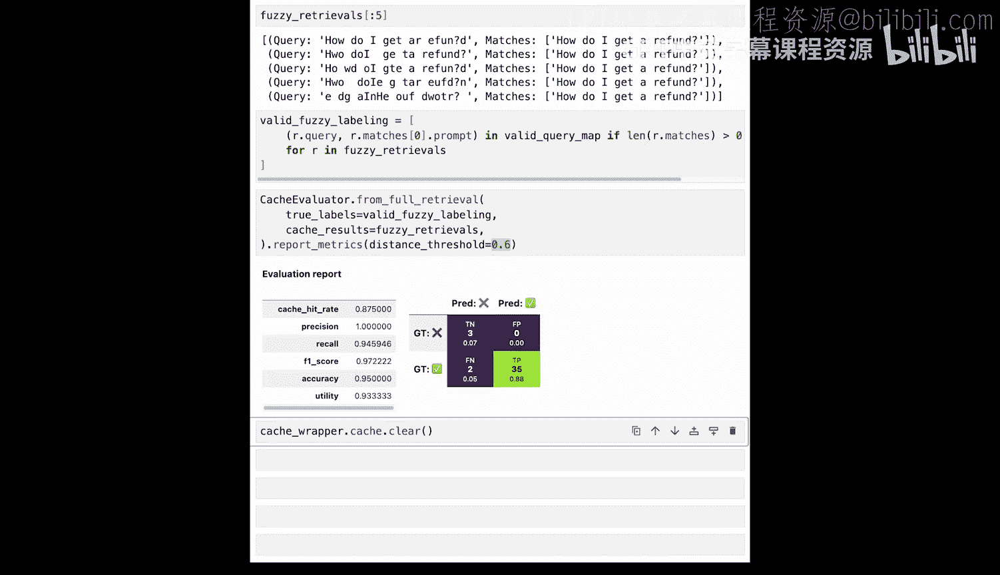

# 005：提升缓存效果 🚀

在本节课中，我们将学习几种技术来提升语义缓存的准确性和效率。我们将探讨阈值调优、交叉编码器、大语言模型验证和模糊匹配这四种策略，并通过代码示例展示如何实现它们。

## 概述


上一节我们介绍了语义缓存的基本概念和评估方法。本节中，我们将深入探讨如何通过多种技术手段来优化缓存性能，包括调整相似度阈值、使用更精细的模型进行重排序、引入大语言模型进行验证，以及在特定场景下应用模糊匹配算法。

## 阈值调优

第一种策略称为阈值扫描。在此策略中，我们使用不同的相似度阈值来评估缓存，以找到能使F1分数最大化的最佳阈值。

观察图表可以发现，提高阈值会提升召回率，但会降低精确率。由于F1分数是精确率和召回率的调和平均数，它会在一个中间的阈值处达到最大值。这个阈值通常就是我们希望设定的值。

以下是执行阈值扫描的代码示例：

```python
# 假设我们有一个评估器 evaluator
report = evaluator.report_threshold_sweep()
print(report)
```

## 交叉编码器

第二种策略是使用交叉编码器作为重排序器。交叉编码器是一种能够同时处理两个句子并捕捉它们之间细微差别的模型，因此表达能力更强。但它不能直接替代嵌入模型，因为它不产生便于快速搜索的向量。

通常，我们在语义缓存系统中的使用方式是：首先为一组用户查询检索出最接近的缓存命中结果，然后将这些结果通过交叉编码器运行，并选择相似度分数最高的缓存命中。

总结来说，交叉编码器可以显著提升精确率，尤其是在使用自有数据对模型进行微调后。当然，这种设置也会增加系统的缓存延迟。

以下是如何在缓存包装器中注册并使用交叉编码器的代码：

```python
# 实例化交叉编码器
cross_encoder = CrossEncoder("model_name")
# 在缓存包装器中注册重排序器
cache_wrapper.register_reranker(cross_encoder.get_reranker_instance())
# 使用带有重排序功能的缓存进行查询
results = cache_wrapper.query(test_queries, distance_threshold=1.0, num_results=10)
```

## 大语言模型验证

我们的第三种策略是使用一个大语言模型，直接询问一对句子在语义上是否相似。为了高效工作，我们可以使用一个更廉价的大语言模型来进行验证。验证相似性所需的令牌数远少于生成整个用户查询响应，因此在实践中成本更低。

您也可以将其设置为一个后备机制，用于验证那些具有模糊距离值的缓存命中。这种验证方案可以大幅提高精确率，但与没有大语言模型验证器的系统相比，它会增加延迟和令牌使用量。

以下是如何集成大语言模型验证器的示例：

```python
# 加载OpenAI密钥
import os
os.environ["OPENAI_API_KEY"] = "your_key"
# 实例化LM验证器
lm_validator = LMValidator()
# 在缓存包装器中注册
cache_wrapper.register_reranker(lm_validator)
# 运行查询
results = cache_wrapper.query(test_queries, distance_threshold=optimal_threshold)
```

## 模糊匹配

最后，让我们看看模糊匹配。这是一种用于匹配字符串的算法策略。模糊匹配通常测量字符串之间的编辑距离，或者衡量通过删除、替换和插入操作将一个字符串转换为另一个字符串的难易程度。

这种技术在关键词式搜索领域非常有用，可以轻松过滤掉拼写错误。为了正确设置，我们通常将模糊匹配放在语义缓存系统之前。通过设置较高的相似度阈值，它可以将带有拼写错误的查询与之前对应的查询匹配起来，从而绕过整个嵌入生成和向量搜索机制。这通常会降低延迟并提高精确率，但如果设置不当，也可能导致误报。

以下是一个简单的字符串模糊化函数和模糊缓存的使用示例：

```python
def fuzzify_string(input_string, iterations):
    """通过随机交换相邻字符来模糊化字符串。"""
    # ... 实现细节
    return fuzzified_string

# 实例化模糊缓存
fuzzy_cache = FuzzyCache()
# 使用数据集初始化缓存
fuzzy_cache.hydrate(faq_dataset)
# 查询模糊化的查询
fuzzy_results = fuzzy_cache.check(fuzzy_queries)
```

## 代码实践与结果

现在，让我们在代码中查看所有这些技术。我们首先设置环境并初始化缓存包装器和数据容器。使用之前评估的基线指标，我们依次应用阈值扫描、交叉编码器重排序和大语言模型验证，并观察各项指标（精确率、召回率、缓存率、F1分数）的变化。

例如，在应用交叉编码器后，我们可能将精确率从90%提升到94%，同时保持可观的缓存率。而引入大语言模型验证器后，我们甚至可能获得100%的精确率，尽管召回率可能会有所下降。

对于模糊匹配，我们创建了一个专门的FAQ数据集并引入不同程度的拼写错误。通过模糊缓存进行匹配，即使在字符串被严重扭曲的情况下，我们仍能获得高精确率和召回率，展示了该技术在特定场景下的有效性。

## 总结

本节课中，我们一起学习了四种提升语义缓存效果的核心技术：
1.  **阈值调优**：通过系统性地测试不同阈值来平衡精确率与召回率。
2.  **交叉编码器**：使用更强大的模型对初步检索结果进行重排序，以提升匹配质量。
3.  **大语言模型验证**：利用大语言模型对可疑的缓存命中进行二次验证，确保高精确率。
4.  **模糊匹配**：在语义缓存前处理拼写错误，提高系统在关键词搜索场景下的鲁棒性。



每种技术都在精度、召回、延迟和成本之间提供了不同的权衡。在实际系统中，您可以根据具体需求选择并组合这些策略。下一节课，您将动手实现第一个利用语义缓存来提升速度和效率的AI智能体。