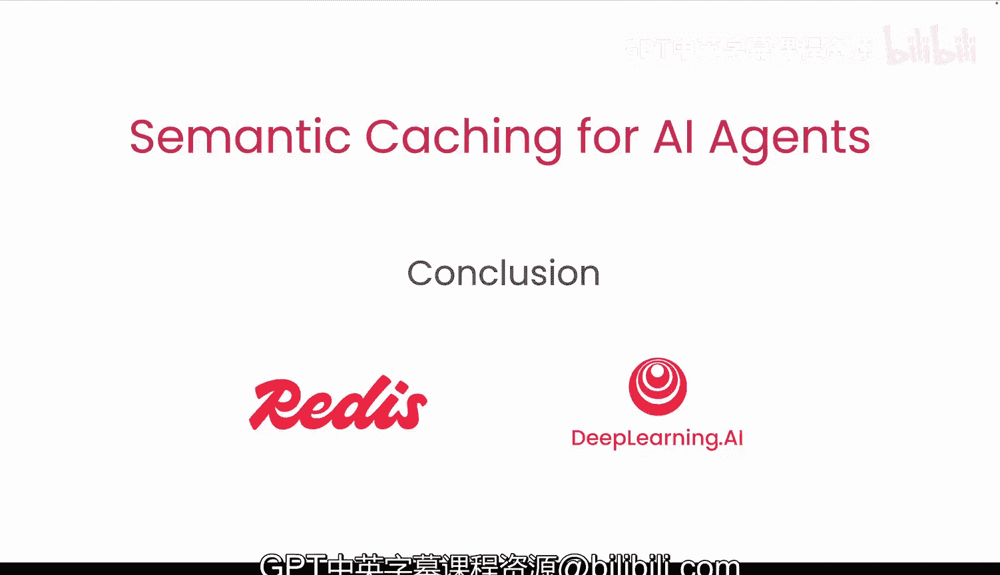

# 007：总结 🎯

在本节课中，我们将一起回顾语义缓存如何帮助AI代理提升速度与效率，并总结课程的核心要点。

## 课程概述

在之前的章节中，我们深入探讨了语义缓存的技术原理与应用。本节作为课程的总结，将系统性地回顾所学内容，并展望其应用前景。

## 核心内容回顾

语义缓存的核心机制在于，它允许AI代理通过比对当前查询与缓存中**语义相似**的历史查询，来直接复用已有的计算结果。其核心逻辑可以用以下伪代码表示：

```python
if semantic_similarity(current_query, cached_query) > threshold:
    return cached_response
else:
    new_response = generate_response(current_query)
    cache.add(current_query, new_response)
    return new_response
```

这个过程避免了大量重复计算，从而显著提升了响应速度。

## 语义缓存的优势

以下是语义缓存为AI代理带来的主要益处：



1.  **提升速度**：对于相似查询，可直接返回缓存结果，大幅减少响应延迟。
2.  **保证质量**：复用的是已验证的高质量结果，确保了输出的一致性。
3.  **降低成本**：减少了对大模型或复杂后端服务的调用次数，节省了计算资源。
4.  **增强可扩展性**：高效的缓存机制使系统能够更好地应对高并发请求。

## 总结


本节课中我们一起学习了语义缓存的核心价值。我们了解到，通过智能地存储和复用语义相似的查询结果，AI代理能够在**保持高质量输出的同时，变得更快、更高效、成本更低**。希望本课程的知识能帮助你构建出更强大的AI应用。

我们期待看到你的实践成果。🚀