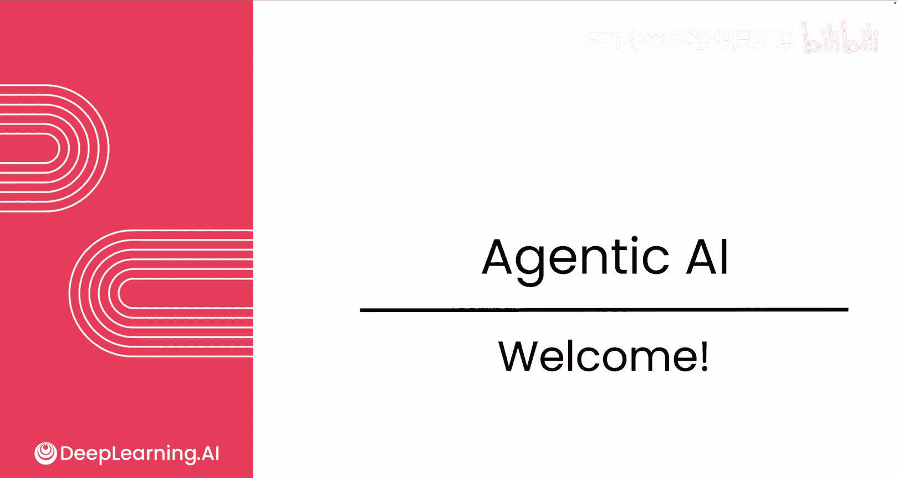
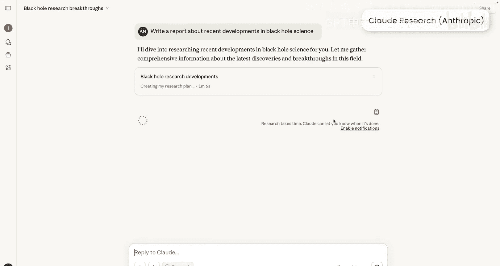
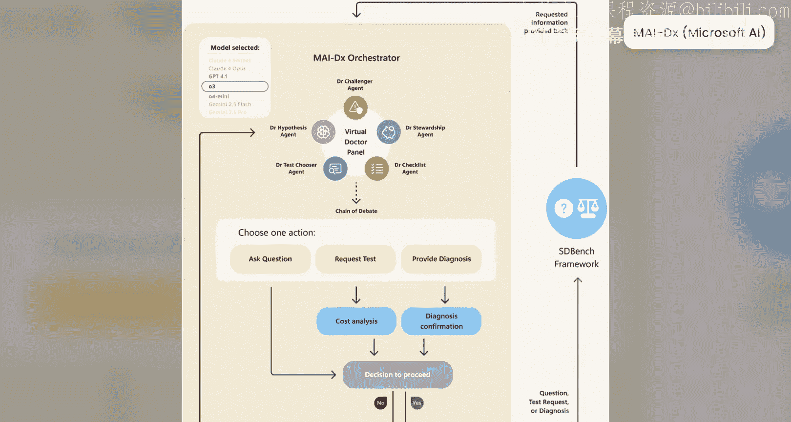

# 001：欢迎与课程概述 🚀

在本课程中，我们将学习代理式AI的核心概念与最佳实践，了解如何构建有价值的AI应用。

欢迎来到这门关于代理式AI的课程。当我创造“代理式”这个术语来描述我所看到的人们构建基于AI应用的一个重要且快速增长的趋势时，我并未意识到许多营销人员会抓住这个词，将其作为一个标签贴到几乎所有事物上。这导致了代理式AI的热度急剧飙升。

好消息是，抛开炒作不谈，使用代理式AI构建的真正有价值且实用的应用数量也在快速增长，即使速度不如炒作那么快。在本课程中，我将向您展示构建代理式AI应用的最佳实践，并为您开启许多新的机会领域。

如今，代理工作流正被用于构建各种应用，例如客户支持代理、协助撰写深度研究报告的研究工具、处理复杂法律文档，或分析患者输入以提供可能的医疗诊断建议。在我的许多团队中，如果没有代理工作流，很多项目根本无法完成。因此，掌握如何用它们构建应用是当今AI领域最重要、最有价值的技能之一。

事实证明，我观察到真正懂得如何构建代理工作流的人与不太擅长的人之间最大的区别之一，是推动一个严谨开发流程的能力。具体来说，是专注于**评估**和**错误分析**的流程。在本课程中，我将解释这意味着什么，并向您展示如何能真正擅长构建这些代理工作流。

掌握这项技能是当今AI领域最重要的能力之一，它将为您开启更多机会，无论是工作机会还是自己构建出色软件的机会。

接下来，让我们进入下一个视频，更深入地探讨单代理工作负载。