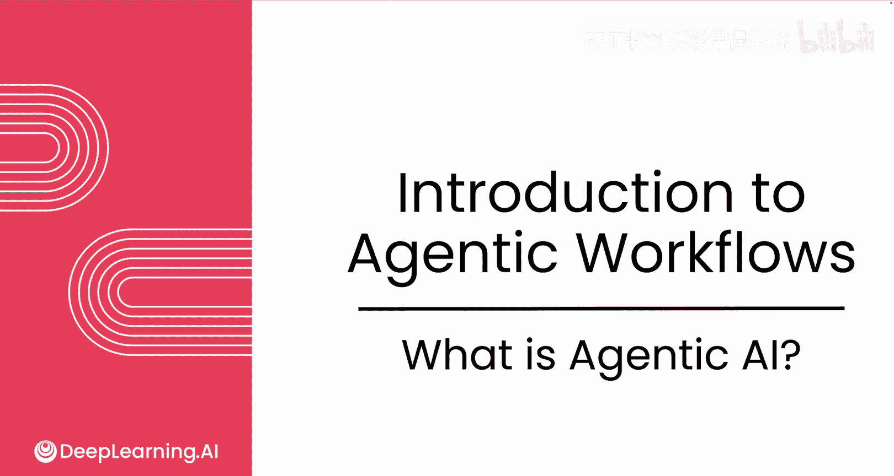
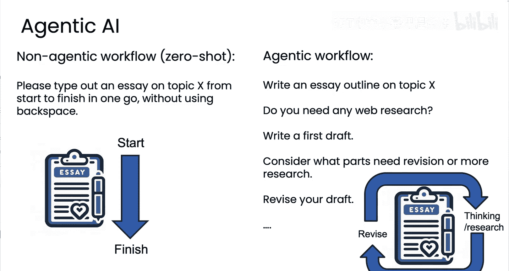
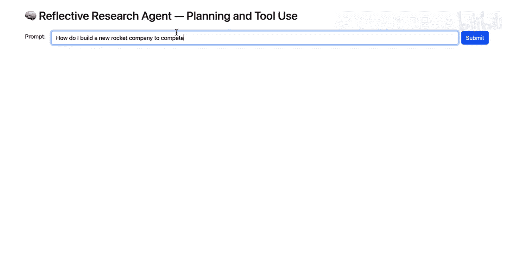
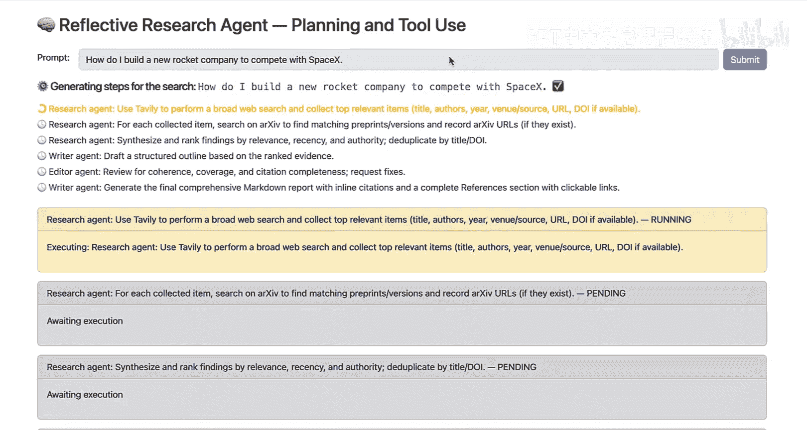
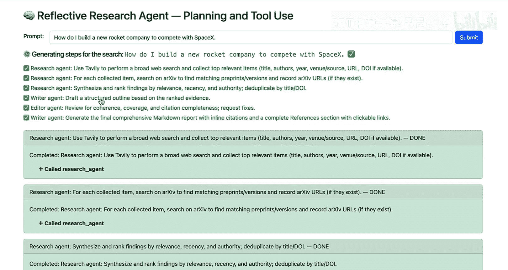
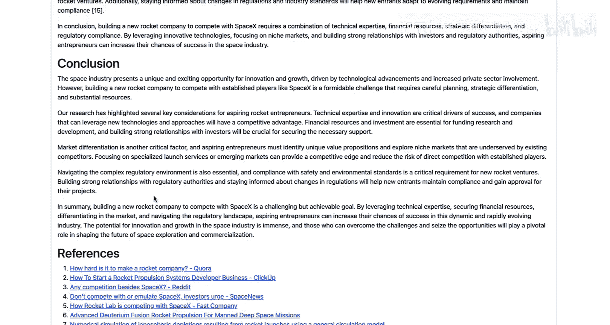

# 002：什么是代理式AI 🤖

在本节课中，我们将要学习什么是代理式AI，以及为什么代理式AI工作流如此强大。

## 概述

许多人在使用大型语言模型时，习惯于直接给出一个指令，例如“请就某个主题X为我写一篇文章”。这种方式类似于要求一个人（或AI）从第一个字到最后一个字，一气呵成地完成整篇文章，并且不允许使用退格键。事实证明，无论是人类还是AI模型，在这种完全线性的、受约束的写作方式下，都难以发挥最佳水平。然而，尽管存在这种困难，当前的模型表现已经相当不错。

相比之下，代理式工作流则采用了不同的方式。

## 代理式工作流详解

上一节我们介绍了传统提示方式的局限性，本节中我们来看看代理式工作流的具体过程。

代理式工作流的过程可能如下：首先，你可以要求AI就某个主题撰写一份大纲；接着，询问它是否需要进行研究；在进行一些网络研究并可能下载一些网页后，让它撰写初稿；然后，让它阅读初稿并提出修改建议；最后，根据建议修订草稿，如此循环。

这种工作流更接近于人类的创作过程：进行一些思考和研究，然后进行修订，再进行更多思考，等等。通过这种迭代过程，代理式工作流虽然耗时更长，但能产出质量高得多的工作成果。

因此，**代理式AI工作流是一个过程，其中基于LLM的应用程序执行多个步骤以完成任务**。

以下是该过程可能涉及的步骤分解：
1.  使用LLM撰写文章大纲。
2.  使用LLM决定调用网络搜索API时应使用的搜索词，以获取相关网页。
3.  将下载的网页内容输入给LLM，让其撰写初稿。
4.  可能使用另一个LLM进行反思，决定哪些部分需要进一步修订。

根据工作流的设计，你甚至可以加入“人在回路”的步骤，让AI可以选择请求人类审查一些关键事实。基于此，AI再修订草稿。这个过程最终能产生更好的输出成果。

在本课程中，你将学习的一项关键技能是：如何将一个复杂任务（如写文章）分解为更小的步骤，以便代理式工作流一次执行一步，最终获得你想要的输出。知道如何将任务分解为步骤，以及如何构建组件来很好地执行各个步骤，是一项棘手但重要的技能，它将决定你为大量激动人心的应用构建代理式工作流的能力。

## 课程实践示例：研究代理

为了具体说明，本课程将使用一个研究代理作为示例，你可以跟随我一起构建它。

以下是该研究代理的工作示例：你可以输入一个研究主题，例如“我如何建立一家新的火箭公司来与SpaceX竞争？”。研究代理会开始规划需要进行的调研，包括调用网络搜索引擎下载相关网页，然后综合并排序发现的信息，起草大纲，让另一个代理审查连贯性，最后生成一份全面的Markdown格式报告。

报告会包含引言、背景、发现等部分。它甚至可能恰当地指出，这将是一家难以建立的初创公司。通过查找和下载多个来源并深入思考，这种代理最终能生成一份比直接要求“写一篇文章”更具思想深度的报告。

我对此感到兴奋的原因之一是，在我的工作中，我已经构建了不少专门的研究代理，无论是用于法律文件合规、医疗健康领域，还是商业产品研究。我希望通过这个示例，你不仅能学会如何为许多其他应用构建代理工作流，而且如果你需要构建自己的定制研究代理，其中的一些思路也能直接对你有用。

## 关于自主性的说明

关于AI代理，一个经常被讨论的领域是它们的自主性程度。你刚才看到的便是一个相对复杂、高度自主的代理式AI工作流。但也存在其他更简单却极具价值的工作流。

在下一节视频中，我们将探讨代理工作流可以实现的自主程度，并为你提供一个框架，帮助你思考如何构建不同的应用程序，以及它们的难易程度。

本节课中我们一起学习了代理式AI的基本概念，理解了其通过多步骤迭代提升输出质量的核心原理，并预览了课程中将构建的研究代理示例。