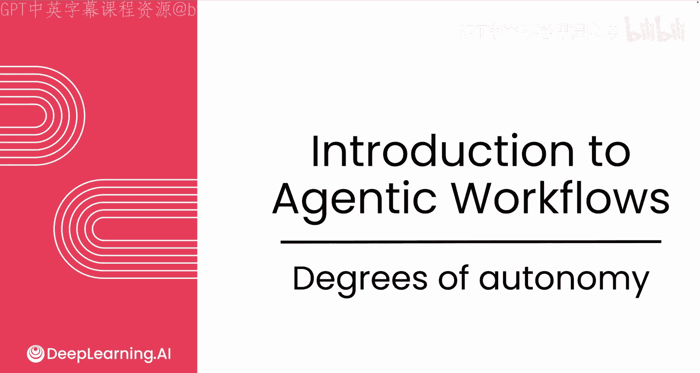
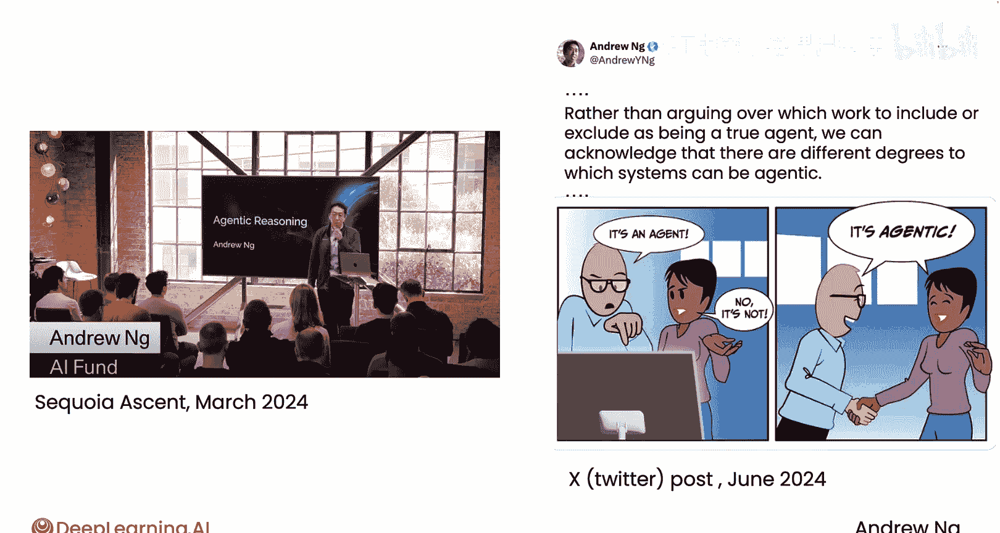
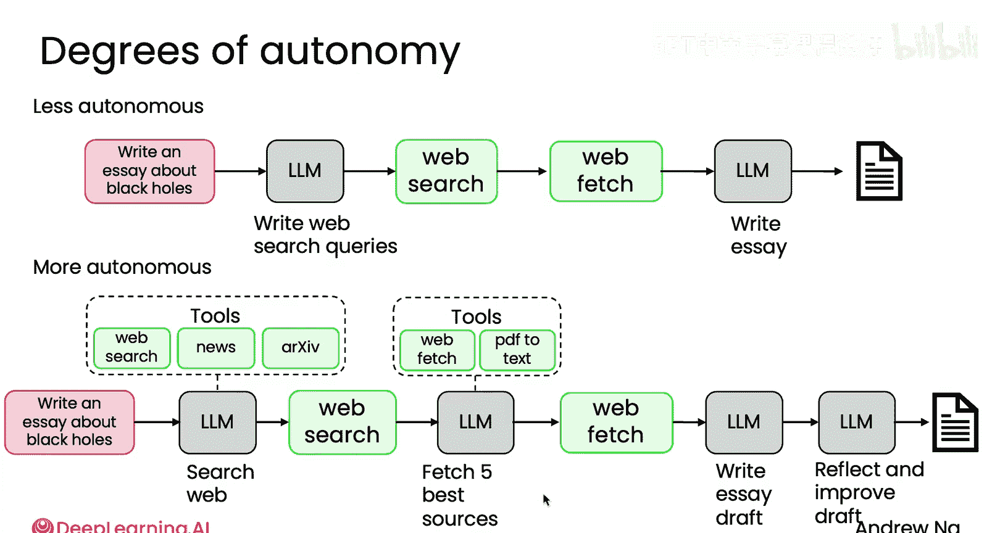
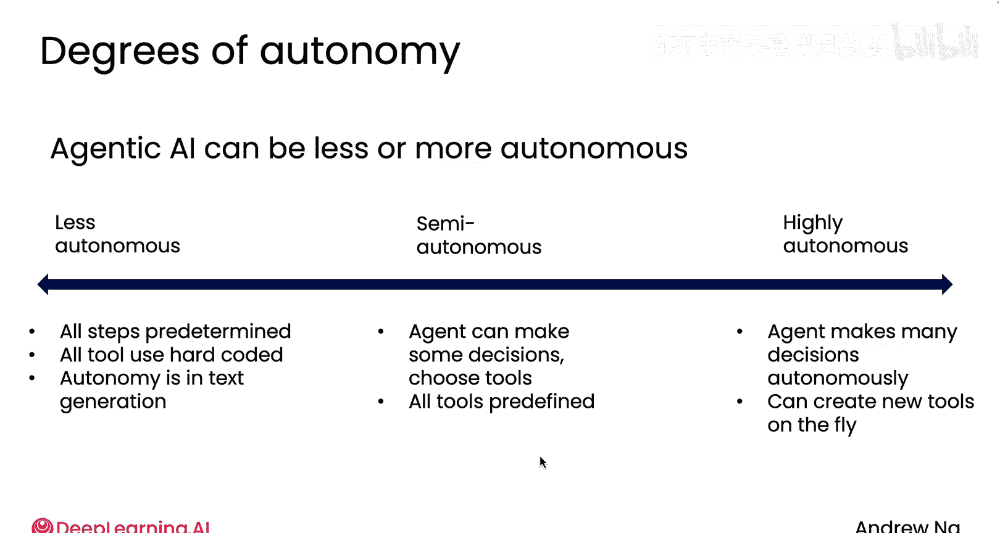

# 003：模块1-5｜代理的自主程度 🎯

在本节课中，我们将要学习代理式AI系统的一个核心概念：自主程度。我们将探讨为何“代理式”这一术语有助于避免不必要的争论，并理解不同自主程度的代理如何运作，以及它们在实践中的应用价值。

---

## 自主程度的概念

几年前，AI社区中关于“何为真正代理”的争论日益激烈。一些人撰文讨论代理，而另一些人则反驳称那并非真正的代理。我认为这场争论并无必要，因此我开始使用“代理式”这个形容词。如果我们将其视为一个程度问题，而非非此即彼的二元判断，我们就能承认系统可以具有不同程度的代理特性。这被称为“代理式”，从而让我们能专注于构建这些系统的实际工作，而非争论某个系统是否足够自主到能被称为代理。

我记得在准备关于代理推理的演讲时，一位团队成员曾对我说：“我们不需要另一个新词，我们已经有‘代理’了，为什么还要用‘代理式’？”但我还是决定使用它。后来，我在《The Batch》通讯和社交媒体上撰文提出，与其争论哪些系统应被纳入“真正代理”的范畴，不如承认系统可以具有不同程度的代理特性。我认为这有助于我们超越关于“何为真正代理”的争论，转而专注于实际构建它们。




---

## 低自主性代理示例

上一节我们介绍了自主程度的概念，本节中我们来看看一个低自主性代理的具体例子。

以撰写一篇关于黑洞的文章为例。你可以构建一个相对简单的代理，其步骤如下：

以下是该代理的确定性执行步骤：
1.  生成几个网络搜索关键词或查询。
2.  通过硬编码方式调用网络搜索引擎。
3.  获取网页内容。
4.  利用获取的内容撰写文章。

这是一个低自主性代理的例子，它遵循完全由程序员预先确定的线性步骤序列。用本课程的符号约定表示，其流程如下：



```
用户输入: "撰写一篇关于黑洞的文章"
    ↓
[LLM调用: 生成搜索查询]
    ↓
[工具调用: 执行网络搜索]
    ↓
[工具调用: 获取网页内容]
    ↓
[LLM调用: 撰写最终文章]
```

**符号说明**：
*   **红色**：代表用户输入（例如查询）。
*   **灰色框**：代表对大语言模型的调用。
*   **绿色框**：代表调用其他软件执行操作（例如API调用或代码执行）。

这种方式可以正常工作。

---

## 高自主性代理示例

了解了低自主性代理后，我们来看看更高自主性的代理如何运作。

对于同样的“撰写一篇关于黑洞的文章”请求，一个更高自主性的代理可能让大语言模型自行决定：是进行网站搜索，还是搜索最近的新闻源，抑或是去网站存档中查找近期的研究论文。在这个例子中，不是人类工程师，而是大语言模型选择了调用网络搜索引擎。

之后，你可能继续让大语言模型决定：它想获取多少个网页？如果获取到PDF文件，是否需要调用函数或工具将其转换为文本？在这个案例中，它可能获取排名靠前的几个网页，然后撰写文章草稿，接着进行反思和改进，甚至可能返回去获取更多网页，最终产生输出。

因此，即使对于“研究代理”这个例子，我们也能看到：有些代理自主性较低，执行由程序员确定的线性步骤序列；有些则自主性更高，你信任大语言模型做出更多决策，具体的步骤序列甚至可能由大语言模型而非程序员预先决定。

---

## 自主程度谱系与应用

基于以上例子，我们可以将代理的自主程度理解为一个谱系。



对于自主性较低的系统，通常所有步骤都是预先确定的，它所调用的任何函数（如网络搜索）——正如你将在本课程第三模块学到的“工具使用”——可能是由人类工程师硬编码的。其大部分自主性仅体现在大语言模型最终生成的文本上。

谱系的另一端是高度自主的代理，这种代理能自主做出许多决策。例如，它可以自行决定撰写文章所需执行的具体步骤序列。一些高度自主的代理甚至能够编写新函数，或者有时被称为“创造新工具”以供执行。

介于两者之间的是半自主代理，它们可以做出一些决策、选择工具，但这些工具通常是预先定义好的。

当你查看课程中的不同示例时，你将学习如何构建这个谱系上从低到高任何自主程度的应用程序。你会发现，在谱系的低自主性一端，有大量为当今众多企业构建的、非常有价值的应用。同时，谱系的高自主性一端也有许多应用正在开发中，但这些应用通常较难控制、有点不可预测，并且如何构建这些高度自主的代理也是当前活跃的研究领域。

---

## 总结与过渡



本节课中，我们一起学习了代理式AI系统的自主程度概念。我们探讨了使用“代理式”一词如何帮助我们聚焦于实际构建，而非语义争论。通过具体示例，我们对比了低自主性与高自主性代理的工作方式，并将代理的自主性理解为一个连续的谱系，其中不同位置都有其有价值的应用场景。

理解了代理的自主程度后，接下来让我们进入下一个视频，更深入地探讨使用代理的好处，以及它们为何能让我们实现早期基于大语言模型的应用所无法完成的任务。