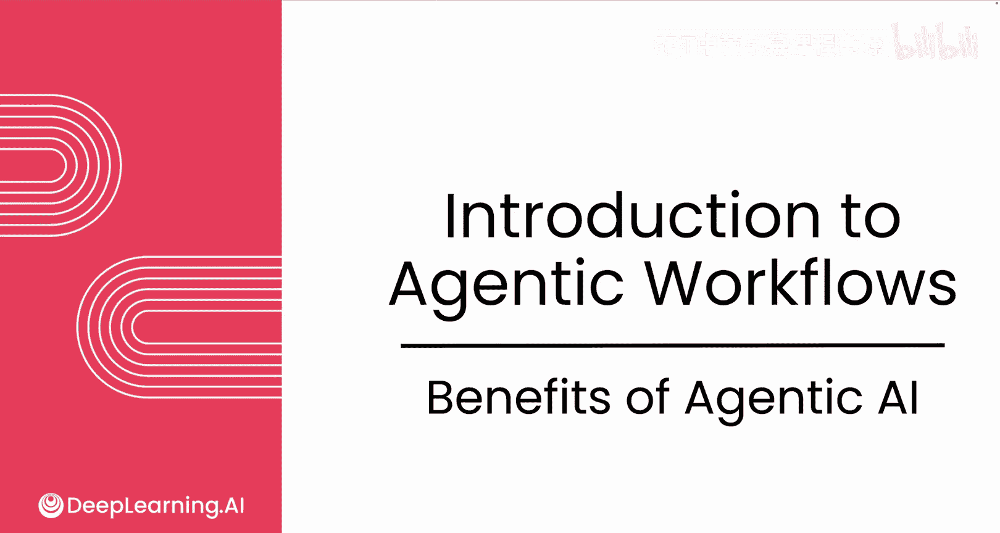
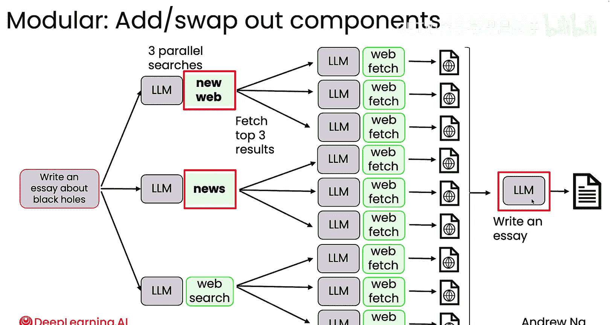
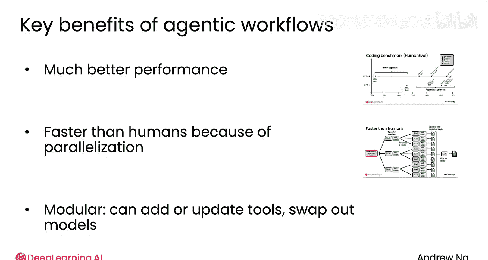

# 004：代理式AI的优势 🚀

在本节课中，我们将学习代理式AI工作流带来的主要优势。我们将探讨它如何实现以往难以完成的任务，以及它在并行处理、模块化设计等方面的额外好处。

---

## 概述

代理式AI工作流不仅能够显著提升任务执行的效果，还能通过并行处理加快速度，并通过模块化设计整合最优组件。接下来，我们将详细分析这些优势。

---

## 核心优势：实现不可能的任务

我认为代理工作流最大的一个好处是，它让你能够有效地完成许多以前根本不可能实现的任务。

## 并行处理：大幅提升速度

除了实现新任务，代理工作流还有其他好处，包括**并行处理**，它能让你非常快速地完成某些事情。

例如，如果你要求一个代理工作流撰写一篇关于黑洞的文章，你可以让多个代理并行运行，以生成用于网络搜索的关键词。基于第一次网络搜索的结果，系统可能会识别出三个顶级结果来获取；基于第二次搜索，可能会识别出第二组网页来获取，依此类推。

事实证明，当人类进行此类研究时，必须按顺序或逐个阅读这九个网页。然而，在使用代理式工作流时，你实际上可以**并行下载所有九个网页**，最后将所有内容输入给一个代理来撰写文章。

因此，尽管代理式工作流确实比纯粹的非代理工作流或仅通过单次提示的直接生成耗时更长，但如果你将这种代理工作流与人类执行任务的方式进行比较，其**并行下载多个网页的能力**实际上可以让它在某些任务上快得多，远胜于人类处理数据的非并行、顺序方式。

## 模块化设计：整合最优组件

另一个好处是**模块化**，它让你能够结合来自许多不同地方的最佳组件，以构建一个高效的工作流。

基于这个例子，我在构建代理式工作流时经常做的一件事是查看各个组件（如大语言模型），并添加或更换组件。

例如，我可能会查看这里的网络搜索引擎，并决定在构建代理式工作流时换入一个新的搜索引擎。实际上，有多个网络搜索引擎可供选择，包括Google（可通过Serper访问）、Bing、DuckDuckGo、You.com等。实际上，有很多专为AI模型使用而设计的网络搜索引擎选项。

或者，也许不仅仅是进行三次网络搜索，你可以在这一步换入一个新的新闻搜索引擎，以便查找关于黑洞大小的最新突破性新闻。

最后，我通常会尝试使用不同的大语言模型，而不是在所有不同步骤中都使用同一个模型。我可能会尝试不同的AI提供商，看看哪个能为这个系统的不同步骤提供最佳结果。

---

## 性能对比：代理工作流的威力

我的团队收集了一些关于编码基准测试的数据，该测试评估不同AI模型编写代码以执行特定任务的能力。这个基准测试在本例中被称为HumanEval。

结果表明，GPT-3.5（这是GPT最初公开版本所基于的模型）如果被要求直接编写代码，仅通过提示输出计算机程序，在这个基准测试上的正确率为**40%**（这是一个被动的、非代理的指标）。

GPT-4是一个好得多的模型，性能跃升至**67%**，但这同样是在非代理工作流下的表现。

然而，事实证明，尽管从GPT-3.5到GPT-4的改进已经很大，但**这种改进幅度还比不上在上一代模型上实施代理工作流所能实现的提升**。

通过将GPT-3.5包装在代理工作流中，并使用你在课程后面将学到的不同代理技术（例如，你可以提示GPT-3.5编写代码，它可能会反思代码并找出改进方法），你实际上可以让GPT-3.5达到更高的性能水平。

同样地，在代理工作流的背景下使用GPT-4，其表现也会好得多。因此，即使使用当今最好的大语言模型，代理工作流也能让你获得更好的性能。

事实上，我们在这个例子中看到的是，从一代模型到另一代模型的巨大改进，仍然比不上在上一代模型上实施代理工作流所带来的差异。

---

## 总结

本节课中，我们一起学习了代理式AI工作流的核心优势。

**总结来说，我使用代理工作流的主要原因是，它能在许多不同的应用上提供更好的性能。** 此外，它还可以并行处理一些人类原本必须顺序执行的任务。许多代理式工作流的模块化设计也让我们能够添加、更新工具，有时甚至可以更换模型。

我们已经深入探讨了构建代理式工作流的关键组件。现在，让我们来看看一系列代理式AI的应用，以便让你了解人们已经在构建的东西，以及你自己可以构建的东西。

让我们进入下一个视频。