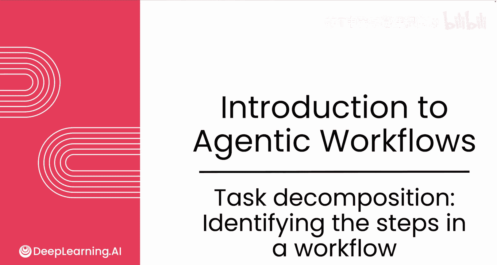
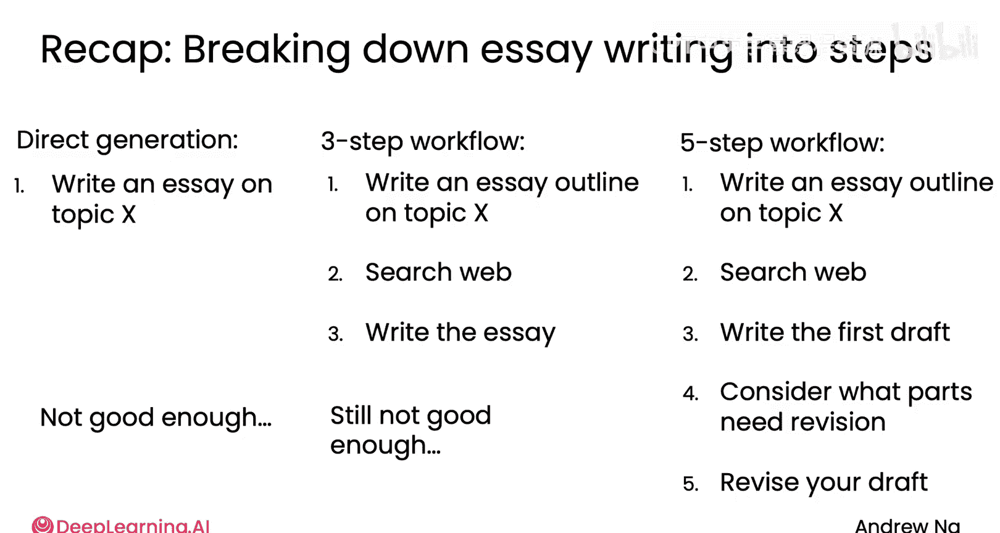
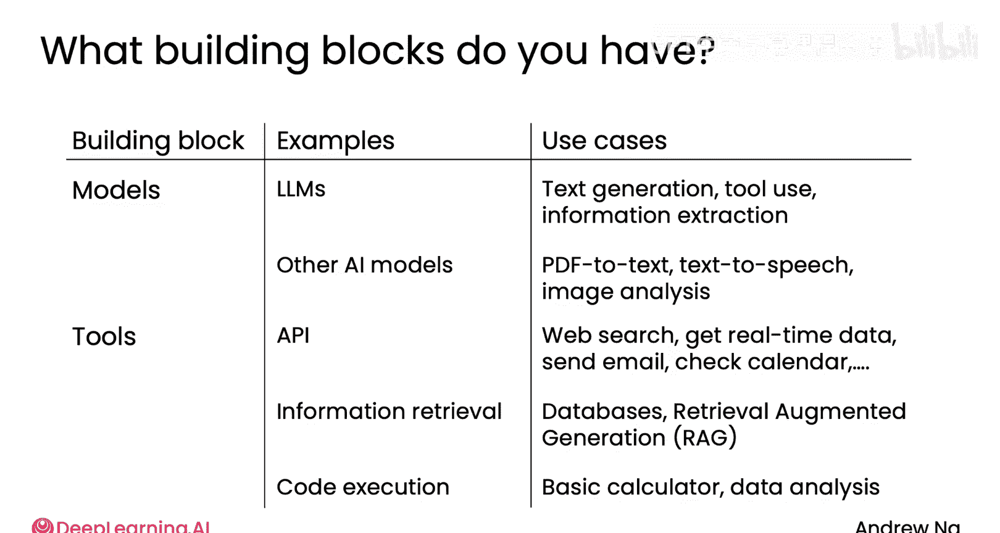

# 005：任务分解——识别工作流中的步骤

在本节课中，我们将要学习如何将人类或企业执行的复杂任务，分解为可由AI代理执行的离散步骤。我们将通过具体示例，探讨如何构建和迭代优化代理工作流。

## 概述

人们和企业会执行许多任务。如何将这些有用的任务分解为可供AI代理工作流遵循的离散步骤？让我们一起来探讨。

## 任务分解的核心思路

上一节我们介绍了代理工作流的基本概念，本节中我们来看看如何将一个宏观任务拆解为可执行的步骤。核心方法是：观察人类如何执行任务，并将其分解为可由大型语言模型（LLM）或特定工具（如API调用、代码执行）完成的子步骤。

## 示例一：构建研究型代理（撰写论文）

假设你需要一个AI系统来撰写关于主题X的论文。一种直接的方法是提示LLM直接生成最终输出。

然而，对于需要深度研究的主题，你可能会发现直接生成的输出仅停留在表面，或只涵盖显而易见的事实，未能达到你期望的深度。

在这种情况下，你可以反思人类撰写论文的过程：你会直接坐下来开始写吗？还是采取多个步骤，例如：
1.  首先撰写论文大纲。
2.  然后进行网络搜索。
3.  最后基于网络搜索结果撰写论文。

这就是将任务分解为步骤。我经常问自己的一个问题是：**步骤1、2、3中的每一个，是否都能由LLM、一小段代码或通过工具进行的函数调用来完成？**

在这个案例中：
*   **步骤1（撰写大纲）**：我认为LLM可以为许多主题写出不错的大纲，所以这一步可行。
*   **步骤2（生成搜索词并搜索）**：我知道如何使用LLM生成搜索词并进行网络搜索，所以这一步也可行。
*   **步骤3（基于搜索结果撰写论文）**：我认为LLM可以输入网络搜索结果并撰写论文，所以这一步也可行。

这将是构建一个比直接生成更深入的论文写作代理工作流的合理初步尝试。

但是，如果我实现这个工作流并查看结果，可能会发现结果仍然不够好，思考深度不足，或者论文读起来有些脱节。这确实在我身上发生过：我曾用这个工作流构建了一个研究代理，但每当我阅读输出时，都感觉文章的开头、中间和结尾不完全一致。

此时，你可以反思：如果作为人类，你发现论文脱节，会如何修改工作流？

一种做法是将第三步“撰写论文”进一步分解为更多子步骤。与其一次性写完，不如：
1.  撰写初稿。
2.  评估哪些部分需要修改。
3.  修订草稿。

这就是我作为人类可能会采取的方式：不是第一次尝试就写出终稿，而是先写初稿，然后通读（这是另一步），再基于对自己文章的批评来修订草稿。

**回顾一下**：我从直接生成（一步）开始，认为效果不佳，于是分解为三步。之后可能仍不满意，于是将其中一步进一步分解为三个更小的步骤，从而形成了一个更复杂、更丰富的论文生成流程。根据你对这个流程结果的满意程度，你甚至可以选择进一步修改这个论文生成过程。

## 示例二：处理客户订单咨询

让我们看看第二个如何将复杂任务分解为最小步骤的例子。以回复基本的客户订单咨询为例。

人类客服可能执行的**第一步**是提取关键信息，例如：这封邮件来自谁？他们订购了什么？订单号是多少？这些是LLM可以完成的。

**第二步**是查找相关的客户记录，即编写并执行相应的数据库查询，以调取客户订购了什么、何时发货等信息。我认为一个能够调用函数来查询订单数据库的LLM应该可以做到这一点。

**第三步**，在调取客户订单记录后，撰写并发送回复给客户。我认为，在提供了调用API发送邮件的选项后，LLM利用我们获取的信息也能完成这一步。

这是将“回复客户邮件”任务分解为三个独立步骤的另一个例子。我可以审视每个步骤并说：我认为一个能够调用函数来查询数据库或发送邮件的LLM应该能够完成。

## 示例三：处理发票

最后一个例子是发票处理。在PDF发票被转换为文本后，**第一步**是提取所需信息：账单名称、地址、到期日、应付金额等。LLM应该能够做到这一点。

**第二步**，如果我想检查信息是否已提取并保存到新的数据库条目中，那么我认为LLM可以帮助我调用函数来更新数据库记录。

因此，要实现一个代理工作流来执行这两个基本步骤。

## 构建代理工作流的“积木”

在构建代理工作流时，我将自己视为拥有一些“积木块”。

*   **一个重要积木是大型语言模型（LLM）**，或者如果需要处理图像或音频，也可以是大型多模态模型。LLM擅长生成文本、决定调用什么、从某些文本中提取信息。
*   **对于某些专门任务，我可能还会使用其他AI模型**，例如用于将PDF转换为文本、文本转语音或图像分析的AI模型。
*   **除了AI模型，我还可以访问许多软件工具**，包括可以调用的不同API，用于网络搜索、获取实时天气数据、发送电子邮件、检查日历等。
*   **我可能还有用于检索信息的工具**，例如从数据库调取数据，或进行检索增强生成（RAG），即可以查询大型文本数据库并找到最相关的文本。
*   **我可能还有执行代码的工具**。这是一个让LLM编写代码然后在你的计算机上运行以完成大量工作的工具。

如果其中一些工具对你来说有些陌生，请不要担心，我们将在后续模块中更详细地介绍最重要的工具。

我认为，构建代理工作流时，我的很多工作是观察个人或企业正在做的工作，然后尝试弄清楚：**如何将这些“积木块”按顺序组合在一起，以执行我希望系统完成的任务？**

这就是为什么充分了解有哪些可用的“积木块”非常重要（我希望在本课程结束时你也能有更好的认识），这将使你能够更好地设想可以通过组合这些“积木块”来构建哪些代理工作流。

## 总结与迭代改进

**本节课中我们一起学习了**，构建智能代理工作流的一项关键技能是：观察某人可能做的一系列事情，并识别出可以用于实现的离散步骤。

当我审视各个离散步骤时，我经常问自己的一个问题是：**这个步骤是否可以用LLM或我拥有的某个工具（如API或函数调用）来实现？**

如果答案是否定的，我通常会问自己：作为人类，我会如何做这一步？是否有可能将其进一步分解或拆分成更小的步骤，从而更易于用LLM或我拥有的某个软件工具来实现？

我希望这能让你对如何思考任务分解有一个大致的了解。如果你觉得还没有完全掌握，请不要担心，本课程中将会有更多示例，到课程结束时你会有更好的理解。

事实证明，在构建代理工作流时，你经常会先构建一个初始的任务分解和初始代理工作流，然后希望多次迭代和改进它，直到它达到你想要的性能水平。

为了推动这个对许多项目都很重要的改进过程，一项关键技能是知道如何评估你的代理工作流。

## 过渡到下一主题

在下一节视频中，我们将讨论评估（evals），这是一个关键组成部分，关乎你如何构建并持续改进工作流以获得想要的性能。让我们在下一个视频中谈谈评估。