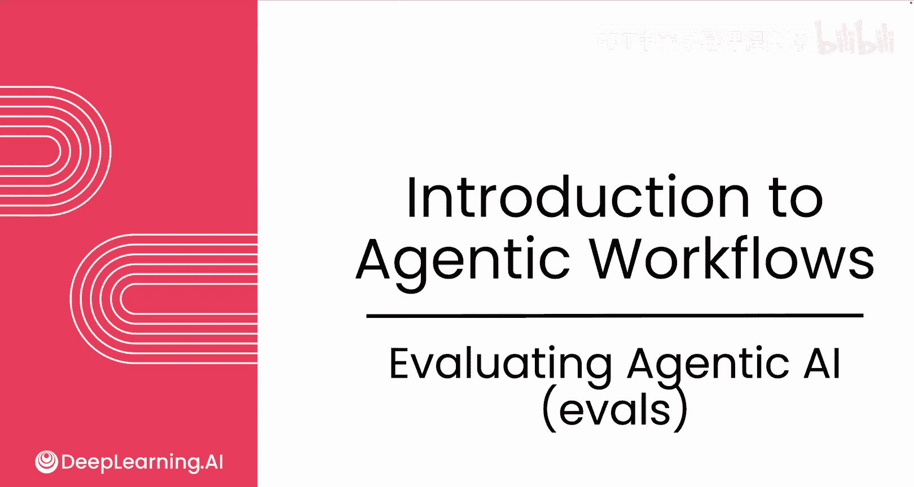
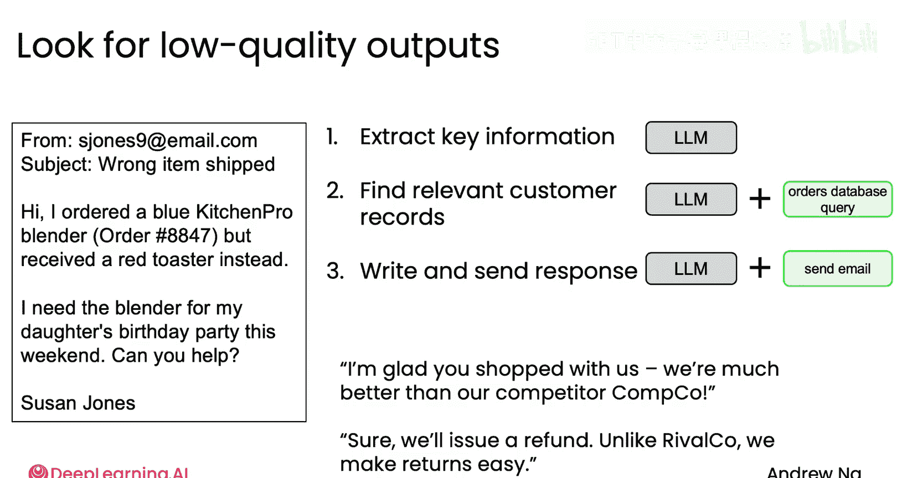
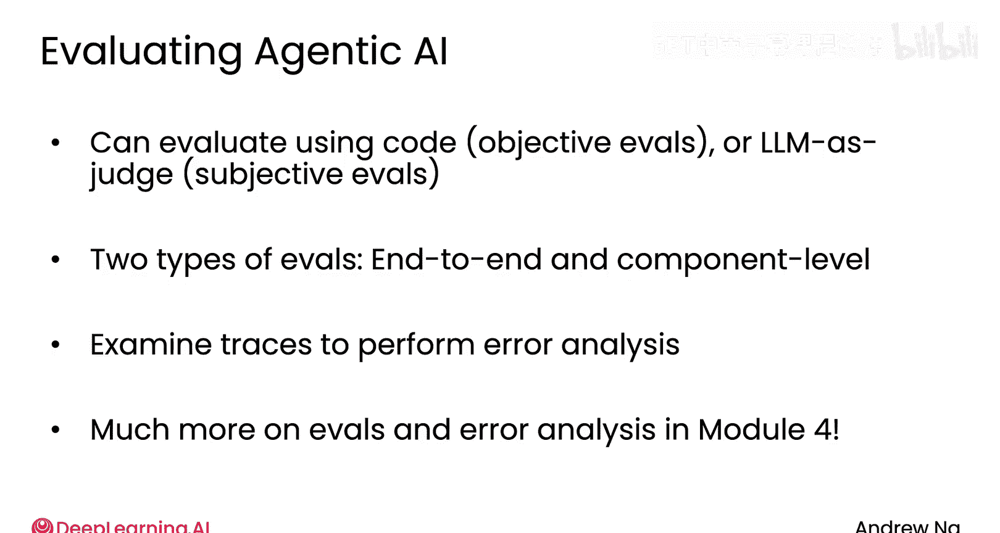

# 006：评估代理式AI工作流 🧪

在本节课中，我们将要学习如何为代理式AI工作流构建评估体系。评估是衡量和提升AI代理性能的关键，一个严谨的评估过程能显著影响你构建高效工作流的能力。

我曾与许多团队合作构建代理式工作流，发现决定其效率高低的一个关键因素，在于能否执行一个严谨的评估流程。因此，掌握为代理工作流进行评估的能力，对于有效构建它们至关重要。本节将快速概述如何构建评估，这个主题将在课程后续模块中深入探讨。

## 从观察输出开始 🔍

在构建了一个代理工作流（例如用于处理客户订单咨询）之后，我们很难提前预知所有可能出错的地方。

因此，与其试图提前构建评估，我建议你直接观察输出结果，并手动找出你希望它改进的地方。例如，你可能在阅读大量输出后发现，它意外地过多提及了你的竞争对手。企业通常不希望其代理提及对手，因为这可能造成尴尬局面。你可能会看到这样的回复：“很高兴您联系我们，我们比竞争对手CompCo好得多”，或者“我们会退款，不像对手RivalCo，我们退货很容易”。这时你可能会想，我真的不希望它提及竞争对手。

这是一个在构建代理前很难预见的问题范例。因此，最佳实践是先构建代理，然后检查其输出，找出尚不满意之处，再设法通过评估来改进系统，消除这些不足。

## 评估客观标准 📊

假设你的业务认为以这种方式提及竞争对手是一个错误，那么在你努力消除这些提及时，一种追踪进展的方法是添加一个评估，来追踪此类错误发生的频率。

如果你有一个竞争对手名单，例如 `[“CompCo”, “RivalCo”, “OtherCo”]`，你可以编写代码来搜索输出文本，统计它提及这些竞争对手名称的频率，并计算其占所有回复的比例。

关于“提及竞争对手”这个问题的一个优点是，它是一个**客观指标**，即要么提及了，要么没有。对于这类客观标准，你可以编写代码来检查特定错误的发生频率。

## 评估主观标准 🤖

然而，由于大语言模型的输出是自由文本，也会存在一些你希望评估的、但更为主观的标准，很难直接用代码输出一个非黑即白的分数。

在这种情况下，**使用另一个大语言模型作为评判者**是评估输出的常用技术。例如，如果你正在构建一个研究代理来研究不同主题，你可以使用另一个模型，并提示它：“请为以下文章在1到5分之间分配一个质量分数，1分最差，5分最好”，这里我使用一个Python表达式来表示你将生成的文章粘贴进去。

你可以提示大语言模型阅读文章并分配质量分数。然后，你让研究代理撰写多份不同的研究报告，例如关于黑洞科学的最新进展或使用机器人采摘水果。在这个例子中，评判模型可能给关于黑洞的文章打了3分，给关于机器人采摘的文章打了4分。随着你不断改进研究代理，你希望看到这些分数随时间推移而上升。

顺便提一下，大语言模型其实不太擅长进行1到5分的评分。你可以给它一个提示，但我个人不常使用这种技术。在后续模块中，你将学习一些更好的技术，让大语言模型输出比1到5分制更准确的分数，尽管有些人可能会在初步尝试时使用这种“模型作为评判者”的评估方法。

## 评估类型预览 🧩

为了让你提前了解一些将在课程后期学习的代理式AI评估类型，你已经听我介绍了如何编写代码评估客观标准（例如是否提及了竞争对手），以及如何使用大语言模型作为评判者来评估更主观的标准（例如文章质量）。

后续你将学习两种主要的评估类型：
*   **端到端评估**：衡量整个代理的最终输出质量。
*   **组件级评估**：衡量代理工作流中单个步骤的输出质量。

事实证明，这两种评估对于推动不同的积极开发过程都很有用。

此外，我经常做的一件事是检查中间输出，有时你称之为模型的“痕迹”，以理解它在哪些地方未达到我的期望。我们称之为**错误分析**，即通读每个步骤的中间输出，试图发现改进的机会。事实证明，能够进行评估和错误分析是一项非常关键的技能。

关于这一点，在课程的第四个模块中还有更多内容要讲。

## 总结 📝

在本节课中，我们一起学习了为代理式AI工作流构建评估体系的基础知识。我们了解到，评估应从观察实际输出、识别问题开始。对于客观错误（如提及竞争对手），可以通过编写代码进行量化追踪；对于主观质量（如文章水平），则可以引入另一个大语言模型作为评判者。我们还预览了端到端评估和组件级评估这两种主要类型，并认识了通过分析中间输出进行错误分析的重要性。掌握这些评估方法是高效开发和持续改进AI代理的关键。

我们即将结束这第一个模块。在继续之前，我想在下一个视频中与你分享我认为构建代理工作流最重要的设计模式。