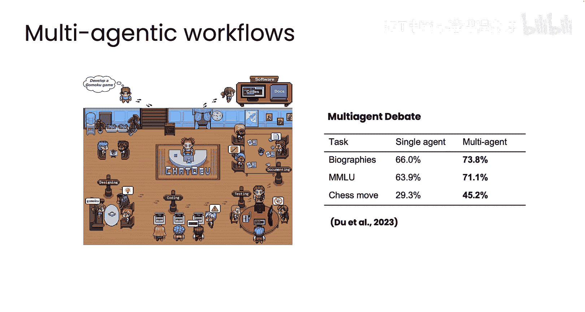

代理式AI：模块1-5：代理工作流设计模式 🧩

在本节课中，我们将学习如何将基础构建模块组合起来，构建复杂的代理工作流。我们将介绍四种关键的设计模式，它们能帮助你思考如何将这些模块整合成更强大的工作流。

---

### 概述

我们通过组合基础构建模块，来编排复杂的代理工作流。本节将分享几种关键的设计模式，它们为如何组合这些模块提供了清晰的思路。

---

### 四种关键设计模式

构建代理工作流的四种关键设计模式是：**反思**、**工具使用**、**规划**和**多代理协作**。下面我们将简要介绍它们的含义，后续课程会深入探讨其中大部分模式，并辅以代码示例。

---

#### 反思模式

第一种主要设计模式是**反思**。例如，我可以要求一个语言模型代理编写代码，它可能会生成如下代码：

```python
def some_task():
    # 执行某项任务的Python函数
    ...
```

然后，我可以构建一个提示词，内容如下：
> “这段代码旨在完成某项任务。[此处粘贴模型刚输出的代码]。请仔细检查代码的正确性、风格和效率，并提出建设性批评。”

事实证明，同一个语言模型在被这样提示后，可能能够指出代码中的一些问题。如果我将这些批评反馈给模型，并说：“这里有一个错误，你能修改代码来修复它吗？”，那么它可能会生成一个更好的代码版本。

为了预览工具的使用，如果你能运行代码并查看其失败之处，然后将这些信息反馈给语言模型，也能促使它迭代并生成更好的版本（例如V3版本）。

因此，反思是一种常见的设计模式，你可以要求语言模型检查自己的输出，或者引入一些外部信息源（例如运行代码并查看是否产生错误信息），并以此作为反馈进行迭代，从而产生更好的输出版本。这个设计模式很巧妙，虽然不能保证每次都100%成功，但有时能显著提升系统的性能。

在上面的描述中，我假设是向同一个模型进行提示。为了预示多代理工作流，你也可以想象不是让同一个模型自我批评，而是有一个**批评者代理**。这本质上是一个被赋予了特定指令（例如“你的角色是代码审查员。这是一段旨在完成某项任务的代码，请仔细检查...”）的语言模型。第二个批评者代理可能会指出错误或对单元测试进行排序。这就像拥有两个独立的代理，每个代理只是一个被赋予特定角色的语言模型，让它们来回交互迭代以获得更好的输出。

---

#### 工具使用模式

除了反思模式，第二个重要的设计模式是**工具使用**。如今，语言模型可以被赋予工具（即可调用的函数）来完成任务。

例如，如果你问一个语言模型：“根据评论，最好的咖啡机是什么？”，并赋予它网络搜索工具，那么它实际上可以搜索互联网以找到更好的答案。或者，如果你问一个数学问题，比如“如果投资100美元，复利计算...”，并赋予它代码执行工具，那么它可以编写并执行代码来计算答案。

如今，不同的开发者已经为语言模型提供了许多不同的工具，涵盖数学、数据分析、通过网络或各种数据库获取信息、与电子邮件和日历等生产力应用交互，以及处理图像等等。语言模型决定使用何种工具（即调用哪些函数）的能力，使得模型能够完成更多工作。

---

#### 规划模式

四种设计模式中的第三种是**规划**。这是一个来自名为“HuggingGPT”论文的例子。如果你要求一个系统：“请生成一张女孩读书的图片，姿势要与这张男孩的图片相同。然后用新的声音描述这张图片。”那么，模型可以自动决定，为了执行此任务，它首先需要找到一个姿势确定模型来识别男孩的姿势，然后根据姿势生成女孩的图片，接着为图片生成文本描述，最后将文本转换为语音。

在规划中，语言模型决定它需要采取的一系列行动步骤（在本例中是一系列API调用），以便以正确的顺序执行正确的步骤来完成任。因此，这不同于开发者预先硬编码步骤序列，而是让语言模型自行决定要采取的步骤。目前，能够规划的代理更难控制，且更具实验性，但有时能产生非常令人满意的结果。

---

#### 多代理协作模式

最后是**多代理工作流**。正如人类经理可能会雇佣多人共同完成一个复杂项目一样，在某些情况下，雇佣一组多个代理（每个代理专精于不同的角色）并让它们协作完成复杂任务可能是有意义的。

你在这里看到的左侧图片取自一个名为“ChatDev”的项目。在ChatDev中，多个具有不同角色（如首席执行官、程序员、测试员、设计师等）的代理，像一个虚拟软件公司一样协作，可以共同完成一系列软件开发任务。

让我们考虑另一个例子。如果你想撰写一份营销手册，你可能会考虑雇佣一个三人团队：一名研究员进行在线研究，一名营销人员撰写营销文案，最后一名编辑进行润色和修改。

类似地，你可以考虑构建一个多代理工作流，其中包含一个模拟的研究员代理、一个模拟的营销人员代理和一个模拟的编辑代理，它们共同为你完成这项任务。多代理工作流更难控制，因为你无法总是提前预知代理会做什么，但研究表明，对于许多复杂任务（如撰写传记或决定国际象棋走法），它们能带来更好的结果。在本课程后续部分，你也会学到更多关于多代理工作流的内容。

---



### 总结

本节课中，我们一起学习了代理工作流能做什么，以及寻找构建模块并将其组合起来（可能通过这些设计模式）以实现代理工作流的关键挑战。当然，还包括开发评估方法，以便了解系统表现如何并持续改进。


在下一个模块中，我将深入介绍这些设计模式中的第一个——**反思模式**。你会发现，这是一种实现起来可能出奇简单的技术，有时能显著提升系统的性能。让我们进入下一个模块，学习反思设计模式。