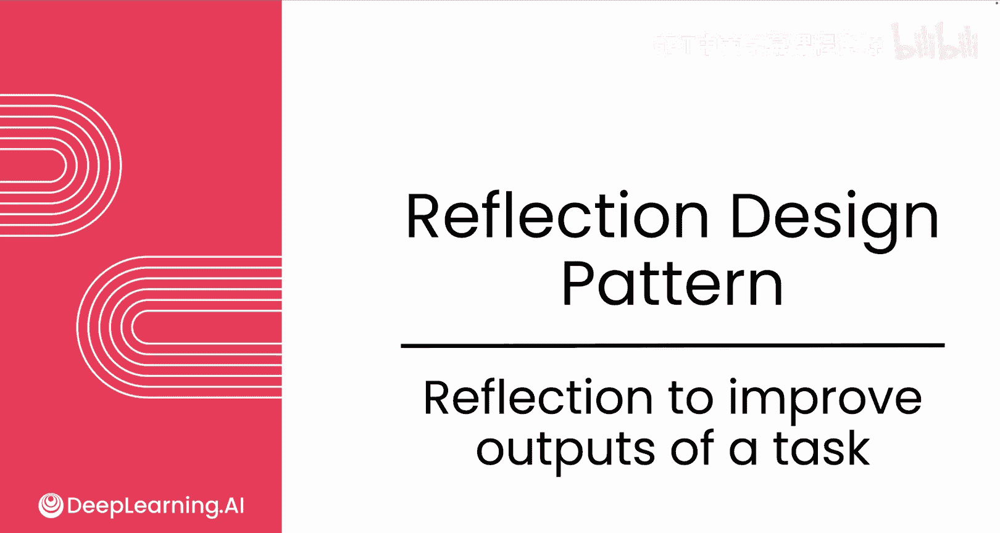
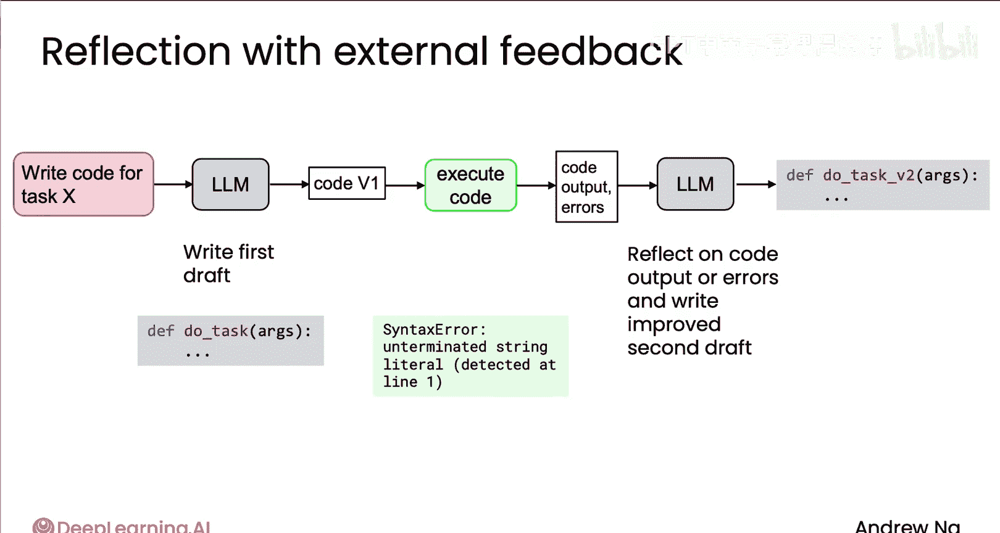

# 008：反思设计模式

在本节课中，我们将要学习一种名为“反思设计模式”的技术。这种模式借鉴了人类自我检查、改进输出的行为，并将其应用于大型语言模型，以帮助模型生成更高质量的结果。我们将通过编写邮件和代码的具体例子，来理解其工作原理和实现方法。

## 反思模式的基本原理

正如人类有时会反思自己的产出并找到改进方法一样，AI代理也可以做到这一点。

例如，我可能会快速起草一封邮件，初稿可能并不完美。当我重读时，可能会发现一些问题：比如“下个月”这个时间表述不清，Tommy哪天有空吃饭不明确；邮件中可能存在拼写错误；我可能还忘了署名。这些反思能让我修改草稿，使其更具体、更准确，例如改为：“Tommy，你5号到7号有空一起吃晚饭吗？”

## 实现反思模式的工作流程

以下是实现反思模式的一个典型工作流程。

1.  **生成初稿**：首先，提示一个大型语言模型生成任务的初稿。例如，生成邮件的第一版 `email_v1`。
2.  **进行反思**：然后，将初稿（可以传递给同一个模型，也可以是另一个模型）连同新的提示一起输入，要求模型对初稿进行反思和改进。
3.  **输出改进版**：模型基于反思，生成一个改进后的第二版输出，例如 `email_v2`。

在这个例子中，我硬编码了工作流：先提示模型生成，再提示同一个模型进行反思和改进，最终得到 `email_v2`。

## 反思模式的应用扩展

事实证明，类似的过程可以用来改进其他类型的输出。

例如，如果你让语言模型编写代码，你可以提示它编写完成某项任务的代码，它会给出代码的初版 `v1`。然后，你可以将这段代码传递给同一个模型或另一个不同的模型，要求它检查错误并写出改进后的第二版代码。

不同的模型有不同的优势，因此有时我会选择不同的模型来分别负责“生成初稿”和“反思改进”。例如，推理模型（有时也称为思维模型）通常更擅长发现错误。因此，我有时会用直接生成模型来编写代码初稿，然后用一个推理模型来检查错误。

## 结合外部反馈的增强反思

然而，不仅仅是让语言模型自行反思代码，如果能引入外部反馈——即来自语言模型之外的新信息——反思过程会变得强大得多。

对于代码而言，一个有效的方法是直接执行它，观察代码的运行结果。通过检查输出（包括任何错误信息），你能为语言模型的反思提供极其有用的信息。

在这个例子中，模型生成了代码初稿，但当我运行它时，产生了语法错误。当你将这段代码、其输出和错误日志反馈给语言模型，并要求它基于这些反馈进行反思并写出新草案时，模型就获得了大量非常有用的信息，从而能够生成质量高得多的代码第二版 `version2`。

## 设计考量与总结

反思设计模式非常有效。它并不能保证语言模型每次都能100%正确，但通常能显著提升其表现。

但需要记住的一个设计考虑是：**当反思过程能够获取新的、额外的外部信息时，它会变得强大得多**。

在本例中，如果你能运行代码，并将代码输出或错误信息作为反思步骤的额外输入，这就能让模型进行更深入的反思，找出问题所在（如果有的话），从而产生比没有这些外部信息时好得多的代码第二版。

因此，请记住：**每当反思有机会获得额外信息时，其效果都会大大增强**。

本节课中，我们一起学习了反思设计模式。我们了解了其模仿人类反思行为的基本原理，探讨了从生成初稿到反思改进的标准工作流程，并看到了它在邮件撰写和代码编写中的具体应用。最重要的是，我们认识到结合外部反馈（如代码执行结果）能极大增强反思的效果，帮助AI代理产出更可靠、更准确的成果。