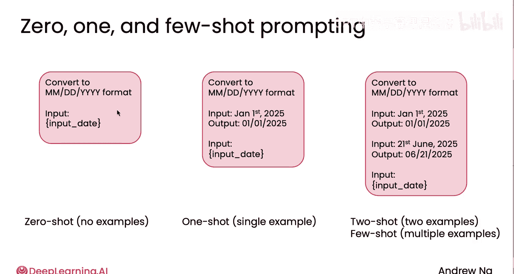
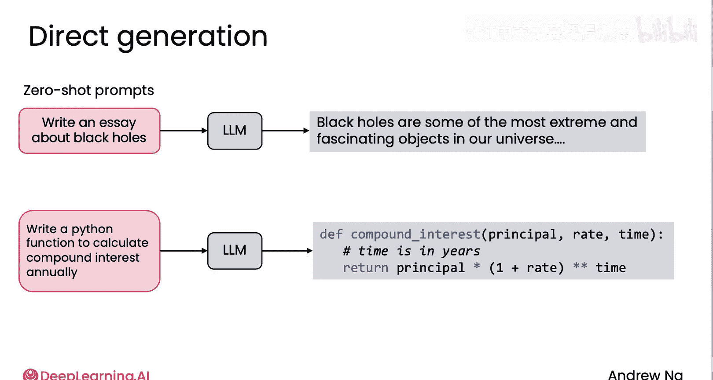
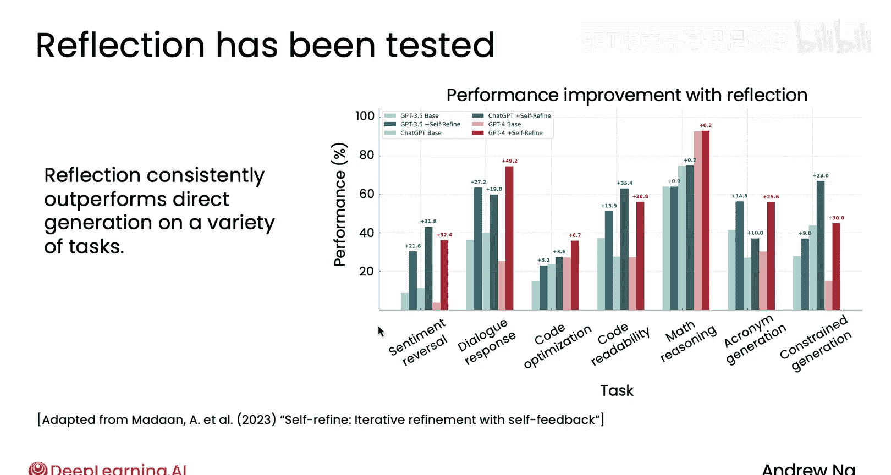
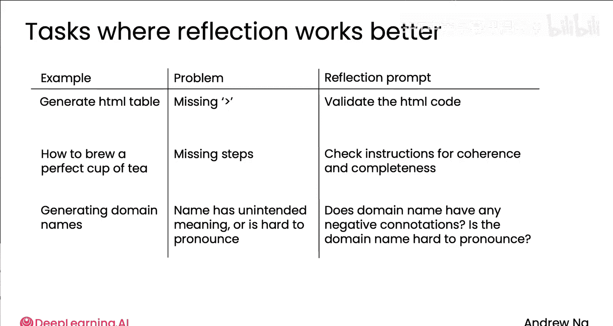
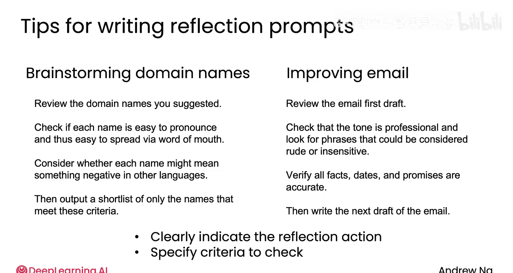

# 009：为什么不是直接生成？

在本节课中，我们将要学习为什么在构建AI代理时，我们更倾向于使用“反思”工作流，而不是简单地让模型一次性直接生成答案。

## 概述：直接生成与反思

上一节我们介绍了AI代理的基本概念，本节中我们来看看两种不同的生成方式：直接生成与反思。直接生成是一种简单的方法，而反思则通过多步骤的自我检查来提升输出质量。

直接生成是指你向大语言模型（LLM）提供一个指令，让它一次性生成最终答案。

例如：
*   你要求LLM写一篇关于黑洞的文章，它直接生成文本。
*   你要求LLM编写一个计算复利的Python函数，它直接生成代码。

你在这里看到的提示词示例也被称为**零样本提示**。

让我解释一下零样本的含义。与零样本提示相对的一种相关方法是在你的提示词中包含一个或多个你期望的输出示例，这被称为**单样本提示**（如果你在提示词中包含一个期望的输入-输出对示例）或**少样本提示**（取决于你在提示词中包含多少个这样的示例）。

因此，**零样本提示**指的是如果你包含零个示例，即不包含任何期望输出的示例。

但如果你还不熟悉这些术语，请不要担心。重要的是，在你这里看到的例子中，你只是提示LLM一次性直接生成答案，我也称之为零样本提示，因为我们包含了零个示例。

## 反思的优势

事实证明，多项研究表明，反思在各种任务上都能提升直接生成的性能。

下图改编自Madan等人的研究论文，它展示了在不同模型上、使用或不使用反思来实现的一系列不同任务。

阅读此图的方法是查看这些相邻的浅色和深色条形图对，其中浅色条形图表示零样本提示，深色条形图表示同一模型但使用了反思，而蓝色、绿色和红色表示使用不同模型（如GPT-3.5和GPT-4）进行的实验。

你可以看到，对于许多应用，代表使用反思的深色条形图明显高于浅色条形图。当然，具体效果可能因你的特定应用而异。

以下是反思可能有所帮助的更多例子：

以下是反思可能派上用场的一些场景：

*   **生成结构化数据**：例如生成HTML表格时，输出格式有时可能不正确。因此，一个用于验证HTML代码的反思提示可能会有所帮助。如果是基本的HTML，这可能帮助不大，因为模型本身就很擅长生成基本HTML。但特别是当你需要更复杂的结构化输出时，比如可能具有大量嵌套的JSON数据结构，反思更有可能发现错误。
*   **生成步骤序列**：如果你要求LLM生成一系列步骤来完成某项指令，例如如何冲泡一杯完美的茶，LLM可能会遗漏步骤。一个要求检查指令连贯性和完整性的反思提示可能有助于发现错误。
*   **生成域名**：这是我实际参与过的工作，使用LLM生成域名。有时它生成的名称可能带有 unintended 的含义，或者可能非常难发音。因此，我使用反思提示来双重检查域名是否有任何有问题的含义，或者名称是否难发音。我们团队的一个AI产品实际上就曾帮助为我们合作的初创公司构思域名。

## 如何编写反思提示

我想向你展示几个用于构思域名的反思提示示例。

你可能会要求它：
*   审查你建议的域名。
*   检查每个名称是否易于发音。
*   检查每个名称在英语或其他语言中是否可能意味着负面含义。
*   然后输出满足这些标准的候选名称简短列表。

或者，为了改进一封电子邮件，你可以编写一个反思提示，告诉它：
*   审查邮件的初稿。
*   检查语气。
*   核实事实、日期和承诺是否准确（这在LLM已被输入大量事实和数据以撰写邮件草稿的上下文中是合理的，这些信息将作为LLM上下文的一部分提供）。
*   然后，根据它发现的任何问题，撰写邮件的下一稿。

以下是一些编写反思提示的技巧：

*   明确表示你希望它审查或反思输出的初稿。
*   如果可能，明确指定标准，例如域名是否易于发音、是否可能有负面含义，或者对于邮件，检查语气和核实事实。这可以更好地指导LLM按照你最关心的标准进行反思和评判。

我发现学习编写更好提示的方法之一是阅读大量其他人编写的提示。有时我甚至会下载开源软件，去找那些我认为做得特别好的软件中的提示词，只是为了阅读作者编写的提示。

## 总结与预告

本节课中我们一起学习了直接生成与反思工作流的区别。我们了解到，虽然直接生成（零样本提示）简单快捷，但引入反思步骤可以通过自我审查和批判性思考，在生成结构化数据、复杂指令或需要创意筛选（如域名）等任务上，显著提高输出的准确性和质量。编写有效的反思提示需要清晰指明反思对象和具体的评估标准。

希望你现在对如何编写基本的反思提示有了概念，甚至可以在自己的工作中尝试，看看它是否能帮助你获得更好的性能。

在下一个视频中，我将分享一个有趣的例子，我们将开始研究多模态输入在AI代理中的应用，看看算法如何对生成的图像或图表进行反思。

😊，让我们一起来看看吧。