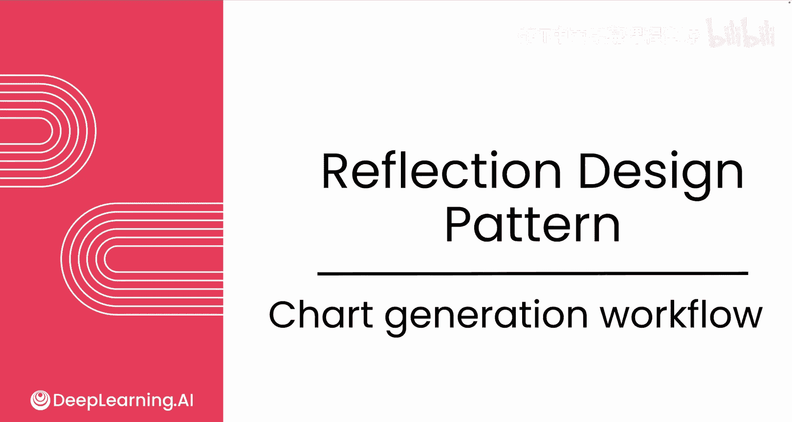
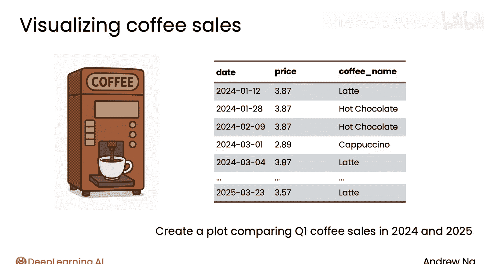
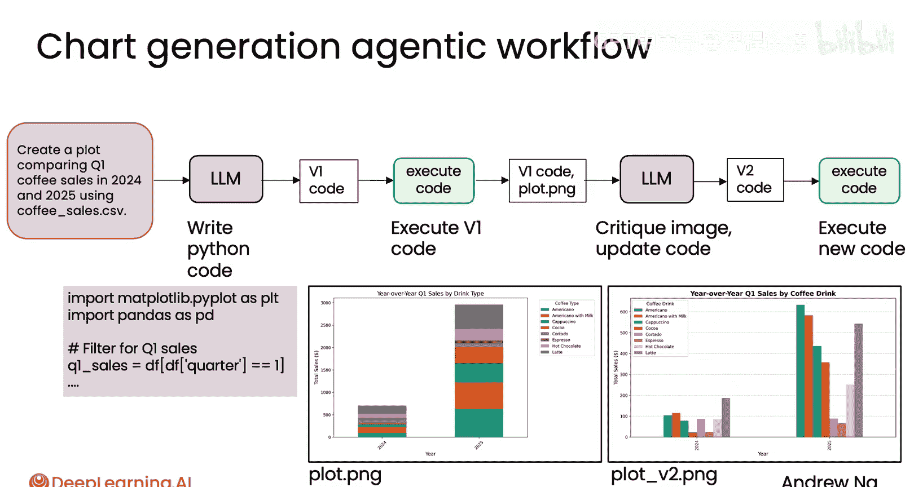
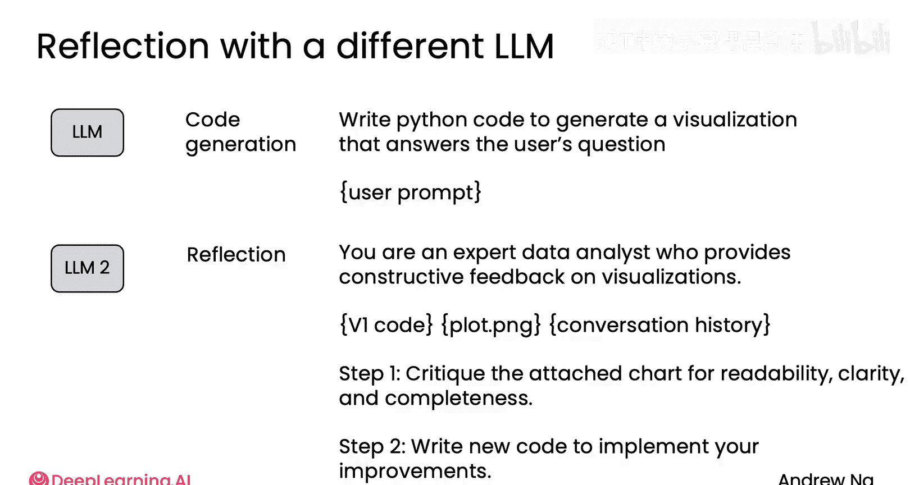

# 010：图表生成工作流 📊

在本节课中，我们将学习一个图表生成工作流。我们将看到如何使用智能体（Agent）来生成美观的图表，并了解“反思”（Reflection）技术如何显著提升输出结果的质量。



## 概述

在本模块的实践项目中，你将体验一个图表生成工作流。该工作流利用智能体来生成美观的图表。事实证明，引入反思环节可以显著改善其输出质量。让我们开始探索。

## 工作流示例

假设我们有一份咖啡机的销售数据，记录了拿铁、热巧克力、卡布奇诺等不同饮品的销售时间和价格。

我们的目标是让一个智能体创建一个图表，用于比较2024年和2025年第一季度的咖啡销售额。

一种直接的方法是编写一个提示词（Prompt），要求大语言模型（LLM）利用存储在CSV文件（即逗号分隔值表格文件）中的数据，生成一个比较2024年和2025年第一季度咖啡销售额的图表。

大语言模型可能会编写类似下面的代码来生成图表：



```python
# 示例代码：生成堆叠柱状图
import pandas as pd
import matplotlib.pyplot as plt

# 读取数据
data = pd.read_csv('coffee_sales.csv')
# ... 数据处理与图表生成代码 ...
```

如果执行这段V1版本的代码，可能会生成一个类似下图的图表：


当我第一次运行模型输出的代码时，它生成了这个图表。这是一个堆叠柱状图，但这种方式并不易于直观比较数据，图表本身看起来也不够理想。

## 引入反思环节

接下来，我们可以将V1版本的代码以及这段代码生成的图表，输入给一个多模态模型（即一个也能接受图像输入的大语言模型）。

然后，我们要求该模型检查这张由代码生成的图像，对其进行批判性分析，找出生成更佳可视化效果的方法，并更新代码以生成更清晰、更好的图表。



多模态大语言模型具备视觉推理能力，因此可以直观地审视这张图，找出改进的方法。

当我这样做时，模型实际上生成了一个条形图。这个条形图将2024年和2025年的咖啡销售额分开显示，相比之前的堆叠柱状图，我认为这种方式更令人愉悦且更清晰。


## 模型选择策略

在编码实践中，你可以自由尝试不同的问题，看看是否能得到视觉效果更好的图表。因为不同的大语言模型各有优缺点。

有时，我会为初始生成和反思环节使用不同的大语言模型。

例如，你可以用一个模型（如GPT-4或GPT-5等）来生成初始代码。只需给出类似“编写Python代码以生成可视化图表”这样的提示词。

然后，反思提示词可能是这样的：要求模型扮演专家数据分析师的角色，提供建设性反馈。接着，给它V1版本的代码、生成的图表，或许还包括生成代码时的对话历史。要求它根据**可读性、清晰度和完整性**等特定标准进行批判。提供具体标准有助于模型更好地理解需要做什么。最后，要求它编写新的代码来实现改进。

你可能会发现，有时使用具备推理能力的模型进行反思，效果可能优于非推理模型。因此，当你为初始生成和反思环节尝试不同模型时，可以尝试切换或组合不同的配置。希望你在编码实践中获得乐趣。

## 反思的实际效果

现在，当你构建应用程序时，可能会思考一个问题：反思是否真的能提升你在特定应用上的性能？

根据多项研究，反思在某些应用上能略微提升性能，在某些应用上能大幅提升，而在另一些应用上可能几乎没有效果。因此，了解反思对你具体应用的影响非常有用，它也能指导你如何调整初始生成或反思的提示词，以尝试获得更好的性能。

## 总结



本节课中，我们一起学习了图表生成工作流。我们看到了如何利用智能体生成图表，并重点介绍了通过引入**反思**环节，让多模态模型分析初始输出并提出改进方案，从而显著提升图表质量的方法。我们还讨论了为初始生成和反思步骤选择不同模型的策略。理解反思在你特定任务上的效果，是优化智能体工作流的关键一步。