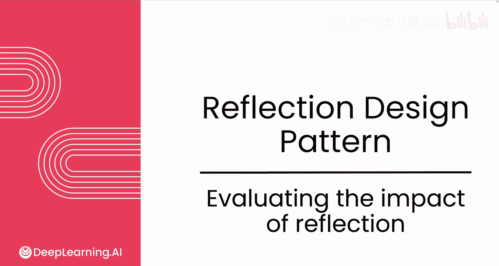
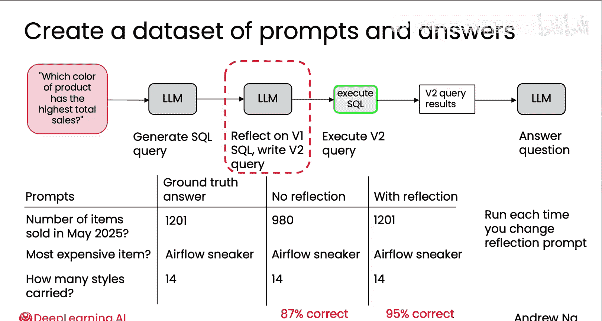
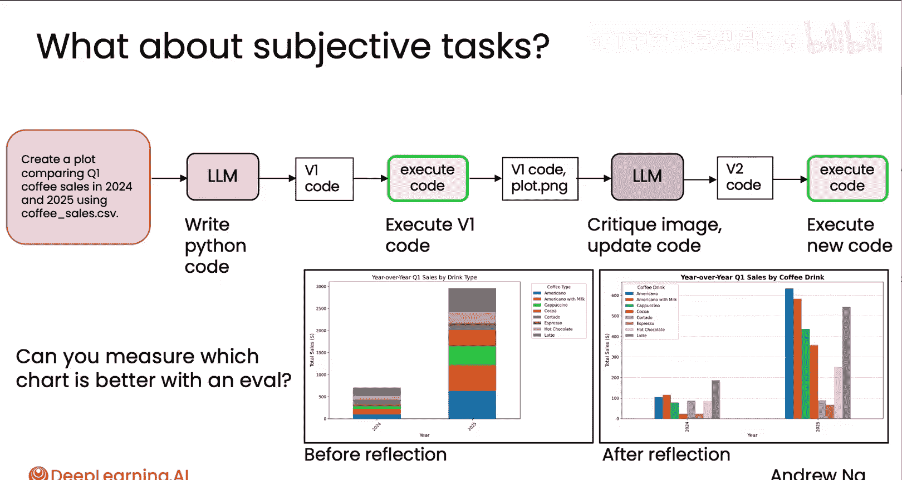
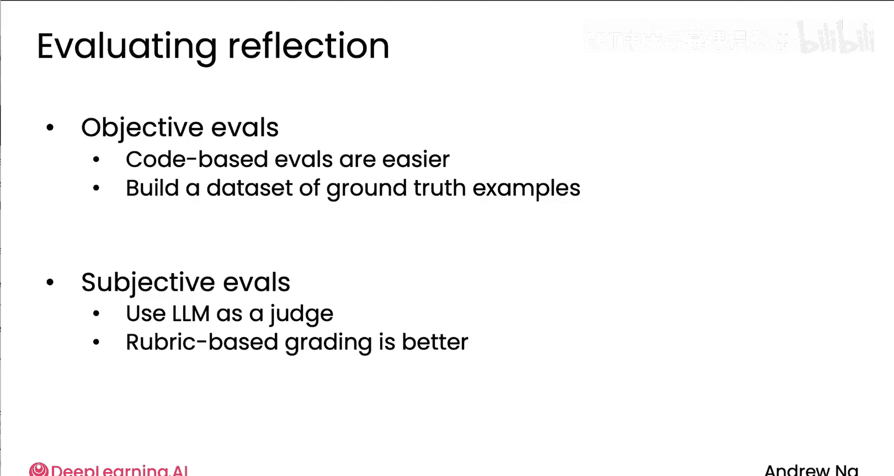

# 011：评估反思机制的影响 📊

在本节课中，我们将学习如何评估反思机制对AI代理工作流程性能的实际影响。我们将探讨两种主要的评估方法：基于客观标准的评估和基于主观标准的评估，并了解如何通过系统化的评估来优化提示词和整体工作流程。

---



## 概述

反思机制通常能提升系统的性能，但在决定保留它之前，我们通常需要双重检查它实际带来了多少提升，因为它需要额外的步骤，可能会稍微降低系统速度。让我们来看看如何为反思工作流程构建评估体系。

## 客观评估：数据库查询示例

上一节我们介绍了反思的基本概念，本节中我们来看看一个具体的评估案例。假设你经营一家零售店，可能会收到诸如“哪种颜色的产品总销售额最高？”之类的问题。为了回答这个问题，你可能会让一个大语言模型生成一个数据库查询语句（例如SQL查询）。

但生成查询后，我们不是直接用它从数据库获取信息，而是让同一个或另一个大语言模型对第一版的查询进行反思和改进，生成一个可能更优的版本。

**工作流程公式**：
```
1. 用户提问 -> 2. LM生成初始查询 -> 3. LM反思并改进查询 -> 4. 执行改进后的查询 -> 5. LM根据查询结果生成最终答案
```

为了评估“使用第二个LM来反思和改进SQL查询”是否真的能改善最终输出，我们可以采取以下步骤：

以下是构建客观评估的步骤：
1.  **收集测试集**：收集一组问题（提示词）及其对应的标准答案。例如：“2025年5月售出了多少件商品？”、“库存中最贵的商品是什么？”、“我的商店有多少种款式？”。
2.  **运行无反思流程**：仅使用第一个LM生成的SQL查询来获取答案。
3.  **运行有反思流程**：使用经过第二个LM反思改进后的SQL查询来获取答案。
4.  **计算正确率**：分别计算两种流程下答案的正确百分比。

在这个例子中，假设无反思的正确率为87%，而有反思的正确率提升至95%。这表明反思机制显著提高了数据库查询的质量，从而更准确地获取答案。

开发者经常做的另一件事是重写反思提示词。例如，你可能想在反思提示中加入“让数据库查询运行更快”或“让查询更清晰”的指令。一旦建立了上述评估体系，你就可以快速尝试不同的提示词创意，并通过测量系统正确率的变化，来判断哪种提示词对你的应用最有效。





## 主观评估：图表生成示例

然而，并非所有应用都像数据库查询那样有明确的对错。在之前关于反思的视频中，我们看到了一个图表生成的例子：无反思时生成了堆叠条形图，有反思后生成了另一种图表。但我们如何知道哪个图表更好呢？这更像是一个主观标准，而非纯粹的黑白分明的客观标准。

对于这类主观标准，一种方法是使用大语言模型作为“裁判”。一个基础的做法可能是将两张图表输入一个能接收多张图像的多模态大语言模型，然后直接问“哪张图更好？”。但事实证明，这种方法效果不佳。

以下是使用LM作为裁判时可能遇到的问题：
*   **答案质量不稳定**：裁判LM的答案可能不够好。
*   **对提示词措辞敏感**：裁判LM的判断可能高度依赖于提示词的具体措辞。
*   **与人类判断不一致**：裁判LM的排名顺序可能与人类专家的判断不太相符。
*   **存在位置偏见**：许多LM往往会更频繁地选择第一个选项，无论其内容如何。

与其让LM直接比较两个输入，**提供一个评分标准（Rubric）来评估单个输入通常能得到更一致的结果**。

你可以这样提示LM：“根据以下质量评分标准评估所附图像”。评分标准可以包含几个清晰的判断维度，例如：
*   图表是否有清晰的标题？
*   坐标轴标签是否清晰？
*   选择的图表类型是否合适？

事实证明，与其让LM在1到5的尺度上打分（其校准通常不佳），不如给它5个二元判断标准（是/否），然后汇总这些分数得到一个1到5（或1到10）的分数，这样往往能得到更一致的结果。

因此，我们可以收集一批用户查询（例如10-15个），让系统分别生成无反思和有反思的图表，然后使用上述评分标准为每张图像打分，从而检查有反思生成的图像是否真的比无反思的更好。

一旦建立了这样一套评估体系，如果你想更改初始生成提示词或反思提示词，也可以重新运行评估，看看更新后的提示词是否能让系统生成根据该评分标准得分更高的图像。这为你持续优化提示词以获得更好性能提供了一种方法。

## 总结与对比

本节课中我们一起学习了如何为反思机制构建评估体系。在构建反思或其他智能体工作流程的评估时，你可能会发现：



*   **对于有客观标准的任务**，基于代码的评估通常更容易管理。就像数据库查询的例子，我们建立了一个包含标准输入输出的测试集，并编写代码来统计系统生成正确答案的频率。
*   **对于主观性较强的任务**，你可能会使用LM作为裁判，但这通常需要更多的调试，例如需要仔细思考使用什么样的评分标准，才能使作为裁判的LM判断更准确、更可靠。

掌握如何进行良好的评估，对于有效构建智能体工作流程至关重要。在后续视频中我们还会深入探讨这一点。

现在你已经了解了如何使用反思机制，下一节视频我们将深入探讨其中一个方面：**如何从外部获取额外信息来显著提升反思的效果**。让我们在下一个视频中继续学习。