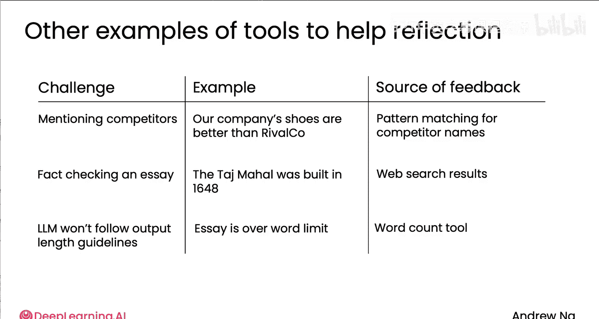

# 012：使用外部反馈进行反思 🚀

在本节课中，我们将要学习如何利用外部反馈来增强AI代理的反思能力，从而显著提升其输出质量。我们将探讨外部反馈相较于仅使用语言模型内部反思的优势，并通过具体示例理解其应用方法。

## 外部反馈的优势

上一节我们介绍了反思的概念。本节中我们来看看，如果能够获取外部反馈，其效果将远胜于仅依赖语言模型自身进行的反思。

当我们构建应用程序时，如果仅通过提示工程进行直接生成（零样本提示），性能随提示调整的变化可能呈现如下趋势：初期，随着提示的优化，性能会有所提升；但一段时间后，性能会趋于平缓或达到瓶颈。即使继续调整提示，也很难获得显著的性能提升。

与其将所有时间浪费在调整提示上，有时更好的做法是在流程的早期阶段就引入反思机制。这有时能带来性能上的提升，幅度或大或小，取决于任务的复杂性。

然而，如果能够在反思的基础上引入外部反馈，情况将大为不同。外部反馈意味着语言模型获得的不再是基于原有信息的重复思考，而是全新的外部信息。随着我们继续优化提示和调整外部反馈机制，最终可能达到一个更高的性能水平。

因此，如果你正在进行提示工程，并感觉努力带来的回报正在递减，即调整大量问题后性能提升有限，那么可以考虑引入反思机制。如果能有外部反馈介入，则效果更佳，这有望将性能曲线从平缓的红色轨迹，推向一个更高的改进轨道。

## 外部反馈的示例

以下是几个具体的例子，说明软件代码或工具如何创造新信息来辅助反思过程。

**1. 代码执行反馈**
我们之前看到，对于编写代码的任务，一个反馈来源是直接执行代码，观察其生成的输出或错误信息，并将这些输出反馈给语言模型。模型利用这些新信息进行反思，然后据此编写新版本的代码。

**2. 内容审查与模式匹配**
如果你使用AI撰写邮件，而邮件中有时会提及竞争对手的名字，你可以编写代码或构建一个软件工具（例如通过正则表达式进行模式匹配）来搜索输出中的竞争对手名称。一旦发现，就将此信息作为批评性输入反馈给AI。这是非常有用的信息，可以指示AI重写文本，避免提及这些竞争对手。

**3. 事实核查与网络搜索**
另一个例子是使用网络搜索或查阅其他可信来源来对文章进行事实核查。假设你的研究代理写道：“泰姬陵建于1648年。”严格来说，泰姬陵实际上于1631年动工，1648年竣工。这个说法虽非完全错误，但未能准确反映历史。为了更准确地描述这座美丽建筑的建造时间，你可以进行网络搜索，获取解释泰姬陵具体建造时期的文本片段，并将其作为额外输入提供给反思代理。这样，它就能利用这些信息写出关于泰姬陵历史的更好版本。

**4. 字数统计与格式限制**
最后一个例子，如果你使用语言模型撰写文案（如博客文章或研究论文摘要），但其输出有时会超出字数限制。语言模型目前仍不擅长精确控制字数。此时，你可以实现一个字数统计功能，编写代码来精确计算单词数量。如果超出限制，就将该字数统计结果反馈给语言模型，并要求其重试。这有助于它更准确地达到你期望的输出长度。

在上述三个例子中，你都可以编写一段代码来帮助发现关于初始输出的额外信息（无论是发现的竞争对手名称、网络搜索到的信息还是精确的字数），然后将这些事实反馈给反思用的语言模型，以期它能更好地思考如何改进输出。

## 总结与展望

本节课中，我们一起学习了外部反馈在增强AI代理反思能力中的强大作用。反思本身已是一个强大的工具，而结合外部反馈则能将其效能提升到新的高度。

在下一个模块中，我们将在此基础上进一步探讨，除了你刚才看到的几个工具示例外，如何系统地让你的AI代理调用不同的函数。这将使你的代理应用程序变得更加强大。

希望你对反思的学习有所收获。期待在下一个视频中与你再见。