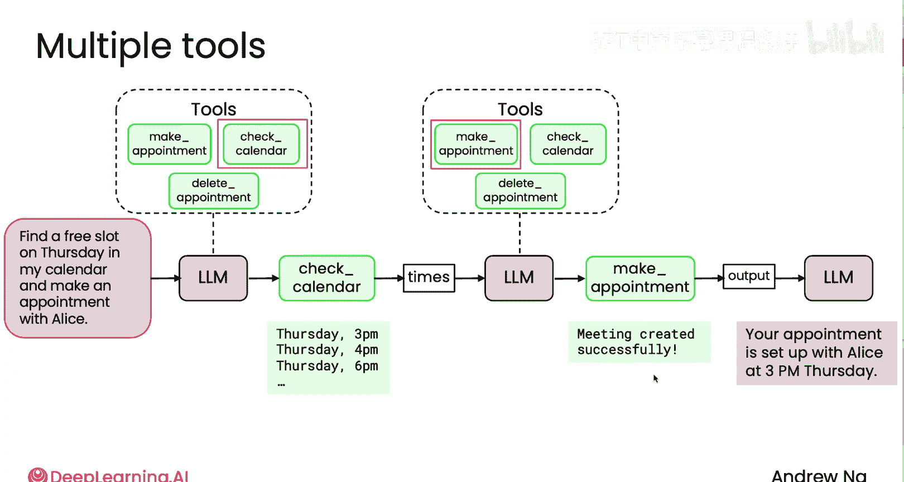

# 013：什么是工具 🛠️

在本节课中，我们将要学习代理式AI中的一个核心概念：**工具**。我们将了解什么是工具，为什么它们对大型语言模型（LLM）至关重要，以及如何通过赋予LLM调用工具的能力来构建更强大的应用程序。

## 概述

正如人类使用工具可以完成远超徒手能力范围的事情一样，大型语言模型在获得工具访问权限后，其能力也能得到极大扩展。本节课程将解释“工具使用”的概念，展示其工作原理，并通过具体例子说明工具如何帮助LLM生成更准确、更有用的回答。

## 什么是工具使用？

上一节我们介绍了代理式AI的基本概念，本节中我们来看看一个关键机制：**工具使用**。

工具使用指的是让您的大型语言模型（LLM）自行决定何时需要请求调用一个函数来执行某项操作、获取某些信息或完成其他任务。这就像人类使用锤子、扳手等工具来增强自身能力。对于LLM而言，我们提供的“工具”就是一些函数，当LLM认为有必要时，可以请求调用这些函数。

**核心概念**：`工具 = 提供给LLM并可让其请求调用的函数`

## 工具使用的工作原理

以下是工具使用的基本工作流程：

1.  **输入提示**：用户向LLM提出问题。
2.  **工具决策**：LLM查看可用的工具集，并决定是否需要调用某个工具。
3.  **工具调用**：如果决定调用，LLM会请求执行相应的函数（工具）。
4.  **结果返回**：被调用的函数执行并返回结果，该结果会被添加回对话历史中。
5.  **生成输出**：LLM结合原始问题、自身知识以及工具返回的结果，生成最终的回答。

为了直观表示LLM被赋予了使用工具的选项，我们将在图表中使用一个**带有虚线框的LLM图标**。这个虚线框表示我们为LLM提供了一组工具，供其在认为适当时选择使用。

## 一个简单的例子：获取当前时间

让我们通过一个具体例子来理解。如果您询问一个可能在数月前训练完成的LLM“现在几点了？”，由于训练模型本身并不知道精确的当前时间，它可能会回答：“抱歉，我无法获取当前时间。”

但是，如果您编写一个 `get_current_time()` 函数，并赋予LLM调用此函数的权限，那么它就能给出更有用的答案。

**工作流程示例**：
1.  用户提问：“现在几点了？”
2.  LLM（拥有 `get_current_time` 工具）决定调用该工具。
3.  `get_current_time()` 函数执行，返回结果，例如 “3:20 PM”。
4.  该结果被反馈给LLM。
5.  LLM 生成最终输出：“现在是下午3点20分。”

**重要特性**：工具的使用是由LLM自主决定的。对于同一个设置了时间工具的LLM，如果您问“绿茶含有多少咖啡因？”，LLM知道回答这个问题不需要当前时间，因此会直接生成答案，而不会调用 `get_current_time` 函数。

## 工具如何提升应用能力

赋予LLM工具访问权限能显著提升其回答质量。以下是一些例子：

*   **网络搜索**：如果用户问“你能找到加州山景城附近的一些意大利餐厅吗？”，一个拥有网络搜索工具的LLM可以调用搜索引擎获取实时信息，并据此生成回答。
*   **数据库查询**：如果您经营一家零售店，LLM被赋予查询数据库的工具，那么对于“给我看看买了白色太阳镜的顾客”这类问题，LLM可以查找销售记录并生成报告。
*   **专业计算**：对于“如果以5%的年利率存入1000美元，10年后我会得到多少钱？”这样的财务问题，LLM可以调用利息计算工具来获得精确答案。另一种方法是让LLM编写并执行一段计算代码，例如 `1000 * (1 + 0.05)**10`，这本身也是一种工具使用。

作为开发者，您需要根据应用程序的目标任务来设计和创建相应的工具。无论是餐厅查询、零售问答还是财务助理，都需要提供合适的工具集。

## 多工具协作示例

到目前为止，我们看到的例子大多只涉及一个工具。但在许多实际用例中，您需要为LLM提供多个工具，让它根据情况选择调用。

假设我们正在构建一个**日历助手代理**。用户提出请求：“请在我的日历中查找周四的空闲时段，并安排一个与Alice的约会。”

为了实现这个请求，我们可能需要为LLM提供以下工具（函数）：
*   `check_calendar()`：查看日历中的空闲时间。
*   `make_appointment()`：发送日历邀请，创建新日程。
*   `delete_appointment()`：取消已有的日历条目。

以下是LLM可能执行的步骤序列：

1.  LLM首先决定，在可用工具中，它应该先使用 `check_calendar` 函数来查看我周四何时有空。
2.  该函数返回空闲时段（例如“下午2点至4点”），结果反馈给LLM。
3.  LLM接着决定下一步：选择一个具体时间（比如下午3点），然后调用 `make_appointment` 函数向Alice发送日历邀请。
4.  该函数返回操作成功的确认信息，并反馈给LLM。
5.  最后，LLM生成最终输出告诉用户：“您与Alice的约会已安排在周四下午3点。”

这个例子展示了LLM如何通过自主决策，按顺序调用多个工具来完成一个复杂的多步骤任务。

## 总结

本节课中我们一起学习了**工具使用**这一核心概念。我们了解到：
*   工具是提供给LLM并可让其请求调用的函数。
*   工具使用让LLM能够获取实时信息、执行特定操作，从而极大地扩展了其能力边界。
*   LLM会自主决定是否需要调用工具，以及调用哪个工具。
*   开发者需要根据应用场景设计和实现相应的工具集。
*   通过组合多个工具，可以构建出能够处理复杂、多步骤任务的智能代理。

能够为您的LLM提供工具访问权限是一件非常重要的事情，它将使您的应用程序变得更加强大。在下一个视频中，我们将具体看看如何编写函数、创建工具，并将它们提供给您的LLM使用。