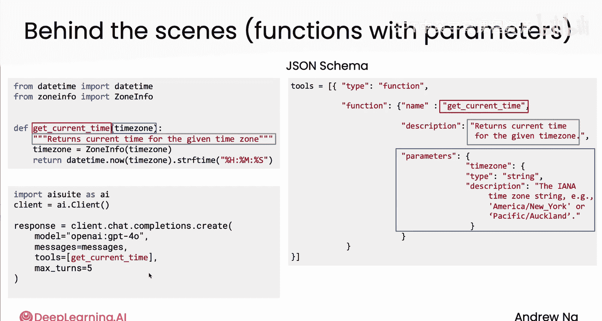

# 015：工具调用语法 🛠️

在本节课中，我们将学习如何编写代码，使你的大语言模型（LLM）能够调用外部工具。我们将重点介绍如何使用AI Suite开源库来简化这一过程，并理解其背后的工作原理。

## 概述

上一节我们介绍了工具调用的基本概念。本节中，我们来看看如何通过具体的代码语法，让LLM请求并执行工具函数。我们将使用一个名为AI Suite的开源库，它可以帮助我们更便捷地管理工具调用。

## 工具调用代码示例

首先，我们来看一个没有时区参数的旧版获取当前时间函数。

```python
def get_current_time():
    """
    获取当前时间。
    """
    # 函数实现...
```

以下是如何使用AI Suite库来让LLM调用工具的代码。这段语法与OpenAI的语法非常相似，但AI Suite使其能够更容易地调用多个LLM提供商。

```python
response = client.chat.completions.create(
    model="gpt-4",  # 假设使用OpenAI的GPT-4模型
    messages=messages,  # 传递给LLM的消息序列
    tools=[get_current_time],  # LLM可以访问的工具列表
    max_turns=5  # 最大调用轮次，防止无限循环
)
```

如果这段代码看起来有些复杂，请不要担心，我们将在后续的实验中看到更多示例。简单来说，它与OpenAI的语法类似：你指定模型、消息和工具列表。`max_turns`参数是一个安全上限，用于限制LLM连续请求调用工具的次数，实践中很少会触及这个限制。

## AI Suite如何自动描述工具

AI Suite的一个便利之处在于，它会自动将函数`get_current_time`以适当的方式描述给LLM，从而使LLM知道何时调用它。你无需手动编写冗长的提示词。

其实现原理并不神秘：AI Suite会查看与`get_current_time`函数关联的**文档字符串**（即函数定义中的注释），并利用这些信息来向LLM描述该函数。

为了说明这一点，我们再次查看这个函数，以及使用AI Suite调用LLM的代码片段。

```python
def get_current_time():
    """
    获取当前时间。
    """
    # 函数实现...

# AI Suite在后台会创建一个JSON Schema来描述此函数
```

在后台，AI Suite会创建一个详细的JSON Schema来描述函数。具体来说，它会提取函数的名称（`get_current_time`）以及从文档字符串中提取的函数描述，然后将这些信息传递给LLM。这使LLM能够判断何时需要调用此函数。

有些API要求你手动构建这个JSON Schema，但AI Suite包为你自动完成了这项工作。

## 处理带参数的复杂工具

让我们看一个更复杂的例子。如果你有一个带有时区参数的`get_current_time2`函数。

```python
def get_current_time2(time_zone: str):
    """
    根据指定的时区获取当前时间。
    参数:
        time_zone (str): 时区名称，例如 'America/New_York' 或 'Pacific/Auckland'。
    """
    # 函数实现...
```

对于这个函数，AI Suite会创建一个更复杂的JSON Schema。和之前一样，它会提取函数名和描述，同时还会识别参数并根据左侧所示的文档向LLM描述它们。这样，当LLM生成调用该工具所需的参数时，它就知道应该传入类似`"America/New_York"`或`"Pacific/Auckland"`这样的值。

如果你执行左下角的代码片段，它将使用OpenAI的GPT-4模型。如果LLM决定调用一个函数，它就会调用该函数，获取函数输出，将其反馈给LLM，并最多重复此过程5轮，然后返回最终响应。

需要注意的是，如果LLM请求调用`get_current_time`函数，AI Suite（或这个客户端）会为你调用它。你不需要自己显式地执行这一步。所有这些都封装在你需要编写的这个单一函数调用中。

请注意，有些其他接口的实现可能需要你手动执行这些步骤。但使用这个特定的AI Suite包，所有功能都封装在了`client.chat.completions.create`函数调用中。

## 代码执行工具的特殊性

在所有可以提供给LLM的工具中，有一个工具非常特殊且强大，那就是**代码执行工具**。



如果你能告诉LLM：“你可以编写代码，而我有一个工具可以为你执行这些代码”，那么这将赋予LLM极大的灵活性，因为代码几乎可以做任何事情。事实证明，赋予LLM编写和执行代码的能力是一个非常强大的工具。

因此，代码执行工具是特殊的。我们将在下一个视频中详细讨论LLM的代码执行工具。

## 总结


本节课中，我们一起学习了如何通过AI Suite库编写代码来实现LLM的工具调用。我们了解了其自动利用文档字符串生成工具描述的原理，并看到了处理带参数工具的示例。最后，我们提到了代码执行工具的特殊性和强大之处。现在你已经知道如何进行函数调用了，希望你能在实验课中愉快地探索。当你提供几个函数，并看到LLM为了完成你的请求而在“世界”中采取行动、获取更多信息时，这确实非常神奇。如果你之前没有尝试过，我相信你会发现这真的很酷。