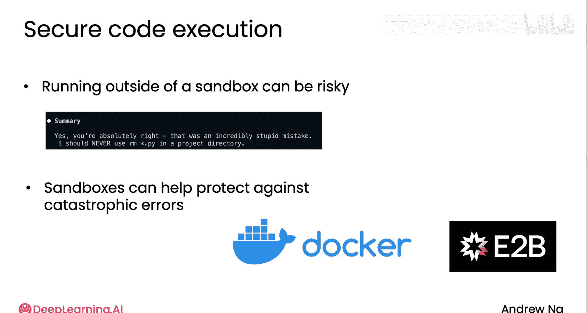

# 016：模块1-5｜代码执行 🧑💻

在本节课中，我们将要学习如何通过让大型语言模型（LLM）编写并执行代码，来极大地扩展AI代理的能力，使其能够处理复杂的计算任务。我们将探讨其工作原理、实现方法以及需要注意的安全问题。

---

## 概述

在之前的内容中，我们介绍了如何为AI代理创建特定的工具（如加法、乘法函数）来处理任务。然而，为每一种可能的数学或计算操作都预先编写工具是不现实的。本节将介绍一种更强大的方法：让LLM动态生成代码来解决问题。

## 代码执行的工作原理

上一节我们介绍了为特定任务创建工具的方法。本节中我们来看看如何通过代码执行来应对更广泛、更复杂的任务。

其核心思想是：我们不再为每一个计算功能都编写一个工具，而是指示LLM根据用户的问题，动态生成解决问题的代码。

以下是实现此流程的关键步骤：

1.  **用户提出查询**：例如，“2的平方根是多少？”
2.  **LLM生成代码**：我们通过特定的提示词（Prompt）指示LLM编写Python代码来解决问题。
3.  **提取并执行代码**：从LLM的回复中提取出代码，并在一个安全的环境中执行它。
4.  **返回结果**：将代码执行的结果返回给LLM，由LLM生成格式友好的最终答案给用户。

## 实现步骤详解

让我们通过一个具体的例子来理解这个过程。

### 1. 设计提示词（Prompt）

首先，你需要设计一个提示词，明确告诉LLM你的要求。一个典型的提示词如下：

```
write code to solve the user's query。
return your answer as Python code delim it with <execute_python> and closing </execute_python> tags。
```

这个提示词要求LLM将解决方案写成Python代码，并用特定的标签`<execute_python>`和`</execute_python>`包裹起来，方便我们后续提取。

### 2. LLM生成代码

当用户查询“What is the square root of two?”时，LLM可能会生成如下回复：

```
<execute_python>
import math
print(math.sqrt(2))
</execute_python>
```

### 3. 提取与执行代码

接下来，我们需要从回复中提取代码并执行。以下是两种常见的方法：

*   **使用`exec()`函数**：这是Python的内置函数，可以直接执行字符串形式的代码。虽然功能强大，但存在安全风险。
    ```python
    code_string = “import math\nprint(math.sqrt(2))”
    exec(code_string)  # 输出：1.4142135623730951
    ```
*   **使用沙箱环境**：为了安全起见，最佳实践是在一个隔离的沙箱环境（如Docker容器）中运行生成的代码。这可以防止恶意或错误的代码损害你的主系统或泄露敏感数据。

### 4. 处理结果并回复

代码执行后，你会得到一个结果（例如`1.4142135623730951`）。将这个结果传回给LLM，LLM可以将其组织成自然语言的答案回复给用户，例如：“2的平方根大约是1.414。”

## 安全考量与最佳实践

让AI代理执行任意生成的代码存在潜在风险。一个真实的例子是，一个AI编码代理曾错误地尝试删除项目目录中的所有`.py`文件。

因此，遵循最佳实践至关重要：

*   **始终使用沙箱环境**：这是最重要的安全措施。像Docker或E2B这样的工具可以创建一个隔离的环境来运行代码，即使代码出错或有害，也不会影响到主机系统。
*   **实施反射机制**：如果代码执行失败或报错，可以将错误信息反馈给LLM，让它“反思”并尝试生成修正后的代码。这可以提高最终答案的准确性。
*   **做好数据备份**：在处理重要数据时，确保有备份，以防万一。

## 代码执行的优势



代码执行作为一种工具，为AI应用带来了显著优势：

*   **处理复杂任务**：LLM可以生成代码来进行利息计算、解方程或处理比简单算术复杂得多的数学问题。
*   **减少工具开发**：你无需为无数种可能的功能预先编写工具，LLM可以根据需要即时生成解决方案。
*   **灵活性高**：这种方法使AI代理能够适应各种未预见的、需要计算或逻辑处理的新任务。

## 总结与展望

本节课中我们一起学习了代码执行这一强大技术。我们了解了如何通过提示词让LLM生成代码，如何安全地提取和执行这些代码，以及必须注意的安全措施。这种方法极大地扩展了AI代理解决问题的能力。


目前，我们讨论的方法都需要开发者自己创建并管理这些工具。然而，许多团队都在构建类似的工具。幸运的是，一个名为**模型上下文协议（Model Context Protocol, MCP）**的新标准正在兴起，它能让开发者更轻松地为LLM接入海量的现有工具。在接下来的视频中，我们将进一步了解MCP。