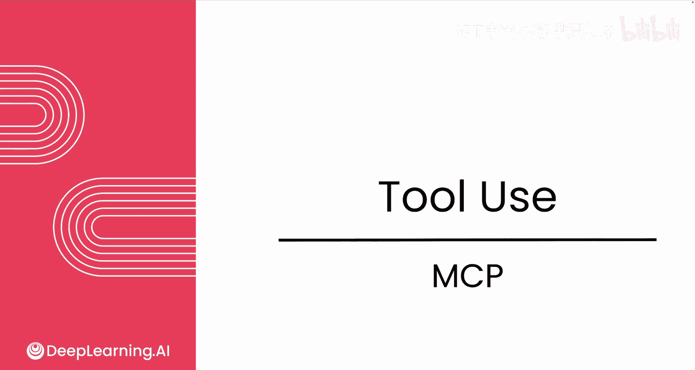
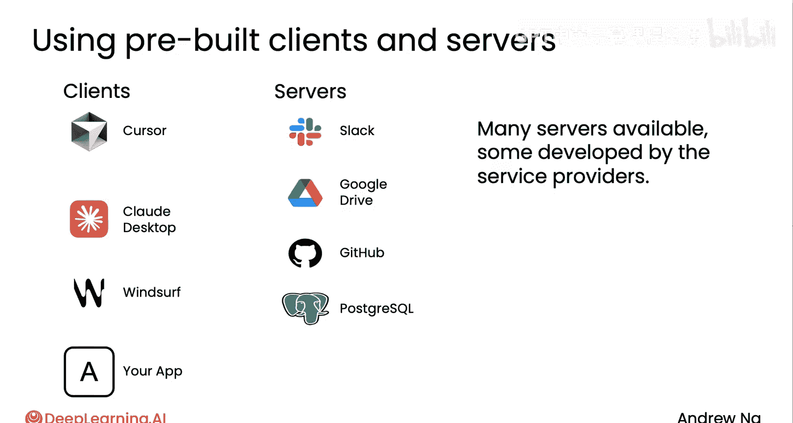
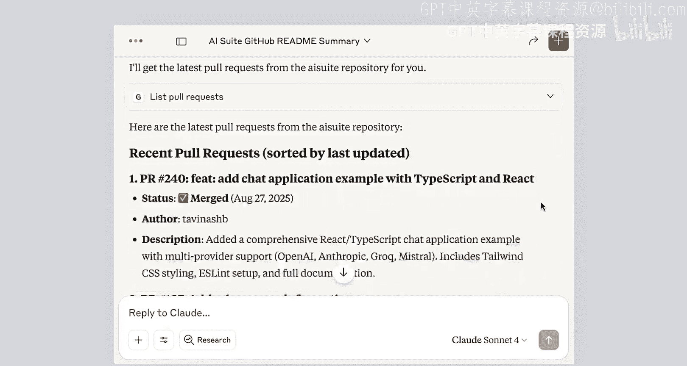

# 017：模型上下文协议（MCP） 🧩

在本节课中，我们将要学习模型上下文协议（MCP）。MCP是一个由Anthropic提出，并被众多公司和开发者采纳的标准，旨在为大型语言模型提供更丰富的上下文和工具访问能力。了解MCP将帮助你为应用程序获取更多资源。

## 解决的问题与核心思想

上一节我们介绍了为AI代理提供工具的重要性，本节中我们来看看MCP如何解决工具集成中的效率问题。

MCP试图解决的核心痛点是开发工作的重复性。如果一个开发者想要构建一个集成了Slack、Google Drive、Github数据或Postgres数据库的应用程序，他需要编写代码来封装这些服务的API，以便为应用程序提供功能。当另一个团队构建另一个应用程序时，他们又需要重复集成Slack、Google Drive和Github等工具。这意味着，如果有 **M** 个应用程序和 **N** 种工具，整个社区需要完成的工作总量是 **M × N**。

MCP通过提出一个应用程序访问工具和数据源的标准，改变了这一局面。其核心思想是：

**总工作量 = M + N**

而非 **M × N**

## MCP的构成

MCP最初的设计侧重于如何为大型语言模型提供更多上下文或获取数据，其初始工具主要是用于获取数据的，在文档中被称为“资源”。但MCP实际上提供了对数据以及应用程序可能想要调用的更通用函数的访问。

以下是MCP生态系统中的主要组成部分：

*   **MCP客户端**：指那些需要访问工具或数据的应用程序。
*   **MCP服务器**：通常是封装了数据访问逻辑的软件包装器，它们提供对Slack、Github、Google Drive等资源的访问，或允许你在这些资源上执行操作。

如今，消费工具或资源的MCP客户端列表正在快速增长，同时提供工具和资源的MCP服务器也在不断增加。

## 一个MCP使用示例

为了让你更直观地理解，我们来看一个使用MCP客户端的快速示例。

这是一个云桌面应用程序，它已连接到一个Github MCP服务器。

当我输入查询：“总结来自Github仓库（此URL，实际上是AI Suite仓库）的README markdown文件”时，这个作为MCP客户端的应用程序会使用Github MCP服务器，发出一个请求：`getReadmeFromRepo(AI_Suite, 此仓库)`。随后，它收到了一个相当长的响应。所有这些内容随后被反馈给语言模型的上下文，模型最终生成了该markdown文件的摘要。

现在，让我输入另一个请求：“让我看看最新的拉取请求是什么”。这促使语言模型使用MCP服务器发出另一个不同的请求：`listPullRequests`。这是Github MCP服务器提供的另一个工具。它请求列出AI Suite仓库的拉取请求，并获取了相关信息。这些响应被反馈给语言模型，然后模型写出了关于该仓库最新拉取请求的简洁技术摘要。

## 总结与展望

本节课中我们一起学习了模型上下文协议（MCP）。MCP是一个重要的标准，它通过标准化工具和数据源的访问方式，极大地减少了开发者的重复工作，提高了生态系统的效率。如果你想深入了解，DeepLearning.AI也提供了一个专门深入讲解MCP协议的短期课程，你可以在完成本课程后去查看。

希望本视频能让你简要了解MCP为何有用，以及为何许多开发者现在都基于此标准进行构建。

这引出了我们关于工具使用的最后一个视频。通过为你的语言模型提供工具访问，你将能够构建更强大的代理应用程序。

在下一个模块中，我们将讨论评估和错误分析。根据我的观察，能够高效执行代理工作流的团队与效率较低的团队之间的一个关键区别，就在于推动严格评估流程的能力。在接下来的系列视频中，我将与你分享一些关于如何使用评估来驱动代理工作流开发的最佳实践，这可能是整个课程中最重要的模块。

期待在下一个模块中与你相见。