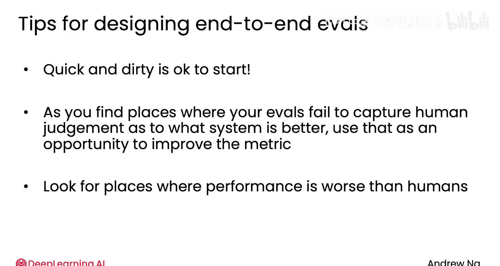

# 018：构建与评估AI工作流


在本节课中，我们将学习构建代理式AI工作流的实用技巧，并重点探讨如何通过评估来发现和改进系统的问题。我们将通过几个具体例子，理解如何创建和使用评估来驱动系统性能的提升。

## 概述：从原型到评估

上一节我们介绍了代理式AI的基本概念。本节中，我们来看看如何通过构建快速原型并建立评估来迭代改进系统。

开发代理式AI系统时，很难提前预知系统在哪些方面表现良好，在哪些方面表现不佳。因此，一个常见的建议是，先构建一个哪怕是“快速而粗糙”的系统原型。这样你就可以运行它，观察输出，从而更精准地发现需要重点改进的地方。相比之下，花费数周时间进行理论推测和假设，效果往往不如直接动手构建一个安全、合理且不泄露数据的快速原型。

## 构建评估以驱动改进

在构建了初始原型后，下一步是识别问题并建立评估来量化改进。以下是创建评估的几个步骤。

### 第一步：检查输出并识别问题模式

首先，你需要运行系统并检查其输出。例如，假设你构建了一个发票处理工作流，其任务是提取四个必填字段并保存到数据库记录中。

构建系统后，你可以找一批发票（例如10或20张），逐一检查输出结果，看看哪些处理正确，哪些出现了错误。

以下是检查时可能发现的情况：
*   发票1：输出正确。
*   发票2：混淆了发票开具日期和到期日。在本任务中，我们需要提取到期日以便按时付款。
*   发票3：输出正确。
*   发票4：输出正确。

通过检查多个例子，你可能会发现一个常见的问题模式：系统在处理日期时频繁出错。基于此观察，你可以得出结论，需要优先改进系统提取到期日的准确性。

### 第二步：创建针对性评估

一旦确定了需要改进的核心问题（例如日期提取），就应该创建一个评估来量化该问题的严重程度并跟踪改进进度。

对于发票日期提取问题，你可以创建一个测试集或评估集。

以下是创建评估集的步骤：
1.  找到10到20张发票。
2.  手动记录下每张发票的正确到期日，并以标准年月日格式（如`2025-08-20`）写下。
3.  为了便于后续用代码评估，你可以在给大语言模型的提示中要求其始终以`年月日`格式输出日期。
4.  编写代码从模型输出中提取日期（使用正则表达式匹配模式，例如四位年份、两位月份、两位日期）。
5.  编写测试代码，判断提取出的日期是否等于你手动标注的真实日期。

**代码示例：检查日期匹配**
```python
# 假设 extracted_date 是从模型输出中提取的字符串，ground_truth_date 是标注的正确日期
if extracted_date == ground_truth_date:
    correct_count += 1
```
通过这个包含约20个例子的评估集，你可以修改提示词或调整系统组件，并观察提取日期的正确率是否提升。

### 第三步：迭代改进与评估

这个过程概括了改进代理式AI工作流的常见路径：观察输出，发现问题，如果知道如何修复就直接修复。如果需要更长时间的迭代改进，则建立评估并用它来驱动后续开发。

此外，随着开发的深入，你可能会发现初始的20个例子不够全面，或者数量太少。这时，你可以随时向评估集中添加更多例子，确保它能更好地反映你对系统性能是否满意的判断。

## 评估的不同类型与应用场景

上一节我们以发票处理为例介绍了有明确标注的评估。本节中我们来看看其他几种常见的评估场景。

### 场景一：评估客观规则（无逐例标注）

假设我们正在构建一个为Instagram撰写产品说明的营销文案助手。营销团队要求文案长度不超过10个单词。

系统接收产品图片（如太阳镜）和用户查询（如“请写一段推销这些太阳镜的文案”），然后由多模态大模型生成描述。

检查输出后，你发现文案内容大多不错，但有时长度会超标。例如，太阳镜文案17个词，咖啡机文案14个词，搅拌机文案11词。这表明模型在遵守长度规则方面存在困难。

对于这种情况，你可以创建一个评估来跟踪文本长度。

**创建评估的步骤：**
1.  创建一个测试集，包含太阳镜、咖啡机等约10-20个例子。
2.  运行系统处理每个例子。
3.  编写代码计算输出文本的单词数。
4.  将生成文本的长度与10个单词的目标限制进行比较。

**代码示例：检查文案长度**
```python
# 假设 generated_text 是模型生成的文案
word_count = len(generated_text.split())
if word_count <= 10:
    correct_count += 1
```
这个评估与发票例子不同之处在于，它没有“逐例标注的真实值”。每个例子的目标都是相同的（≤10个词），而不是像发票日期那样每张发票都有一个独特的正确日期。

### 场景二：评估主观质量（有逐例标注）

让我们回顾之前的研究代理例子。检查它在不同输入提示下的输出时，你可能会发现一些问题。

例如：
*   要求撰写关于“黑洞研究近期突破”的文章时，它遗漏了一些被广泛报道的重要成果。
*   要求研究“在西雅图租房与买房”时，它做得不错。
*   要求研究“水果采摘机器人”时，它未提及一家领先的设备公司。

基于此，你发现系统有时会遗漏人类专家作者肯定会涵盖的重要论点。为此，你可以创建一个评估来衡量它捕捉要点的频率。

**创建评估的步骤：**
1.  准备一系列示例提示（如关于黑洞、机器人采摘等）。
2.  为每个提示手动制定3到5个“黄金标准”讨论要点。**这里存在逐例标注**，因为每个主题的重要要点都不同。
3.  使用一个大语言模型作为“裁判”，来统计生成的文章中包含了多少个黄金标准要点。

**提示词示例（给裁判LLM）：**
```
请判断提供的文章中包含了多少条（共5条）黄金标准讨论要点。
原始提示：[用户提问]
文章文本：[模型生成的文本]
黄金标准要点：[要点列表1, 要点2, ...]
请返回一个JSON对象，包含“分数”（0到5）和“解释”。
```
在这个例子中，我们使用LLM作为裁判来计数，因为讨论要点的表述方式多种多样，简单的正则表达式或模式匹配代码可能效果不佳。这是一种针对更主观评价的评估。

## 评估方法的分类框架

通过以上例子，我们可以看到评估方法可以根据两个维度进行分类，形成一个有用的2x2网格：

| 评估方式 | **有逐例标注的真实值** | **无逐例标注的真实值** |
| :--- | :--- | :--- |
| **用代码进行客观评估** | **发票日期提取**：编写代码检查输出日期是否与每张发票的唯一正确日期匹配。 | **营销文案长度**：编写代码检查每个输出的单词数是否都满足≤10词的统一规则。 |
| **用LLM作为裁判进行主观评估** | **研究文章要点**：使用LLM裁判判断文章是否涵盖了为每个主题独特制定的要点列表。 | **图表评分**：使用LLM裁判根据统一的评分标准（如是否有坐标轴标签）评估每个生成的图表。 |

这个框架可以帮助你思考为自己的应用构建哪种类型的评估。这些评估通常被称为**端到端评估**，因为一端是输入（如用户查询），另一端是最终输出，评估的是整个端到端系统的性能。

## 设计端到端评估的最终建议

在本节最后，我想分享一些设计端到端评估的实用建议。

**1. 从“快速而粗糙”的评估开始**
许多团队因为认为构建评估是一项耗时数周的大工程而迟迟无法开始。实际上，就像迭代改进代理工作流一样，你也应该计划迭代改进你的评估。开始时，用10-20个例子建立一个初步评估，写点代码或用LLM裁判，先获得一些度量指标。这可以与人工检查输出相结合，共同驱动决策。

**2. 迭代并改进你的评估集**
随着开发进程，你可能会发现初始的评估集无法完全捕捉你对系统好坏的判断。例如，你改进了系统，感觉效果更好，但评估分数却没有提高。这通常是一个信号，提示你需要扩大评估集，或者改变评估输出方式，使其更符合你的实际判断。因此，你的评估集和评估方法也会随着时间的推移而变得更完善。

**3. 从评估中获取改进灵感**
代理工作流通常用于自动化人类可以完成的任务。对于这类应用，我常寻找那些系统表现**逊于人类专家**的环节。这能为我提供明确的方向，告诉我应该集中精力改进哪些方面，或者需要收集哪些类型的例子来让工作流表现得更好。



## 总结与预告

本节课中我们一起学习了如何通过构建快速原型来启动代理式AI项目，并通过创建端到端评估来识别问题、量化性能并驱动系统迭代改进。我们探讨了基于代码的客观评估和使用LLM裁判的主观评估，以及它们在有/无逐例标注情况下的应用，并通过一个分类框架梳理了这些方法。


除了帮助你驱动改进，评估还有一个重要作用：帮助你理解复杂代理系统中，哪个组件最值得投入精力优化。因为代理系统通常由多个部分组成，高效判断优化重点是一项关键技能。在下一个视频中，我们将深入探讨这个话题。