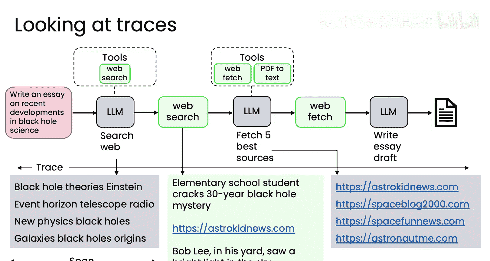
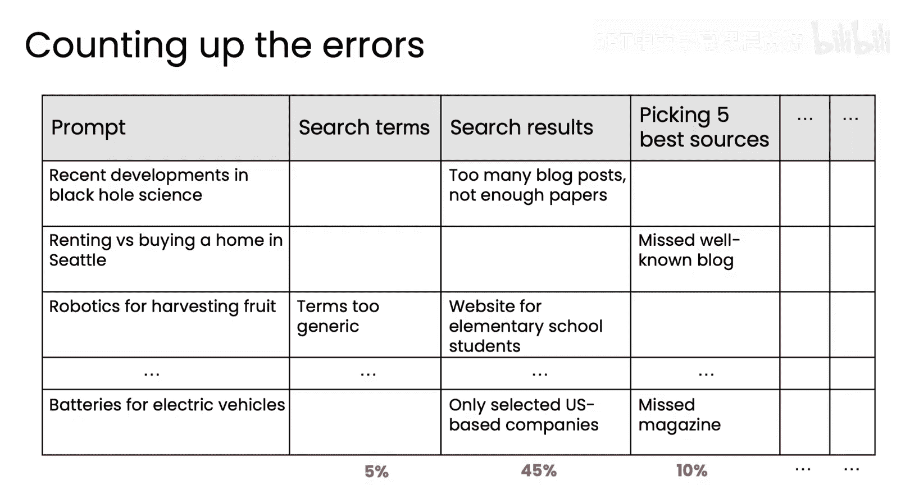
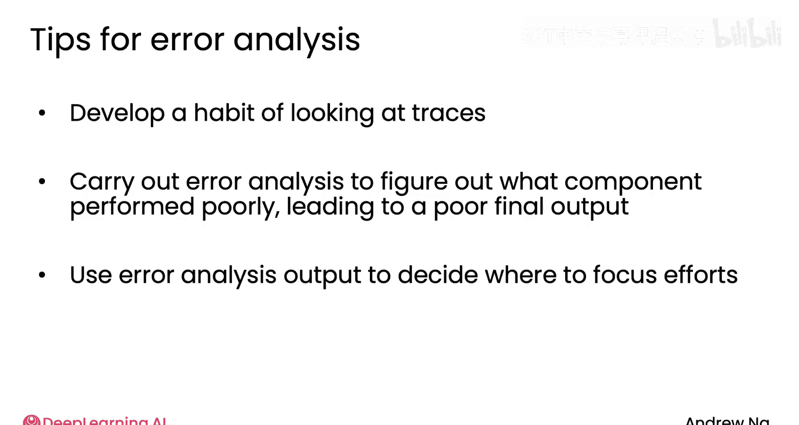

# 019：错误分析与优先级排序 🎯

在本节课中，我们将学习如何对代理工作流进行错误分析，并确定改进的优先级。当您构建的代理系统未能达到预期效果时，系统性地分析错误来源，而非凭直觉猜测，能极大地提升您改进系统的效率。

上一节我们介绍了研究代理的示例，本节中我们来看看如何通过分析其工作流中的中间输出来定位问题。

## 错误分析的重要性

假设您已经构建了一个代理工作流，但其表现未达预期。这种情况经常发生。问题在于，您应该将改进精力集中在何处？

代理工作流包含许多不同的组件，改进某些组件可能比其他组件带来更大的收益。您选择聚焦点的能力，将极大地影响您改进系统的速度。我发现，一个团队效率高低的关键预测指标之一，就是他们能否通过一个严谨的错误分析流程来确定工作重点。因此，这是一项重要的技能。

## 如何进行错误分析

在研究代理的示例中，我们在之前的视频里已经看到了错误分析。我们发现它经常遗漏关键点。专家本应在某些主题上写出引人入胜的文章。

现在您发现了“有时遗漏关键点”这个问题。您如何知道该改进哪里？事实证明，在这个工作流的众多步骤中，几乎任何一步都可能导致“遗漏关键点”这个问题。

例如：
*   第一步的LLM可能生成了不佳的搜索词，导致搜索了错误的内容，未能发现正确的文章。
*   或者使用的网络搜索引擎本身效果不佳。实际上存在多个网络搜索引擎，其中一些比另一些更好。
*   或者网络搜索本身没问题，但当我们将搜索结果列表交给LLM时，它可能没有很好地选出最佳的几篇来下载。
*   网页抓取在此案例中问题较少（假设您能准确抓取网页），但在将网页内容交给LLM后，LLM可能忽略了已抓取文档中的某些要点。

有些团队有时会凭直觉选择其中一个组件进行改进，有时这能奏效，但有时会导致团队花费数月时间，系统整体性能却进展甚微。

因此，与其凭直觉决定改进哪个组件，我认为进行错误分析以更好地理解工作流中的每一步要有效得多。特别是，我经常检查**追踪信息**，即每个步骤后的中间输出，以了解哪些组件的性能不达标（即远低于人类专家的水平），因为这指明了哪里可能存在显著的改进空间。

## 检查追踪信息示例

让我们看一个例子。如果我们要求研究代理撰写一篇关于黑洞科学最新发现的文章，其输出可能是这样的搜索词：“黑洞理论 爱因斯坦 事件视界望远镜 射电……”等等。

然后，我会让人类专家查看这些搜索词，判断它们对于撰写黑洞科学最新发现的文章是否合理。也许专家会说这些网络搜索词看起来没问题，与人类会做的搜索很相似。

接着，我查看网络搜索的输出，即返回的URL列表。网络搜索会返回许多不同的网页，可能其中一篇是“小学生声称破解了3年之久的黑洞谜题——来自AstroKid新闻”。这看起来不像是最严谨的同行评议文章。检查所有返回的文章后，您可能会得出结论：它返回了太多博客或大众媒体类型的文章，而不足以支撑撰写一篇高质量的研究报告。

同样，最好也查看其他步骤的输出。例如，选出的“最佳五个来源”可能以AstroKid新闻、SpaceB 2000、SpaceF新闻等结尾。

正是通过查看这些中间输出，您才能尝试评估每个步骤输出结果的质量。

## 相关术语

所有中间步骤的完整输出集合通常被称为该代理一次运行的**追踪信息**。此外，在其他资料中您可能还会看到，单个步骤的输出有时被称为**跨度**。这些术语来自计算机可观测性文献，用于帮助理解计算机的运行情况。在本课程中，我会较多地使用“追踪信息”一词，较少使用“跨度”，但您可能会在互联网上看到这两个术语。

通过阅读追踪信息，您可以开始非正式地了解哪些组件可能问题最大。

## 系统化错误分析方法

为了以最系统化的方式进行错误分析，将注意力集中在系统出错的案例上是有用的。也许有些文章写得很好，输出完全令人满意。我会将这些案例放在一边，并尝试找出一组例子，在这些例子中，无论出于何种原因，您的研究代理的最终输出并不完全令人满意，然后只专注于这些例子。这就是我们称之为“错误分析”的原因之一，因为我们希望专注于系统出错的案例，并通过分析找出哪些组件对错误负主要责任。

为了使分析更严谨，而不仅仅是阅读和获得非正式的印象，您可以建立一个电子表格来更明确地统计错误所在。这里的“错误”指的是，某个步骤的输出性能显著低于人类专家在给定相同输入时可能产生的输出。

我经常自己用电子表格来做这件事。我可能会建立这样一个电子表格：

对于第一个查询“黑洞科学的最新发展”，我看到搜索词没问题，但搜索结果不佳，因为“博客文章、大众媒体文章太多，科学论文不足”。基于此，确实选出的五个最佳来源也不理想，但在这里我不会说“挑选五个最佳来源”这一步做得不好，因为如果筛选的输入文章本身都不够严谨，那么我不能责怪这一步没有选出更好的文章，因为它已经在给定的选择范围内尽力了。人类专家面对同样的选择列表可能也会如此。

然后，您可以为不同的提示重复此过程。例如，对于“在西雅图租房还是买房”这个提示，它可能遗漏了一个知名的关于水果采摘机器人的博客。在这种情况下，我们可能会查看并说：“哦，搜索词太宽泛了，搜索结果也不好”，等等。

基于此，我将在电子表格中统计在不同组件中观察到错误的频率。在这个例子中，我对搜索词不满意的情况占5%，但对搜索结果不满意的情况占45%。

如果我实际看到这个数据，我可能会仔细检查搜索词，以确保搜索词确实没问题，并且搜索词的选择不是导致搜索结果不佳的原因。但如果我确实认为搜索词没问题，而搜索结果不理想，那么我会仔细检查正在使用的网络搜索引擎，以及是否有任何参数可以调整，使其返回更相关或更高质量的结果。

正是这种类型的分析告诉我，在这个例子中，也许我应该将注意力集中在修复搜索结果上，而不是这个代理工作流的其他组件上。

## 总结与优先级排序

本节课中我们一起学习了错误分析。总结一下，我发现养成在构建代理工作流后查看追踪信息的习惯非常有用。主动查看中间输出，以感受每个步骤的实际执行情况，从而更好地理解不同步骤的性能优劣。

更系统化的错误分析可以通过电子表格来完成，让您收集统计数据或计算哪个组件最频繁地表现不佳。

查看哪些组件表现不佳，以及我对于有效改进不同组件是否有思路，这将帮助您确定改进的优先级。也许某个组件有问题，但我没有任何改进它的想法，这可能意味着不应将其优先级设得太高。但如果有一个组件产生了大量错误，并且我有改进它的思路，那么这就是优先处理该组件的一个充分理由。

我想强调的是，错误分析是帮助您决定工作重点的一个非常有用的产出。因为在任何复杂系统中，有太多可以改进的地方，很容易随便选一个点，然后投入数周甚至数月时间，最后才发现这并未带来系统整体性能的提升。因此，利用错误分析来决定工作重点，对于提高您的效率来说极其有用。

在本视频中，我们通过研究代理的示例探讨了错误分析。但我认为错误分析是一个如此重要的话题，我想再介绍一些额外的示例。所以，让我们进入下一个视频，在那里我们将查看更多错误分析的例子。