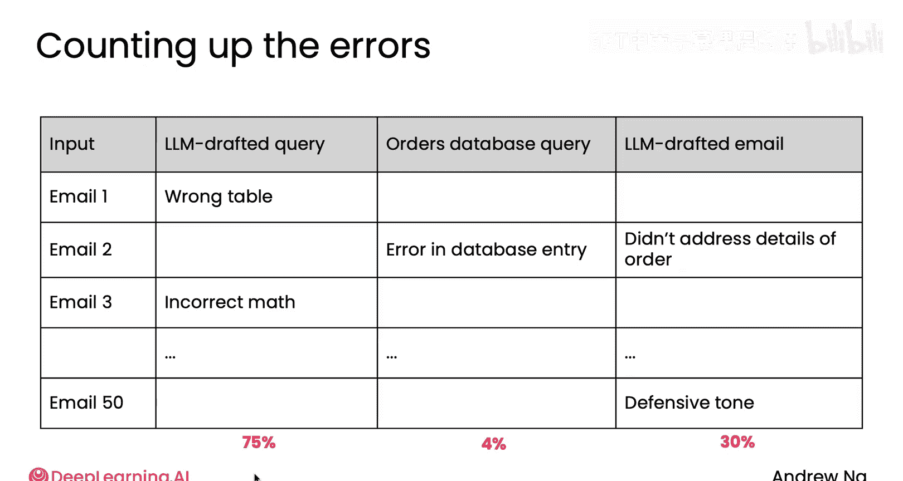

# 020：更多错误分析示例 🧐

在本节课中，我们将学习如何通过具体的错误分析示例，来诊断和优化代理式AI工作流中的问题。我们将通过发票处理和客户邮件回复两个案例，演示如何定位导致系统性能不佳的根本原因。

上一节我们介绍了错误分析的基本概念，本节中我们来看看两个更具体的应用实例。

## 发票处理工作流的错误分析

我们首先回顾一下发票处理的工作流。该流程遵循一个清晰的代理工作流：识别四个必需字段，然后将它们记录到数据库中。在本模块的第一个视频示例中，我们提到系统经常在发票的**到期日期**上出错。因此，我们可以进行错误分析，以找出问题可能出在哪个组件上。

例如，问题可能源于：
*   **PDF转文本**组件提取日期错误。
*   或者，**大语言模型**从PDF转文本组件输出的所有文本中提取了错误的日期。

为了进行错误分析，我会尝试找出多个数据提取器出错的例子。和上一个视频一样，专注于那些性能不佳的示例以找出问题所在是很有用的。我会忽略那些日期正确的例子，但会找出大约10到20张日期错误的发票，然后逐一检查。

以下是分析步骤：
1.  判断问题是PDF转文本组件提取日期错误。
2.  还是大语言模型在给定PDF转文本输出后，提取了错误的日期（例如，可能识别成了发票日期而非到期日期）。

你可能会建立一个如下所示的简单电子表格，检查20张发票，并统计每种错误发生的频率。

| 发票编号 | PDF转文本错误？ | LLM日期提取错误？ |
| :--- | :--- | :--- |
| 1 | 否 | 是 |
| 2 | 是 | 否 |
| ... | ... | ... |
| 总计 | 20% | 80% |

在这个假设的例子中，看起来**大语言模型的日期提取**导致了更多的错误。这告诉我，也许我应该把精力集中在改进日期提取组件上，而不是PDF转文本组件。

这一点很重要。因为如果没有这个错误分析，我设想有些团队可能会花费数周或数月的时间来调整PDF转文本组件，最终才发现这对整个系统的性能提升影响不大。另外，底部的百分比总和可能不是100%，因为这些错误并非互斥的。

## 客户邮件回复工作流的错误分析

让我们再看最后一个例子，回到回复客户邮件的HIV工作流。在这个流程中，大语言模型在收到客户关于订单的邮件后，会提取订单详情、从数据库获取信息，然后起草回复供人工审核。

同样，我会找出一些最终输出不满意的例子，然后尝试找出问题所在。

可能出现问题的地方包括：
*   大语言模型生成了错误的数据库查询。当查询发送到数据库时，它未能成功获取客户信息。
*   数据库本身存在损坏的数据。因此，即使大语言模型生成了完全合适的数据库查询（例如用SQL），数据库也没有正确的信息。
*   或者，在获得了正确的客户订单信息后，大语言模型撰写的邮件在某些方面不太合适。

再次，我会检查一批最终输出不满意的邮件，并尝试找出问题根源。

例如：
*   在邮件1中，我们可能发现大语言模型在查询中请求了错误的表，即以错误的方式查询了数据库。
*   在邮件2中，我可能发现数据库实际上存在错误，并且大语言模型基于那个输入也写出了不太好的邮件。

在这个例子中，在检查了许多邮件后，我可能发现最常见的错误在于大语言模型编写数据库查询（比如SQL查询）以获取相关信息的方式。而数据库本身大部分是正确的，只有少量数据错误。撰写邮件的方式也存在一些错误，可能在大约30%的情况下写得不太合适。

这告诉我，最值得投入精力的是改进大语言模型编写查询的方式。其次重要的是改进撰写最终邮件的提示。像这样的分析可以告诉你，系统可能75%的错误都源于数据库查询问题。这对于指导你在开发GenAI工作流时应将注意力集中在哪里，是极其宝贵的信息。

当我开发生成式AI工作流时，我经常使用这种类型的错误分析来告诉我应该优先改进哪个部分。

在你做出这个决定后，事实证明，为了补充我们在本模块早期讨论的端到端评估，通常不仅评估整个端到端系统，也评估单个组件是很有用的。因为这可以使你更高效地改进错误分析后决定要重点关注的某个特定组件。

本节课中我们一起学习了如何通过具体的错误分析案例，定位代理工作流中的瓶颈。我们看到了系统性地检查错误样本、归因问题组件，并据此确定优化优先级的过程。这能帮助我们避免在次要问题上浪费精力，从而更高效地提升系统整体性能。