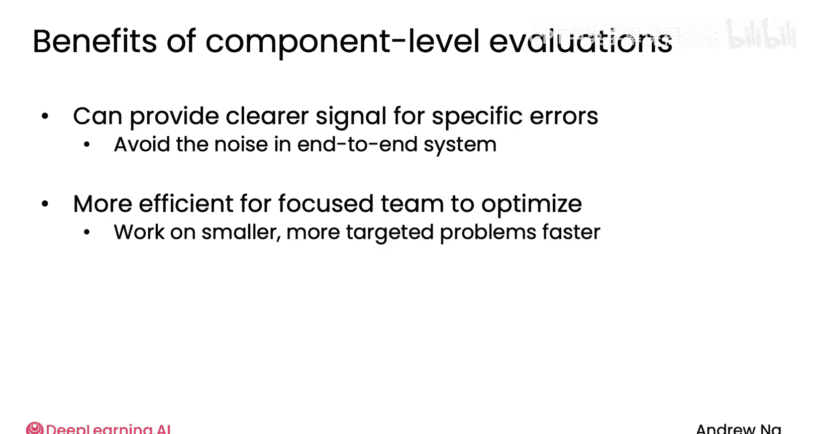

# 021：组件级评估 🧩

在本节课中，我们将学习如何构建和使用组件级评估。我们将通过一个研究代理的例子，探讨为何仅依赖端到端评估可能效率低下，以及如何通过针对特定组件的评估来更高效地优化系统性能。

## 概述

在之前的课程中，我们提到研究代理有时会遗漏关键信息。如果问题出在网络搜索组件上，那么每次我们更换搜索引擎或调整参数时，都需要重新运行整个工作流程来进行端到端评估。这种方法虽然能提供全面的性能指标，但成本高昂且效率低下。此外，由于整个工作流程较为复杂，其他组件引入的随机噪声可能会掩盖网络搜索组件本身的微小改进。因此，本节将介绍一种替代方案：构建专门的组件级评估。

## 构建组件级评估

上一节我们介绍了端到端评估的局限性，本节中我们来看看如何为特定组件（如网络搜索）建立独立的评估体系。

核心思想是：为单个组件设计一个清晰、独立的度量标准，以便快速、准确地判断其性能变化，而无需运行整个复杂系统。

以下是构建网络搜索组件评估的具体步骤：

1.  **建立黄金标准资源列表**：针对少量特定查询，邀请领域专家确定一组最权威的网页资源。这些资源被视为“黄金标准”，即一个理想的搜索应该找到这些页面。
    *   **专家判断**：`专家资源列表 = [URL_1, URL_2, ..., URL_n]`
2.  **编写评估代码**：运行你的网络搜索组件，获取其返回的网页结果列表。
    *   **组件输出**：`搜索结果列表 = [Result_URL_1, Result_URL_2, ..., Result_URL_m]`
3.  **计算标准指标**：通过代码计算你的搜索结果与黄金标准资源列表之间的重叠程度。信息检索领域有标准的评估指标，例如**F1分数**，它综合了**精确率**和**召回率**。
    *   **精确率**：`(检索出的相关网页数量) / (检索出的全部网页数量)`
    *   **召回率**：`(检索出的相关网页数量) / (全部相关网页数量)`
    *   **F1分数**：`2 * (精确率 * 召回率) / (精确率 + 召回率)`

通过这种方式，你便获得了一个专门用于评估网络搜索组件质量的工具。

## 组件级评估的优势

拥有了组件级评估工具后，你可以在调整组件时获得更清晰的反馈信号。

*   **快速迭代**：当你调整网络搜索的参数或超参数时——例如更换搜索引擎（尝试Google、Bing、DuckDuckGo等）、改变返回结果数量或调整搜索日期范围——你可以快速运行组件级评估来判断质量是否提升。
*   **信号清晰**：组件级评估能提供更清晰的改进信号，让你确切知道正在优化的组件（如网络搜索）是否有所改善，避免了端到端系统中其他复杂组件带来的噪声干扰。
*   **团队协作高效**：在由不同团队负责不同组件的大型项目中，每个团队可以拥有自己明确优化的指标，而无需担心其他组件的影响。这使得团队能够更专注、更快速地解决各自范围内更具针对性的问题。

当然，在最终完成工作前，运行一次端到端评估以确保整体系统性能得到提升仍然是必要的。但在逐个调整超参数的过程中，通过评估单个组件可以极大地提高效率，无需每次都重新运行昂贵的端到端评估。

## 总结与过渡

本节课中我们一起学习了组件级评估的概念与构建方法。我们了解到，当决定改进某个组件时，考虑为其建立专门的组件级评估是值得的，这能让你更快地提升该组件的性能。

现在，你可能会想：如果决定改进一个组件，具体该如何让它变得更好呢？在下一个视频中，让我们来看一些具体的例子。🚀