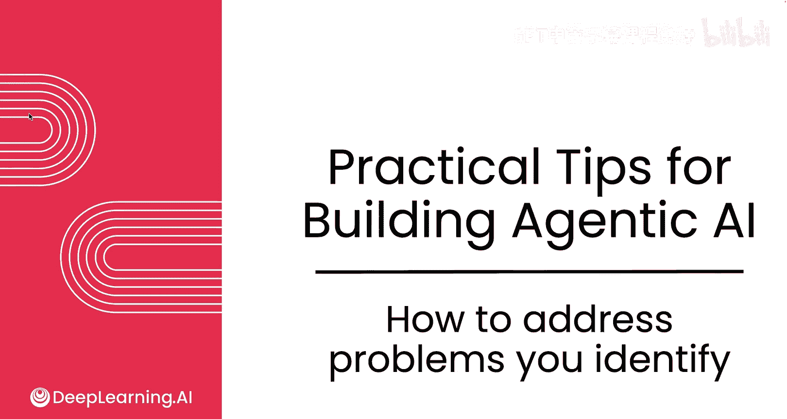
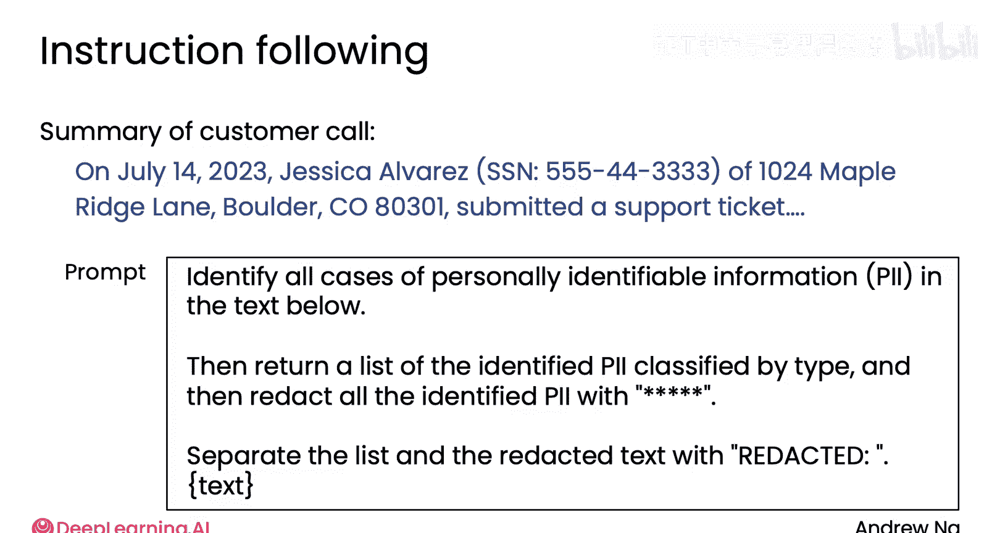
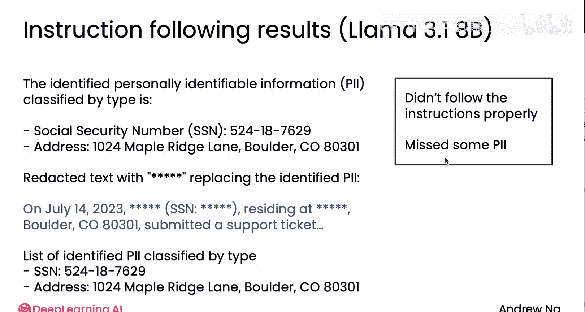
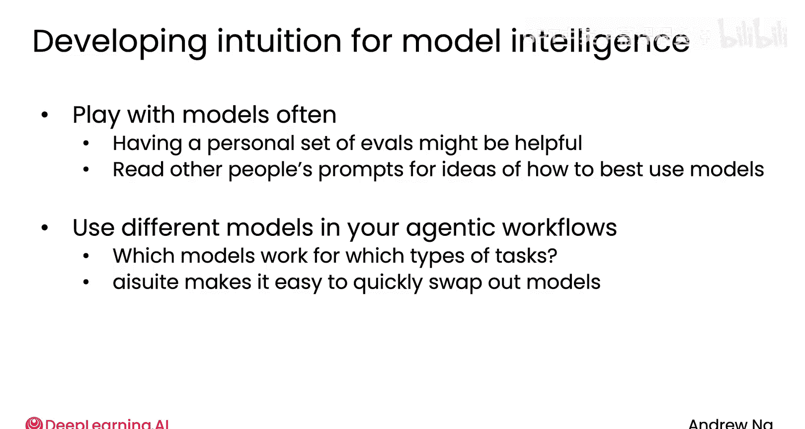

# 022：如何解决已识别的问题 🛠️

在本节课中，我们将学习如何分析和改进代理工作流中的各个组件。我们将探讨针对不同类型组件的优化策略，并分享一些提升模型性能、降低成本和延迟的通用模式。

## 概述

一个代理工作流通常包含多种不同类型的组件。因此，改进不同组件的工具和方法也会有很大差异。接下来，我将分享一些在实践中观察到的通用模式。

## 优化非LLM组件

上一节我们介绍了代理工作流的构成，本节中我们来看看如何优化其中的非LLM组件。

你的代理工作流中可能包含一些非基于大语言模型的组件。例如，它可能是一个网络搜索引擎、一个文本检索组件（如果你的系统包含检索增强生成功能）、一个代码执行器、一个单独训练的机器学习模型，或者是一个语音识别或图片人物检测系统。

这些非LLM组件通常有可以调整的参数或超参数。以下是几个例子：

*   对于网络搜索引擎，你可以调整返回结果的数量或要求其考虑的日期范围。
*   对于文本检索组件，你可以更改决定文本相似度的相似度阈值，或者调整分块大小（检索系统通常会将文本切分成更小的块进行匹配）。
*   对于人物检测，你可以更改检测阈值，这会影响其敏感度以及判定“发现人物”的可能性，从而在误报和漏报之间进行权衡。

如果你没有完全理解上述所有超参数的细节，不必担心，具体细节并不那么重要。关键在于，这些组件通常都有可以调整的参数。当然，你也可以尝试直接替换组件。我在自己的代理工作流中经常这样做，例如更换不同的检索搜索引擎或RAG提供商，以测试其他提供商是否会因为其多样性而表现更好。

鉴于非LLM组件的多样性，改进它们的技术也将更加多样化，并高度依赖于该组件的具体功能。

## 优化LLM组件

在讨论了非LLM组件的优化后，现在我们将焦点转向基于大语言模型的组件。以下是你可以考虑的一些选项：

*   **改进提示词**：尝试添加更明确的指令。如果你了解**小样本提示**，它指的是在提示中添加一个或多个输入和期望输出的具体示例。这是一种可以为你的LLM提供示例，从而帮助其生成更好性能输出的技术。
*   **尝试不同的LLM**：使用AI套件或其他工具，尝试多个LLM模型并利用评估来选择最适合你应用的模型，这通常相当容易。
*   **任务分解**：如果一个步骤对单个LLM来说过于复杂，你可以考虑将任务分解为更小的步骤，或者将其分解为一个生成步骤和一个反思步骤。更一般地说，如果一个步骤内的指令非常复杂，单个LLM可能难以遵循所有指令。将任务分解为更小的步骤，可能更容易让两到三次LLM调用准确执行。
*   **微调模型**：当其他方法效果不够好时，可以考虑微调模型。这往往比其他选项复杂得多，在开发时间上的成本也更高。但如果你有可用于微调LLM的数据，这可能比仅使用提示词带来更好的性能。我倾向于在真正用尽其他选项后才进行微调，因为它通常很复杂。但对于那些尝试了所有其他方法后，性能仍停留在90%或95%，而我确实需要提升最后几个百分点的情况，微调我自己的定制模型有时是一个很好的技术。由于其成本高昂，我倾向于只在更成熟的应用中这样做。

## 培养模型选择直觉

事实证明，当你尝试选择使用哪个LLM时，如果你对不同大语言模型的智能程度或能力有良好的直觉，这对开发者非常有帮助。你可以做的就是尝试很多模型，看看哪个效果最好。我发现，随着使用不同模型工作，我开始磨练出关于哪些模型最适合哪些类型任务的直觉。随着这些直觉的磨练，你也能更高效地为模型编写好的提示词，并为你的任务选择合适的模型。

因此，我想与你分享一些关于如何磨练直觉，以判断哪些模型适合你应用的想法。让我们用一个例子来说明：使用LLM遵循指令来移除或编辑PII（个人可识别信息），以保护私人敏感信息。

例如，如果你使用LLM来总结客户通话记录，那么一个摘要可能是：“在2023年7月14日，Jessica Alvarez（社会安全号码XXX-XX-XXXX）就支持工单#12345联系了我们，她的地址是...”

这段文本包含大量敏感的个人可识别信息。现在，假设我们想从这些摘要中移除所有PII，因为我们希望将这些数据用于下游统计分析，以了解客户来电原因，并且为了保护客户信息，我们希望在进行分析前剥离这些PII。

你可能会这样提示LLM：“识别以下文本中的所有PII案例，然后返回编辑后的文本，用`[已编辑]`替换...”

事实证明，较大的前沿模型往往更擅长遵循指令，而较小的模型虽然擅长回答简单的事实性问题，但在遵循指令方面就不那么出色。如果你在一个较小的模型（例如具有80亿参数的OpenAI o1模型）上运行这个提示，它可能会生成如下输出：

> 识别出的PII是：社会安全号码和地址。编辑如下：[已编辑]...

这里它犯了几个错误：没有正确遵循指令（先显示了列表，然后编辑文本，然后又返回了一个本不该出现的列表）；在这个PII列表中漏掉了姓名；并且我认为它也没有编辑部分地址。细节可能有所不同，但它没有完美遵循这些指令，并且可能遗漏了一些PII。

相比之下，如果你使用一个更智能、更擅长遵循指令的模型，你可能会得到更好的结果，例如它正确地列出了所有PII，并正确地编辑了所有PII。

我发现，不同的LLM提供商在不同任务上各有专长，不同的模型确实更适合不同的任务：有些更擅长编码，有些更擅长遵循指令，有些在某些特定类型的事实上表现更好。你可以磨练自己的直觉，了解哪些模型智能程度更高或更低，以及它们更擅长或更不擅长遵循哪些指令，从而能够更好地决定使用哪些模型。

以下是一些关于如何做到这一点的建议：

*   **经常尝试不同模型**：每当有新模型发布，我经常去尝试，并在上面测试不同的查询，包括专有模型和开源模型。
*   **建立个人评估集**：有时，拥有一套个人评估集也很有用，即你经常询问不同模型的一些特定问题，这可以帮助你校准它们在不同类型任务上的表现。
*   **阅读他人的提示词**：我经常做的一件事是花大量时间阅读他人的提示词。有时人们会在互联网上发布他们的提示词，我经常去阅读，以了解提示词的最佳实践是什么。我也经常与各个公司的朋友（包括一些前沿模型公司）交流，分享我的提示词，看看他们是如何编写提示词的。有时，我还会去找我尊敬的人编写的开源软件包，下载并深入研究，以找到作者编写的提示词，通过阅读它们来磨练我关于如何编写好提示词的直觉。我鼓励你考虑这种技术：通过阅读大量他人的提示词，这将帮助你更好地自己编写提示词。我经常这样做，也鼓励你这样做。这将磨练你的直觉，了解模型擅长遵循哪些类型的指令，以及何时对不同的模型说某些话。
*   **在工作流中尝试多种模型**：除了尝试模型和阅读他人的提示词，如果你在代理工作流中尝试许多不同的模型，这也能让你磨练直觉。你会看到哪些模型在哪些类型的任务上表现最好，无论是通过查看追踪记录获得非正式的感知，还是通过查看组件级或端到端的评估，都能帮助你评估不同模型在工作流中的表现。然后，你开始磨练关于性能、价格和速度之间权衡的直觉，以便为不同模型的使用做出决策。我倾向于在AI套件上开发代理工作流的原因之一，就是因为它可以让我轻松快速地更换和尝试不同的模型，这使我在尝试和评估哪些模型最适合我的工作流方面更有效率。

## 优化成本与延迟

我们已经讨论了很多关于如何改进不同组件的性能，以期提升端到端系统整体表现的方法。除了提高输出质量，在你的工作流中，你可能还想优化延迟和成本。

我发现，对于很多团队来说，开始开发时通常最关心的是输出质量是否足够高。但当系统运行良好并投入生产后，使其运行得更快、成本更低也往往很有价值。

因此，在下一个视频中，让我们看看一些关于改进代理应用成本和延迟的想法。

## 总结

本节课中我们一起学习了如何分析和优化代理工作流中的各个组件。我们探讨了针对非LLM组件（如调整参数或更换提供商）和LLM组件（如改进提示词、更换模型、任务分解和微调）的不同策略。我们还讨论了如何通过频繁尝试不同模型、阅读他人提示词以及在具体工作流中测试来培养模型选择的直觉。最后，我们提到了在确保质量后，优化系统延迟和成本的重要性。掌握这些方法将帮助你构建更高效、更经济的智能代理系统。