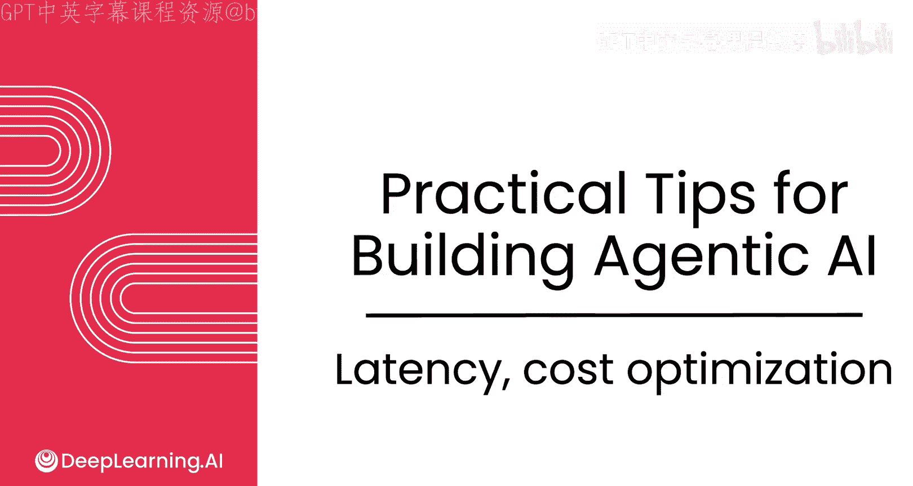
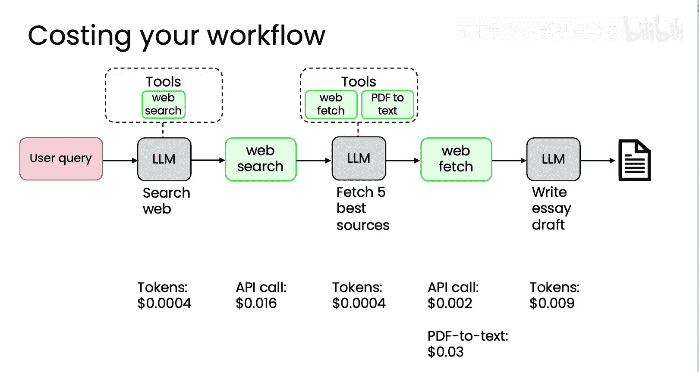

# 023：延迟与成本优化 🚀

在本节课中，我们将学习如何优化代理工作流的延迟与成本。我们将探讨如何通过基准测试和分析，识别并改进工作流中耗时或成本高昂的环节。

---

当构建代理工作流时，通常建议团队首先专注于提升输出质量，之后再优化成本和延迟。成本和延迟并非不重要，但提升性能或输出质量通常是最困难的部分。只有当工作流真正有效运行时，才应开始关注其他方面。

我曾多次遇到这样的情况：团队构建了一个代理工作流并交付给用户，幸运的是用户数量庞大，导致成本实际上成为了问题，于是我们不得不紧急采取措施降低成本。但这本身是一个“好问题”。因此，我倾向于不过早担心成本问题，但也不会完全忽视它。在我的待办事项列表中，它的优先级较低，直到用户数量多到确实需要降低人均成本时才会重点关注。对于延迟，我也会有所顾虑，但同样不如确保输出质量高那么重要。

然而，当工作流达到一定规模时，拥有优化延迟和成本的工具将非常有用。让我们看看一些实现方法。

## 优化延迟 ⏱️

如果你想优化代理工作流的延迟，我通常会做的一件事是对工作流进行基准测试或计时。

以这个研究代理为例，它包含多个步骤。如果我对每个步骤计时，可能会发现：生成搜索查询耗时7秒，网络搜索耗时5秒，读取网页耗时63秒，总结内容耗时11秒，撰写最终文章平均耗时18秒。

通过查看这个整体时间线，我可以了解哪些组件最有提速空间。在这个例子中，或许可以尝试多种方法。如果你尚未利用某些步骤的并行性，例如获取网页，或许值得考虑并行执行其中一些操作。或者，如果你发现某些语言模型调用耗时过长——比如第一步耗时7秒，最后一步耗时18秒——我可能会考虑尝试使用更小、或许智能度稍低的模型，看看它是否仍能满足需求，或者寻找能提供更快响应的语言模型供应商。

许多API提供商提供不同的模型接口，一些公司拥有专用硬件，能够以更快的速度提供某些模型服务。因此，有时尝试不同的提供商，看看哪个能最快地返回结果，是值得的。至少，进行这种时间分析可以让你明确应该集中精力优化哪些组件以减少延迟。

## 优化成本 💰

在优化成本方面，可以进行类似的计算，即计算每个步骤的成本，这也能让你进行基准测试并决定应关注哪些步骤。

许多语言模型提供商根据输入和输出的令牌数量收费。许多API提供商按API调用次数收费。计算步骤的成本可能因服务器容量付费方式和服务成本而异。

对于这样一个流程，你可能会在这个例子中决定：此步骤的令牌平均每个成本0.004美分，网络搜索API可能花费1.6美分，读取网页API成本这么多，文本处理成本这么多，最终文章生成的令牌成本这么多。这同样可以让你了解，是否有更便宜的组件或模型可以使用，从而找到优化成本的最大机会。

我发现这些基准测试练习通常能带来很大启发，有时能清晰地告诉我某些组件根本不值得担心，因为它们对成本或延迟的贡献并不显著。因此，我发现当成本或延迟成为问题时，简单地测量每个步骤的成本和/或延迟，通常能为你提供一个决策基础，以确定应优先优化哪些组件。

---

## 总结 📝

本节课中，我们一起学习了代理工作流中延迟与成本的优化策略。我们了解到，在开发初期应优先保证输出质量，待工作流稳定运行后，再通过基准测试和分析来识别并优化高延迟或高成本的环节。通过计时和成本计算，我们可以明确工作流中的瓶颈，并采取相应措施，如利用并行处理、尝试不同模型或供应商，以实现更高效、更经济的系统运行。

我们即将结束本模块的学习。感谢你坚持学习，让我们进入本模块的最后一个视频进行总结。