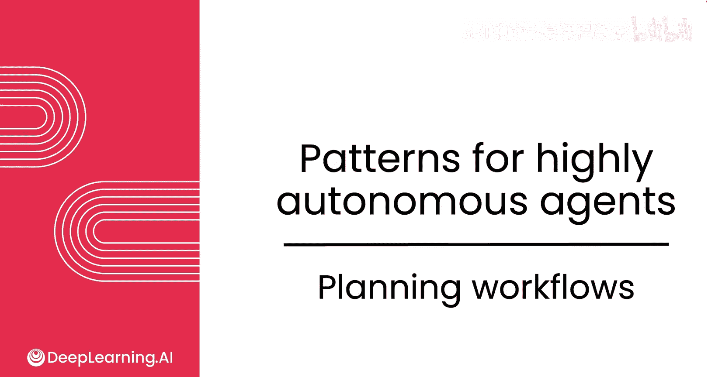
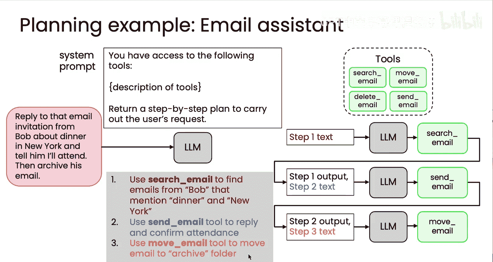

# 024：规划工作流 🧠

## 概述
在本节课中，我们将要学习一种名为“规划”的设计模式。这种模式能让您构建高度自主的智能体，无需预先硬编码执行步骤的固定顺序。智能体可以更灵活地自行决定需要采取哪些步骤来完成一项任务。我们将通过两个具体示例来理解规划模式的工作原理。



## 规划模式简介
上一节我们介绍了构建自主智能体的目标。本节中我们来看看实现这一目标的关键模式之一：规划。规划模式的核心思想是，让大型语言模型（LM）先制定一个多步骤的计划，然后逐步执行该计划，而不是直接执行最终任务。

## 示例一：客户服务智能体
假设您经营一家太阳镜零售店，库存信息存储在数据库中。您希望有一个客户服务智能体来回答诸如“你们有100美元以下的圆形太阳镜库存吗？”这样的复杂查询。

为了处理这类查询，我们需要为LM提供一组工具，例如：
*   `get_item_descriptions`：获取商品描述。
*   `check_inventory`：检查库存。
*   `get_item_price`：获取商品价格。

以下是构建此类智能体的关键步骤：

1.  **生成计划**：首先，我们提示LM根据用户请求生成一个分步计划。提示词可能如下：
    ```
    你可以使用以下工具：[工具列表]。请返回一个分步计划来执行用户的请求。
    ```
    对于上述查询，LM可能输出的合理计划是：
    *   步骤1：使用 `get_item_descriptions` 查找圆形太阳镜。
    *   步骤2：使用 `check_inventory` 检查找到的太阳镜是否有库存。
    *   步骤3：使用 `get_item_price` 检查库存中的太阳镜价格是否低于100美元。

2.  **执行计划**：生成计划后，我们引导LM逐步执行。
    *   我们将**步骤1**的文本（例如“使用 `get_item_descriptions` 查找圆形太阳镜”）连同用户查询和工具背景信息一起输入给LM，让它执行第一步操作。
    *   LM调用相应工具（`get_item_descriptions`）并获得结果（例如，找到两款圆形太阳镜）。
    *   接着，我们将**步骤2**的文本和**步骤1的输出结果**一起输入给LM，让它执行第二步（检查这两款太阳镜的库存）。
    *   同理，用**步骤3**的文本和**步骤2的输出结果**驱动LM执行第三步（检查价格）。
    *   最后，将所有步骤的结果汇总，让LM生成最终答案回复给用户。

这种方法的优势在于，开发者无需预先决定调用工具的确切顺序。对于不同的用户请求（例如“我想退回之前购买的金框眼镜，但不是金属框的那副”），LM可以动态生成不同的执行计划。

## 示例二：邮件助手智能体
让我们再看一个规划模式的例子：邮件助手。如果您想让它“回复Bob关于纽约晚宴邀请的邮件，然后将其归档”，我们可以为它提供以下工具：
*   `search_email`：搜索邮件。
*   `send_email`：发送邮件。
*   `move_email`：移动邮件。

以下是处理流程：

1.  **生成计划**：LM针对该请求可能生成如下计划：
    *   步骤1：使用 `search_email` 查找来自Bob关于纽约晚宴的邮件。
    *   步骤2：生成并发送确认出席的回复邮件。
    *   步骤3：将该邮件移动到归档文件夹。

2.  **执行计划**：与上一个示例类似，系统会引导LM依次执行这三个步骤，每一步都使用上一步的输出作为上下文。

## 规划模式的应用与挑战
规划模式已在许多高度自主的编码系统中成功应用。例如，当要求AI编写一个复杂应用程序时，它可能会先规划出需要构建的各个组件，形成一个检查清单，然后逐一完成。



然而，规划模式的应用目前在某些领域仍处于实验阶段，尚未广泛普及。它面临的一个挑战是可能使系统更难控制，因为开发者在运行时无法确切知道智能体会制定出什么样的计划。

尽管如此，规划是一项令人兴奋的技术，它使智能体无需为复杂任务硬编码精确的步骤序列。随着技术发展，我们将在越来越多的应用中看到它的身影。

## 总结
本节课中我们一起学习了**规划设计模式**。我们了解到，通过让大型语言模型先**制定分步计划**，再**逐步执行该计划**，可以构建出能够灵活处理复杂、多步骤任务的自主智能体。我们通过客户服务和邮件助手两个示例，具体分析了该模式的工作流程：`生成计划 -> 执行步骤1 -> 执行步骤2 -> ... -> 生成最终输出`。虽然规划模式赋予了系统更大的灵活性，但它也带来了可控性方面的挑战。在接下来的视频中，我们将更深入地探讨这些计划的具体形式以及如何将它们串联执行。