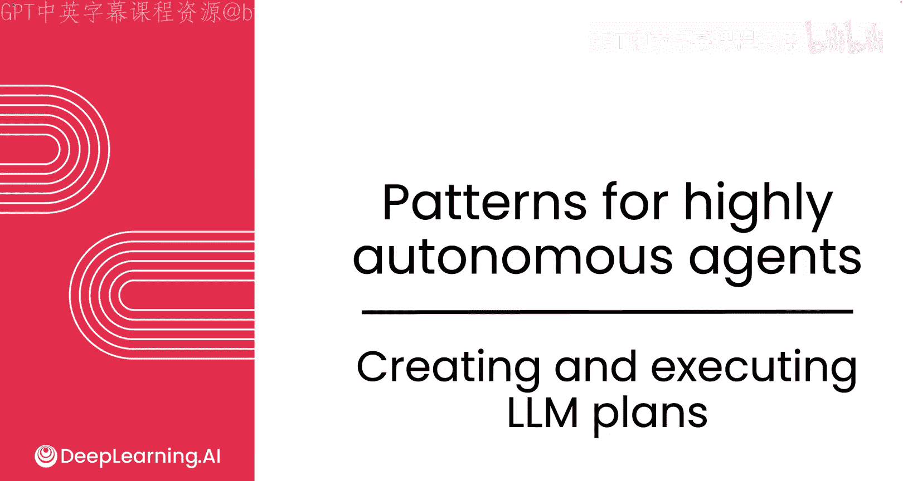
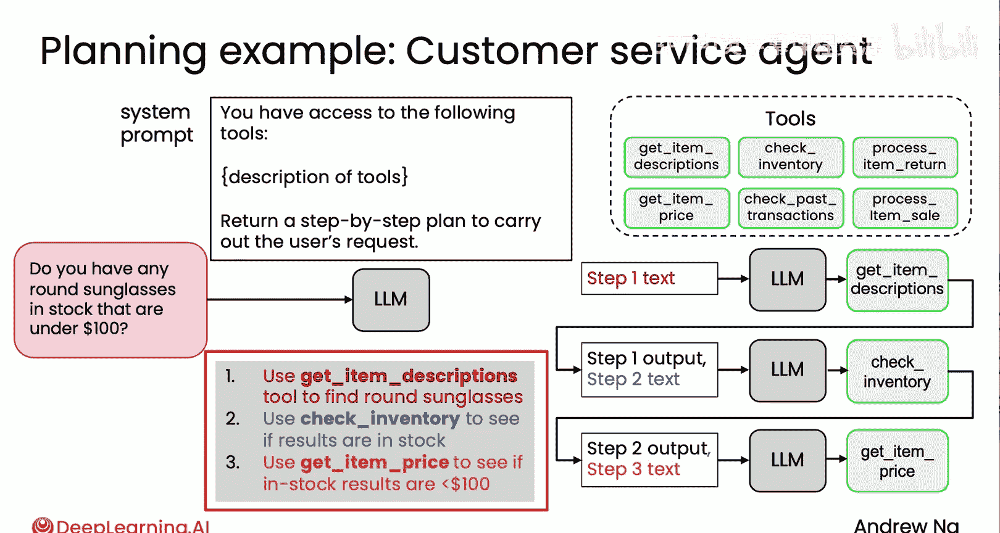
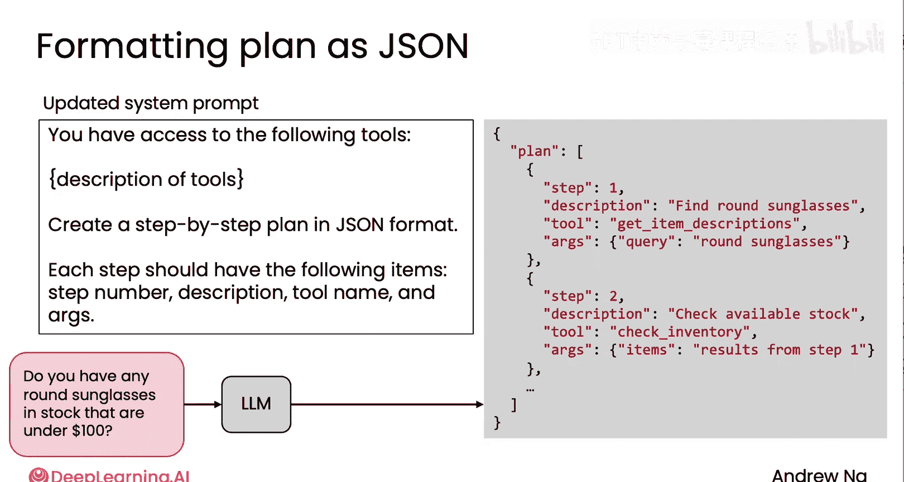

# 025：创建与执行LLM计划

在本节课中，我们将详细探讨如何提示大型语言模型（LLM）生成计划，以及如何读取、解释并执行该计划。让我们开始吧。




## 生成清晰的计划格式

上一节我们介绍了客户服务代理的示例计划，该计划使用了简单的文本描述进行高层级展示。本节中我们来看看如何让LLM编写更清晰、更详细的计划，而不仅仅是简单的高层文本描述。

许多开发者会要求LLM将计划格式化为JSON格式，以便执行。因为JSON格式允许下游代码以相对清晰、无歧义的方式解析计划的各个步骤。尽管目前领先的LLM在生成JSON输出方面表现良好，但系统提示词可以这样设计：

```json
{
  "system_prompt": "你拥有访问以下工具的权限：[工具列表]。请创建一个JSON格式的逐步计划。"
}
```

开发者需要足够详细地描述JSON格式，以引导模型输出类似右侧所示的计划结构。



## JSON计划结构解析

以下是JSON输出结构的一个示例。它创建了一个列表，其中第一个列表项包含清晰的键值对。


```json
{
  "plan": [
    {
      "step": 1,
      "description": "计划第一步的描述",
      "tool": "要使用的工具名称",
      "arguments": "传递给该工具的参数"
    },
    {
      "step": 2,
      "description": "计划第二步的描述",
      "tool": "要使用的工具名称",
      "arguments": "传递给该工具的参数"
    }
  ]
}
```

与用英语书写计划相比，这种JSON格式允许下游代码更清晰地解析计划的每一步，从而能够可靠地逐步执行。

## 其他计划格式选择

除了JSON，一些开发者也会使用XML。你可以使用XML分隔符或标签来明确指定计划的步骤及其编号。

```xml
<plan>
  <step number="1">
    <description>第一步描述</description>
    <tool>工具名</tool>
    <arguments>参数</arguments>
  </step>
</plan>
```

我感觉使用Markdown的开发者较少，因为它在如何解析方面有时略显模糊。而纯文本可能是这些选项中最不可靠的。但我认为，无论是这里展示的JSON还是XML，都是让LLM格式化计划的良好选择，可以确保计划明确无误。

## 执行JSON计划

通过以JSON格式生成计划，你可以解析它，并让下游工作流更系统化地执行计划的不同步骤。



## 进阶思路：用代码表达计划

在向LLM提供计划方面，还有一个非常巧妙的想法，可以让LLM输出非常复杂的计划并确保其可靠执行，那就是让LLM编写代码，并用代码来表达计划。


我们将在下一个视频中详细探讨这个思路。

## 总结

本节课中我们一起学习了如何引导LLM生成清晰的计划，重点介绍了使用JSON格式来结构化计划，以便于下游代码解析和执行。我们还简要了解了XML作为替代格式，并预告了让LLM通过编写代码来表达复杂计划的进阶方法。掌握这些格式和技巧，将帮助你构建更可靠、更易执行的AI代理工作流。