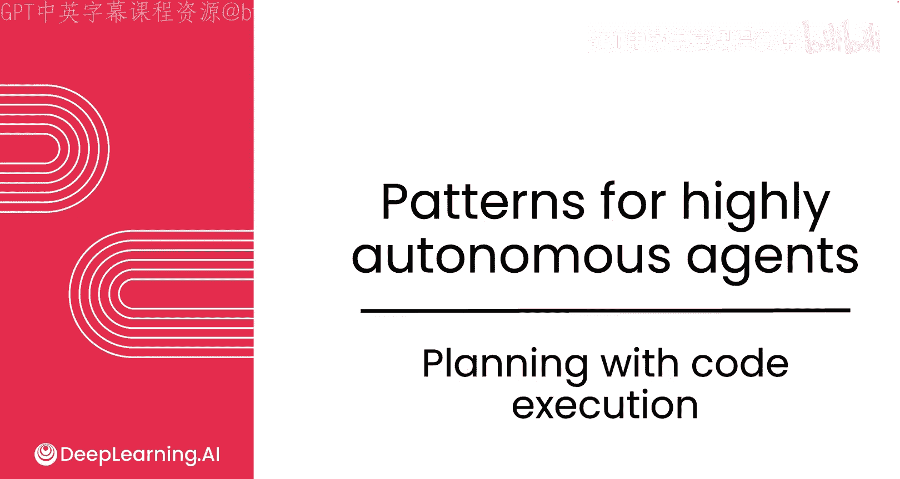
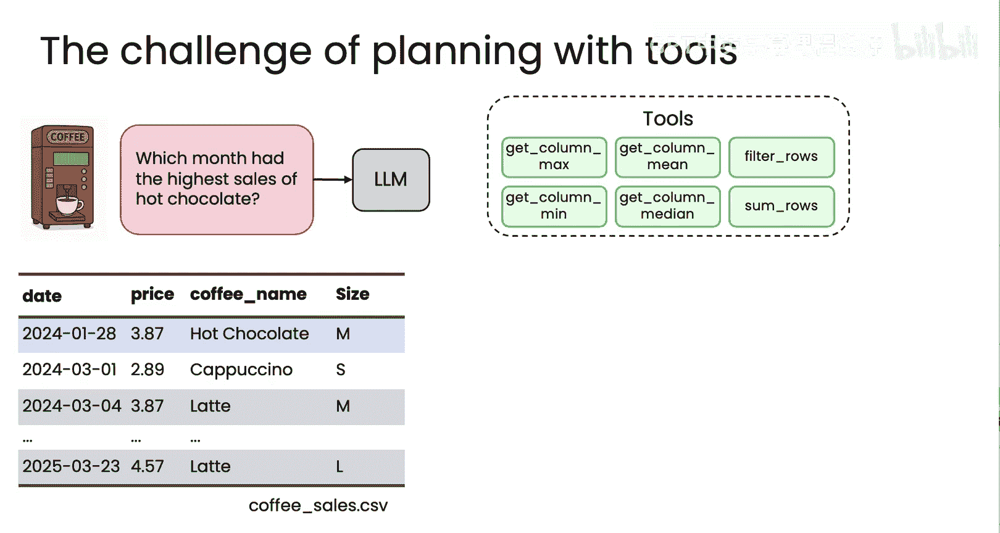
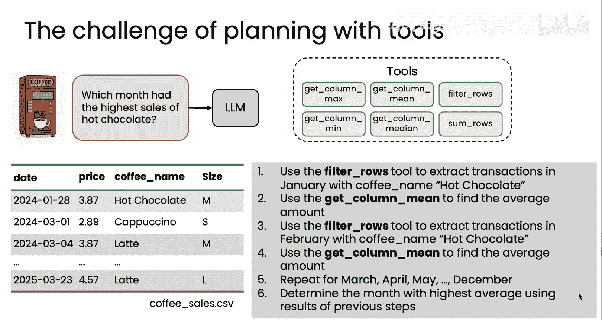
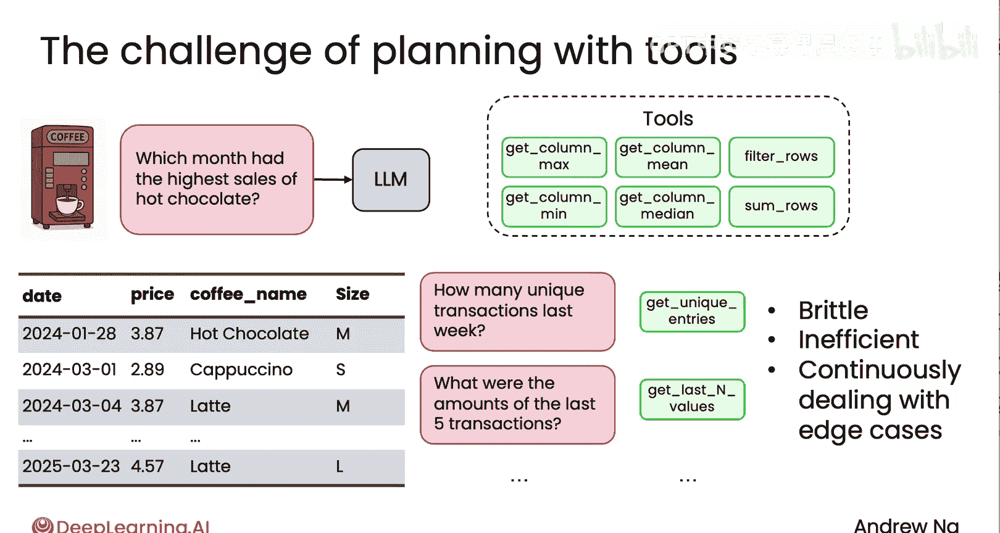
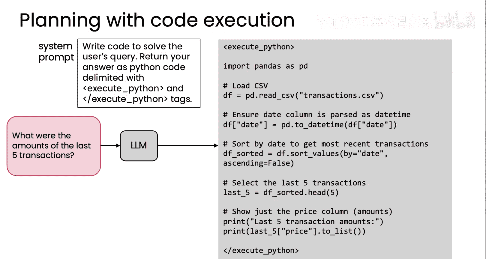
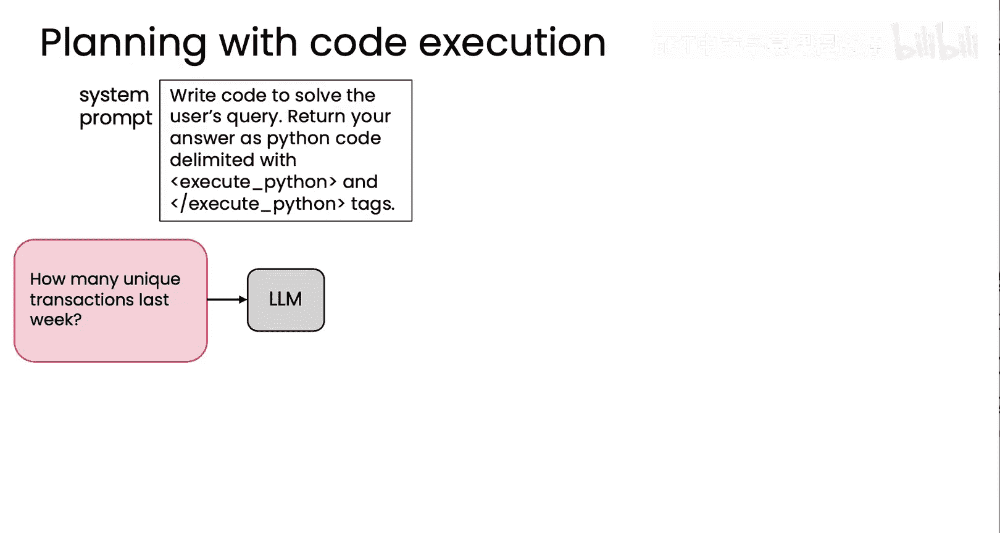
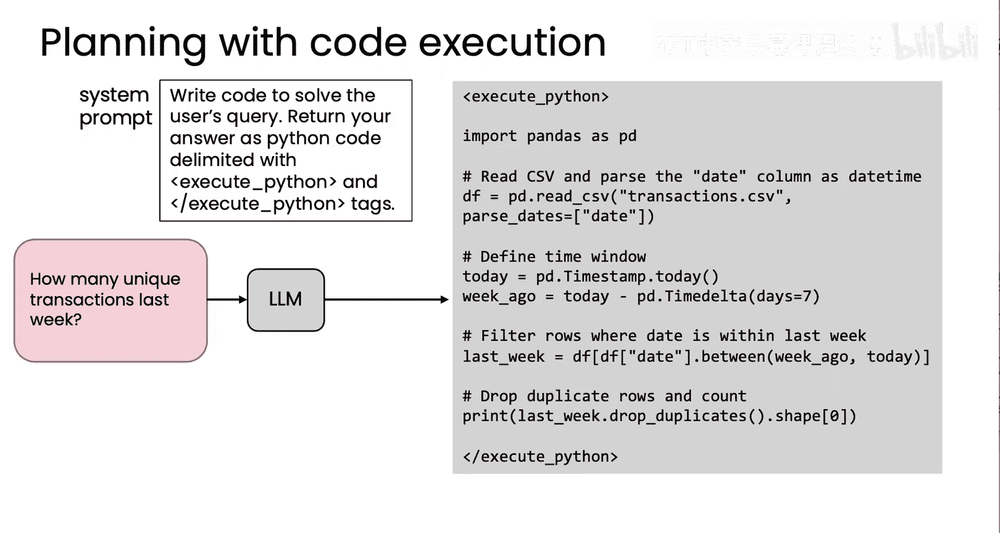
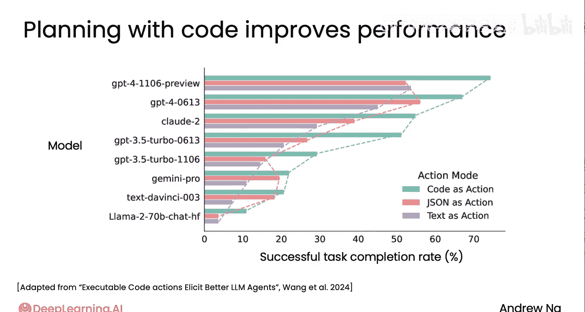

# 026：使用代码执行进行规划 🧠



在本节课中，我们将要学习一种强大的代理式AI规划技术：**使用代码执行进行规划**。我们将探讨其核心思想、适用场景、优势以及实现方式。

---

## 概述

传统的AI规划方式可能要求模型以JSON等格式逐步生成计划。然而，一种更高效的方法是让大型语言模型直接编写代码来制定并执行计划。这种方法允许模型通过代码捕获多步骤计划，并通过执行生成的代码来完成复杂任务。

上一节我们介绍了基础的规划概念，本节中我们来看看如何利用代码执行来实现更强大的规划能力。

---

## 为何使用代码执行进行规划？

假设你需要构建一个系统，用于回答关于咖啡机销售数据的问题。数据存储在一个类似下图的电子表格中。




你可能会为模型提供一系列工具函数来处理数据，例如：
*   `get_column_max`：获取某列的最大值。
*   `get_column_mean`：获取某列的平均值。
*   `filter_rows`：根据条件筛选行。

以下是这些工具函数的示例代码：

```python
# 示例工具函数
def get_column_max(dataframe, column_name):
    return dataframe[column_name].max()

def filter_rows(dataframe, condition):
    return dataframe.query(condition)
```

如果用户提问：“哪个月份的热巧克力销售额最高？”，使用上述工具回答会非常复杂。你需要：
1.  用 `filter_rows` 筛选出一月份所有热巧克力的交易。
2.  对这些交易进行统计。
3.  对二月份重复步骤1和2。
4.  对三月份重复...
5.  ...一直重复到十二月。
6.  最后，从所有月份的结果中找出最大值。





这个过程不仅繁琐，而且当用户提出新问题时，例如“上周有多少笔独特的交易？”，现有的工具可能无法直接回答。这通常导致开发者需要不断创建新的、更具体的工具函数来覆盖各种边缘情况，效率低下。

---

## 更好的方法：让模型编写代码

与其提供大量特定工具，不如直接提示模型：“请编写代码来解决用户的问题，并将答案以Python代码形式返回。”

例如，你可以使用这样的提示词：

```python
prompt = f"""
请编写Python代码来解决用户查询。
将你的代码包裹在 <execute> 和 </execute> 标签中。
用户查询：{user_query}
可用数据：coffee_sales.csv
"""
```


模型可能会生成如下代码：

```python
import pandas as pd

# 加载数据
df = pd.read_csv('coffee_sales.csv')
# 确保日期列格式正确
df['date'] = pd.to_datetime(df['date'])
# 按日期排序
df_sorted = df.sort_values('date')
# 选择最后五笔交易
last_five = df_sorted.tail(5)
# 仅显示价格列
result = last_five[['price']]
print(result)
```

在这段代码中，模型实际上制定了一个清晰的计划：
1.  加载CSV文件。
2.  解析日期列。
3.  按日期排序数据。
4.  选择最后5行。
5.  提取价格列并输出。

通过使用像Python（及Pandas库）这样的编程语言，模型可以利用其训练数据中见过的成百上千个内置函数来组合成计划，从而灵活应对各种复杂查询。



对于“上周有多少笔独特交易？”这样的问题，模型同样可以生成一个包含多个步骤（如读取数据、定义时间窗口、筛选行、去重、计数）的代码计划来直接解决。



---

## 优势与注意事项

**核心优势**：
*   **表达能力强**：代码可以简洁地表达包含多步骤和复杂逻辑的计划。
*   **利用现有知识**：模型可以利用其对编程语言和常用库（如Pandas、NumPy）的丰富知识。
*   **减少工具开发**：无需为每个特定任务预先构建大量专用工具。

**重要注意事项**：
*   **安全执行环境**：必须在一个安全的沙箱环境中执行模型生成的代码，以防止恶意或错误代码对主系统造成损害。这是一个关键的安全考量。
*   **适用场景**：此方法最适合那些本质上可以通过编写代码来解决的任务，例如数据分析、文件处理、计算等。



---

## 效果对比

根据相关研究（如Xyao Wang等人的工作），在许多任务上，让模型“编写代码作为行动”的方法，其性能优于让模型“编写JSON计划”或“编写纯文本计划”。




图表显示，**代码作为行动 > JSON计划 > 文本计划**。当然，对于需要集成特定自定义工具的应用，编写代码可能不是唯一选择，但在适用的情况下，它是一种非常强大的规划表达方式。

---

## 总结与展望

本节课中我们一起学习了**使用代码执行进行规划**这一设计模式。我们了解到：

1.  **核心思想**：让大型语言模型通过编写可执行代码来表达和实现复杂计划，而非逐步输出结构化指令。
2.  **适用场景**：尤其适合数据处理、自动化脚本等可通过编程解决的任务。
3.  **关键优势**：极大地扩展了模型的计划能力，减少了为每个功能开发专用工具的需要。
4.  **重要前提**：必须在安全的沙箱环境中执行生成的代码，并评估其任务适用性。

目前，这一技术在最先进的**智能编程助手**中得到了卓越应用。这些助手能够为编写复杂软件制定详细计划（如先构建A模块，再构建B模块，然后进行集成测试），并逐步执行该计划。

尽管在编程领域之外，规划技术的应用仍在发展和探索中，并且放弃部分控制权以换取模型更强的自主性也需要权衡，但这无疑是一项重要且前沿的技术，有望在未来解决更广泛的问题。

这节关于规划的内容就到此结束。在本模块中，最后一个我希望与你分享的设计模式是：**如何构建多智能体系统**。在这种系统中，并非只有一个智能体，而是多个智能体协同工作以完成任务。让我们在下一个视频中一探究竟。