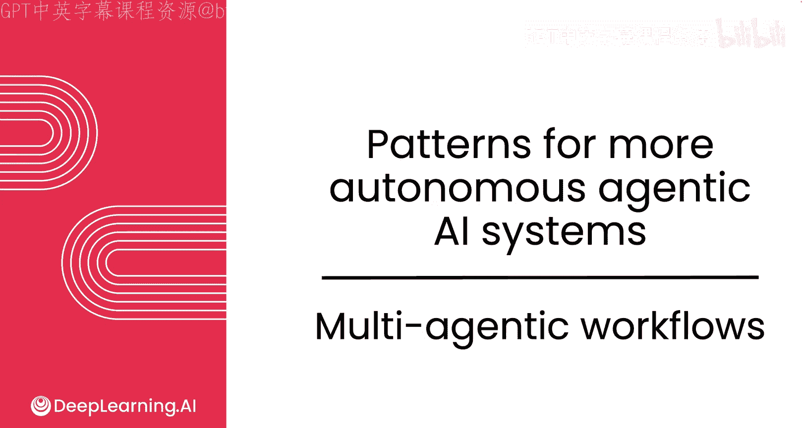
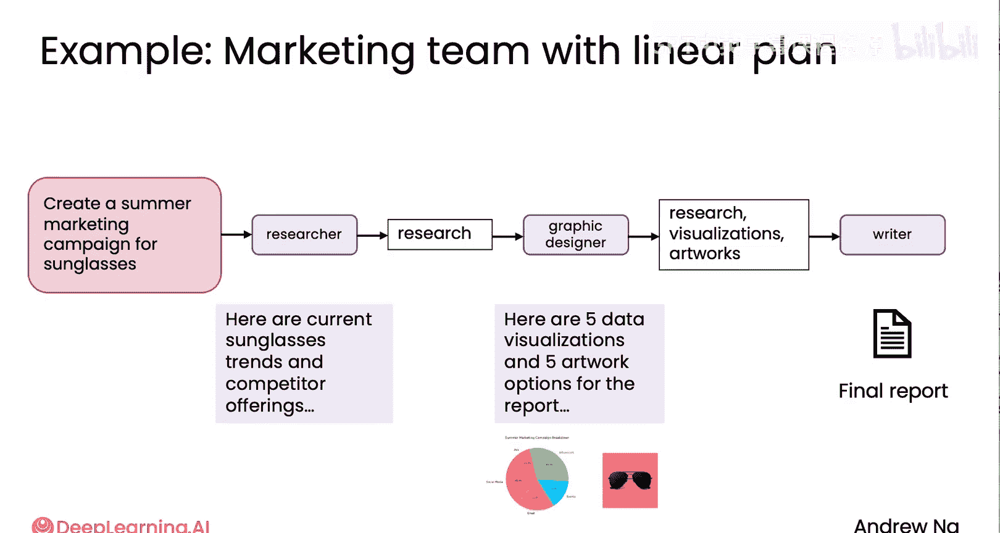
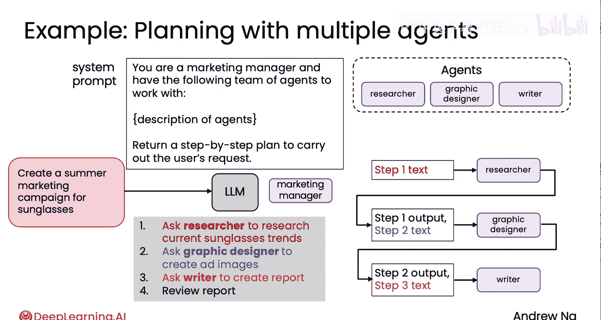

# 027：多智能体工作流 🚀

在本节课中，我们将要学习如何构建多智能体系统，让多个AI智能体协同工作，以完成复杂的任务。我们将探讨多智能体系统的设计理念、构建方法以及不同的协作模式。

## 概述

之前我们讨论了如何构建单个智能体来完成任务。在多智能体工作流中，我们将拥有一组智能体，它们通过协作来为你完成工作。这类似于在软件开发中将任务分解为多个进程或线程，或者在现实世界中组建一个各司其职的团队来完成复杂项目。

## 为什么需要多智能体系统？

有些人初次听说多智能体系统时会疑惑：为什么需要多个智能体？我反复提示同一个大语言模型，使用同一台计算机，不就可以了吗？

一个有用的类比是：尽管我们在一台计算机上工作，但我们通常会将工作分解为多个进程或线程。作为开发者，思考如何将工作分解为多个进程或程序来运行，会使编写代码变得更加容易。同样地，面对复杂任务时，与其思考如何雇佣一个人来完成，不如考虑雇佣一个由不同角色组成的团队来分别处理任务的各个部分。

在实践中，对于许多代理式系统的开发者来说，一个有效的思维框架是：不要问“我应该雇佣哪一个人来做这件事？”，而是问“雇佣哪三四个不同角色的人来共同完成这个整体任务更有意义？”这提供了一种将复杂事物分解为子任务，并逐一为这些子任务构建解决方案的方法。

## 多智能体工作流实例：创建营销材料

让我们通过一个具体例子来看看这是如何运作的。假设任务是创建营销材料，例如为一款太阳镜制作营销宣传册。

一个自然的团队分工可能包括：
*   **研究员**：负责研究太阳镜市场趋势和竞争对手的产品。
*   **平面设计师**：负责制作图表或精美的太阳镜图片。
*   **文案撰写人**：负责整合研究报告和设计素材，撰写一份美观的宣传册。

以下是这些角色可能承担的具体任务：

*   **研究员**：分析市场趋势，研究竞争对手。在设计研究员智能体时，需要考虑它需要哪些工具来完成研究报告。一个自然的工具是**网络搜索**，就像人类研究员需要上网搜索一样。
*   **平面设计师**：创建视觉艺术品。这个智能体可能需要**图像生成和处理的API**，或者像之前咖啡机例子中那样，需要**代码执行**能力来生成图表。
*   **文案撰写人**：将研究和报告文本转化为营销文案。在这种情况下，除了大语言模型本身生成文本的能力外，它可能不需要其他特殊工具。

在接下来的讲解中，我们将用紫色方框代表一个智能体。构建单个智能体的方法是通过提示大语言模型来扮演特定角色（如研究员、设计师或撰写人）。例如，对于研究员智能体，你可以这样提示：
`你是一个研究员智能体，负责分析太阳镜产品的市场趋势和竞争对手。请进行在线研究，分析太阳镜产品的市场趋势，并总结竞争对手的动态。`

类似地，通过提示大语言模型扮演平面设计师（配备相应工具）和文案撰写人，你就可以构建出这些智能体。

## 智能体协作模式

构建好这三个智能体后，让它们协同工作以生成最终报告的一种方式是采用**线性顺序工作流**。

例如，要创建太阳镜的夏季营销活动：
1.  你将任务提示给**研究员智能体**。
2.  研究员生成一份报告，内容为“当前太阳镜趋势与竞品分析”。
3.  将这份研究报告传递给**平面设计师智能体**。设计师根据研究发现的数据，创建一些数据可视化和艺术设计方案。
4.  将所有素材传递给**文案撰写人智能体**。撰写人整合研究和图形输出，撰写最终的营销宣传册。

以这种方式构建多智能体工作流的优势在于，设计研究员、设计师或撰写人时，你可以一次专注于一件事。你可以花时间构建最好的平面设计师智能体，而你的合作者可以同时构建研究员和撰写人智能体，最后再将它们串联起来，形成这个多智能体系统。在某些情况下，开发者开始复用一些智能体。例如，构建了一个用于营销宣传册的平面设计师后，可以考虑将其构建得更通用，使其也能帮助撰写社交媒体帖子和网页插图。

## 更复杂的协作：管理者智能体

上面展示的是一个线性计划，即研究员、设计师、撰写人依次工作。除了线性计划，智能体之间还可以以更复杂的方式互动。

让我用一个例子来说明涉及多个智能体的规划。之前我们看到了如何给一个大语言模型一套工具来执行不同任务。而在这里，我们将给一个大语言模型调用不同智能体的选项，让它请求不同智能体帮助完成不同任务。

具体来说，你可以写一个这样的提示：
`你是营销经理，拥有以下团队智能体可供调用：[此处描述研究员、设计师、撰写人智能体]。`
这与我们进行规划和工具调用的过程非常相似，只是绿色的“工具”框被紫色的“智能体”框所取代。

然后，我们要求它返回一个分步计划来执行用户的请求。在这种情况下，它可能会：
1.  要求研究员研究当前太阳镜趋势并报告。
2.  要求平面设计师创建图像并报告。
3.  要求文案撰写人创建报告。
4.  最后，可能选择审查或反思并改进报告一次。

执行这个计划时，你会按步骤进行：研究员执行研究，将结果传给设计师，再传给撰写人，最后可能进行一步反思，然后任务完成。

这个工作流的一个有趣视角是：除了上面这三个智能体，左边这个大语言模型本身就像是**第四个智能体**——一个营销经理智能体。它负责设定方向，并将任务委派给研究员、设计师和撰写人智能体。因此，这实际上是一个由四个智能体组成的集合：一个营销经理智能体协调着研究员、平面设计师和文案撰写人智能体的工作。

## 总结与展望

在本视频中，你看到了两种通信模式：
1.  **线性模式**：智能体依次采取行动，直到任务结束。
2.  **管理者协调模式**：一个管理者智能体协调其他几个智能体的活动。

事实证明，在构建多智能体系统时，一个关键的设计决策就是确定不同智能体之间的**通信模式**。这是一个热门的研究领域，目前正在涌现多种模式。

在下一节课中，我将向你展示一些最常见的通信模式，用于让你的智能体彼此协作。让我们在下一个视频中继续探讨。😊

