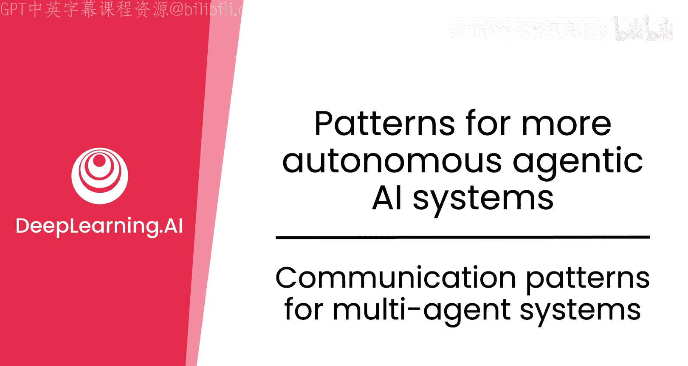
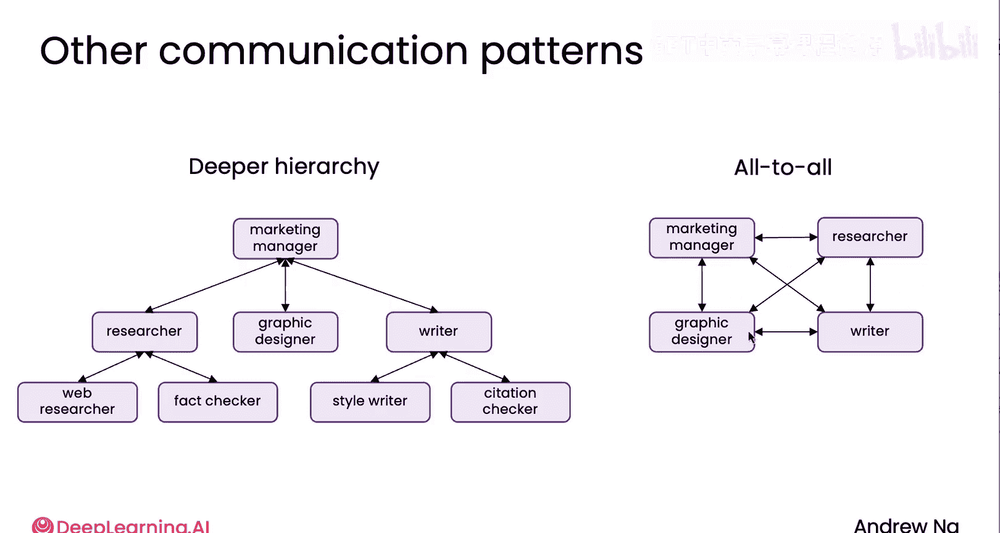

# 028：多智能体系统的通信模式 🗣️

在本节课中，我们将要学习多智能体系统中几种常见的通信模式。理解这些模式对于设计高效协作的智能体团队至关重要。

当一个人工智能团队共同工作时，它们之间的通信模式可能相当复杂。事实上，设计一个组织结构图以找到人员之间最佳的沟通与协作方式，本身就是一项复杂的任务。

事实证明，为多智能体系统设计通信模式也同样复杂。接下来，我将展示几种目前不同团队最常用的设计模式。

## 线性通信模式 📈

首先，我们来看一个最常见的通信计划。在一个采用线性计划的营销团队中，研究员首先工作，然后是平面设计师，最后是文案。其通信模式是线性的。

以下是线性通信模式的工作流程：
*   研究员与平面设计师沟通。
*   研究员和平面设计师都可能将输出结果传递给文案。

这是一种非常线性的通信模式，也是我目前所见最常用的两种通信计划之一。

## 分层通信模式 🏢

上一节我们介绍了线性模式，本节中我们来看看第二种最常见的通信计划。它类似于我们在使用多智能体进行规划的示例中所见，即存在一个管理者，负责与多个团队成员沟通并协调他们的工作。

在这个例子中，营销经理决定调用研究员来完成一些工作。你可以想象，营销经理收到报告后，将其发送给平面设计师；收到平面设计师的报告后，再指示文案。这就是一种分层通信模式。

如果你要实际实现分层通信模式，让研究员将报告传回给营销经理，而不是由研究员直接将结果传递给平面设计师和文案，可能会更简单。因此，这种由一个管理者协调多个其他智能体工作的分层结构，也是一种相当常见的规划通信模式的方式。

## 其他通信模式 🔄

除了上述两种主流模式，还有一些更高级、使用频率较低但在实践中有时会用到的通信模式。

### 深层分层结构

这种模式与之前类似，设有营销经理、研究员、平面设计师和文案。但研究员自己可能还会调用另外两个智能体，例如网络研究员和事实核查员。平面设计师可能独立工作，而文案则可能拥有一名初级风格写手和一名引文检查员。

这构成了一种分层组织的智能体结构，其中某些智能体自身可以调用其他子智能体。我在一些应用中也见过这种模式，但它比单层分层结构复杂得多，因此目前使用较少。

### 全互联通信模式

最后一种模式执行起来颇具挑战性，但我看到一些实验性项目在使用它，即全互联通信模式。

在这种模式中，任何智能体都可以在任何时间与其他任何智能体交谈。实现方式是，提示所有四个智能体（在本例中），告知它们可以决定调用其他三个智能体。每当一个智能体决定向另一个智能体发送消息时，该消息就会被添加到接收方智能体的上下文中。然后，接收方智能体可以思考一段时间，再决定何时回复第一个智能体。

于是，所有智能体在一个群体中协作，相互交谈一段时间，直到每个智能体都声明自己完成了任务，停止交谈。也许当所有人都认为完成时，或者当文案认为足够好时，就生成最终输出。

在实践中，我发现全互联通信模式的结果有点难以预测。因此，一些不需要高度控制的应用可以运行它，看看能得到什么。如果营销手册不够好，也许没关系，只需再次运行，看看是否能得到不同的结果。我认为，对于那些愿意容忍一点混乱和不可预测性的应用，我确实看到一些开发者在使用这种通信模式。

## 工具与框架 🛠️

我希望以上内容能传达出多智能体系统的丰富性。目前也有相当多的软件框架，支持轻松构建多智能体系统，并且它们也能相对容易地实现上述一些通信模式。因此，如果你要构建自己的多智能体系统，可能会发现这些框架对于探索这些不同的通信模式也很有帮助。

本节课中我们一起学习了多智能体系统的几种核心通信模式：线性的、分层的、深层分层的以及全互联的。理解这些模式是设计高效、可控的智能体协作系统的关键基础。

现在，这把我们带到了本模块也是本课程的最后一个视频。让我们进入最后的视频进行总结。