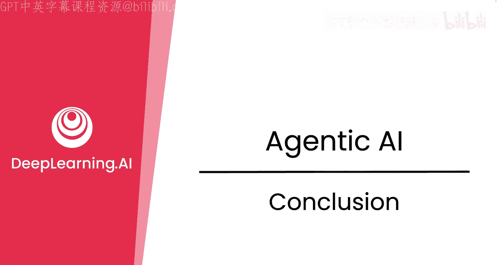
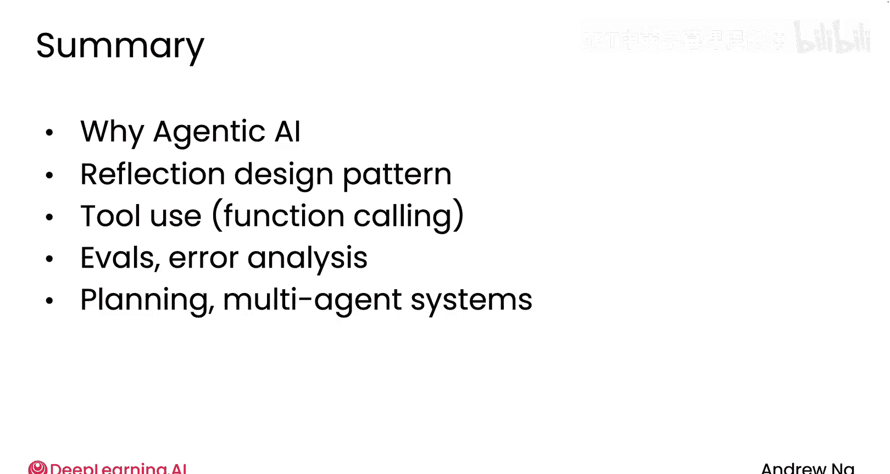

# 029：课程总结 🎓

在本节课中，我们将回顾整个课程的核心内容，总结从基础概念到高级应用的关键知识点，并展望如何将这些技能应用于实际项目中。

---

## 课程回顾 📚

上一节我们介绍了多智能体系统等高级主题，本节中，我们来对整个课程进行总结。

首先，我们回顾了本课程涵盖的五个主要模块。

以下是各模块的核心内容：

1.  **模块一：应用前景**
    我们探讨了利用代理式AI可以构建哪些前所未有的应用程序。

2.  **模块二：关键设计模式**
    我们开始研究关键的设计模式，包括反思设计模式。这是一种有时能为你的应用带来显著性能提升的简单方法。

3.  **模块三：工具使用与评估**
    我们深入讨论了工具使用和函数调用，这扩展了你的LLM应用的能力，代码执行是其中一个重要案例。我们还花了大量时间讨论评估、错误分析，以及如何通过严谨的构建和分析流程，持续高效地提升代理式AI系统的性能。

4.  **模块四：实用构建技巧**
    第四模块包含了一些我认为在你长期构建代理式AI系统时会发现最有用的材料。

5.  **模块五：规划与多智能体系统**
    在这个模块中，我们讨论了规划与多智能体系统，它们能让你构建更强大（尽管有时更难控制、更难预测）的高级系统。

---

## 技能应用与职业机会 💼

凭借从本课程中学到的技能，我认为你现在已经知道如何构建许多酷炫、令人兴奋的代理式AI应用。

当我的团队或我面试求职者时，我发现面试官常常试图评估候选人是否具备与本课程所教授内容相似的技能。

因此，我希望本课程也能为你开启新的职业机会。

无论你是为了兴趣还是为了专业的实际应用场景，我相信你都会享受现在可以构建的这一系列新事物。

---

## 总结与致谢 🙏

最后，我想再次感谢你花时间与我一起学习。

我希望你能掌握这些技能，负责任地使用它们，并着手构建出色的应用。

在本节课中，我们一起回顾了代理式AI的核心概念、设计模式、评估方法以及高级系统构建。从反思模式到多智能体协作，你已掌握了构建智能、高效AI代理所需的关键知识与实践技能。现在，是时候将这些知识付诸实践，创造属于你的智能应用了。