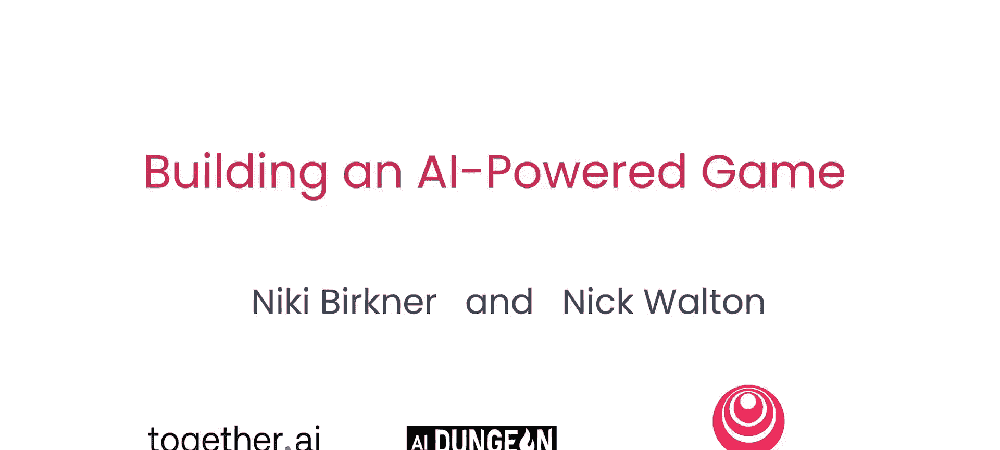
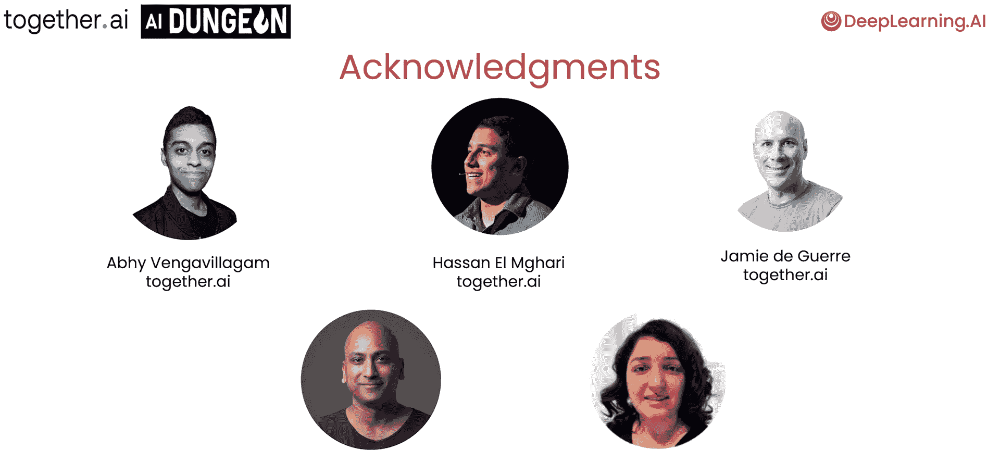

# 001：课程介绍 🎮

在本课程中，我们将学习如何从零开始构建一个由AI驱动的文字冒险游戏。你将掌握使用大语言模型（LLM）进行游戏开发的核心技术，包括世界构建、游戏机制设计以及生产部署，最终完成一个可以分享给朋友的可玩项目。

课程由Together AI的资深产品经理Nikki Burrkner和AI Dungeon（由Latitude公司开发）的CEO兼联合创始人Nick Walton共同讲授。Nikki在Together AI的产品开发中发挥了关键作用，而Nick则从一次黑客马拉松中创建了最初的AI Dungeon，并专注于开发只有借助AI才能实现的新型游戏体验。

---

## 课程内容概述 📚

上一段我们介绍了讲师和课程目标，接下来我们详细了解一下你将学习的具体内容。

以下是本课程涵盖的核心模块：

1.  **世界创建**：你将学习使用**提示工程**和**分层内容生成**技术，根据你的提示指令创造一个完整的世界，包括王国、城镇和角色，让你的游戏体验栩栩如生。
2.  **构建交互式AI应用**：你将学习创建一个AI角色扮演游戏，并将你构建的世界整合到一个有趣的游戏体验中。
3.  **实现复杂游戏机制**：你将学习利用AI将文本数据解析为**结构化JSON输出**。这项技术能让你构建物品栏检测系统等机制，以追踪和利用结构化的游戏状态。
4.  **内容安全与合规**：你将学习如何基于指定策略，为AI游戏内容生成强制执行内容安全和合规性。同时，你将使用**LlamaGuard**为自己的游戏构建自定义策略。

掌握这些技术后，你将能够从游戏开始，构建更具创造性和创新性的AI应用。

---

## 致谢与课程启动 🙏

本课程的完成离不开许多人的共同努力。在此感谢来自Together AI和AI Dungeon的Abbi Vanga、Vigam、Hasan El Megari、Jamie theger、Vi Paul Vt Prakash，以及来自DeepLearning.AI的Dila Ezeine。

第一节课将围绕世界创建展开，你将运用提示工程和分层生成技术来创造游戏世界。

你准备好了吗？让我们进入下一个视频，正式开始学习。