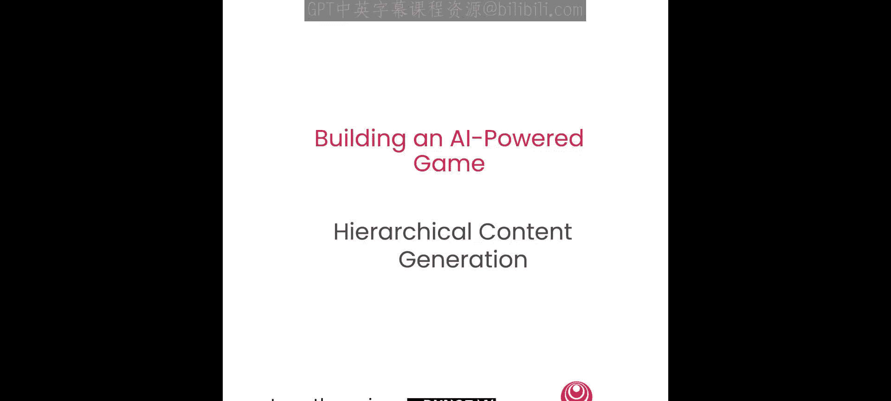
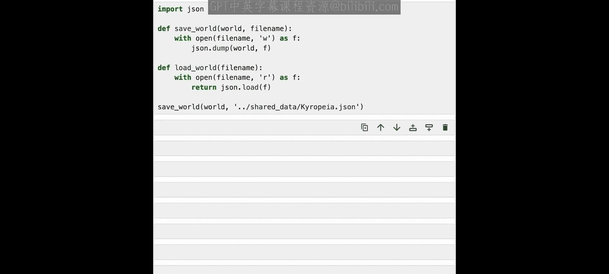

# 002：分层内容生成 🏗️



在本节课中，我们将学习如何使用分层内容生成技术，根据你的提示指令创建一个完整的世界。你将决定想要创建的世界类型，然后分层生成王国、城镇和角色，最终构建一个各部分紧密相连的完整世界。


## 什么是分层内容生成？🤔

上一节我们介绍了课程目标，本节中我们来看看核心方法。

分层内容生成是一种利用AI创建大量内容的方法，它能确保内容具有高度的一致性和连贯性。你首先需要生成一个关于要创建内容类型的高级概述，然后逐步深入到更具体、更细化的层面。关键在于，生成较低层级的内容时，它会知晓较高层级已生成的内容。因此，第一层的信息会输入到第二层，第二层再输入到第三层，依此类推。

例如，如果你想创建一本教科书，你可以从描述这本书的主题开始。然后生成章节标题，接着是各级标题和副标题，最后生成教科书的所有段落文本。最终，你将得到一本从宏观到微观都围绕同一主题、内容连贯的教科书。同样的方法也适用于创作剧本或商业计划。

在我们的案例中，我们将为一个奇幻世界应用此方法。我们将从生成世界描述开始，然后是王国、城镇，你还可以生成这些城镇中的地点和角色。通过这种方式，你能够创建出一整套内容连贯的集合。你只需在高层级给出简单的方向（比如你想要什么样的世界或书籍），最终就能得到一套详尽完整的内容，供你随意使用。

## 为何使用分层内容生成？✨

以下是分层内容生成带来的几个显著优势：

*   **以少量输入创造大量内容**：你无需向AI详细描述世界中的一切，只需说“我想要一个这样的世界”，然后AI就会遵循这个指令创建所有元素。
*   **支持人工介入引导方向**：例如，你可以先创建世界，然后说“我喜欢这个王国，不喜欢那个主题”。在你告知AI你的偏好后，再让它生成下一组内容。对于教科书，你也可以说“保留这章，删除那章”。
*   **确保大量内容的高度一致性**：这种方法让你创建的内容彼此高度一致，并能以引人入胜的方式完美融合在一起。

## 如何提升内容的整体性？🌐

为了进一步提升内容的整体性和全面性，你可以在生成同一层级的后续内容时，引入之前已生成的内容作为参考。

例如，如果你只是说“在这个王国里生成10个城镇”，那么在生成第二个城镇时，AI并不知道第一个城镇的样子，这可能导致生成的第二个城镇与第一个有些相似，从而产生大量看起来雷同、重复的内容。通过将同一层级已生成的内容作为输入，AI就能知道之前生成了什么，从而可以尝试生成不同的内容。

例如，如果AI要生成10个城镇，并且它知道之前生成的所有城镇信息，它就可以判断：“我们已经有一个这样的城镇了，现在来创建一个有点不同的吧。”也许新城镇规模更大，或者有不同的风格或氛围。因此，将同一层级已生成的内容反馈给其他元素的生成过程，有助于实现更全面的内容生成。

## 开始编写代码 💻

好了，让我们开始编写代码。首先，我们要创建世界。为此，我们需要给AI下达关于如何创建世界的指令。

### 生成世界 🌍

我们将首先给出一些通用指令，说明我们希望AI以何种方式生成输出。这是AI提示编程的标准做法。这里，我们只需给出关于任务本身的一些指令，以及关于我们希望使用的语言风格和输出长度的基本细节。

然后，我们将给出一个更具体的提示来生成世界。现在，我们可以就我们想要生成的具体世界类型给出指令。假设我们想延续“巨型野兽”这个概念，我们可以给出指令：“为一个奇幻世界创作一个富有创意的描述，其核心概念是城市建立在巨型野兽的背上。”我们还会告诉AI我们希望输出的具体格式，以便后续解析。我们让它生成一个世界名称和世界描述，并给出起始提示，让它知道接下来该做什么。

现在，我们将使用Together AI API来生成这个世界。我们导入库，创建客户端，然后调用API来生成这个世界。

```python
# 示例代码结构：调用AI API生成世界描述
import together

client = together.Together()
response = client.completions.create(
    model="模型名称",
    prompt="生成一个奇幻世界描述，城市建立在巨型野兽背上。输出格式：名称：<世界名>，描述：<描述>",
    max_tokens=500
)
world_output = response.choices[0].text
```

现在让我们解析这个输出，看看得到了什么。我们得到了一个名为“Caropia”的世界，描述是：一个古老的巨型生物“巨像”漫游大地的领域，它们庞大的身躯是蔓延都市的基石。现在，我们有了一个由AI生成的世界。如果需要，我们可以稍作编辑，或者生成更多选项。你可以根据自己的想法给出指令，创建你想要的世界类型，比如水世界、科幻世界等，然后在此基础上继续构建。我们将使用这个世界，并继续下一步。我们只需解析这个输出，以便稍后创建这个世界JSON结构时使用。

### 生成王国 👑

现在让我们继续生成王国。我们将使用相同的写作风格指令，但会添加关于如何生成王国的新指令。

这里，我们将告诉AI为我们输入的世界创建三个王国。我们可能会让它描述王国的重要领袖、文化或历史，并给出我们想要的输出结构。请注意，我们是一次性生成所有王国，这让我们能够实现整体内容生成：AI可以规划“第一个王国是这样的，第二个王国做些不同的，第三个再进一步变化”，从而使它们共同拥有一系列有趣的混合属性。

和之前一样，我们可以运行它，其中系统提示是通用生成指令，用户提示是生成王国的具体指令。

```python
# 示例代码结构：生成王国
kingdom_prompt = f"""
基于以下世界描述，生成三个王国。
世界：{world_description}
每个王国请提供：名称：<王国名>，描述：<描述>。
"""
response = client.completions.create(
    model="模型名称",
    prompt=kingdom_prompt,
    max_tokens=800
)
kingdoms_output = response.choices[0].text
```

现在，我们将解析输出结果，得到一组王国。我们将为王国设置一个字典，获取输出内容，然后为每个王国解析出名称和描述，以便创建包含名称、描述及其所属世界的王国对象，并填充该字典。然后，我们可以将这些王国添加到世界中，作为这个世界的一部分，并打印出我们得到的内容。

我们看到了在这个世界中创建的三个王国。例如，其中一个王国建立在一个名为Lysandra的巨像上，其人民隐居且崇尚精神世界，他们能聆听那个特定巨像的低语。这样，我们就得到了一个基于这个世界的独特王国。

### 生成城镇 🏘️

现在，我们将继续为城镇做同样的事情，这与生成王国非常相似。我们将创建一个城镇提示，给出输出指令，并且这次我们不仅输入世界信息，还会输入王国信息，然后生成城镇。

现在，让我们定义一个函数，它接收世界和王国信息，并能为该王国创建城镇。我们将使用刚刚创建的提示来告诉AI应该生成什么。我们将获取城镇的输出结果，然后对每个城镇进行同样的操作：解析名称和描述，创建一个城镇对象，然后将其添加到我们的王国中。

运行它，为我们的王国创建城镇。

你可以看到，我们为我们生成的每个王国都创建了几个城镇。你可以更改这个数量，创建更多或更少。你可以修改这些指令的工作方式，以及你想要创建何种类型的城镇。最后，我们只是打印了其中一个城镇，但每个城镇都有描述。例如，我们看到了“Are‘s Peak”，这是一个位于Lysandra巨角之巅的城镇，俯瞰着西部平原的广阔区域。你可以看到，它与之前创建的王国风格一致，都围绕着他们所栖息的巨型野兽的精神力量展开。

### 生成角色 🧙

最后，我们将为这个世界生成一些角色。在游戏中，我们称这些为NPC（非玩家角色），他们将居住在我们刚刚生成的城镇和王国中。

与之前类似，我们将创建一个提示，说明我们希望AI如何生成这些角色，例如他们的外貌、职业，以及一些更深层次的背景。现在，我们将输入世界、王国和城镇所有这些更高层级的信息，来生成角色。

现在，我们将创建一个类似的函数，基于世界、王国和城镇来生成这些NPC。

这里我们创建生成请求，用提示调用AI模型来生成一个角色，同样地，我们解析出他们的名称和描述，并为这个NPC设置名称、描述、世界、王国和城镇信息，然后将其添加到我们的世界中。

现在，让我们至少为我们的一个王国创建NPC。为了节省时间，我们不会为所有王国都创建，但你可以遍历并为你的世界中的所有城镇和王国生成任意数量的NPC。

首先，我们为Luminaria镇创建角色，我们看到它创建了三个角色：Kaeren、Aaron Vex和Lirian Flynn。然后为Ethes镇，我们可能有Kan Darkhaven、Allra Moonwsper和Thrin Blackfi。最后为Terra Verde镇，你又有Kan Darkhaven、Lerian Flynn和Er in the wild。

这里你可以看到我们遇到了一点问题：有些名字实际上是相同的。例如，这里和这里有相同的角色名。发生这种情况的原因之一是，AI在为一个地点生成角色时，并不知道之前地点已生成的角色，因此有可能重复使用相同的名字。我们有几种方法可以解决这个问题。

一种方法是，我们可以输入所有之前生成的角色名字，并说“不要使用这些名字”。另一种方法是，因为我们生成时使用了默认的温度参数`temperature=0`，我们可以将其改为`temperature=1`，这样生成的内容会有更多变化。让我们运行修改后的代码看看会发生什么。

这次你可以看到，我们得到了所有不同的名字。虽然有些名字或姓氏有相似之处，但每个名字都有些不同。

现在，让我们看看其中一个生成角色的描述。我们有一个角色，她是一位技艺精湛的考古学家，热衷于揭开世界过去的秘密。我们有一些关于她外貌的描述（卷曲的棕色头发和绿色眼睛），以及她所热衷的事情：她致力于揭开巨像及其在世界中作用的真相。她在“大灾变”（世界历史上的一场悲剧事件）中失去了家人，这让她内心燃起了理解为何会发生以及世界上正在发生什么的强烈渴望。这样，你得到的就不仅仅是一个名字和一些基本信息，而是一个有真实背景故事和动机的角色，可以在游戏中引发出有趣的故事。

### 保存世界 💾

最后，我们将保存这个世界，以便在未来的课程中使用，你也可以在创建游戏时在其中游玩。

```python
# 示例代码结构：将世界数据保存为JSON文件
import json

world_data = {
    "name": world_name,
    "description": world_description,
    "kingdoms": kingdoms_dict,
    # ... 包含城镇和角色信息
}

with open("generated_world.json", "w") as f:
    json.dump(world_data, f, indent=4)
```

## 总结 📝

本节课中我们一起学习了如何使用分层内容生成来构建一个AI驱动的奇幻世界。我们从一个高层级的世界概念出发，逐步生成了具体的王国、城镇和角色，并探讨了如何通过引入已生成内容来提升整体性和多样性，以及如何通过调整参数（如温度）来避免重复。这就是我们创建世界的方法。如果你想改变创建世界的方式，比如想要不同类型的世界，甚至想要生成不同的元素（例如不生成王国而生成星球或派系），分层生成的原则仍然适用，它能让你创建一个叙事一致的世界，并由AI根据你的指令进行充实。



现在我们已经创建了我们的世界，让我们继续下一课的学习。