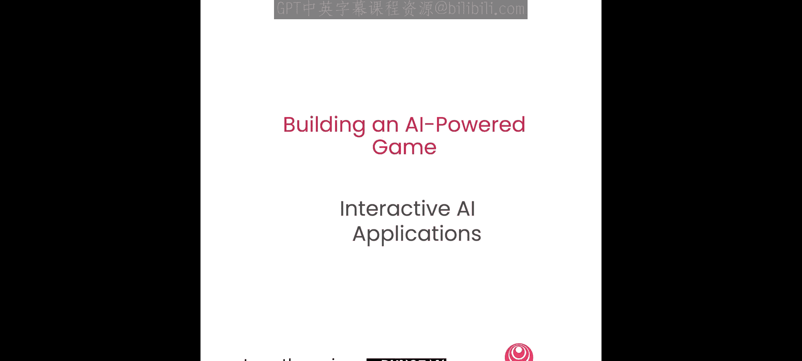
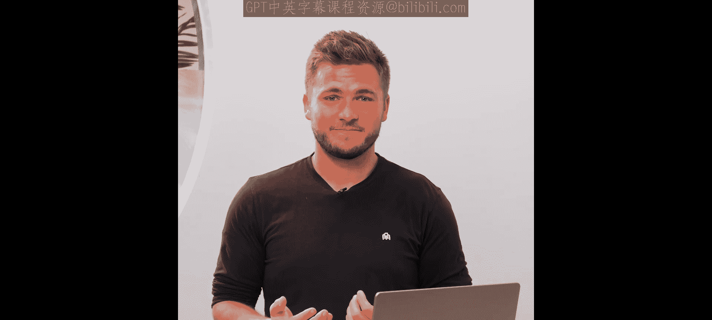
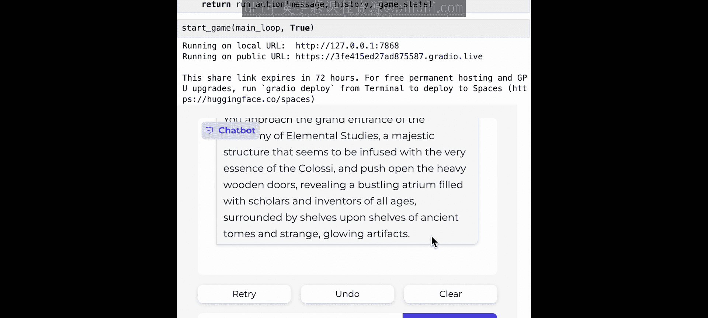

# 003：构建一个简单的AI角色扮演游戏 (RPG)




在本节课中，我们将利用Radio库和之前创建的世界设定，构建游戏的第一版。你将学习定义核心游戏循环，以及如何让AI对玩家的行动做出响应。我们会将世界细节整合到上下文中。课程结束时，你将拥有一个可以游玩的AI游戏。



## 设置游戏界面

首先，我们需要导入Radio库。这是一个能让你轻松构建UI工具包的库，非常适合测试和原型化AI应用。

我们将定义一个用于启动游戏的函数。这个函数接收一个名为`main_loop`的参数，该函数将运行游戏逻辑。然后，我们使用Radio创建一个聊天界面。

以下是设置界面的代码：

```python
import radio

def start_game(main_loop):
    # 使用radio创建聊天界面，传入主循环函数
    # 设置初始消息、占位符、标题等UI参数
    radio.ChatInterface(
        fn=main_loop,
        # ... 其他UI参数设置
    ).launch()
```

接下来，我们定义一个简单的测试循环，用于验证UI是否正常工作。目前，我们还没有接入真正的游戏逻辑。

```python
def test_loop(action, history):
    # 暂时只返回玩家输入的动作
    return f"输入的动作是：{action}"
```

现在，我们可以测试这个基础UI。启动游戏后，输入“开始游戏”，界面会返回我们预设的测试响应。这表明游戏的基本UI框架已经就绪。

## 生成游戏起始剧情

既然UI已经可以工作，现在我们来创建真正的游戏循环，构建可玩的游戏版本。

首先，我们需要一个冒险的开端。就像生成世界设定一样，我们将使用AI模型来生成游戏的初始故事。

我们需要导入Together API，并加载之前生成的世界设定（世界、王国、城镇和角色），以便在生成游戏开始时使用。

以下是生成起始剧情的步骤：

1.  创建一个提示词，指导AI如何撰写开头。
2.  我们要求AI以第二人称、现在时态来写（例如“你是杰克...”）。
3.  提示词要求AI先描述角色及其背景故事，然后描述他们的起始位置和周围环境，为玩家提供一个起点。
4.  最后，我们将世界信息也输入给AI。

```python
import together

# 加载之前生成的世界信息
world_info = load_world_info()

# 创建系统提示词
system_prompt = """
你是一个游戏主持人。请以第二人称、现在时态撰写。
首先，描述角色及其背景故事。
然后，描述角色开始冒险的地点以及他们周围的环境。
"""

# 调用AI模型生成游戏开始
start_story = together.Completion.create(
    prompt=system_prompt + world_info,
    model="...", # 指定模型
)
```

运行后，AI生成了类似这样的开头：“你是艾尔文·斯托林格，一位25岁的发明家，热衷于驾驭‘克拉西’的力量...”。它描述了角色站在卢米纳里亚镇，周围是水晶构造和元素研究学院——这些都是我们创建世界时生成的元素。这样，我们就有了一个供玩家开始的冒险起点。

## 定义核心行动循环

上一节我们生成了游戏的开场，本节中我们来看看游戏的核心机制：行动循环。这个循环决定了当玩家做出一个动作后，接下来会发生什么。

首先，定义玩家首次开始游戏时的情况：直接返回我们刚刚生成的起始剧情。

然后，定义AI如何响应玩家的单个行动。我们需要创建一个系统提示词来提供指令，例如告诉AI它是“游戏主持人”以及它应该如何撰写接下来的内容。

和之前一样，我们还需要输入世界信息，让AI知道游戏发生在哪个世界里。

最后，设置要输入给AI的消息。这包括系统消息、世界信息消息，以及游戏过程中所有已发生行动的历史消息（这样AI才知道故事的上下文）。历史消息来自函数接收到的`history`参数。

以下是核心行动循环的代码框架：

```python
def action_loop(player_action, history):
    # 1. 系统提示词
    system_msg = {"role": "system", "content": "你是一个游戏主持人，负责描述世界和对玩家的行动做出反应..."}
    
    # 2. 世界信息
    world_msg = {"role": "user", "content": world_info}
    
    # 3. 历史消息（将之前的对话记录加入）
    messages = [system_msg, world_msg]
    for old_action, old_response in history:
        messages.append({"role": "user", "content": old_action})
        messages.append({"role": "assistant", "content": old_response})
    
    # 4. 加入玩家最新的行动
    messages.append({"role": "user", "content": player_action})
    
    # 5. 调用AI模型生成响应
    ai_response = call_ai_model(messages)
    return ai_response
```

现在，我们已经定义了游戏的核心行动循环。

## 整合游戏状态与主循环

接下来，我们需要设置游戏状态和主循环函数，以便将其接入之前创建的`start_game`函数。

我们基于已有的世界设定（地点、角色、起始剧情）来定义游戏状态。

然后，创建这个可以传递给`start_game`函数的`main_loop`。

```python
# 定义游戏状态（示例结构）
game_state = {
    "locations": [...],
    "character": {...},
    "story_start": start_story
}

def main_loop(message, history):
    # 如果是游戏开始，返回起始剧情
    if not history:
        return game_state["story_start"]
    # 否则，调用行动循环处理玩家动作
    else:
        return action_loop(message, history)
```

## 游玩与测试

现在，游戏已经准备就绪，可以开始游玩了。

首先，输入“开始游戏”，获取冒险的起始剧情。你会看到之前生成的关于艾尔文·斯托林格的描述。

接着，就可以做真正酷的事情了：与AI互动，探索这个世界。例如，你可以采取一个动作：“四处看看”。

AI会生成接下来发生的事情作为响应：“你凝视着卢米纳里亚令人叹为观止的景色，映入眼帘的是街道两旁水晶构造散发的 vibrant 光芒，将万花筒般的色彩投射在整个城镇...”

然后，你可以采取另一个动作，比如：“前往学院，申请加入”，以便学习你的角色真正想知道的秘密。AI会据此描述你接近学院大门、进入 bustling 大厅的情景。

现在，我们拥有了一个根植于我们所创造世界的游戏。我们可以看到，世界设定融入了我们所做的每一件事。我们可以采取各种行动，而AI将在这个无限延续的冒险中回应接下来发生的事情。

## 总结

本节课中，我们一起学习了如何构建一个简单的AI角色扮演游戏。我们从设置Radio库的UI界面开始，然后利用AI生成游戏的起始剧情。接着，我们定义了核心的行动循环，使AI能够根据玩家的动作和游戏历史做出连贯的响应。最后，我们整合了游戏状态和主循环，并成功进行了测试。



现在，你拥有了游戏的第一版。你可以随意游玩，修改指令，甚至改变AI的写作风格。在接下来的课程中，我们将添加更多元素，让游戏变得更加有趣、复杂，并为其引入新的系统。